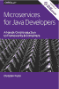
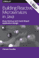
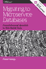
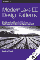
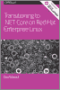

# 趋势电子书

> 原文：<https://developers.redhat.com/articles/2017/10/06/trending-ebooks>

**[面向 Java 开发人员的微服务:框架和容器实用介绍](https://developers.redhat.com/promotions/microservices-for-java-developers/)**

微服务架构方法不仅仅是关于技术。它深入到您组织的基础，允许您构建真正可扩展的、适应性强的复杂系统，帮助企业适应快速变化的竞争市场。

**[用 Java 构建反应式微服务:异步和基于事件的应用设计](https://developers.redhat.com/promotions/building-reactive-microservices-in-java/)**

调查分布式微服务？想要摆脱单一的企业应用程序，还是不想创建新的应用程序？反应式设计会有所帮助。作家兼红帽匠 Clement Escoffier 解释了 Eclipse Vert.x 为什么是构建有效微服务系统的好选择。

**[迁移到微服务数据库:从关系型整体数据库到分布式数据](https://developers.redhat.com/promotions/migrating-to-microservice-databases/)**

代码容易，状态难。学习如何在微服务结构中处理整体关系数据库是在快速变化的工作场所中保持同步的关键。有许多方法，在本书中，作者 Edson Yanaga 向您介绍了将数据从单片应用集成到微服务架构的九种不同策略。

**[现代 Java EE 设计模式:构建可持续企业发展的可伸缩架构](https://developers.redhat.com/promotions/distributed-javaee-architecture/)**

创建分布式 Java EE 架构。随着 DevOps、微服务、容器和基于云的开发平台的兴起，最先进的解决方案和企业通常支持的技术之间的差距大大增加了。但正如 O'Reilly 报告中所解释的那样，一些企业正在寻求通过在 Java EE 之上构建基于微服务的架构来弥合这一差距。

**[过渡到。NET Core on Red Hat Enterprise Linux](https://developers.redhat.com/promotions/dot-net-core/)**

的。网络世界已经变了，而且肯定是变得更好了。不仅是。NET Core 现在是一个开源框架，但由于微软最近与 Red Hat 的合作，你可以开发和运行。NET web 应用程序。

*Last updated: August 17, 2018*