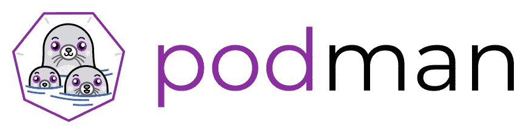
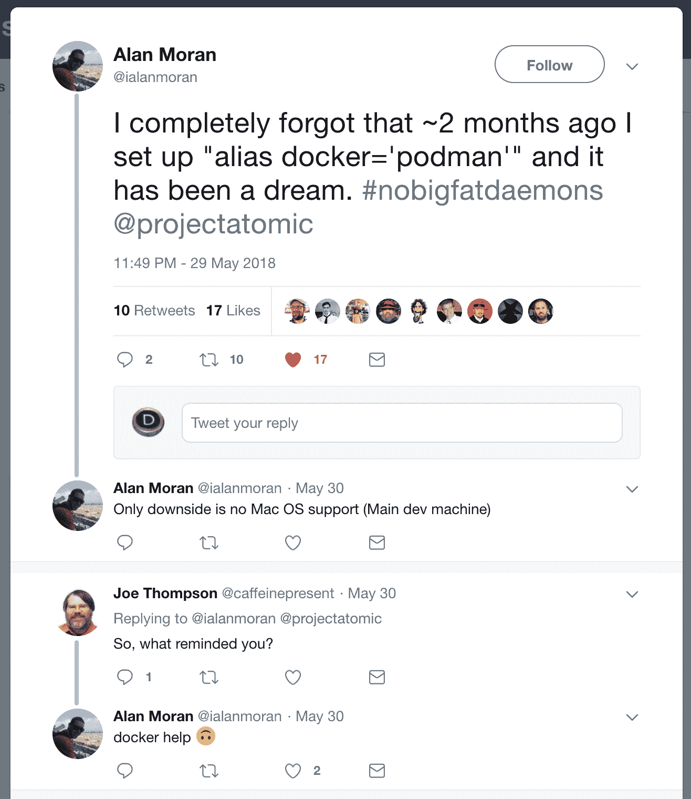
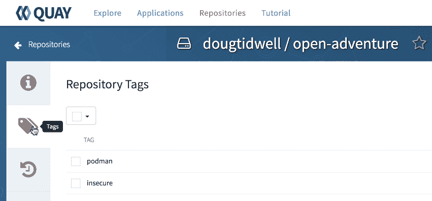
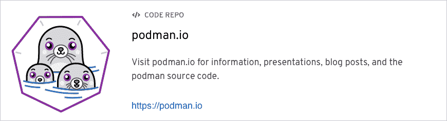

# podman——下一代 Linux 容器工具

> 原文：<https://developers.redhat.com/articles/podman-next-generation-linux-container-tools>

[https://www.youtube.com/embed/bJDI_QuXeCE?autoplay=0&start=0&rel=0](https://www.youtube.com/embed/bJDI_QuXeCE?autoplay=0&start=0&rel=0)

`podman`是一个使用容器的开源 Linux 工具。这包括 docker.io 和 quay.io 等注册中心中的容器。在本文中，我将向您展示如何使用`podman`构建容器映像并从中创建容器。接下来，我将向您展示如何将映像上传到注册表，最后，我将向您展示如何使用`docker`在非 Linux 系统上使用我用`podman`创建的完全兼容的映像创建一个容器。



在我们开始之前，快速了解一下这个项目的名称和它的标志。正如我将向您展示的那样，它可以与容器一起工作，但它也可以与 pods 一起工作，pods 是部署在同一台主机上的一组容器。(如果你了解 Kubernetes 豆荚，你就会熟悉`podman`豆荚的工作原理。)更重要的是，一群海豹被称为一个豆荚，因此有了上面这个令人敬畏的`podman`标志。我们不会在这里讨论 pod(我保证，我们很快就会涉及到它们)，但是它们是该工具的一个重要特性。

背景够了，我们继续。

第一步，当然是安装`podman`。像往常一样，明智的第一步是运行更新以保持良好的系统卫生:

```
[doug@fedora-server28 Documents]$ **sudo** dnf -y update
```

如果您的系统是最新的，请继续安装`podman`:

```
[doug@fedora-server28 Documents]$ sudo dnf -y install podman
```

(显然使用`yum`或`apt-get`或任何你的发行版用来安装和管理软件的东西。)

如果你准备好全押`podman`，你可以加上`alias docker=podman`。这意味着您的 Linux 系统将总是调用`podman`，即使您出于习惯键入`docker`。出于研究的目的，我运行了`docker`和`podman`来表明它们是兼容的，所以我没有定义别名。值得一提的是，推特用户艾伦·莫兰(与 yr 无关。作者以任何方式)定义了别名，没有任何问题:



安装好工具后，从`sudo podman version`开始查看您正在使用的版本。我使用的是版本 0.9.3.1:

```
[doug@fedora-server28 Documents]$ sudo podman version
podman version 0.9.3.1
```

还没有到 1.0 版本，所以请记住这一点。此外，我在这里以 root 用户身份运行`podman`,尽管对于您所拥有的`podman`版本来说这可能是不必要的。**版本 1.0 的目标是命令永远不需要 root 访问。**我们很快会谈到更多关于 root 访问的内容。

接下来，运行`podman info`来获取一些关于环境的信息:

```
[doug@fedora-server28 Documents]$ sudo podman info
. . .
  registries:
  - docker.io
  - registry.fedoraproject.org
  - quay.io
  - registry.access.redhat.com
  - registry.centos.org
. . .
```

这里我要指出的唯一细节是，`podman`在这个系统上使用了五个注册表。如果您试图加载一个容器映像，它首先在本地机器上查找，然后按照这里列出的顺序检查其他注册表。

现在，让我们进入正题。我们将使用下面的`Dockerfile`并使用`podman`来构建一个图像。该文件将大型洞穴探险游戏的源代码复制到容器映像中(T2 和 T3 命令)，出于安全原因安装一些内核更新(`RUN`命令的前六行)，以及构建代码所需的包(`RUN`的下五行)，最后，构建代码(`RUN`的最后一行):

```
FROM registry.centos.org/che-stacks/centos-stack-base

WORKDIR /usr/src/open-adventure

COPY ./open-adventure /usr/src/open-adventure

RUN sudo yum -y update && \
    sudo yum -y install kernel-headers && \
    sudo rpm --import https://www.elrepo.org/RPM-GPG-KEY-elrepo.org && \
    sudo rpm -Uvh http://elrepo.org/linux/kernel/el7/x86_64/RPMS/elrepo-release-7.0-3.el7.elrepo.noarch.rpm && \
    sudo yum --enablerepo=elrepo-kernel -y install kernel-ml && \
    sudo yum --enablerepo=elrepo-kernel -y swap kernel-headers -- kernel-ml-headers && \
    sudo yum -y install centos-release-scl && \
    sudo yum -y install gcc && \
    sudo yum -y install make && \
    sudo yum -y install libedit-devel && \
    sudo yum -y install python-yaml && \
    sudo make

CMD tail -f /dev/null 
```

构建容器映像是用您期望的命令完成的:

```
[doug@fedora-server28 Documents]$ sudo podman build -t open-adventure:podman .
STEP 1: FROM registry.centos.org/che-stacks/centos-stack-base
Getting image source signatures
Copying blob sha256:f9ce27a295e879233c8fbbf9ab67944a10e1ce80da69a46f87c583082a1ff3bb

. . .

STEP 8: CMD tail -f /dev/null 
--> 9e5d996316fac25084c5fa4d62ff4cbebad39dd8913ca4aff46c53653589ec7
STEP 9: COMMIT open-adventure:podman
```

(和往常一样，不要忘记`build`命令末尾的点。)将需要几分钟的时间来提取基础映像以及所有的需求，尤其是第一次构建容器映像时。这是轶事数据，但根据我的经验，用`podman`建立一个形象似乎并不比`docker`快或慢。

如您所料，运行`podman images`显示了我刚刚构建的图像:

```
[doug@fedora-server28 Documents]$ sudo podman images
REPOSITORY                                         TAG                 IMAGE ID            CREATED              SIZE
localhost/open-adventure                           podman              a2b9a17504ac        About a minute ago   1.1GB
registry.centos.org/che-stacks/centos-stack-base   latest              6e397c56690f        2 weeks ago          510MB
```

请注意,`localhost/`已经添加到图像的名称中。这告诉`podman`图像在本地机器的图像缓存中。

[](https://quay.io/repository/dougtidwell/open-adventure?tab=tags&tag=latest)

接下来，我将根据图像创建一个容器。`podman run --rm -it`【我刚创建的图像名称】`/bin/bash`。当容器启动时，它运行一个 bash shell。

```
[doug@fedora-server28 Documents]$ podman run --rm -it open-adventure:podman /bin/bash
ssh-keygen: generating new host keys: RSA1 RSA DSA ECDSA ED25519
[user@d767729eca88 open-adventure]$
```

如果您在图像名称的开头添加`localhost/`，这也是有效的，但是我没有添加它是为了强调这一点。(重点是我懒。)

现在我在容器内的一个 bash 提示*，它有巨大的洞穴探险，正如`podman`创建图像时编译的那样。我可以跑`./advent`玩游戏。进入建筑，吃点东西，喝点东西，然后退出游戏。诸如此类的事情。*

这里的重点是，我创造了一个形象，我可以与任何想玩这个游戏的人分享。当然，您也可以构建一个包含有用软件的映像。

说到分享，我将把图像放在 quay.io 的公共回购中。首先，我将使用`podman`登录我的帐户:

```
[doug@fedora-server28 Documents]$ sudo podman login quay.io -u dougtidwell -p [password]
```

现在，我可以将我的映像从本地主机推送到 quay.io 存储库:

```
[doug@fedora-server28 Documents]$ sudo podman push open-adventure:podman quay.io/dougtidwell/open-adventure:podman
```

注意，当我将映像推送到 quay.io 时，我必须指定 quay.io repo 和我的用户名(`dougtidwell`)作为远程映像名称的一部分。

现在，我将前往 quay.io 网页查看我的容器图片:



根据映像的基本操作系统，quay.io 可能会运行安全漏洞扫描。我用修改过的没有安装任何内核更新的`Dockerfile`构建了标记为`insecure`的映像。那个镜像有一些漏洞，quay.io 给了我帮助我修复问题的建议。我把旧图像留在身边是为了说明一点。(重点是安全扫描非常酷。)

最后，为了结束演示，让我们回到我的 Mac，使用`docker`从 quay.io 中提取图像。请记住，`podman`仅适用于 Linux，因此我们必须使用`docker`。使用一分钟前我在 Linux 上使用的相同选项，我可以完全像在 Linux 上一样运行和使用该映像:

```
doug@dtidwell-mac:~/Developer/CLH/S2E1 $ docker run --rm -it open-adventure:podman /bin/bash
ssh-keygen: generating new host keys: RSA1 RSA DSA ECDSA ED25519 
[user@79fb285b6576 open-adventure]$ 
```

图像完全兼容。实际上，`podman`使用的一些库也是`docker`的一部分。

在我们开始之前，有一个关于容器架构的快速提示。在 Linux 上作为守护进程运行。这造成了一定的开销，并且还要求任何想要构建容器映像的人都具有 root 访问权限。这会带来安全风险，尤其是如果你的用户知道`docker run`命令的`--privileged`选项。

守护进程方法也抑制了容器社区的创新。如果你想改变容器的工作方式，你需要改变`docker`守护进程，并将这些改变推送到上游。没有守护进程，容器基础设施更加模块化，更容易进行更改。`podman`的无守护进程架构更加灵活和安全。

[](https://podman.io)

这是对`podman`的一个快速概述。正如你所料，它是完全开源的，看看 [podman.io](https://podman.io) 的文档、演示，当然还有源代码。我们鼓励您在 Linux 系统上安装该工具并使用它。例如，你可以从我的 quay.io 账户中调出[我刚刚创建的容器图像，并用它来玩大型洞穴探险。](https://quay.io/repository/dougtidwell/open-adventure?tab=tags&tag=latest)

享受使用下一代容器工具的乐趣吧！

*Last updated: January 9, 2023*