# 在 Eclipse Che 中创建自定义堆栈

> 原文：<https://developers.redhat.com/articles/2018/12/13/creating-custom-stacks-eclipse-che>

Eclipse Che *stacks* 包含编译器、运行时、工具和其他对大多数流行编程语言有用的东西。但是，您的项目可能需要工具和其他工具，而这些工具和工具不属于产品的堆栈。幸运的是，您可以构建一个包含您需要的所有内容的自定义堆栈，然后在新堆栈的基础上构建一个工作区。在本文中，我们将向您展示如何实现。

如果你想看而不是读，这篇文章的所有内容都在下面的视频中:

[https://youtu.be/ODsuvd4YgN0](https://youtu.be/ODsuvd4YgN0)

## 2048 年的比赛

对于我们的例子，我们将使用 Eclipse Che 来看看流行游戏 **2048** 的 C++实现。2048 源代码需要一些特殊的工具，所以我们需要在 Che 中构建它之前创建一个自定义堆栈。当我们完成这里的工作时，您将知道如何构建一个包含项目所需的所有工具的堆栈。最重要的是，你可以在假装工作的时候浪费几个小时的宝贵时间。*不客气！*

我们先上 Che 的主页，:

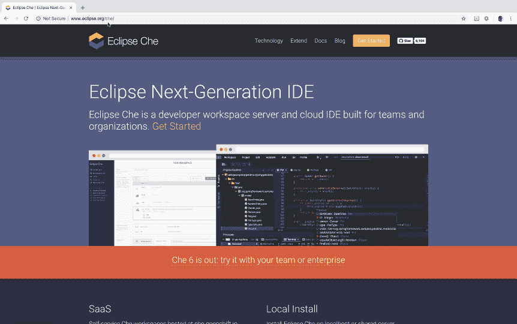

稍微向下滚动，点击 SaaS 标题下的创建免费账户按钮。


现在向下滚动，从模板创建工作区。我们要构建的代码是用 C++写的，所以选择 C++栈。

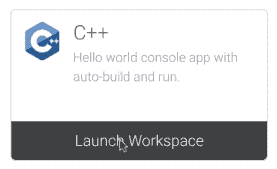

此时，您需要一个 **CodeReady Toolchain** 帐户。如果你没有(这是免费的)，你可以在 [openshift.io](https://openshift.io/) 注册。如果您有一个帐户，但尚未登录，您将看到 openshift.io 登录屏幕。

登录后，当工作区加载时，您会看到一个有趣的 crane 动画。系统进行一些初始化，下载一个容器映像，基于该映像创建并启动一个容器，然后加载必要的代码来显示 IDE。第一次在您的帐户中运行时，Che 必须为包含操作系统和其他工具的堆栈下载容器映像。完成后，您会看到这个屏幕:

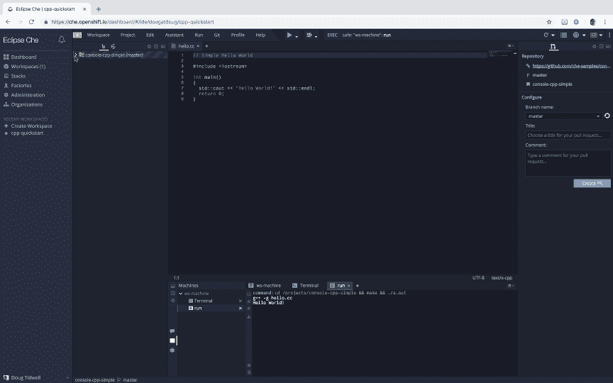

这里显示的 IDE 包括一个样本 Hello，World 项目，它是从 GitHub repo()克隆而来的，Che 已经构建并运行了该代码。你可以在屏幕底部的 Run 标签中看到“Hello，world”。

但是我们在这里建立一个破坏生产力的游戏。为此，我们将从 2048 repo 创建一个新项目。

## 构建代码

转到工作区菜单，然后单击导入项目:

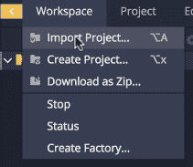

在此输入屏幕上显示的回购 URL([github.com/plibither8/2048.cpp.git](https://github.com/plibither8/2048.cpp.git))。我把这个项目命名为 2048，但是你可以随便叫它什么。我们将其他选项留空。


现在单击 Import 按钮克隆代码。一旦代码被导入，转到项目菜单，然后选择更新项目配置...并告诉 Che 这是一个 C++项目:

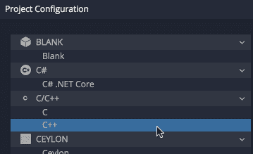

这使得语法高亮显示和其他好的特性成为可能。点击保存，就完成了。

展开项目并查看`/src`文件夹。`2048.cpp`有`main()`的方法，但是`game.cpp`有大部分的逻辑。您可以随意探索代码，但是...在项目中寻找，没有`Makefile`。

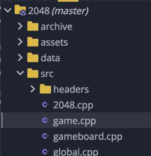

不清楚如何构建这段代码，所以出于无奈，*让我们实际阅读一下指令*。repo 中的`README.md`文件说我们需要在项目中创建一个`build`目录，然后运行`cmake`:

3.创建并输入构建目录:

```
$ mkdir build && cd build
```

4.用 cmake 编译程序

```
$ cmake ..
```

5.构建可执行文件

```
$ make
```

所以，我们去终点站吧！切换到项目目录(在我的例子中是`2048`，然后创建一个`build`目录并切换到它。您可能会注意到，当您创建目录时，项目的树视图会自动更新。现在跑`cmake`...只是没有`cmake`:

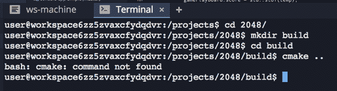

## 自定义堆栈

这就把我们带到了自定义堆栈的主题。我们需要做的是将堆栈放在这个工作区下面，并向其中添加`cmake`。然后，我们将在新堆栈的顶部创建一个工作区，一切都将正常工作。但是这个工作区下面的堆栈是什么呢？要找到答案，请转到窗口最左侧的“工作区”选项卡。

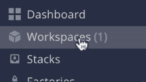

单击工作区名称对面的齿轮图标:

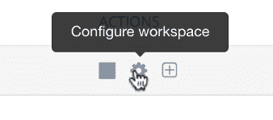

您将看到工作区的配置文件。我们在 JSON 中寻找的是`recipe`条目，您可以在这里看到:

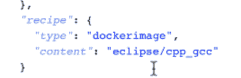

工作区构建在名为`eclipse/cpp_gcc`的容器映像之上。这就是我们将在构建新堆栈的`Dockerfile`中使用的。

下面是完成这项工作的`Dockerfile`:

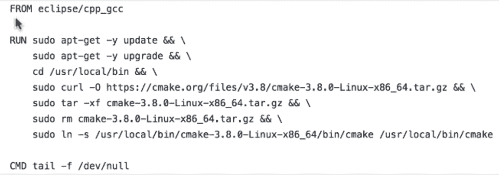

正如您所看到的，它所做的只是从基本映像开始，通过几个命令来下载和安装`cmake`。

**奖励内容:GitHub 回购**

这个 GitHub repo 有一个名为`Dockerfile.cmake`的文件。这就是我用来为新堆栈构建映像的内容。

*Github Code**[Learn how to build the image for the new stack](https://github.com/dougtidwell/podman-demo)* ***更多奖励内容:一个容器图像**

您可以随意自己构建图像，或者您可以简单地参考这里预先构建的图像，而不构建任何东西。这里我们将采用懒惰的方法，只使用预先构建的映像。

*Quay Image**[Pre-built container image](https://quay.io/dougtidwell/2048-stack:cmake)* *## 使用自定义堆栈

现在我们有了容器映像，让我们回到 Che 并创建一个新的堆栈。停止工作区(转到工作区菜单并单击停止)并转到最左侧的堆栈选项卡。正如您所料，您需要单击 Add Stack 按钮:

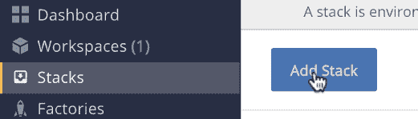

对于食谱，我们将使用我们刚才看到的容器图像，因此单击 Dockerimage 并输入`quay.io/dougtidwell/2048-stack:cmake`:

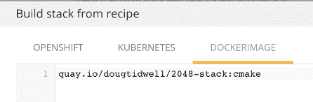

单击确定创建堆栈。

我们将通过给栈起一个名字(我称我的名字为`2048-stack`)和一个描述来配置栈，然后我们将编辑在容器内运行的机器。单击铅笔图标更改计算机名称，然后单击计算机名称旁边的箭头向其添加几个代理:

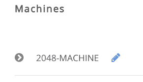

您至少需要执行、终端和工作区 API 代理:

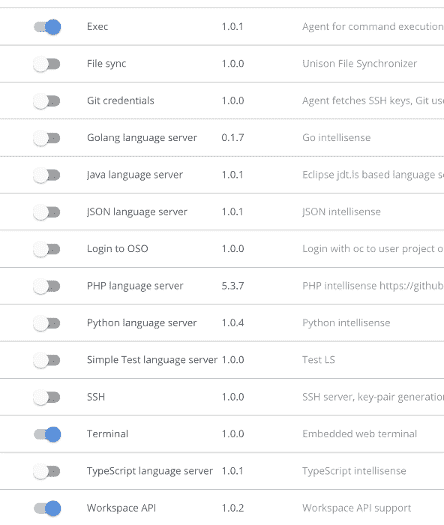

完成这些更改后，点击 Save 按钮。如果您愿意，您可以直接测试堆栈，但是我们将基于它创建一个工作区。我们所做的只是将`cmake`添加到现有的堆栈中，所以一切都应该正常。(这点相信我。)

返回到最左侧的“工作区”选项卡，并单击“添加工作区”按钮。给工作空间命名，然后选择我们刚刚定义的`2048-stack`。现在单击添加或导入项目按钮。单击 Git 选项卡并输入回购的 URL(`https://github.com/plibither8/2048.cpp.git`):

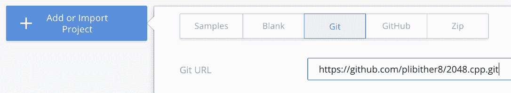

顺便说一下，如果你点击 GitHub，Che 想要连接到你的 GitHub 账户。因为我们不拥有正在处理的回购，所以只需使用 Git 选项卡。这让你可以克隆任何公共回购。

单击“添加”按钮将 repo 添加到您的工作区，然后单击页面底部的绿色“创建”按钮。在弹出的面板上，单击 Open 在浏览器中查看工作区。几秒钟后，您将看到 Che 正在提取新图像。正在运行的工作区如下所示:

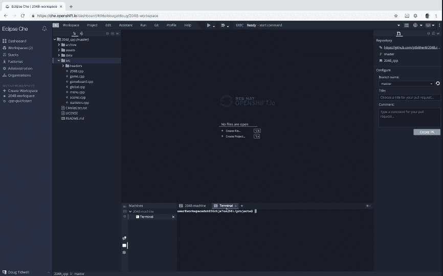

如您所见，`2048.cpp` repo 被克隆到环境中。我们知道接下来该做什么。转到终端选项卡，按照之前的说明进行操作。创建`build`目录，切换到该目录，运行`cmake ..`，然后运行`make`。`cmake`创建`Makefile`，而`make`创建目标文件并将它们链接成可执行文件。现在双击终端选项卡将其最大化，然后键入`./2048`。我用一个 4 x 4 的棋盘玩了一个新游戏，并用箭头键来操纵单元格。这是游戏早期的屏幕截图:

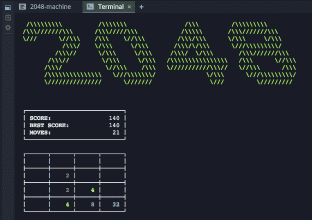

这个 UI 不像你可能见过的其他版本那样视觉上华而不实，但它同样困难和令人上瘾。

这就是如何构建自定义堆栈。大多数情况下，你可以使用 Che 的一个默认栈来做你需要做的事情，但是如果不能，构建一个自定义栈也是一个不错的选择。在`Dockerfile`中，我们使用一些命令来安装缺失的工具，我们基于新的容器映像创建了一个新的堆栈，我们基于新的堆栈创建了一个工作区，最后使用我们添加的工具在工作区内构建代码。

## 车工厂

如果您想更进一步，您可以使用一个*工厂*从该工作区创建一个 URL。然后，您可以与任何人共享该 URL。当他们打开工厂 URL 时，他们的浏览器将打开一个具有完全相同环境的新工作区。换句话说，它可以在他们的机器上工作。工厂是使 Che 如此强大的另一个特征。我们将在这段视频中介绍工厂:

[https://youtu.be/5PDm7tTHB9c](https://youtu.be/5PDm7tTHB9c)

这个视频来自[一篇关于 Che 工厂和工作空间的完整文章](https://developers.redhat.com/che/creating-factories/)。当您完成了这里的工作后，也可以看看那篇文章。

## 摘要

有了自定义堆栈，您可以确保每个人都拥有相同的工具和库。这意味着在你的机器上工作的任何东西都可以在其他人的机器上工作。我们希望这有助于您在团队中充分利用 Eclipse Che。

*Last updated: April 26, 2021***