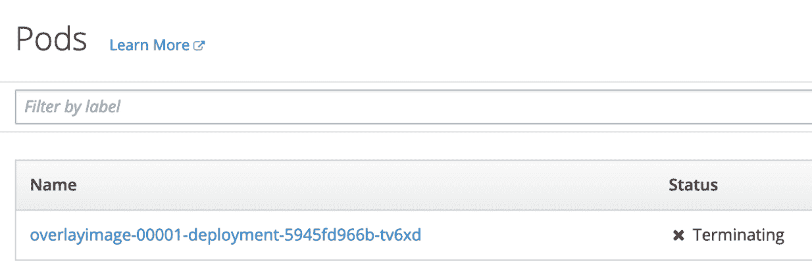

# 第 3 部分:将无服务器服务部署到 Knative

> 原文：<https://developers.redhat.com/coderland/serverless/deploying-serverless-knative>

所以现在我们有了一个[服务，它可以做我们想要的一切](/coderland/serverless/building-a-serverless-service "Part 2: Building a Serverless Service"),我们有了一个非常好的前端，可以随时测试这个服务。很好，但我们是来讨论无服务器的。这意味着我们需要将服务部署到 Knative。Knative 将监控服务的需求，并将其降低到零或增加到处理负载所必需的水平。

如果你更喜欢视频而不是文本，下面是我们将要做的详细解释:

[https://www.youtube.com/embed/AR4fqwFLn9I?autoplay=0&start=0&rel=0](https://www.youtube.com/embed/AR4fqwFLn9I?autoplay=0&start=0&rel=0)

## 背景

我们假设您已经看过了本系列的前两个视频，但这不是必需的。当我们将服务部署到 Knative 时，我们使用代码的预构建 Docker 映像，因此您不必自己构建它，甚至不必真正理解它的作用。但是，如果您还没有复制这些回购，您需要复制它们。以下是图像处理代码的报告:

*Github Code**[React front-end for the Image Overlay code](https://github.com/redhat-developer-demos/coderland-photo-store)* *你可以在这里找到唐·申克的 React 前端:

*Github Code**[React front-end for the Image Overlay code](https://github.com/redhat-developer-demos/coderland-photo-store)* *## Kubernetes、Istio 和 Knative

我们将使用三样东西来进行无服务器计算:Kubernetes，它提供了我们用于其他一切的基本集群；Istio，一个提供路由和其他服务的服务网格；和管理我们服务的 Knative。

Knative 有三个部分:

*   **Knative Build** ，如您所料，它会构建您的代码

*   **Knative Eventing** ，它允许您配置触发代码的事件

*   **Knative Serving** ，它管理运行您的服务的 pod 的数量，并根据需要将流量路由到它。

对于我们这里的目的，我们提供服务代码的预构建容器映像，所以我们不需要 Knative Build。我们将直接调用服务，而不是建立一个事件基础设施，所以 Knative Eventing 也不会出现。我们将把重点放在创造性发球上。

所以。

你所需要做的就是在另一个主要基础设施内部安装另一个主要基础设施。很简单，对吧？嗯，多亏了我们的朋友 Kamesh Sampath(像 Don 一样，很棒，很有才华，而且非常乐于助人)，实际上*很容易。*

对于 Kubernetes 环境，我们将使用 Red Hat 的容器开发工具包(CDK)。CDK 提供了`minishift`，一个 Red Hat OpenShift 的单节点版本，一个开源的企业级 Kubernetes 实现。如果你是红帽开发者计划的成员(如果你不是，你应该是，它是免费的)，你可以在 developers.redhat.com/products/cdk/overview 下载一份。

与`minishift`一起，我们将使用`oc`命令来控制集群，并使用 Istio 和 Knative。

随着 CDK 的安装，是时候了解 Kamesh 的精彩 Knative 教程了。请注意，该教程目前正在开发中(毕竟 Knative 是 v0.3.0)，但是我们会随着情况的变化而更新这里的说明。完成以下步骤，在您的机器上获得您需要的一切:

1.  在新的浏览器标签中打开[redhat-developer-demos.github.io/knative-tutorial](https://redhat-developer-demos.github.io/knative-tutorial)。这包含了 Kamesh 的教程文本。如果你想从这里开始，可以在 bit.ly/knative-tutorial 的[找到包含所有代码的完整教程。](https://bit.ly/knative-tutorial)

2.  通过`git clone https://github.com/redhat-developer-demos/knative-tutorial`获取 Kamesh 的代码

3.  将`knative-tutorial`目录定义为`TUTORIAL_HOME`(例如`export TUTORIAL_HOME=~/Developer/knative-tutorial`)

4.  切换到`knative-tutorial/work`目录

5.  通过`git clone https://github.com/openshift-cloud-functions/knative-operators`获取安装脚本

6.  切换到`knative-operators`目录

从那个目录开始，在路径`./etc/scripts/install-on-minishift.sh`中有一个奇妙的脚本。信不信由你，运行这个脚本会安装你需要的所有东西。但是首先，您需要编辑文件并更改或删除这一行:

```
minishift config set openshift-version v3.11.0
```

您可以将版本更改为`v3.11.43`,或者干脆删除这一行。CDK 目前在 OpenShift v3.11.43 上，它确保一切都是同步的。请注意，如果您使用最新的 CDK，要求`v3.11.0`将会失败。

脚本更新后，运行`./etc/scripts/install-on-minishift.sh`。这个脚本处理了几乎所有的事情，包括启动和运行 Kubernetes / OpenShift、安装 Istio、安装 Knative Build、Knative Eventing 和 Knative Serving。要有耐心；安装这么多东西需要一段时间，对于许多步骤来说，前一步的所有组件都必须在该步骤开始之前启动并运行。请注意，Kamesh 的脚本至少比你或我输入安装所有这些东西所需的几十个命令快一个或两个数量级。

脚本完成后，运行以下命令:

```
eval $(minishift oc-env)
eval $(minishift docker-env)
oc login -u admin -p admin
```

这会将`oc`指向您的集群，并将其放在您的系统路径上，设置`minishift`使用的 Docker 环境，并让您以管理员身份登录。

## 将您的服务部署到 Knative

您的集群已经启动并正在运行，您以管理员身份登录，因此运行以下三个命令:

```
oc new-project knativetutorial
oc adm policy add-scc-to-user privileged -z default
oc adm policy add-scc-to-user anyuid -z default
```

这些命令创建一个名为`knativetutorial`的新项目，并向默认服务帐户添加特权安全上下文约束(SCCs)。

在命令行中，切换到您之前克隆的`image-overlay`目录。它包含文件`service.yaml`:

```
apiVersion: serving.knative.dev/v1alpha1
kind: Service
metadata:
 name: overlayimage
spec:
 runLatest:
   configuration:
     revisionTemplate:
       spec:
         container:
           image: docker.io/dougtidwell/imageoverlay:v1
```

这个 YAML 文件做了两件重要的事情:1)它给我们的服务一个名字，`overlayimage`；2)它告诉 Knative 在哪里可以找到包含服务代码的容器映像。以下是如何将我们的服务部署到 Knative:

```
oc apply -n knativetutorial -f service.yaml
```

这将文件`service.yaml`应用到项目中(`n`命名空间)`knativetutorial`。就这么简单。如果您转到控制台，您将看到您的新服务正在运行。运行`console`命令:

```
minishift console
```

这将在新的浏览器选项卡中打开集群的控制台。您将收到一条错误消息，指出该站点正在使用自签名证书；当然，忽略这一点，直接进入页面。接下来，您将被要求登录。使用`admin`作为您的用户名和密码。看到主面板后，单击右上角“创建项目”按钮下的“查看全部”小链接:


如你所料，有一个项目叫做`knativetutorial`:


单击项目以查看其资源:


`overlayimage-00001`是我们通过 YAML 文件部署的应用。

现在单击应用程序菜单并选择窗格:


现在，您将看到与部署的应用程序相关联的所有窗格。不幸的是，我在捕捉屏幕时拖拖拉拉，因为当我去寻找 pod 时，它们已经被终止了:



pod 被终止，因为我没有调用服务。*这是应该的。*在监控系统时，如果没有服务需求，Knative 会将 pod 的数量调整为零。当某人*调用服务时，pod 的数量将是非零的。*

## 从命令行调用您的服务

现在让我们通过`curl`调用服务并检查结果。请记住，我们在这里做的是调用由 Knative 管理的代码的容器化版本，与 Istio 一起运行，并在 Kubernetes 集群内运行。但是首先，我们需要获得服务的 IP 地址。如果你以前和 Istio 合作过，你会知道那很复杂。Istio 有一个入口网关，控制谁可以访问它管理的服务，我们必须找到网关的 IP 地址、端口和其他详细信息，然后才能访问我们的服务。

所以我们开始吧。不要尝试输入这些内容，只需剪切和粘贴即可:

```
IP_ADDRESS="$(minishift ip):$(kubectl get svc istio-ingressgateway --namespace istio-system --output 'jsonpath={.spec.ports[?(@.port==80)].nodePort}'/overlayImage)"
```

`$(minishift ip)`只是返回集群的 IP 地址，`/overlayImage`是服务的端点。中间的`kubectl`命令是获取端口号的命令。在我的系统上，`$IP_ADDRESS`就是`192.168.99.100:31380/overlayImage`。当然，您的里程可能会有所不同。

还有一个更复杂的问题，而且是一个很大的问题:Knative 使用 HTTP `Host`头将请求路由到它的服务。这个头的值通常是服务的名称(`overlayimage`)，后跟名称空间的名称(`knativetutorial`和`example.com`)。所以 Knative 看这个标题:

```
Host: overlayimage.knativetutorial.example.com
```

并确定该请求应该被路由到名称空间`knativetutorial`中名为`overlayimage`的服务。不管怎样，这是`Host`头的默认值。要确切知道值应该是多少，运行命令`oc -n knativetutorial get services.serving.knative.dev`:

```
doug@dtidwell-mac:~/Developer/image-overlay $ oc -n knativetutorial get services.serving.knative.dev 
NAME           DOMAIN                                     LATESTCREATED LATESTREADY     READY REASON
overlayimage   overlayimage.knativetutorial.example.com   overlayimage-00001   overlayimage-00001 True
```

如您所见，`overlayimage`服务的域是`overlayimage.knativetutorial.example.com`。现在我们终于部署了我们的服务，并且拥有了通过`curl`调用它所需的所有信息。我们必须指定之前使用的相同参数，增加`-H “Host: overlayimage.knativetutorial.example.com”`和`$IP_ADDRESS`来代替`http://localhost:8080/overlayImage`。下面是完整的命令:

```
curl -X "POST" -H "Host: overlayimage.knativetutorial.example.com" -H "Content-Type: application/json" -H "Accept: application/json" -d @sampleInput.txt $IP_ADDRESS
```

正如您之前所做的那样，您需要将该命令的输出重定向到一个文件，编辑 JSON 以仅留下`imageData`字段的内容，然后使用`base64`命令对其进行解码并查看修改后的图像。这很麻烦，但是它可以让你确保代码有效。

## 从 React 前端调用您的服务

你应该为你目前所取得的成就感到兴奋。您获取了一些代码，并将其部署到 Kubernetes 集群内部的 Knative 运行中。Knative 管理这些代码，而不需要将其部署在自己的服务器上。

但是从 Don 的 React 前端代码(我们在第 2 部分中讨论过的 web 应用程序)中调用服务会非常酷。使用 React，您可以确保服务正常工作，而不必处理命令行和手动编辑文件以及所有这些繁琐的工作。

然而，这就是事情变得复杂的地方。(嗯，实际上，这就是他们让*变得更加*复杂的地方。)Don 的代码使用 XMLHttpRequest(一种 XHR)来调用图像处理服务，而不需要强制重新加载页面。毕竟，这就是现代 web 应用程序的工作方式。不幸的是，XHR 不能设置 HTTP `Host`头的值。在 XHR 中，`Host`的值将总是请求被发送到的 URL。完全合理的行为，但是它阻止我们调用服务。

解决这个问题的优雅方法(据我们所知)是设置一些 Istio 通配符路由规则和一些 DNS 设置以及基本的库管理员魔术，以便默认的`Host`值匹配服务的域。不幸的是，你的作者无法让这个工作。我会继续努力，当我让它工作的时候，我会发布一个视频和一篇文章。

在这里，我们都是程序员，所以我求助于由来已久的传统，暂时放弃优雅，编写一个绕过这个问题的程序。这没什么丢人的。(反正不多。)我做的是写一个可以修复`Host`头的代理。Don 的 React 应用程序(或任何使用 XHRs 的应用程序)将请求发送给我的代理，代理正确设置了`Host`头并将请求提交给服务。当结果返回时，代理将它们发送给发出请求的人。

## 代理项目

首先，克隆代理回购:

*Github Code**[A Knative proxy function](https://github.com/redhat-developer-demos/knative-proxy)* *让我们看一下代码。我首先要处理的是从第三方网站加载内容的 web 应用程序所固有的 CORS 问题(跨源资源共享)。这里的流程是 Don 的代码使用 HTTP `OPTIONS`动词来检查我们服务的属性。如果代理返回的头是 Don 的代码正在寻找的，它就用`POST`请求来响应。下面是`OPTIONS`动词的代码:

```
reassureTheClient = function(req, res) {
   res.header('Access-Control-Allow-Origin', req.header('Origin'));
   res.header('Access-Control-Allow-Methods', 'POST, OPTIONS');
   res.header('Access-Control-Allow-Headers',
              'Content-Type, Authorization, Content-Length,
               X-Requested-With');
   res.sendStatus(200);
}
```

这告诉调用者，请求的允许来源是调用者。我们将该头的值设置为来自请求者的`Origin`头的值。换句话说，如果`jane.example.com`询问谁被允许从这个函数请求数据，我们用一个值为`jane.example.com`的`Access-Control-Allow-Origin`头来响应。这告诉打电话的人“我们对`jane.example.com`只有爱”这让 Jane 很高兴，所以她回复了`POST`请求。

处理`POST`请求的代码非常简单，但是它需要配置两个值:服务的 URL 和主机头的必需值。下面是我们如何在代码中处理这些参数:

```
const url = process.env.PROXY_URL ||
         'http://192.168.99.100:31380/overlayImage';
   const headerValue = process.env.PROXY_HOST ||
         'overlayimage.knativetutorial.example.com';
```

换句话说，如果在当前环境中设置了`PROXY_URL`和`PROXY_HOST`变量，我们就使用这些值。否则，有两个默认值看起来很像我们在这个例子中使用的值。

设置好这些变量后，我们使用流行的`nodefetch`库来调用服务:

```
nodeFetch(url, {
       timeout: 90000,
       method: 'post',
       headers: {
           'Content-Type': 'application/json',
           'Accept': 'application/json',
           'Host': headerValue
       },
       body: JSON.stringify(req.body)
   })
   .then(response => response.json())
   .then((responseJson) => {
       res.set({'Access-Control-Allow-Origin': req.header('Origin'),
                'Cache-Control': 'no-cache, no-store, must-revalidate'})
                .json(responseJson)
                .status(200);
});
```

首先，我们将超时值设置为`90000`毫秒。我们希望代理能给 Knative 足够的时间来安装新的 pod 并在必要时运行。接下来，我们设置请求的头部。正如我们在`curl`中看到的，我们需要设置`Content-Type`、`Accept`和`Host`头。前两个的值永远不会改变(我们总是使用 JSON 数据)，我们从配置中获取第三个的值。

对 Knative 服务的请求体是来自 Don 代码或调用代理的任何人的请求体。从那里我们有几个承诺来处理响应。我们再次设置了`Access-Control-Allow-Origin`头，我们告诉调用者不要缓存结果，我们用状态码`200`进行响应。

最后一点是告诉 Express 哪个方法处理`/overlayImage`端点的`POST`和`OPTIONS`动词，然后启动代理:

```
app.route('/overlayImage')
   .post(modifyImage)
   .options(reassureTheClient);

app.listen(port);
```

转到运行代理的终端窗口。根据需要设置两个变量:

```
export PROXY_URL=http://192.168.99.100:31380/overlayImage
export PROXY_HOST=overlayimage.knativetutorial.example.com
```

运行`npm install`如果您以前没有运行过，那么运行`npm start`来启动并运行代理。

默认情况下，代理在`http://localhost:8888/overlayImage`运行，所以我们需要配置 Don 的代码向该 URL 发送请求。切换到运行 Don 代码的终端窗口，设置`REACT_APP_OVERLAY_URL`环境变量:

```
export REACT_APP_OVERLAY_URL=http://localhost:8888/overlayImage
```

现在输入`npm start`重启 Don 的代码。这将打开一个浏览器选项卡，其中运行着编译驱动程序。如果没有，打开`http://localhost:3000`。

## 成功的景象

看着相机，点击“拍照”按钮。这就是成功的样子:


你可以在底部看到修改后的图像。在页面的顶部，你会看到一个非常开心的程序员。有用！(如果你从我的左肩看过去，你会看到第一个视频中编译驱动的模型。)

JavaScript 控制台在右侧。错误消息与标记问题有关(例如，`<div>`不能是`<p>`的子元素)。您还可以看到 Don 代码和代理之间交互的痕迹。

## 下一步是什么？

这让我们结束了对编译驱动程序的讨论。您可以做几件事来不断增长您的无服务器计算和 Knative 知识:

*   首先也是最重要的，跟随[卡梅什在 bit.ly/knative-tutorial](https://bit.ly/knative-tutorial)的神奇技巧教程。Kamesh 一直在积极开发和改进教程。他是 Knative 和其他开源项目的提交者，他的教程让您可以利用他的专业知识和经验。
*   如果你没有看完本教程的[第 2 部分，那么你的时间是值得的。](/coderland/serverless/building-a-serverless-service "Part 2: Building a Serverless Service")
*   在 Red Hat Developer Program 中，请留意更多的无服务器内容。
*   最后，如果因为一些不可想象的原因，你还没有加入红帽开发者计划，那就想办法放下一切，现在就加入吧。它是免费的，让你可以使用我们的产品。(例如，CDK。)

我们希望您喜欢这些材料；我们把它们放在一起很开心。我们希望听到你的评论，建议，甚至是对我们的回购 pr。我们是 coderland@redhat.com:让我们听听你的意见！

*Last updated: April 21, 2021****