# 在 Eclipse Che 中创建工厂

> 原文：<https://developers.redhat.com/che/creating-factories>

Eclipse Che 最强大的特性之一是它能够构建**工厂**，这是定制的共享环境，为团队中的每个人提供相同级别的工具和库。创建工作空间后，您将基于该工作空间构建一个工厂。一旦创建了工厂，您就可以与新的队友共享工厂的 URL，给他们一个与您相同的开发环境。在这个场景中，我们正在讨论 onboarding，但是当您希望其他人在您使用的相同环境中查看代码时，工厂是非常有用的。

本教程以视频和操作方法文章的形式提供，如下所示:

[https://www.youtube.com/embed/DyrqvknB0sc?autoplay=0&start=0&rel=0](https://www.youtube.com/embed/DyrqvknB0sc?autoplay=0&start=0&rel=0)

程序说明:本文中的屏幕截图来自我笔记本电脑上运行在`minishift`上的 Che 的一个实例，但是所有的屏幕(和所有的技术)都是一样的，不管你在哪里或者如何运行 Che。

## 创建工作空间

我们在这里的场景是，我们正在加入一个新的团队，所以我们将首先为他们创建一个工作空间。当您转到 Che URL 时，如果您没有定义任何工作区，您将看到此页面:

如果您*已经有了*工作区，点击左侧的*工作区*标签，然后点击*添加工作区*按钮。不管怎样，你都会出现在上面的页面上。

为工作区命名；我给我的宠物诊所打电话:

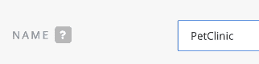

选择一个包含 Tomcat 和 Maven 的 Java 栈。我们将在使用宠物诊所应用程序时使用这两个工具。Che 的每个安装都定义了许多堆栈，所以您可能需要滚动列表来找到您想要的。不过，在我安装的 Che 中，我需要的 Java 堆栈排在列表的第一位:

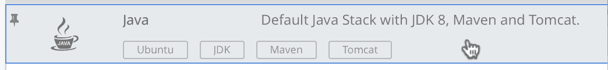

现在点击*添加或导入项目*按钮。选择 *Git* 标签(不是 *GitHub* 标签)。输入网址`https://github.com/che-samples/web-java-spring-petclinic`并点击*添加*按钮:

(一定要包括`https://`部分。)

这就是我们开始的全部内容。点击页面底部的绿色*创建并打开*按钮。您的工作区将很快启动。在我的机器上，在浏览器中启动工作区并克隆 git repo 花费了大约 45 秒。当然，启动时间会因您的 Che 环境而异。加载工作区时，宠物诊所示例应用程序已经导入。

## 使用工作空间

为了让以后的生活更简单，进入*项目*菜单，选择*更新项目配置*:

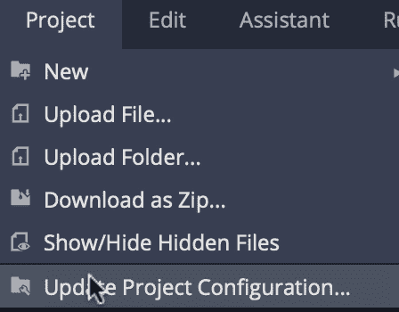

告诉 Che 这是一个 Maven 项目，然后点击*保存*:

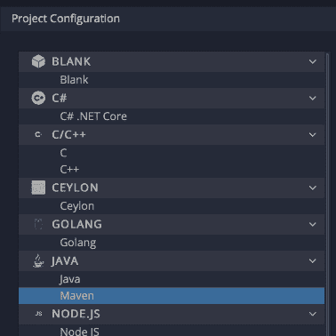

现在在文件浏览器中展开项目，然后展开`src`、`main`、`java`、包名和`model`:

双击`Pet.java`打开该对象的源代码:

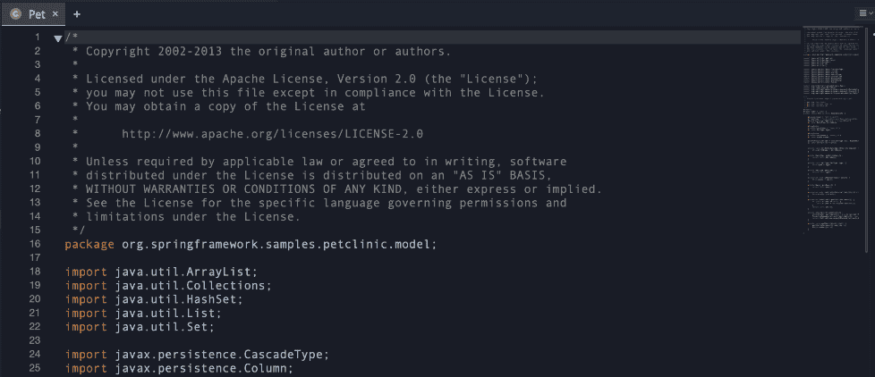

对于想要学习代码的人来说，这是一个很好的起点。稍后，我们将配置工厂，以确保在工作空间启动时打开该文件，但是我们还有其他工作要先做。

查看管理命令视图。(在项目浏览器上方，单击下图中类似大于号的图标和光标。)因为我们告诉 Che 这是一个 Maven 项目，它已经创建了一个名为`build`的命令。正如您所料，它在*构建*部分:

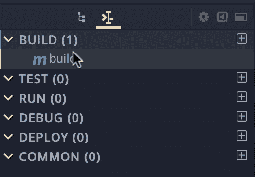

命令本身使用`${current.project.path}`宏执行`mvn clean install`:

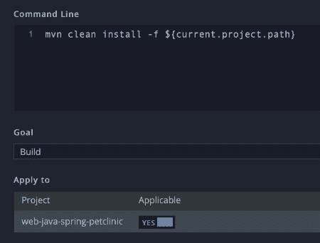

点击滑块告诉车该命令适用于宠物诊所项目，然后点击*保存*。现在点击绿色的*运行*按钮来构建项目。这将在`target`目录中为宠物诊所应用程序创建 WAR 文件。

## 在工作空间中创建命令

此时，我们可以转到终端，将 WAR 文件复制到 Tomcat 的`webapps`目录中，但是最好用一个命令来构建和部署代码。我们现在将创建一个命令来完成这项工作。单击*运行*选项卡旁边的加号图标(+)。双击 *Maven* 作为命令类型:

 next to the Run tab. Double-click on Maven as the command type.")

将该命令命名为*构建并运行*:

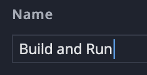

实际上，您可以随意命名、拼写或大写，但是您需要准确地记住稍后键入的内容。

因为我们说过这是一个 Maven 命令，所以已经定义了`clean`和`install`目标。通过添加另外几行来编辑代码。在 Maven 构建了 WAR 文件之后，下一步是将该文件复制到 Tomcat `webapps`目录中。键入`cp`，然后单击文本区域上方的宏链接。双击`${current.project.path}`将其插入到命令中:

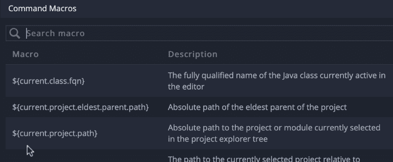

现在加上`/target/*.war $TOMCAT_HOME/webapps/ROOT.war`，拼写和大写完全一样。将文件复制为`ROOT.war`使得我们刚刚构建的 WAR 文件成为我们的 Tomcat 服务器的默认应用程序。

最后，在新的一行添加`$TOMCAT_HOME/bin/catalina.sh run 2>&1`。这将启动 Tomcat 服务器并禁止服务器的任何输出。该命令应该如下所示:

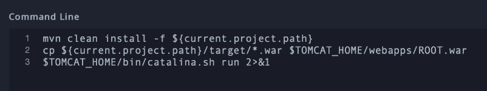

我们要为此命令做的最后一件事是定义一个预览 URL。这是基于 Che 服务器的名称。这个 URL 为我们提供了一个链接来查看 Tomcat 服务器的启动和运行情况，因此我们可以确保我们的代码正确运行。清除已经存在的文本，然后单击视图底部的宏链接。

向下滚动并选择`${server.tomcat8}`宏:

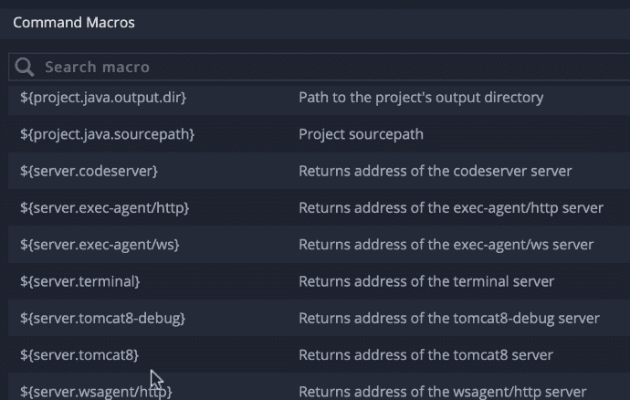

这就是我们在这里所需要的，因为默认应用程序是从 Pet Clinic 项目创建的 WAR 文件。如果你愿意，你可以有多个项目并把它们作为单独的 webapps 来部署，但是我们现在保持简单。预览 URL 应该如下所示:

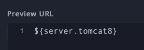

## 在工作区中构建和运行代码

要运行您的新命令，请单击*保存*按钮，然后单击绿色的*运行*按钮。这将构建和部署代码并启动 Tomcat。当您看到服务器启动消息时，单击视图顶部的蓝色预览链接:

在此图中，服务器启动消息位于屏幕底部。预览网址为`http://routenjoait10-mini-che.192.168.99.100.nip.io`。使用`${server.tomcat8}`宏使我们不必计算 URL 并正确键入它。

正如你在这里看到的，一切都已成功构建和部署，webapp 正在 Tomcat 上运行，世界上最可爱的小狗和小猫现在就在我们的屏幕上:

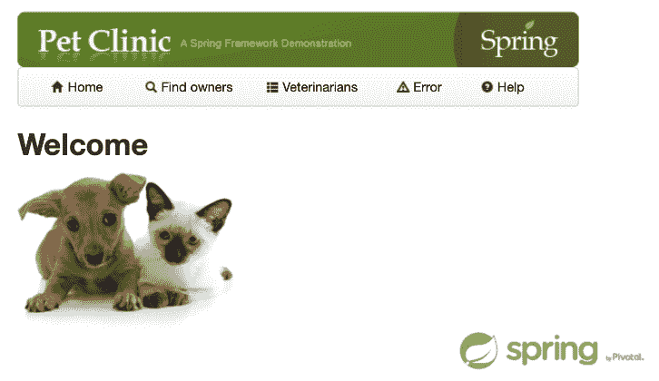

Che 确实有一个很好的快捷方式，你可以在处理代码的时候使用。因为我们创建的*构建和运行*命令位于*运行*菜单中，所以它与屏幕顶部的运行按钮相关联:

每当您想要查看您在代码中所做的任何更改的效果时，您可以使用 run 按钮来执行您刚刚定义的命令。

## 创建工厂

在我们创建工厂之前，记下`Pet.java`文件的完整路径。我们将设置工厂，以便工作区以打开的文件开始。Che 将您工作区中的所有项目放在`/projects`目录中，所以我们给 Che 的路径是`/web-java-spring-petclinic/src/main/java/org/springframework/samples/petclinic/model/Pet.java`。

现在我们已经按照我们想要的方式配置了工作区，让我们创建工厂。进入*工作区*菜单，点击*创建工厂*:

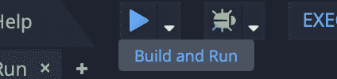

给工厂起个名字，然后点击*创建*。工厂的 URL 出现在下方的输入字段中，同时还有一个将 URL 复制到剪贴板的按钮:

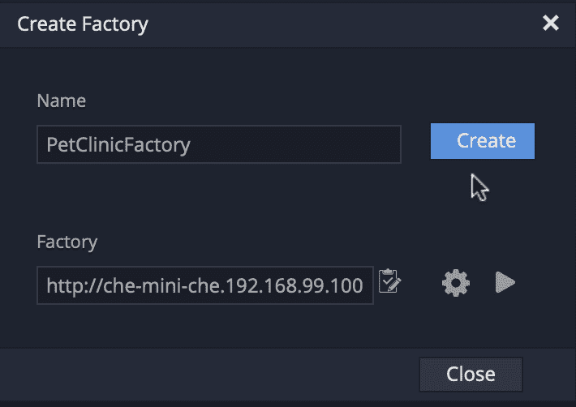

因为 Che 是基于浏览器的，所以工厂 URL 可以在任何具有全功能浏览器的平台上工作。如果你愿意，现在就可以尝试，但是在我们完成之前，我们还会在工厂中添加一些东西。

进入*工作区*菜单，点击*停止*，结束这部分流程:

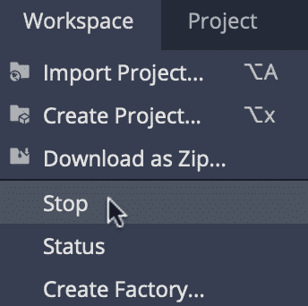

## 定制工厂

现在转到窗口的左侧，点击*工厂*选项卡。单击刚刚创建的工厂的名称以编辑其属性。向下滚动到*配置动作*部分。一旦工作区启动并运行，您在本节中定义的所有内容都会发生。我们要做的是告诉 Che 在工作空间加载时运行一个命令并打开一个文件。在*运行命令*旁边，输入您定义的命令名称，并点击*添加*按钮:

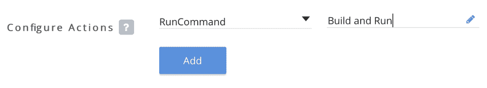

点击*运行命令*旁边的向下箭头。选择 *openFile* 作为下一个动作。粘贴到`Pet.java`文件的完整路径。确保路径以斜杠开头。再次单击*添加*按钮，您将得到两个命令，每当有人使用工厂打开工作区时，这两个命令都会被执行:

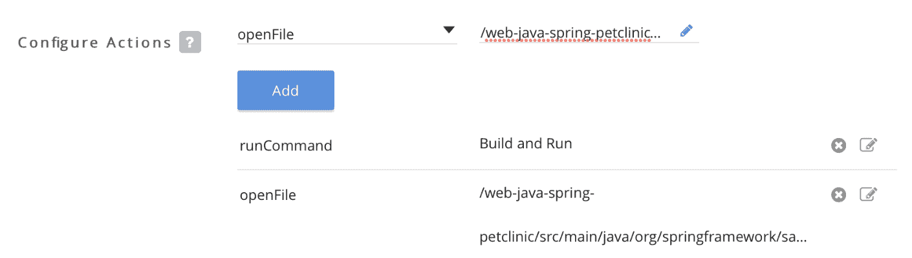

您还可以将添加到工作区的命令菜单中。让我们添加一个名为 *Start Tomcat* 的命令来启动 Tomcat。给命令命名，然后输入命令并点击*添加*按钮:

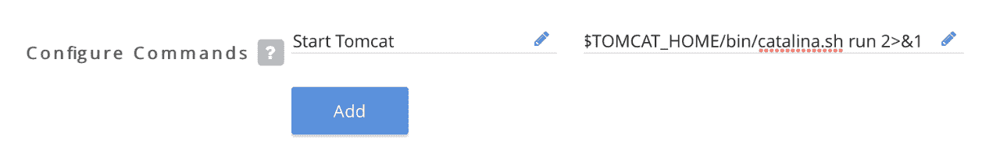

如果您需要创建一个包含多行的命令，请在它们之间使用双&符号。例如，如果您希望您的命令执行一个`mvn clean install`操作，然后打印工作目录，那么这个命令应该是`mvn clean install -f ${current.project.path} && pwd`。如果您想添加前面定义的三行*构建和运行*命令，请使用双&符号代替换行符。

现在滚动到窗口的顶部，复制工厂的 URL。该 URL 有两个版本。一个包含您的用户名，另一个不包含，但它们都指向同一个位置:

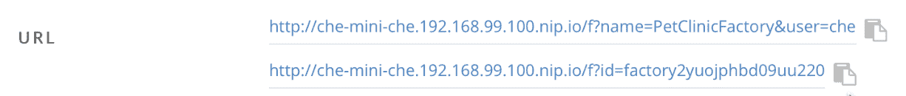

如果你只是想测试工厂，点击右上角的*打开*按钮，配置好的工作区将会打开。

或者你可以切换到不同的浏览器，粘贴在工厂的网址。您甚至可以切换到不同的机器，只要该机器被授权访问 Che 服务器。几分钟后，您将拥有完全相同的工作空间:

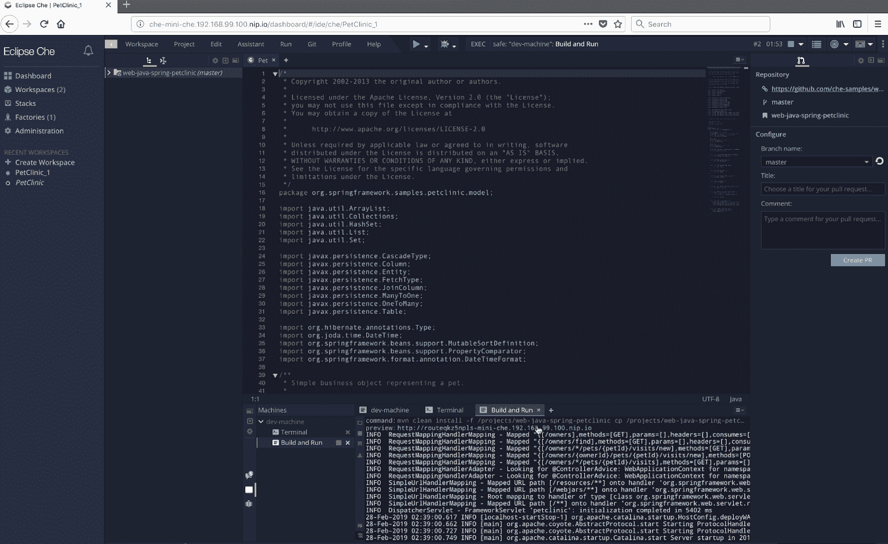

这是 Firefox 中加载的工作区 URL 这里所有其他的截图都来自 Safari。如您所见，文件`Pet.java`已经打开，代码已经构建并部署。当部署完成后，点击*构建和运行*窗口中的预览 URL，您将进入宠物诊所应用程序。

## 摘要

这是对 Che 工厂工作方式的快速浏览。工厂让入职变得异常简单。如果有人加入您的团队，他们可以使用工厂来创建新的工作空间。使用工厂消除了“它在我的机器上工作”综合症。你的机器就像其他人的一样，所以它在任何地方都以同样的方式工作，或者不工作。我们希望这篇文章能帮助你充分利用你的团队。

*Last updated: April 21, 2021*