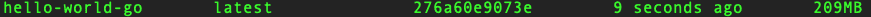

# 使用 Go 构建你的“Hello World”容器

> 原文：<https://developers.redhat.com/articles/go-container>

在阅读了本系列的前一篇博客文章“Containers，Kubernetes，microservice:Start here”之后，您现在已经准备好构建您的第一个“Hello World”应用程序，并在容器中运行它。为此，我们将使用 Go。

## 建啊，波曼，还是码头工人

您使用哪种方法来构建和运行您的容器取决于您的操作系统和工具选择。因为它更安全(它不需要 root 访问权限)，我将使用 Podman 来构建和运行我的容器，因为我知道所使用的命令与`docker`命令 100%兼容。事实上，你可以运行`alias docker=podman`，你不会知道有什么不同。因此，如果您不使用 podman，只需使用命令`docker`代替下面的每个`podman`。

## 建筑用零件

您需要将要运行的代码、配置/管理构建过程的文件以及工具(即 Podman)。

## 构建配置/管理

我们将创建一个名为“Dockerfile”的文件，其中包含构建映像所需的步骤和信息。构建过程分层次完成，起点通常是操作系统，或者更可能是操作系统和框架的组合。在我们使用 Go 的情况下，我们不需要安装任何框架。我们可以将代码编译成针对我们选择的操作系统的二进制文件。在这个例子中，我从 CentOS 开始。然后，我们将把我们的代码复制到图像中，当有人在容器中运行图像时，我们将给图像一个要执行的命令。下面的文件“Dockerfile”做这些事情(除了编译):

`FROM centos``COPY rest-api .``EXPOSE 3333``CMD [ "./rest-api"]`A line-by-line explanation is later in this article, but let's just build thing and run it; we can come back to the details.

## 让我们得到一些代码

Fork or clone the github repository at https://github.com/donschenck/path-to-kubernetes.Move into the directory src/go/hello-world

## 让我们建造并运行

We need to make sure gorilla/mux ([URL router and dispatcher for golang](https://github.com/gorilla/mux)) is installed:`go get github.com/gorilla/mux`To compile the code into a CentOS-compatible binary, run`env GOOS=linux GOARCH=amd64 go build -o rest-api`To build the image, run`podman build -t hello-world-go .`To run the image (again, we'll dive into this later), run`podman run -p 3333:3333 hello-world-go`Finally, open a second terminal window and run`curl http://localhost:3333`You should see "Hello World!" as the result.If you get an error message that "slirp4netns" was not found, you need to install it.

## 周期

So that's the basic cycle:

1.  创建源代码
2.  创建 Dockerfile 文件
3.  建立形象
4.  在容器中运行图像

## 关于那个文件

文件“Dockerfile”用于指导您构建图像。这里有一个简短的逐步分解:`FROM centos`这是你的基本形象，起点。在这种情况下，它是来自 CentOS 的官方图像。如果你想知道，我的 Mac 电脑是 209MB。

I could have chosen almost any Linux distribution. In fact, Alpine Linux weighed in at just over five megabytes. That is one small base image.`COPY rest-api .`Copies the compiled program into the image.`EXPOSE 3333`Exposes the application port, 3333, to the outside world.`CMD [ "./rest-api"]`This is what runs when the image is started (i.e. `podman run` or `docker run`).

## 在容器中运行

运行`podman run -p 3333:3333 hello-world-go`启动容器中的图像。它的代码使用端口 3333，它被映射到本地端口 3333。请随意尝试。它将附加到您的命令行；也就是说，它在运行时会占用您的终端。您可以通过在命令中使用`--detach`选项来消除这种情况。在这种情况下，容器在后台运行。

您可以通过运行`curl`命令或打开浏览器到`http://localhost:3333`来查看代码的结果。

## 把所有的东西装箱

所以您知道在 Linux 容器中运行 Node.js 代码所需的所有知识和工具。下一篇博文将扩展这方面的知识，以包括一个应用程序的多个实例和/或一个集群中的多个应用程序。

*Last updated: May 27, 2020*