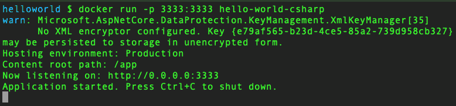
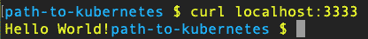

# 使用 C#构建你的“Hello World”容器

> 原文：<https://developers.redhat.com/articles/c-containers>

在阅读了本系列的前一篇博客文章“Containers，Kubernetes，microservice:Start here”之后，您现在已经准备好构建您的第一个“Hello World”应用程序，并在容器中运行它。为此，我们将使用 C#。

## 建啊，波曼，还是码头工人

您使用哪种方法来构建和运行您的容器取决于您的操作系统和工具选择。因为它更安全(它不需要 root 访问权限)，我将使用 Podman 来构建和运行我的容器，因为我知道所使用的命令与`docker`命令 100%兼容。事实上，你可以运行`alias docker=podman`，你不会知道有什么不同。因此，如果您不使用 podman，只需使用命令`docker`代替下面的每个`podman`。

## 建筑用零件

您需要将要运行的代码、配置/管理构建过程的文件以及工具(即 Podman)。

## 构建配置/管理

我们将创建一个名为“Dockerfile”的文件，其中包含构建映像所需的步骤和信息。构建过程分层次完成，起点通常是操作系统，或者更可能是操作系统和框架的组合。比如你需要。安装了网络核心。所以从这一点开始是很常见的。您可以从操作系统开始，然后在构建映像时将框架全部安装到映像中——这样做可能有很好的理由。您也可以这样做——从一个操作系统开始，添加一个框架——保存该映像，并将其用作其他映像的基础。是的，像任何 IT 技术一样，你可以把它变得简单或复杂。为了简单起见，我们将从 OS+框架组合开始。然后，我们将在映像中复制我们的代码，然后运行`dotnet restore`以确保依赖项是最新的。构建完二进制文件后，我们将给图像一个命令，当有人在容器中运行图像时，该命令将被执行。下面的文件“Dockerfile”(我从[微软的网站](https://learn.microsoft.com/en-us/dotnet/core/docker/build-container)得到的)，做了那些事情:

```
FROM microsoft/dotnet:2.1-sdk
WORKDIR /app
# copy csproj and restore as distinct layers
COPY *.csproj ./
RUN dotnet restore

# copy and build everything else
COPY . ./
RUN dotnet publish -c Release -o out
ENTRYPOINT ["dotnet", "out/helloworld.dll"]

```

本文后面会逐行解释，但让我们先构建并运行它；我们可以回到细节上来。

## 让我们得到一些代码

1.  派生或克隆 https://github.com/donschenck/path-to-kubernetes.的 github 库
2.  进入目录 src/csharp/helloworld。

## 让我们建造并运行

To build the image, run`podman build -t hello-world-csharp .`(or `docker build -t hello-world-csharp .`)Note that a fast internet connection really pays off here, as layers (images or binary code) are being downloaded to your build machine. If an image already exists in your build machine cache, the download is bypassed.To run the image (again, we'll dive into this later), run`podman run -p 3333:3333 hello-world-csharp`(or `docker run -p 3333:3333 hello-world-csharp`)Finally, open a second terminal window and run`curl http://localhost:3333`You should see "Hello World!" as the result.

## 周期

So that's the basic cycle:

1.  创建源代码
2.  创建 Dockerfile 文件
3.  建立形象
4.  在容器中运行图像

## 关于那个文件

文件“Dockerfile”用于指导您构建图像。这里有一个简短的逐步分解:`FROM microsoft/dotnet:2.1-sdk`这是你的基本形象，起点。在这种情况下，它来自微软并具有。安装了 NET Core 2.1 SDK。这意味着我们不必安装任何框架；它已经包含在此基础映像中。如果你想知道，我的 Mac 是 1.74GB。这只是在你的映像中建立一个工作目录。`# copy csproj and restore as distinct layers (this is a Dockerfile comment)` `COPY *.csproj ./` `RUN dotnet restore`正如评论所说，这两行将 C#项目文件复制到您的映像中，然后在您的映像中运行`dotnet restore`来下拉依赖项。`# copy and build everything else` `COPY . ./`将其他需要的东西复制到图像中。`RUN dotnet publish -c Release -o out`在映像中构建二进制文件(DLL)。`ENTRYPOINT ["dotnet", "out/helloworld.dll"]`这是图像启动时运行的程序(即`podman run`或`docker run`

## 在容器中运行

运行`podman run -p 3333:3333 hello-world-csharp`命令启动容器中的映像。它的代码使用端口 3333，它被映射到本地端口 3333。请随意尝试。它将附加到您的命令行；也就是说，它在运行时会占用您的终端。您可以通过在命令中使用`--detach`选项来消除这种情况。在这种情况下，容器在后台运行。您可以通过运行`curl`命令或打开浏览器到`http://localhost:3333`来查看代码的结果。

## 把所有的东西装箱

因此，您知道在 Linux 容器中运行 C#代码所需的所有知识和工具。下一篇博文将扩展这方面的知识，以包括一个应用程序的多个实例和/或一个集群中的多个应用程序。

*Last updated: January 6, 2023*