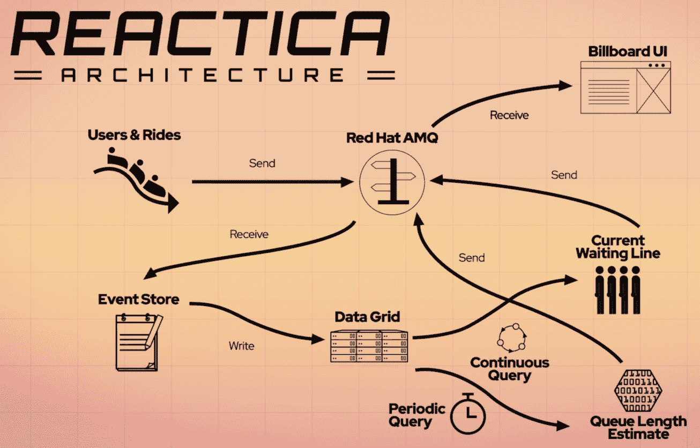

# 第 1 部分:反应式编程和 Vert.x 简介

> 原文：<https://developers.redhat.com/coderland/reactive/reactive-intro>

在我们进入代码的细节之前，我们将在这里讨论三个主题:

*   reactiva 过山车和我们的任务
*   反应式编程
*   Eclipse 绿色. x

## reactiva 过山车

乘坐 Reactica 过山车的兴奋难以用语言表达，所以我们在这里不做尝试。此外，这个演示的目的是创建一个显示过山车等待时间的显示。我们会让游乐设施和它的乘客自己说话。

我们将介绍的代码使用一个反应式微服务系统来处理与过山车和敢于乘坐过山车的游客相关的所有数据。这些微服务使用异步消息来完成它们的工作，创建一个具有弹性、可伸缩性和可靠性的系统。其结果是一个引人注目的显示，向 Coderland 的客人显示他们在登上游乐设施之前需要等待多长时间。

这就是我们真正需要了解的场景本身，所以让我们继续。

## 反应式编程

反应式编程到底是什么？引用 Andre Staltz 的反应教程:

> 反应式编程是用异步数据流编程。

换句话说，我们将编写创建或消费事件的组件。(在某些情况下，一个组件两者都做。)在我们这里的工作中，一些事件被发送到红帽 AMQ；其他的发送到红帽数据网格。这两个中间件是数据在系统中移动的方式。事件是像“过山车刚刚关闭”、“有人刚刚坐上去”和“有人刚刚坐完”这样的事情。我们将使用这些事件中的数据来计算 Reactica 的等待时间。

我们使用 Red Hat 数据网格跟踪公园游客排队乘坐 Reactica、登上游乐设施以及结束游乐设施的过程。数据网格提供了*回流支持*，这意味着我们可以存储事件，直到消费者处理它们。当事件发生时，消费者可能无法处理所有事件。有了数据网格，所有的事件都会被消费掉。

我们在这里要做的是创建一些微服务，并让每个微服务创建和/或观察异步数据流。我们将要关注的事件简单且易于处理。最棒的是，代码也很简单。我们大多数微服务的代码少于 25 行。

### 反应系统的特征

[反应宣言](https://reactivemanifesto.org/)定义了反应系统的四个特征。我们在这里简单讨论一下。当我们浏览 Reactica 代码时，我们将看到它是如何体现这些原则的。宣言说反应系统是:

**反应灵敏**

系统尽可能快地响应。(咄。)显然，每个系统都是这样设计的，但反应式系统的响应性包括快速发现故障并以优雅的方式处理故障的概念。

**弹性**

根据这种响应性的概念，当系统的一部分发生故障时，反应式系统保持响应。正如您将看到的，我们的系统有多个组件，每个组件都相互隔离。这意味着任何故障都局限于一个组件，而不是整个系统。当部署了完整的应用程序后，我们可以启动和停止不同的组件，而不会影响整个系统。

**弹性**

因为反应式系统的组件异步地创建和使用事件，所以特定组件所需的资源可能会随着时间的推移而发生显著变化。反应式系统会根据需要放大或缩小这些资源。(如果你认为这听起来很云里雾里的，那么你就对了。)

**消息驱动**

难题的最后一部分是反应式系统使用异步消息传递来相互通信。消息传递，就其本质而言，促进了组件之间的松散耦合，并且异步地做事情可以保护一个组件免受另一个组件失败的影响。如果一个组件产生消息，它不知道使用这些消息的组件是否以某种方式失败或降级。类似地，消息消费者不知道生产者是否失败。

### 系统结构

我们的反应式系统的架构如下所示:



在图的左上角，我们有生成`User`和`Ride`对象的组件。新的`User`被送到红帽 AMQ。在左下方，事件存储组件监视 AMQ 的新`User`并将它们传递给 Red Hat 数据网格。

右下角是生成 Billboard 组件所需数据的组件。队列长度估计组件查询数据网格以查看有多少人在排队等候过山车。这决定了等待时间。当前等待队列组件跟踪队列中的客人(`User` s)的名字及其状态。`User`的状态可以是正在排队、正在乘坐或已完成乘坐。

整个练习的重点是右上角的 Billboard UI 组件。它从队列长度估计和当前等待队列组件中监视更新的数据(通过 AMQ 发送),并相应地更改 web UI。它还对 coaster 本身进行控制，允许管理员启动或停止 coaster，启动或停止新`User`的生成，如果 Reactica 要停机一段时间，甚至可以从 coaster 中删除所有`User`。

### 一个反应式的分布式系统

所有这些组件和底层基础设施的组合不仅仅是反应式编程的一个例子；这是一个完整的反应式分布式系统，体现了我们前面提到的所有特征。

### 被动资源

如果您想更深入地了解反应式编程，这里有一些有用的资源:

*   克莱门特·埃斯科菲耶的优秀电子书《在 Java 中构建反应式微服务:异步和基于事件的应用程序设计》值得大力推荐，该书可从 Red Hat 开发者计划免费获得。

*   你错过的反应式编程介绍

*   [反动宣言](https://www.reactivemanifesto.org)

## Eclipse 绿色. x

因为几乎所有的代码都是用 Vert.x 编写的，所以有必要说一下。正如 Vert.x 网站上的标题( [vertx.io](https://vertx.io) )所说，“Eclipse Vert.x 是一个在 JVM 上构建反应式应用的工具包。”它是事件驱动、单线程和非阻塞的，这意味着您可以用少量线程处理许多并发应用程序。(如果你知道 Node.js 事件循环是如何工作的，Vert.x 会显得很熟悉。)

一个 Vert.x 组件被称为一个**顶点**。它是一个单线程的、事件驱动的(通常是非阻塞的)组件，接收事件(HTTP 请求、计时器的滴答)并产生响应(HTTP 响应、控制台输出)。它还可以做其他事情。例如，给 AMQ 发信息。

继续利用网站上的概述，Vert.x 是:

**轻量级**

核心 Vert.x 模块大约 650kB。千字节。这还不到旧软盘容量的一半。(对于那些不记得软盘的人来说，它们是原始的存储设备，看起来像一个保存按钮。)

**快**

如果你愿意，你可以在上面找到数字，但是相信我们，它很快。如果你不相信，vertx.io 指出了 TechEmpower 上的[统计数据。Vert.x 在该基准测试中得分最高，在许多其他测试中得分也很高。](https://www.techempower.com/benchmarks/#section=data-r17&hw=ph&test=db)

**不是应用服务器**

您不需要将 Vert.x 应用程序部署到某处的整体服务器中。你可以在任何你想去的地方运行你的代码。如果您熟悉 Node.js 和 Express 的组合，您会觉得在这里就像在家里一样。

**模块化**

Vert.x 有很多组件，但我们只需使用我们需要的组件。例如，如果我们需要为我们的事件流访问 Apache Kafka，我们可以将 Vert.x Kafka JAR 文件添加到应用程序的依赖项中。如果我们不需要 Kafka，它就不会是我们应用程序的一部分。

**简单但不简单化**

我们将在查看 Reactica 代码时看到这一点。大多数应用程序(顺便说一下，Vert.x 称之为 verticles)的代码都不超过 25 行。

**微服务的理想选择**

微服务应该是轻量级、异步和事件驱动的。Vert.x 使构建这种应用程序变得容易。

**多语言**

因为它是在 JVM 上构建的，所以它支持许多已经在 JVM 上实现的语言，包括 Java(当然)、JavaScript、Ruby、Groovy、Ceylon、Scala 和 Kotlin。

### 基本的 Vert.x 应用程序

下面是一个简单的 Vert.x verticle:

```
package com.redhat.coderland; 

import io.vertx.core.AbstractVerticle;
import io.vertx.core.Vertx;

public class SampleVerticle extends AbstractVerticle {
    private long startTime = System.currentTimeMillis();
    private long counter = 1;

    @Override
    public void start() {
        vertx.setPeriodic(2000, counter -> {
            long runTime = (System.currentTimeMillis() - startTime) / 1000;
            System.out.println("Server run time: " + runTime + " seconds.");
        });

        vertx.createHttpServer()
            .requestHandler(req -> {
                System.out.println("Request #" + counter++ +
                                   " from " + req.remoteAddress().host());
                req.response().end("Hello from Coderland!");
            })
            .listen(8080);

        System.out.println("----------------------------------------------");
        System.out.println("---> Coderland now listening on localhost:8080");
        System.out.println("----------------------------------------------");
    }

    @Override
    public void stop() {
       System.out.println("---------------------------------------------");
       System.out.println("---> Coderland signing off! Have a great day.");
       System.out.println("---------------------------------------------");
    }

    public static void main (String[] args) {
        Vertx vertx = Vertx.vertx();
        vertx.deployVerticle(new SampleVerticle());
    }
}
```

一旦这个 verticle 启动并运行，它就同时做两件事:它使用`vertx.setPeriodic()`每两秒(2000 毫秒)打印一条消息来指示代码已经运行了多长时间，它使用`vertx.createHttpServer()`向`localhost:8080`发送请求。代码可在 [GitHub](https://github.com/redhat-developer-demos/vertx-starter.git) 获得；我们鼓励您克隆或派生回购并自己运行它。转到克隆 repo 的目录，用 Maven 构建它:

```
mvn clean package
java -jar target/vertx-starter-1.0-SNAPSHOT.jar
```

当您运行代码时，您会看到类似这样的内容:

```
doug@dtidwell-mac:~/vertx-starter $ java -jar target/vertx-starter-1.0-SNAPSHOT.jar 
----------------------------------------------
---> Coderland now listening on localhost:8080
----------------------------------------------
Jun 26, 2019 8:33:59 AM io.vertx.core.impl.launcher.commands.VertxIsolatedDeployer
INFO: Succeeded in deploying verticle
Server run time: 2 seconds.
Server run time: 4 seconds.
Request #1 from 192.168.1.67
Server run time: 6 seconds.
Request #2 from 192.168.1.76
Server run time: 8 seconds.
Server run time: 10 seconds.
Request #3 from 0:0:0:0:0:0:0:1
Request #4 from 0:0:0:0:0:0:0:1 
Server run time: 12 seconds.
Server run time: 14 seconds.
Server run time: 16 seconds.
Request #5 from 192.168.1.67
Server run time: 18 seconds.
Server run time: 20 seconds.
Request #6 from 192.168.1.76
Server run time: 22 seconds.
Server run time: 24 seconds.
^C---------------------------------------------
---> Coderland signing off! Have a great day.
---------------------------------------------

```

关于输出的一些注释。首先，注意我们从`AbstractVerticle`中`@Override`出了`start()`和`stop()`方法。覆盖`start()`方法是典型的，因为当你的 verticle 被加载时，你可能想要设置一些东西。覆盖`stop()`不太常见，但是请注意，在命令行键入 Ctrl+C 会在系统终止代码之前调用`stop()`方法。

其次，`start()`方法中的 print 语句是在 verticle 启动并运行之前执行的。在`start()`方法完成之前，Vert.x 运行时不会打印“成功部署 verticle”消息。输出显示代码正在监听端口 8080，但这在技术上是不正确的，直到几分之一秒后 verticle 被完全加载。

最后，verticle 包含两个异步流程。一个(`vertx.setPeriodic()`)每两秒调用一次，另一个(`vertx.createHttpServer()`)在`localhost:8080`上有 HTTP 请求时调用。只要 verticle 在运行，这两个进程就相互独立地运行。

正如您所料，我们将在 Reactica 代码中看到的一些垂直部分要复杂得多，但这是基本结构。我们将使用`start()`方法来建立我们需要的任何基础设施，我们将定义方法来处理我们将从该基础设施获得的事件，然后我们将坐下来让系统做它的工作。

## 还有一件事——事件总线

在我们开始之前，还有一个概念我们应该提到:Vert.x 事件总线。事件总线允许您在系统的所有垂直领域发送消息。消息被发送到地址，它们有一组头和一个主体。地址只是一个字符串，通常是一个有意义的名称，头和主体中的数据格式可以是您喜欢的任何格式。(通常头是元数据，主体是 JSON。)任何垂直都可以注册为某个地址的消费者，这意味着发送到该地址的任何消息都将被传递到注册了该地址的每个垂直。

有关事件总线的更多细节，请参见 Clement Escoffier 的前述书籍[用 Java 构建反应式微服务](https://developers.redhat.com/books/building-reactive-microservices-java/)，该书可从[红帽开发者计划](https://developers.redhat.com/)免费获得。

## 下一步是什么？

我们希望听到您对此内容的评论和问题。你可以在 coderland@redhat.com 找到我们。

如果你是红帽开发者计划的成员(为什么你不是呢？它是免费的。)，可以下载[红帽 AMQ](https://developers.redhat.com/products/amq/) 和[红帽数据网格](https://developers.redhat.com/products/datagrid/)的副本。

除此之外，本系列还有两篇文章:

*   [第二部分:构建反应系统](https://developers.redhat.com/coderland/reactive/building-a-reactive-system/)
*   [第 3 部分:反应系统在运行](https://developers.redhat.com/coderland/reactive/reactive-system-in-action/)

这两篇文章是独立的。如果您只想运行代码，可以跳到第 3 篇文章，但是我们强烈建议您通读这两篇文章以了解代码是如何工作的。尽情享受吧！

*Last updated: April 21, 2021*