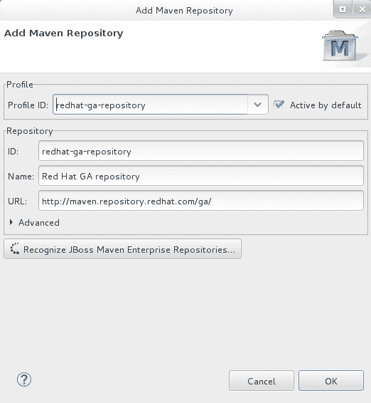
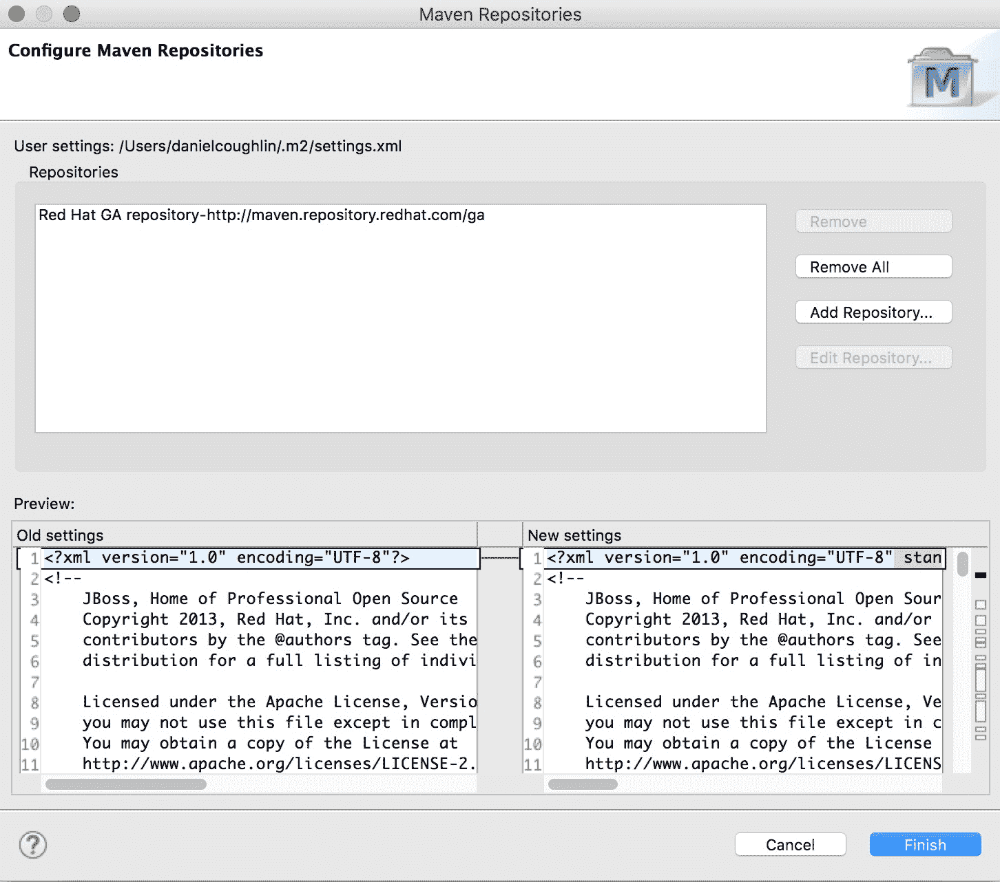
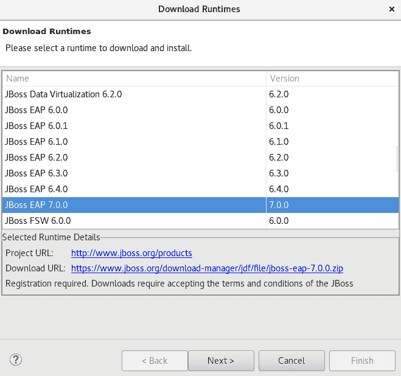
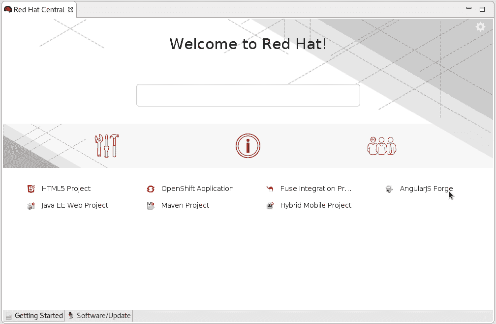
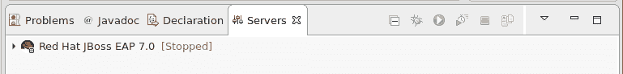

# 通过 CodeReady Studio 面向 JBoss EAP 运行时的 Hello World

> 原文：<https://developers.redhat.com/articles/hello-world-jboss-eap-runtime-codeready-studio>

## 设置您的开发环境

您可以安装 Red Hat Developer Studio standalone(A)，也可以安装 JBoss Enterprise Edition (B)。

### A.独立安装 Red Hat Developer Studio

1.  安装 Java SE 开发工具包(JDK)版本 8。我们建议使用 OpenJDK 或 Oracle JDK。

2.  下载[开发者工作室 12](https://developers.redhat.com/download-manager/file/devstudio-12.0.0.GA-installer-standalone.jar?) 单机版。

3.  运行 Developer Studio 安装程序。

    1.  对于 **Mac/Windows** 开发主机:

        1.  导航到包含下载的 Developer Studio JAR 文件的文件夹。

        2.  右击`devstudio-12.0.0.GA-installer-standalone.jar`

        3.  选择*打开方式→ Jar 启动器。*

    2.  对于 **Linux** 开发主机:

        1.  导航到包含 Developer Studio JAR 文件的文件夹。

        2.  执行安装程序:

            ```
            $ java -jar devstudio-12.0.0.GA-installer-standalone.jar
            ```

    3.  按照屏幕上的说明继续安装过程。

4.  启动开发者工作室。详见 [Developer Studio 12 安装文档](https://access.redhat.com/documentation/en-us/red_hat_developer_studio/12.0/html-single/installation_guide/index.html)。

5.  配置 Maven:

    1.  在 Developer Studio 中，点击*窗口→首选项。*

    2.  在文本框中输入 *maven* 查看与 maven 相关的选项。

    3.  在结果中，展开 *JBoss 工具*并点击 *JBoss Maven 集成。*

    4.  点击*配置 Maven 仓库*。

    5.  点击 *Add Repository* ，然后点击 *Profile ID:* 字段中的向下箭头，查看可用的 Maven 资源库。

    6.  从下拉列表中选择 **redhat-ga-repository** ，然后点击 *OK* 。

        

6.  单击完成。

    

7.  当被问及更新`settings.xml`文件时，回答*是*。

### B.安装 JBoss EAP

一旦安装了 Developer Studio(如上)，您就可以从 IDE 中下载、安装和设置 JBoss EAP。

要从 IDE 中下载、安装和设置 JBoss EAP，请执行以下操作:

1.  启动 IDE。

2.  单击窗口→首选项，展开 JBoss 工具，然后单击 JBoss 运行时检测。

3.  在“路径”窗格中，单击“下载”。

4.  在下载运行时窗口中，从下载运行时表中选择要下载的 JBoss EAP 版本，然后单击下一步。

注意:对于 JBoss EAP 6.1.x 和更高版本，请继续遵循这里给出的步骤。对于 JBoss EAP 6.0.x 和更早版本，请按照屏幕上的说明从 Red Hat 客户门户下载 JBoss EAP，并在安装 JBoss EAP 后继续[使用运行时检测从 IDE 内设置 JBoss EAP](https://access.redhat.com/documentation/en-us/red_hat_jboss_developer_studio/11.0/html/getting_started_with_jboss_developer_studio_tools/developing_first_applications_with_jboss_developer_studio_tools#UseRuntimeDetection)。

**图 2.2。列出可用 JBoss EAP 版本的下载运行时窗口**



5.  在 JBoss.org 凭据窗口中，输入您的凭据，然后单击下一步。
6.  在运行时 JBoss EAP_version 窗口中，阅读条款和条件，然后单击我接受许可协议的条款，然后单击下一步。请注意，如果您之前已经在 IDE 中或通过 jboss.org 网站接受了条款和条件，此窗口将被跳过。

7.  在下载运行时窗口的安装文件夹字段中，单击浏览并选择 JBoss EAP 的安装位置，然后单击完成。“下载”JBoss EAP 1 窗口显示下载进度。

8.  单击应用并关闭以关闭首选项窗口。

结果:服务器以停止模式列在 Servers 视图中。

## 安装、配置和验证

要验证 Developer Studio 和 JBoss EAP 是否正常工作，请在您将要创建和配置的 JBoss EAP 服务器中部署并执行 *helloworld* quickstart 应用程序:

在 Developer Studio 中，打开 *Red Hat Central* 视图。

1.  **注意:**如果*红帽中心*视图不可见，点击

    主菜单栏上的图标。

2.  在搜索框中输入`helloworld`，点击结果中显示的 ***helloworld-rs*** 快速入门。

    

3.  点击*完成。*这会下载 **helloworld** 应用程序及其 Maven 依赖项。

4.  下载完所有的依赖项后，会出现一个对话框，告诉您项目已经准备好了。点击*完成*。

5.  在*服务器*选项卡中，选择*红帽 JBoss EAP 7.0【已停止】*，点击启动服务器图标，启动 JBoss EAP 服务器。

    

6.  一旦服务器启动，在*项目浏览器*视图中右键单击 *jboss-helloworld* 应用程序。

    1.  从出现的菜单中，选择*运行方式..*然后*运行在服务器*上。

    2.  选择新创建的 JBoss EAP 服务器，点击*确定*，然后*完成*。

这将在 JBoss EAP 服务器中构建、部署和运行 **helloworld** 应用程序。应用程序在内部默认的 Developer Studio web 浏览器中打开，并显示“Hello World！”成功页面。

## 构建您的第一个 JBoss EAP 应用程序

按照下面的系列来构建您的第一个应用程序。您将构建一些简单的示例，并使用 JBoss EAP 构建 TicketMonster 应用程序。TicketMonster 应用程序向您展示了如何构建一个使用 REST 与 Jakarta EE 后端通信的现代 HTML 应用程序。本系列将带您从头到尾经历应用程序开发生命周期的每一步。

| **第一步:**了解更多关于入门的信息 | [JBoss 企业应用平台入门指南](https://access.redhat.com/documentation/en-us/red_hat_jboss_enterprise_application_platform/7.2/html/getting_started_guide/) |
| 第二步:开始探索 TicketMonster | [教程](https://developers.redhat.com/ticket-monster?referrer=jbd) |

想知道更多关于 JBoss EAP 可以做什么？

*   [查看快速入门、视频和其他学习材料](https://developers.redhat.com/search/?f=project%7Eeap)

*   [阅读其他人如何使用 JBoss EAP](https://www.redhat.com/en/success-stories/?f%5B0%5D=taxonomy_product%3ARed+Hat+JBoss+Enterprise+Application+Platform)

*Last updated: January 9, 2023*