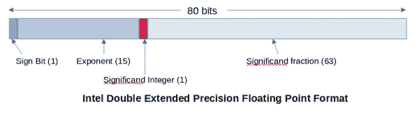

# 大部分无害:一个伪正常浮点数的帐户

> 原文：<https://developers.redhat.com/blog/2021/05/12/mostly-harmless-an-account-of-pseudo-normal-floating-point-numbers>

浮点运算是计算机科学中一个普遍的深奥课题。可以肯定地说，每个软件工程师都听说过浮点数。许多人甚至在某个时候使用过它们。很少有人会声称真正理解到合理的程度，更少有人会声称知道所有的极限情况。最后一类工程师可能是虚构的，或者充其量是乐观的。我过去在 GNU C 库中处理过浮点相关的问题，但我不会自称是这方面的专家。我绝对没有想到会像几个月前那样，了解到一种新数字的存在。

本文描述了在物理世界中不对应任何东西的新型浮点数。这些数字，我称之为*伪正常数字*，会给程序员带来难以追踪的问题，甚至已经进入可怕的[常见漏洞和暴露(CVE)列表](https://cve.mitre.org/)。

## 简要背景:IEEE-754 双打

实际上，每种编程语言都使用 IEEE-754 双浮点格式来实现 64 位`double`浮点数。该格式指定了一个 64 位存储，包含一个符号位、11 个指数位和 52 个有效位。每个位模式都属于这些浮点数类型中的一种:

*   标准数:指数至少有一位(但不是所有位)设置。有效位和符号位可以是任何值。
*   非正规数:指数的所有位都清零。有效位和符号位可以是任何值。
*   无穷大:指数的所有位都已设置。有效数位的所有位都清零，符号位可以是任何值。
*   不是数字(NaN):指数的所有位都已设置。有效数位至少设置了一个位，符号位可以是任何值。
*   零:指数和有效数位的所有位都清零。符号位可以是任何值，这就产生了备受欢迎的有符号零的概念。

有效位仅描述小数部分；对于非正规数，该整数隐式为零，对于所有其他数，该整数为 0 和 1。编程语言将概念完美地映射到这些数字类别。不存在至少其分类是未指定的双浮点数。由于广泛采用，人们可以假定跨硬件平台和运行时环境的行为在很大程度上是一致的。

要是我们能对 double 类型的更大的兄弟姐妹:`long double`类型说同样的话就好了。IEEE-754 扩展精度格式是存在的，但是它没有指定编码，也不是所有架构的标准。不过，我们在这里不是为了哀悼这种状况；我们正在研究一种新的数字。我们发现它们采用英特尔双扩展精度浮点格式。

## 英特尔双扩展精度浮点格式

[英特尔 64 和 IA-32 架构软件开发人员手册](https://software.intel.com/content/www/us/en/develop/articles/intel-sdm.html)的第 4.2 节将双精度浮点格式定义为 80 位值，布局如图 1 所示。

Figure 1: Layout of the Intel double extended-precision floating point format.

根据这个定义，我们所依赖的可靠的数字分类映射到 long-double 格式，如下所示:

*   标准数:指数至少有一位(但不是所有位)设置。有效位和符号位可以是任何值。*整数位被设置*。
*   非正规数:指数的所有位都清零。有效位和符号位可以是任何值。*整数位清零*。
*   无穷大:指数的所有位都已设置。有效数位的所有位都清零，符号位可以是任何值。*整数位被设置*。
*   不是数字(NaN):指数的所有位都已设置。有效数位至少设置了一个位，符号位可以是任何值。*整数位被设置*。
*   零:指数和有效数位的所有位都清零。符号位可以具有任何值。*整数位清零*。

## 认同的转折点

细心的观察者可能会问两个非常合理的问题:

*   如果一个普通的数，无穷大，或者 NaN 的整数位清零了呢？
*   如果反规范数设置了整数位会怎么样？

带着这些问题，你会发现一组新的数字。恭喜你！

*英特尔 64 和 IA-32 架构开发人员手册中的第 8.2.2 节不支持的双扩展精度浮点编码和伪反规范*描述了这些数字，因此它们不是未知的。总之，如果英特尔浮点单元(FPU)遇到伪 NaN(即整数位清零的 NaN)、伪无穷大(整数位清零的无穷大)或非 normal(整数位清零的正常数)，它将生成无效操作异常。FPU 通过生成非正规操作数异常，继续以与常规非正规操作相同的方式支持伪非正规操作(设置了整数位的非正规操作)。自 387 FPU 以来一直如此。

伪反规范数不太有趣，因为它们被视为反规范数。其余的则不受支持；手册声明 FPU 永远不会生成这些数字，也不会费心给它们一个集合名称。然而，在本文中我们需要统称它们，所以我称它们为*伪正常数*。

## 如何对伪正常数进行分类？

很明显，这些数字暴露了我们在编程环境中对浮点数的世界观的不足。一个伪南也是南吗？伪无穷大也是无穷大吗？不正常的数字怎么办？他们应该集体成为他们自己的一类数字吗？都应该是自己的一类数字。第三题之前我为什么不退？

修改编程环境来引入一个新的数字类对于一个单一的架构来说是不值得的，所以这是不可能的。将这些数字硬塞到现有的类中可能是基于它们是哪个类的伪类。或者，我们可以将它们统称为 nan(特别是信令 nan ),因为像信令 nan 一样，对它们进行操作会生成无效的操作异常。

### 未定义的行为？

一个有效的问题是我们是否应该关心。例如，C 标准在第 *6.2.6 节类型的表示*中声明“某些对象表示不需要表示对象类型的值”，这符合我们的情况。FPU 永远不会为 long double 类型生成这些表示，因此可以说在 long double 中传递这些表示是未定义的。这是回答分类问题的一种方式，但它本质上是让用户理解硬件规格。这意味着每当用户从二进制文件或网络中读取一个长 double 时，他们都需要根据底层架构来验证该表示是否有效。这是[FP classify 函数](https://en.cppreference.com/w/c/numeric/math/fpclassify)和朋友们应该做的事情，但遗憾的是他们没有这样做。

### 如果许多答案都是可能的，你会得到许多答案

为了识别一个输入是否是 NaN，GNU 编译器集合(GCC)传递 CPU 给它的答案。也就是说，它通过与输入执行浮点比较来实现`__builtin_isnanl`。当一个异常产生时(就像 n an 一样)，奇偶标志被置位，这表示一个无序的结果，从而表示输入是 NaN。当输入是任何伪正常数字时，它会生成一个无效操作异常，因此所有这些数字都被归类为 NaN。

另一方面，GNU C 库(glibc)查看数字的位模式来决定它的分类。该库评估该数字的所有位，以决定该数字是在`__isnanl`还是`__fpclassify`中为 NaN。在评估过程中，该实现假设 FPU 永远不会生成伪正常数，并忽略整数位。因此，当输入是任何伪标准数(当然，伪 nan 除外)时，实现会将这些数“固定”为它们的非伪对应物，并使它们有效！

## 大部分(但不是完全)无害

`isnanl`的 glibc 实现假设它总是得到正确格式化的`long double`。这不是一个不合理的假设，但它让每个程序员都有责任在将从文件或网络读取的二进制`long double`数据传递给`isnanl`之前对其进行验证，具有讽刺意味的是，这是一个验证功能。

这些假设导致了 [CVE-2020-10029](https://cve.mitre.org/cgi-bin/cvename.cgi?name=CVE-2020-10029) 和 [CVE-2020-29573](https://cve.mitre.org/cgi-bin/cvename.cgi?name=CVE-2020-29573) 。在这两个 CVE 中，函数(前者是三角函数，后者是函数的`printf`族)依赖于有效的输入，并以潜在的可利用的堆栈溢出结束。我们修复了 CVE-2020-10029，将伪正常数视为 NaN。这些函数将检查整数位，如果它是空的，就退出。

CVE-2020-29573 的修复历史更有趣一些。几年前，作为一次清理，glibc [用标准的 C99 宏`isnan`取代了](https://sourceware.org/git/?p=glibc.git;h=d81f90ccd0109de9ed78aeeb8d86e2c6d4600690)对`isnanf`、`isnan`和`isnanl`的使用，该宏根据输入扩展到适当的函数。随后，另一个补丁进入[优化 isnan C99 宏定义](https://sourceware.org/git/?p=glibc.git;h=8df4e219e43a4a257d0759b54fef8c488e2f282e)，以便在安全的时候使用`__builtin_isnan`。这无意中修复了 CVE-2020-29573，因为对伪正常数字的有效性检查现在开始失败。

## 同意答案

CVEs 促使我们(GNU 工具链社区)更严肃地讨论关于 C 库接口的这些数字的分类。我们[在 glibc 和 GCC 社区中讨论了这个](https://sourceware.org/pipermail/libc-alpha/2020-November/119949.html),并同意这些数字应该被认为是 C 库接口上下文中的 nan 信号。然而，这并不意味着 libm 将努力在内部将这些数字一致地视为 nan 或提供详尽的覆盖范围。目的不是定义这些数字的行为；这只是为了使分类在整个工具链中保持一致。更重要的是，在这些数字的错误分类导致崩溃或安全问题的情况下，我们就指导方针达成了一致。

朋友们，这是一个非正常的、伪南的和伪无限的故事。我希望你永远不会遇到这些，但是如果你遇到了，希望我们已经让你更容易处理它们。

*Last updated: October 14, 2022*