# 如何在红帽 OpenShift 上安装 Kubeflow 1.2

> 原文：<https://developers.redhat.com/articles/2021/05/28/how-install-kubeflow-12-red-hat-openshift>

随着人工智能(AI)在各行各业的采用增加，特别是通过机器学习(ML)，集成通常不同的工具、库、包和依赖关系的工作也增加了复杂性。这使得开发和运营( [DevOps](/topics/devops) )成为一项令人生畏的任务，组织和开源社区都在积极努力。引用《机器学习系统中隐藏的技术债务》的作者[的话](https://web.kaust.edu.sa/Faculty/MarcoCanini/classes/CS290E/F19/papers/tech-debt.pdf)，“开发和部署 ML 系统相对来说是快速和便宜的，但是长期维护它们是困难和昂贵的。”

如果你正处于为 [AI/ML](/topics/ai-ml) (MLOps)处理 DevOps 的阵痛中，那么两个值得你关注的开源项目是上游的 [Kubeflow](https://www.kubeflow.org/) 和下游的[开放数据中枢](https://opendatahub.io/) (ODH)。这些项目的目标是提供机器学习工具包，处理传统软件 DevOps 不处理的复杂的编排部分。

**注**:有关 MLOps 的更多信息，请参见[关于 OpenShift 的 Dotscience:为 MLOps 启用 DevOps】。](https://www.openshift.com/blog/dotscience-on-openshift)

顾名思义，Kubeflow 基于 [Kubernetes](/topics/kubernetes) 。在本文中，我们将展示它在 [Red Hat OpenShift 容器平台](/products/openshift)上运行，并包含一个 [Istio 服务网格](/topics/service-mesh)。

## 目标

使用本文作为启动步骤，在 OpenShift 容器平台实例上安装默认的 Kubeflow 工具包，以探索工具和功能。图 1 显示了在 OpenShift 容器平台上运行的 Kubeflow 仪表板，提供了对一套跨越系统生命周期的机器学习工具的访问。

[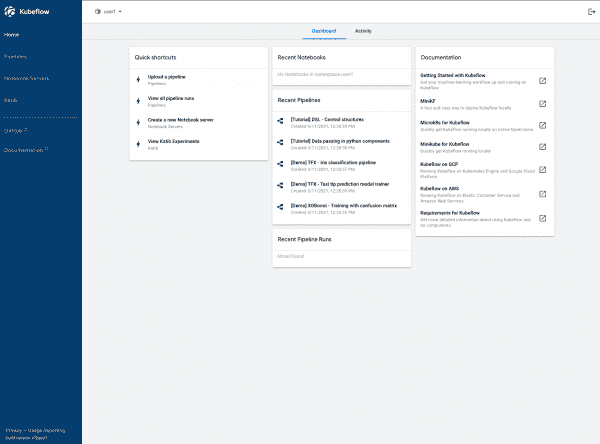](/sites/default/files/blog/2021/04/kubeflow-ui.png)Figure 1: The Kubeflow central dashboard.

Figure 1: The Kubeflow central dashboard.

**注意**:在撰写本文时，Kubeflow 的最新版本对特定于发行版的平台(如 OpenShift)的文件结构进行了修改。如果您对细节感兴趣，您可以阅读解释变更原因的来源[拉动请求](https://github.com/kubeflow/manifests/pull/1739)。

### 主要步骤概述

下面的列表总结了在 OpenShift 容器平台上运行 Kubeflow 所需的步骤:

1.  安装开放式数据中心操作器。
2.  创建 Kubeflow 项目。
3.  安装 Kubeflow。
4.  监控安装。
5.  访问 Kubeflow 用户界面(UI)。

### 要求

要使用本文所示的 Kubeflow，请注意以下要求:

*   您*必须*使用集群管理权限安装 OpenShift 容器平台集群 4.2+。
*   你*不应该*有一个[现有的 Istio 服务网格](https://istio.io/latest/docs/ops/deployment/deployment-models/#multiple-meshes)，因为这将导致域名冲突。
*   你*不应该*有一个名为`istio-system`的现有项目作为 [Kubeflow 部署 Istio 以及配置](https://www.kubeflow.org/docs/external-add-ons/istio/istio-in-kubeflow/)。
*   你*不能*有剩余的变异网络钩子或者验证来自先前测试的网络钩子。
*   您*不得*在`kubeflow`之外的项目或名称空间中部署 Kubeflow。

## 在 OpenShift 集群上运行

下面是访问 OpenShift 集群以运行本文中的过程的一些选项。让集群运行超出了本教程的范围，但是本节中的参考资料提供了一个起点。

### 在本地机器集群上(推荐)

[Red Hat code ready Containers](/products/codeready-containers/overview)设计为在本地计算机上运行，以简化设置和测试。该产品使用开发基于容器的应用程序所需的所有工具来模拟云开发环境。

### 在 60 分钟的临时集群上(仅用于学习)

Katacoda 提供了一个 OpenShift 集群作为平台，只要你在一个小时或更短的时间内完成任务，就可以使用它来执行这个安装。可以做到。

### 更多选项

其他选项参见 [OpenShift 试用页](https://www.openshift.com/try)。

## 安装开放式数据中心操作器

Kubeflow 应使用 [OpenShift 操作符目录](https://catalog.redhat.com/software/operators/explore)中的开放数据中心操作符安装在 OpenShift 上。来自 [OperatorHub.io](http://operatorhub.io) 的上游 Kubeflow 操作符不会在 OpenShift 上成功运行，因为它是为通用 Kubernetes 集群设计的。

作为 OpenShift web 控制台的管理员，请执行以下操作:

1.  转到**操作员**。
2.  转到**操作员中枢**。
3.  搜索“开放式数据中心”
4.  点击**打开数据中枢操作员**按钮。
5.  点击**继续**按钮。
6.  点击**安装**按钮。
7.  接受默认安装策略，该策略使用以下设置:
    *   更新渠道:测试版
    *   安装模式:群集上的所有命名空间(默认)
    *   已安装的名称空间:`openshift-operators`
    *   批准策略:自动
8.  点击**安装**按钮。

图 2 展示了从 OpenShift OperatorHub 中选择的开放数据中心操作者。

[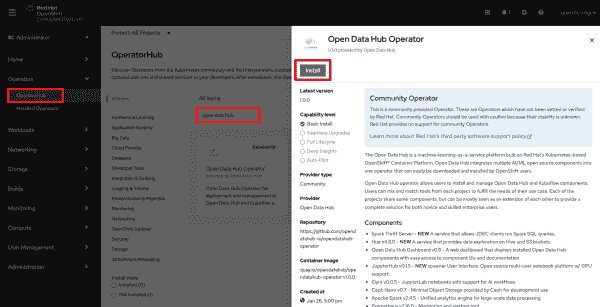](/sites/default/files/blog/2021/04/odh-install.png)Figure 2: Open Data Hub Operator install.

Figure 2: Open Data Hub Operator installation.

## 创建 Kubeflow 项目

Kubeflow 必须安装在名为`kubeflow`的名称空间中。在撰写本文时，对另一个名称空间的请求是一个[未决问题](https://github.com/kubeflow/kubeflow/issues/5647)。

作为 OpenShift web 控制台的管理员，请执行以下操作:

1.  去**家**。
2.  转到**项目**。
3.  点击**创建项目**按钮。
4.  设置以下值:
    *   名称:`kubeflow`(不可更改)
    *   显示名称:`kubeflow`(与之前的名称不同，您可以在此选择另一个值)
    *   描述:Kubeflow ML 工具包(您可以选择另一个值)
5.  切换到`kubeflow`项目。
6.  转到**操作员— >已安装操作员**。
7.  等待操作员在状态字段中显示“成功”。

图 3 显示了操作器完全安装后的预期结果。

[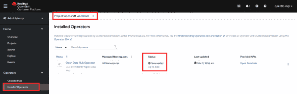](/sites/default/files/blog/2021/04/odh-succeeded.png)Figure 3: ODH Operator successful installation.

Figure 3: A succesful installation of the Open Data Hub Operator.

## 安装 Kubeflow

默认情况下，Open Data Hub 操作符包含一个清单，允许您尝试 MLOps 的不同组件。因为本文中使用的工具集不同于默认清单中的工具集，所以您应该粘贴到不同的清单中。

作为 OpenShift web 控制台的管理员，请执行以下操作:

1.  点击**打开数据中枢操作员**按钮。
2.  点击**提供的 API**下的**开放数据中枢**链接。
3.  点击**创建 KfDef** 按钮。
4.  点击 **YAML 视图**单选按钮。
5.  删除所有 YAML 代码。
6.  Copy and paste in all the YAML code from [kfctl_openshift.v1.2.0.yaml](https://raw.githubusercontent.com/kubeflow/manifests/c41f71e01ee6f0a8573185e96a9168a18581aa34/distributions/kfdef/kfctl_openshift.v1.2.0.yaml).

    **注**:作为参考，HTML 版本可以在 [Kubeflow GitHub 清单](https://github.com/kubeflow/manifests/tree/c41f71e01ee6f0a8573185e96a9168a18581aa34/distributions/kfdef)上找到。

7.  点击**创建**按钮。

图 4 显示了所提供的 API 选择。

[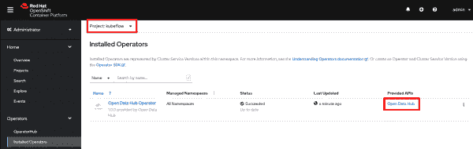](/sites/default/files/blog/2021/04/odh-api.png)Figure 4: Open Data Hub Provide API.

Figure 4: Open Data Hub Provided APIs.

图 5 显示了您将替换的 YAML 代码。

[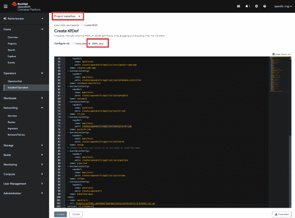](/sites/default/files/blog/2021/04/kfctl-yaml.png)Figure 5: ODH Provided API KfDef YAML View.

Figure 5: Open Data Hub Provided API KfDef YAML View.

## 监控安装

在后台，Open Data Hub 操作员执行系统管理员在命令行上执行的命令来安装 Kubeflow，例如`kfctl build -f...`和`kfctl apply -f...`安装完成时，web 控制台不会显示，因此本节将介绍几种监视安装的方法。如果所有单元都运行正常，安装就完成了。

### 从管理员的角度进行监控

流式事件是一种很好的方式，可以了解在部署等操作之后发生了什么主要活动。要查看事件:

1.  去**家**。
2.  对项目进行分区:或者使用`kubeflow`来查看 Kubeflow 的事件，或者使用“All projects”来查看安装过程中更新的多个项目。
3.  转到**事件**以监控部署事件流。

图 6 显示了在`kubeflow`项目中安装期间的事件流。

[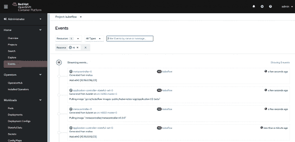](/sites/default/files/blog/2021/04/events.png)Figure 5: Event stream during installation

Figure 6: Event stream during installation.

工作负载状态和警报是了解进度的快速方法。要查看工作负荷:

1.  在**首页**下，点击**项目**。
2.  点击`kubeflow`项目链接。
3.  单击屏幕主体中的**工作负载**菜单项，查看窗格。
4.  调查无法自我纠正的工作负载(给他们时间进行自动纠正)。

图 7 显示了来自项目概述页面的工作负载。项目中的工作负荷也可以从垂直菜单中查看。

[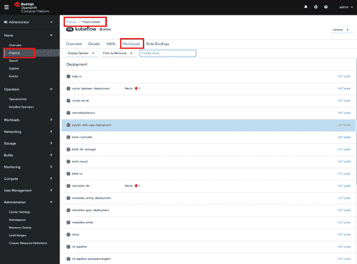](/sites/default/files/blog/2021/04/overview.png)Figure 6: Kubeflow project Workloads overview

Figure 7: Overview of the Kubeflow project workloads.

在安装过程中会创建一个名为`cert-manager`的项目。它的事件和豆荚提供了很好的洞察力。要查看这些事件或窗格:

1.  选择**项目:证书管理器**。
2.  在**首页**下，点击**事件**查看事件。在**工作量**下，点击**窗格**查看窗格。

图 8 显示了`cert-manager`的吊舱。

[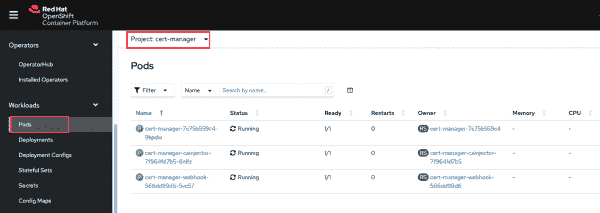](/sites/default/files/blog/2021/04/cert-manager.png)Figure 7: Project cert-manager pods status

Figure 8: Status of pods in the cert-manager pods status.

另一个重要的项目`istio-system`是在安装过程中创建的。该项目托管 Istio 服务网格，处理服务之间的所有网络。要查看项目:

1.  选择**项目:istio-system** 。
2.  在**首页**下，点击**事件**查看事件。在**工作量**下，点击**窗格**查看窗格。在**网络**下，点击**路线**访问 Kubeflow 中央仪表盘的 URL。

图 9 显示了项目中的路线。

[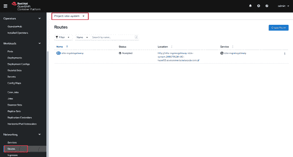](/sites/default/files/blog/2021/04/istio-route.png)Figure 8: Istio-system route for istio-ingressgateway

Figure 9: istio-system route for the istio-ingress gateway.

### 从开发人员的角度进行监控

除了管理员视角之外，开发人员视角将基础设施的特性抽象出来，以留下整洁的开发人员体验。要理解这一观点:

1.  转到**开发者**视角。
2.  选择**项目:kubeflow** 。
3.  转到**拓扑**。

图 10 显示了结果。

[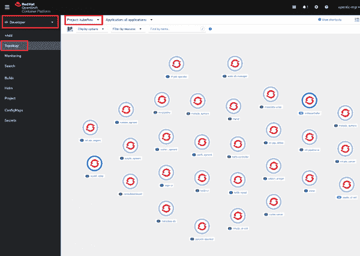](/sites/default/files/blog/2021/04/kfctl-topology.png)Figure 9: Developer Perspective kubeflow project topology

Figure 10: Kubeflow project topology in the developer perspective.

如果项目之间没有错误，并且 Kubeflow UI 启动，则安装成功。

## 访问 Kubeflow 用户界面

本节提供了两种从 web 控制台访问 Kubeflow central 仪表板的方法。作为参考，命令行查询如下所示:

```
# oc get routes -n istio-system istio-ingressgateway -o jsonpath='http://{.spec.host}/'

```

### 从管理员的角度转到仪表板

从管理员的角度来看，请执行以下操作:

1.  选择**项目:istio-system** 。
2.  进入**联网**。
3.  转到**路线**。
4.  点击位置 URL `http://istio-ingressgateway...`。

图 11 显示了如何找到位置 URL。

[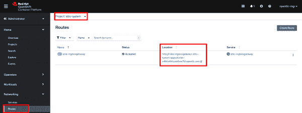](/sites/default/files/blog/2021/04/kubeflow-dashboard.png)Figure 10: Route to Kubeflow Dashboard in the istio-system project

Figure 11: Route to the Kubeflow dashboard in the istio-system project.

### 从开发人员的角度转到仪表板

从开发人员的角度来看，请执行以下操作:

1.  选择**项目:istio-system** 。
2.  转到**拓扑**。
3.  搜索“istio-Ingres gateway”
4.  点击**打开网址**箭头图标，或者点击**资源— >路线**下的`istio-ingressgateway`窗格和网址。

图 12 显示了 URL 的位置。

[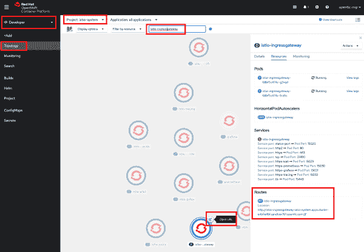](/sites/default/files/blog/2021/04/kubeflow-route.png)Figure 11: Developer Perspective route to Kubeflow from istio-system project

Figure 12: Developer perspective route to Kubeflow from istio-system project.

### 查看 Kubeflow 中央仪表板

一旦您完成了注册过程并创建了名称空间，您将看到如图 13 所示的仪表板。

[](/sites/default/files/blog/2021/04/kubeflow-ui.png)Figure 1: The Kubeflow central dashboard.

Figure 13: The Kubeflow central dashboard.

## 卸载 Kubeflow

没有卸载过程，任何正确的安装过程都不是真正完整的。

作为 OpenShift web 控制台的管理员，请执行以下操作:

1.  选择**项目 kubeflow** 。
2.  点击**打开数据中枢**操作器。
3.  点击**提供的 API**下的**开放数据中枢**链接。
4.  为您的`kubeflow`实例点击**烤肉串**按钮(有三个垂直点的那个)。
5.  单击**删除 KfDef** 开始删除您的`kubeflow`实例。

## 摘要

本文中的过程展示了一个最佳实践，您可以遵循该实践使用 Open Data Hub 操作符在 Red Hat OpenShift 上安装 Kubeflow。所使用的清单文件提供了 Kubeflow 项目中的一个示例工具包，您可以派生、修改和更新该工具包以满足您的生产 MLOps 需求。此外，[操作者框架](/topics/kubernetes/operators)简化了安装、操作和维护，因为社区[继续发布对操作者和机器学习工具的增强](https://opendatahub.io/docs/roadmap/future.html)，以及 AI/ML 在 Red Hat OpenShift 上的整体[优势。](https://www.openshift.com/learn/topics/ai-ml)

*Last updated: August 15, 2022*