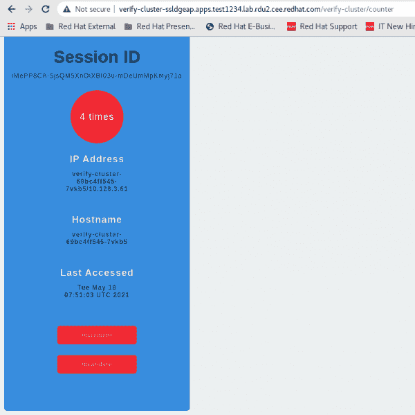

# 在 Red Hat OpenShift 上集成 Red Hat 数据网格和 Red Hat JBoss 企业应用平台

> 原文：<https://developers.redhat.com/articles/2021/06/29/integrate-red-hat-data-grid-and-red-hat-jboss-enterprise-application-platform>

[红帽数据网格](/products/datagrid/overview)可以作为应用特定数据的外部缓存容器，比如[红帽 JBoss 企业应用平台](https://www.redhat.com/en/technologies/jboss-middleware/application-platform) (JBoss EAP)中的 HTTP 会话。这使我们能够独立于应用程序扩展数据层。它还使得驻留在不同域中的 JBoss EAP 集群能够从同一个数据网格集群中访问数据。

这篇文章提供了如何让数据网格 8.1.1 与部署在 [Red Hat OpenShift](/products/openshift/) 上的 JBoss EAP 版本 7.3.6 协同工作的快速说明。对于这种集成，我们将在 OpenShift 上的同一个项目中部署数据网格和 JBoss EAP。我们将[使用飞车手罗德商店将 HTTP 会话](https://access.redhat.com/documentation/en-us/red_hat_jboss_enterprise_application_platform/7.3/html-single/configuration_guide/index#jdg_externalize_http_sessions)外部化到数据网格。

我最近为一个 Red Hat 客户探索了这种集成，并认为把复制它的详细说明放在一起会有所帮助。

## 这种集成的好处

这种集成提高了应用程序的可伸缩性、弹性和会话持久性。将会话数据卸载到远程数据网格使应用程序层更具可伸缩性和弹性，并确保应用程序在 JBoss EAP 节点故障时仍能存活。JVM 故障不会导致您丢失会话数据。

## 设置环境

本文中描述的集成需要以下技术:

*   笔记本电脑上的`oc`客户端
*   红帽 JBoss 企业应用平台 7.3.6
*   数据网格 8.1.1
*   OpenShift 4.6.x

## 步骤 1:在 OpenShift 上建立数据网格

该过程的第一步是登录到您的 OpenShift 集群并创建一个新项目。一旦完成，您将使用数据网格操作符安装数据网格 8.1.1。

### 安装数据网格运算符

要安装数据网格操作器，请打开 Red Hat OpenShift 控制台，然后导航到**操作器— >操作中心— >数据网格 8.1.x** 。对于批准策略，选择**自动**。安装方式选择**名称空间:<项目名称> — >安装**:

```
NAME                                  READY   STATUS    RESTARTS   AGE
infinispan-operator-88d585dd7-xc5xh   1/1     Running   0          58s
```

**注**:参见 [*在 Red Hat OpenShift*](https://access.redhat.com/documentation/en-us/red_hat_data_grid/8.1/html/running_data_grid_on_openshift/installation#create_olm_subscription) 上安装数据网格操作符，了解更多说明。

### 创建 Infinispan 集群

接下来，您将为群集创建一个 Infinispan 自定义资源(CR)。使用数据网格操作符可以很容易地在各种配置中部署数据网格。一旦您从 OpenShift [OperatorHub](https://docs.openshift.com/container-platform/4.5/operators/understanding/olm-understanding-operatorhub.html) 部署了操作符，它就会公开自定义资源，称为 Infinispan 集群和 Infinispan 缓存，Data Grid 使用这些资源在现有集群上提供缓存。

首先从 OpenShift 控制台创建一个 Infinispan 集群，方法是转到**已安装的操作员— > Infinispan 集群— >创建**。然后，在**服务**字段下选择**数据网格**服务类型。

### 禁用 HTTP 通信的 SSL 安全性

您需要禁用 JBoss EAP 和数据网格之间的安全套接字层(SSL)通信，并将安全规范中的`endpointEncryption`类型更改为`none`:

```
apiVersion: infinispan.org/v1
kind: Infinispan
metadata:
 name: eap-infinispan
 namespace: dgeap
spec:
 service:
   type: DataGrid
 replicas: 1
 security:
   endpointEncryption:
     type: None
```

## 步骤 2:在 JBoss EAP 中部署您的应用程序

您可以使用两种策略之一在 JBoss EAP 中构建和部署应用程序:

*   使用 JBoss EAP 模板之一。
*   使用二进制构建、WAR 工件和正式的 JBoss EAP 容器映像。

在这里，我们将采用第二种方法来实现。

### 关于 JBoss EAP 模板的注释

如果您选择使用 [JBoss EAP 模板](https://access.redhat.com/documentation/en-us/red_hat_jboss_enterprise_application_platform/7.3/html-single/getting_started_with_jboss_eap_for_openshift_container_platform/index#prepare_for_deployment)部署您的应用程序，您将需要将 web-clustering Galleon 层添加到 Infinispan 子系统，如下所示:

```
 -p GALLEON_PROVISION_LAYERS=jaxrs-server, web-clustering \
```

`GALLEON_PROVISION_LAYERS`通过删除不需要的部分来整理您的服务器。注意`jaxrs-server` Galleon 层没有拉入 Infinispan 子系统；为此，您还需要 web 集群 Galleon 层。更多信息参见[可用 JBoss EAP 层](https://access.redhat.com/documentation/en-us/red_hat_jboss_enterprise_application_platform/7.3/html-single/getting_started_with_jboss_eap_for_openshift_online/index#available-jboss-eap-layers_default)的文档。

### 使用 JBoss EAP 容器映像进行部署

首先，您将导入 JBoss EAP 容器映像:

```
$ oc import-image jboss-eap-7/eap73-openjdk11-openshift-rhel8 --from=registry.redhat.io/jboss-eap-7/eap73-openjdk11-openshift-rhel8 --confirm
```

#### 部署 WAR 文件

在 OpenShift 上部署外部 WAR 文件是一个两步过程。首先，您将定义并创建新的应用程序，而不提供任何类型的源代码。为了确保不向`oc`客户端提供源代码，创建一个空目录，并使用它来设置新的应用程序:

```
$ mkdir /tmp/nocontent
$ oc get is
$ oc new-app eap73-openjdk11-openshift-rhel8~/tmp/nocontent --name=verify-cluster
```

这会导致创建一个新的构建，它与应用程序同名。您可以通过提供二进制源代码来开始构建:

```
$ oc start-build APPLICATION_NAME --from-file=/tmp/verify-cluster.war (application under /tmp)
```

**注**:你可以从我的 [GitHub 库](https://github.com/varsharain-a11y/distributable)下载应用源码。

#### 挂载一个配置映射来执行定制脚本

为了在从映像启动 JBoss EAP 时包含自定义脚本，我们必须挂载配置映射以作为`postconfigure.sh`执行。首先，创建两个文件，一个名为`actions.cli`，另一个名为`postconfigure.sh`。以下是`actions.cli`的内容:

```
embed-server --std-out=echo --admin-only --server-config=standalone-openshift.xml 
/socket-binding-group=standard-sockets/remote-destination-outbound-socket-binding=remote-rhdg-server:add(host=eap-infinispan.dgeap.svc.cluster.local,port=11222)
batch
/subsystem=infinispan/remote-cache-container=rhdg:add(default-remote-cluster=data-grid-cluster,\
        properties={infinispan.client.hotrod.use_auth=true,infinispan.client.hotrod.sasl_properties.javax.security.sasl.qop=auth,infinispan.client.hotrod.sasl_mechanism=SCRAM-SHA-512,infinispan.client.hotrod.auth_username=developer,infinispan.client.hotrod.auth_server_name=eap-infinispan,infinispan.client.hotrod.auth_password=Cx2ak@E9fGcaSfs4,infinispan.client.hotrod.use_ssl=false,infinispan.client.hotrod.auth_realm=default})
/subsystem=infinispan/remote-cache-container=rhdg/remote-cluster=data-grid-cluster:add(socket-bindings=[remote-rhdg-server])
run-batch
batch
/subsystem=infinispan/cache-container=web/invalidation-cache=infinispan:add()
/subsystem=infinispan/cache-container=web/invalidation-cache=infinispan/store=hotrod:add( remote-cache-container=rhdg,\
                fetch-state=false,\
                purge=false,\
                passivation=false,\
                shared=true)
/subsystem=infinispan/cache-container=web/invalidation-cache=infinispan/component=transaction:add(mode=BATCH)
/subsystem=infinispan/cache-container=web/invalidation-cache=infinispan/component=locking:add(isolation=REPEATABLE_READ)
/subsystem=infinispan/cache-container=web:write-attribute(name=default-cache,value=infinispan)
run-batch
stop-embedded-server 
```

以下是 postconfigure.sh 的内容:

```
$JBOSS_HOME/bin/jboss-cli.sh --file=$JBOSS_HOME/extensions/actions.cli
```

接下来，您将挂载配置映射:

1.  用我们需要包含在`postconfigure.sh`:

    ```
    oc create configmap jboss-cli --from-file=postconfigure.sh=postconfigure.sh --from-file=actions.cli=actions.cli
    ```

    中的内容(`actions.cli`)创建一个配置映射
2.  通过部署控制器或部署:

    ```
    oc set volume deployment/verify-cluster --add --name=jboss-cli -m /opt/eap/extensions -t configmap --configmap-name=jboss-cli --default-mode='0777'

    ```

    将配置图挂载到 pod 中
3.  检查 pod 状态:

    ```
    $ oc get po
    NAME                                   READY   STATUS      RESTARTS   AGE
    eap-infinispan-0                       1/1     Running     1          13d
    infinispan-operator-59949fc49c-vk22x   1/1     Running     0          20d
    verify-cluster-1-build                 0/1     Completed   0          20d
    verify-cluster-2-build                 0/1     Completed   0          20d
    verify-cluster-69bc4ff545-7vkb5        1/1     Running     0          6d6h
    ```

#### 更新部署的端口部分

输入以下内容以更新部署的`ports`部分:

```
$oc edit deployment/verify-cluster
ports:
  - containerPort: 8080
    name: http
    protocol: TCP
  - containerPort: 8443
    name: https
    protocol: TCP
  - containerPort: 8778
    name: jolokia
    protocol: TCP
```

#### 公开 JBoss EAP 所需的服务

输入以下内容以公开 JBoss EAP 所需的服务:

```
$ oc expose svc/verify-cluster (name of servicefrom [ $ oc get svc])
$ oc get svc
NAME                          TYPE        CLUSTER-IP       EXTERNAL-IP   PORT(S)                      AGE
verify-cluster                ClusterIP   172.30.102.7     <none>        8080/TCP,8443/TCP,8778/TCP   20d
$ oc get routes
NAME             HOST/PORT                                                       PATH   SERVICES         PORT       TERMINATION      WILDCARD
verify-cluster   verify-cluster-ssldgeap.apps.test1234.lab.rdu2.cee.redhat.com          verify-cluster   8080-tcp                    None
```

将 URL 从输出(`verify-cluster-ssldgeap.apps.test1234.lab.rdu2.cee.redhat.com`)复制到 web 浏览器，并添加上下文路径名(`/verify-cluster*name of context path*`)来访问应用程序，如图 1 所示。

[](/sites/default/files/eap_1.png)Figure 1: The deployed application.

## 步骤 3:测试 HTTP 会话外部化

在访问应用程序时递增计数器，观察日志:

```
07:50:55,023 INFO  [com.example.verify_cluster.CounterServlet] (default task-1) Session:iMePP8CA-5jsQM5XnOiXBI03u-mDeUmMpKmyj71a, IP :verify-cluster-69bc4ff545-7vkb5/10.128.3.61, Hostname: verify-cluster-69bc4ff545-7vkb5, Visit Count:1
07:51:01,904 INFO  [com.example.verify_cluster.CounterServlet] (default task-1) Increment visitCount to 2
07:51:01,905 INFO  [com.example.verify_cluster.CounterServlet] (default task-1) Session:iMePP8CA-5jsQM5XnOiXBI03u-mDeUmMpKmyj71a, IP :verify-cluster-69bc4ff545-7vkb5/10.128.3.61, Hostname: verify-cluster-69bc4ff545-7vkb5, Visit Count:2
07:51:03,907 INFO  [com.example.verify_cluster.CounterServlet] (default task-1) Increment visitCount to 3
07:51:03,907 INFO  [com.example.verify_cluster.CounterServlet] (default task-1) Session:iMePP8CA-5jsQM5XnOiXBI03u-mDeUmMpKmyj71a, IP :verify-cluster-69bc4ff545-7vkb5/10.128.3.61, Hostname: verify-cluster-69bc4ff545-7vkb5, Visit Count:3
07:51:05,056 INFO  [com.example.verify_cluster.CounterServlet] (default task-1) Increment visitCount to 4
07:51:05,056 INFO  [com.example.verify_cluster.CounterServlet] (default task-1) Session:iMePP8CA-5jsQM5XnOiXBI03u-mDeUmMpKmyj71a, IP :verify-cluster-69bc4ff545-7vkb5/10.128.3.61, Hostname: verify-cluster-69bc4ff545-7vkb5, Visit Count:4
```

将 JBoss EAP pod 缩小到 0，然后尝试将其放大。计数器不应复位:

```
09:44:40,628 INFO  [org.jboss.as] (Controller Boot Thread) WFLYSRV0060: Http management interface listening on http://0.0.0.0:9990/management
09:44:40,628 INFO  [org.jboss.as] (Controller Boot Thread) WFLYSRV0054: Admin console is not enabled
09:44:46,960 INFO  [com.example.verify_cluster.CounterServlet] (default task-1) Increment visitCount to 5
09:44:46,962 INFO  [com.example.verify_cluster.CounterServlet] (default task-1) Session:q3QKwxM0GPvrSssbE6ubuR9866iNIn9dEuJrQuS1, IP :verify-cluster-69bc4ff545-dgkls/10.128.3.26, Hostname: verify-cluster-69bc4ff545-dgkls, Visit Count:5
```

现在，登录到数据网格窗格，验证是否创建了缓存。使用 web 应用程序名(如`verify-cluster.war`)自动创建本地缓存。使用 CLI 连接到远程数据网格服务器以验证集群:

```
$ oc rsh eap-infinispan-0
[eap-infinispan-0-56270@infinispan//containers/default]> ls caches
___protobuf_metadata
___script_cache
Verify-cluster.war
```

## 步骤 4:启用 JBoss EAP 和数据网格之间的安全性

要将会话外部化到启用了安全性的数据网格，请将以下飞车手罗德客户端属性添加到您的配置映射中:

```
infinispan.client.hotrod.use_ssl=true,
infinispan.client.hotrod.auth_realm=default,infinispan.client.hotrod.trust_store_path=/var/run/secrets/kubernetes.io/serviceaccount/service-ca.crt
```

在数据网格端，使用端点加密创建一个 infinispan 集群:

```
spec:
  ...
  security:
    endpointEncryption:      
      certSecretName: eap-infinispan-cert-secret
      certServiceName: service.beta.openshift.io
      type: Service
```

## 结论

您已经成功地外部化了会话数据！

*Last updated: August 15, 2022*