# 集装箱化。NET for Red Hat OpenShift:像容器一样使用 Windows VM

> 原文：<https://developers.redhat.com/blog/2021/04/29/containerize-net-for-red-hat-openshift-use-a-windows-vm-like-a-container>

拥抱未来—从运行于上的传统单片应用程序过渡到。NET 框架到微服务和运行在 T2 容器中的图像是一项艰巨的任务。要是有一种安全的、按照你自己的步调进行改变的方式就好了，这种方式既熟悉又通向新的目的地。当然有这样的路径；否则，我不会写这篇文章。本文是我的系列文章的最后一篇，介绍[三种容器化的方法。NET 应用程序，我们将看看在](/blog/2021/03/16/three-ways-to-containerize-net-applications-on-red-hat-openshift/) [OpenShift](/products/openshift/overview) 上运行的 Windows 虚拟机(VMs)，并把它们当作容器。

如果你错过了它们，这里有另外两篇文章。NET for Red Hat OpenShift”系列:

*   [Windows 容器和。NET 框架](/blog/2021/04/22/containerize-net-for-red-hat-openshift-windows-containers-and-net-framework/)
*   Linux 容器和。网络核心

## 重构“遗留”应用程序

不经意间，我读到了一个我喜欢的想法，它可能有助于最小化“遗留应用程序”这个词的负面含义你所要做的就是用*证明*来代替*遗产*这个词。不错吧。突然之间，你不是在做一些几乎不能完成工作的旧代码。相反，它是一个经过验证的系统，正在用更新的技术进行升级。

好了，回到手头的话题。

## 在 OpenShift 上运行 Windows 虚拟机

我们的目标是在 OpenShift 上运行一个现有的 [Windows](/blog/category/windows/) 虚拟机，但是从运营的角度来看，它是一个容器。我们还想保持我们习惯的“VM-ness”，所以我们将使用 [OpenShift 虚拟化操作符](https://www.openshift.com/learn/topics/virtualization/)，它是基于 [KubeVirt 技术](https://kubevirt.io/)构建的。

OpenShift 虚拟化允许您运行虚拟机(提示:它不限于 Windows VMs ),并让它像映像一样出现在您的集群中。您可以获得与任何映像相同的基于角色的访问控制、服务发现和其他特性。在 IIS 中运行的 web 服务在 OpenShift 中显示为另一个服务。您的其他应用程序可以通过服务名来访问它；没有端口，没有 IP 地址，没有服务器名称...只是名字。

这是双向的:您的 IIS 网站可以通过名称访问您的其他服务。这甚至可能包括 SQL Server 数据库。

现在我引起你的注意了。让我们开始设置我们的开发环境。

## 安装 OpenShift 虚拟化运算符

第一步是安装 OpenShift 虚拟化操作符。这非常简单:

*   搜索并找到 OpenShift 虚拟化操作员。
*   点击**安装**。
*   再次点击**安装**。

就这样，您已经安装了操作符。剩下的工作就是创建一个超收敛集群:

*   点击 **OpenShift 虚拟化部署**。
*   点击**创建超融合**。
*   点击**创建**。

**注意** : [本文](/blog/2020/08/28/enable-openshift-virtualization-on-red-hat-openshift/)有安装 OpenShift 虚拟化操作器的详细说明。

## 安装 virtctl CLI

如果您使用命令行界面(CLI)工具，生活会更轻松。你可以按照这个网页上的[说明来安装它。`virtctl` CLI 便于将虚拟机映像上传到集群中。](https://kubevirt.io/user-guide/operations/virtctl_client_tool/)

## 准备 Hyper-V 虚拟机

我们将使用 [qemu-img 命令行工具](https://cloudbase.it/qemu-img-windows/)将 Hyper-V VM 转换为 qemu 写时复制(QCOW2)格式。这是 CNV 期待的格式之一。以下是我使用的命令:

```
qemu-img convert "C:\Users\Public\Documents\Hyper-V\Virtual hard disks\win2012r2.vhdx" win2012r2.qcow2 -O qcow2

```

转换在我的机器上完成得相当快。事实上，如此之快，以至于我反复检查以确保输出文件在那里。如图 1 所示。

[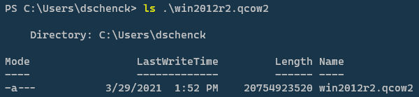](/sites/default/files/blog/2021/03/ls-output.png)

Figure 1: The output file confirms the installation.

一旦你有了这个 21GB 的文件，乐趣就开始了。

## 将 Hyper-V 虚拟机映像上传到您的集群

将 Hyper-V 虚拟机映像上传到集群比我预想的要复杂得多，但是我想到了一个解决方法，我将在这里与您分享。

我已经上传并运行了许多虚拟机。我通常使用较小的虚拟机映像，大约 4GB，使用我的慢速家庭互联网需要 45 分钟。出了问题，我就把东西抹掉，重新开始；又浪费了一个小时左右。

根据这一经验，上传一个 21GB 的文件需要几个小时，如果出现问题，我没有时间再上传一次。知道可以从一个 URL 将一个 VM 镜像拉进我的集群给了我一个更好的主意。

## 亚马逊 S3 拯救世界

我决定在我的 Amazon Web Services 帐户中创建一个简单的存储服务(S3)桶，并将我的 21GB 图像上传到那里。这将让我从 S3 的网址直接进入我的集群。AWS 和 Azure——我在那里使用了 [Azure Red Hat OpenShift](https://azure.microsoft.com/en-us/services/openshift/) 来托管我的集群——都有超高速的互联网连接。创建虚拟机应该很快。

花了四个小时我的图像上传到 S3 桶；我在晚上启动了它，然后上床睡觉，祈祷它会成功，它成功了。

最后，现在大约需要*四分钟*来将图像拉入我的集群。软件开发并不总是与失败有关的*；我们也有胜利的时刻。这是其中之一，我很喜欢。*

## 在 OpenShift 中创建 Windows 虚拟机

一旦 OpenShift 容器本地虚拟化(CNV)准备就绪，就该开始行动了。跟我来这里。

首先，我在命令行登录并创建我的项目`winquotes`，如图 2 所示。

[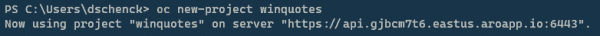](/sites/default/files/blog/2021/03/oc-new-project-winquotes.png)

Figure 2: Create the project on the command line.

剩下的工作在 Red Hat OpenShift 管理员仪表板中进行。首先，在 **winquotes** 项目中，我选择了**虚拟化**选项(如图 3 所示)来开始创建一个新的虚拟机。

[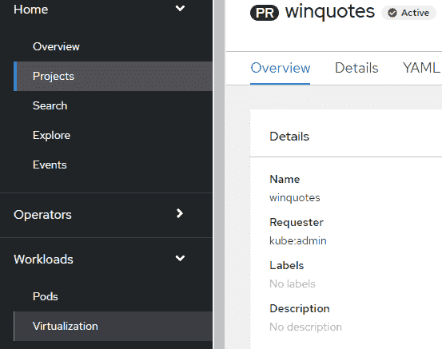](/sites/default/files/blog/2021/03/winquotes-virtualization.png)

Figure 3: Open the project and select the virtualization option.

**New with Wizard** 选项引导我完成了这个过程，如图 4 所示。

[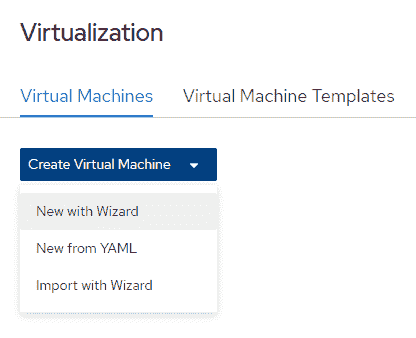](/sites/default/files/blog/2021/03/virtualization-new-with-wizard.png)

Figure 4: Select the 'New with wizard' option.

正如我在上一节中提到的，VM 实例是从 S3 URL 导入的。出于演示的目的，我保持了较低的 CPU 和 RAM 限制:2GB 的 RAM 和两个 CPU，如图 5 所示。

[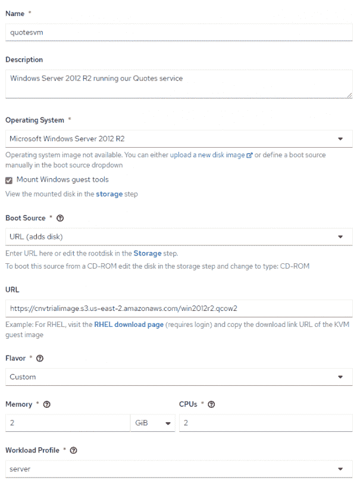](/sites/default/files/blog/2021/04/create_vm_general.png)

Figure 5: Create a new virtual machine.

编辑磁盘信息很重要，特别是因为根磁盘的默认值是 15GB。磁盘必须足够大，以容纳原始的虚拟机，在我的例子中，它有一个 50GB 的驱动器。为了安全起见，我将大小编辑为 60GB。我还将驱动器类型更改为 SATA，因为它是 Windows。图 6 显示了默认的存储设置。

[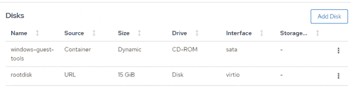](/sites/default/files/blog/2021/04/create_vm_storage_1.png)

Figure 6: The default storage settings.

图 7 显示了我编辑过的存储设置。

[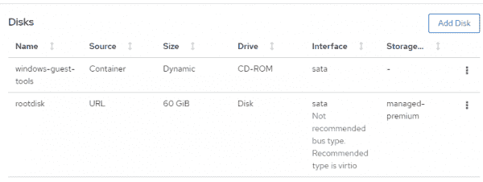](/sites/default/files/blog/2021/04/create_vm_storage_2.png)

Figure 7: The edited storage settings.

在创建该虚拟机的剩余过程中，我可以使用屏幕上的默认值。当我到达最后一个屏幕时，它立即开始导入位于所提供的 S3 URL 的虚拟机，如图 8 所示。

[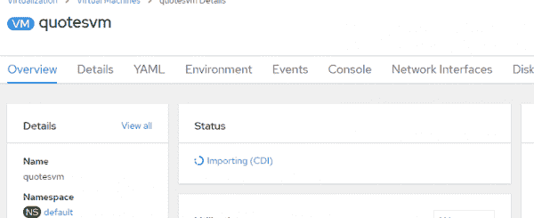](/sites/default/files/blog/2021/04/create_vm_importing.png)

Figure 8: Importing the virtual machine.

当导入完成时，VM 关闭，如图 9 所示。

[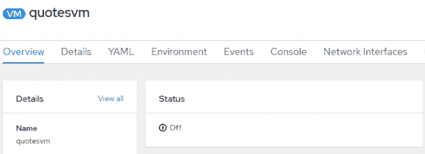](/sites/default/files/blog/2021/04/create_vm_status_off.png)

Figure 9: The virtual machine status is off.

我从右上角的菜单启动它，如图 10 所示。

[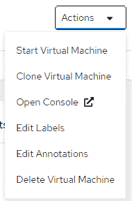](/sites/default/files/blog/2021/04/create_vm_start_menu_option.png)

Figure 10: Start the virtual machine manually.

然后我切换到 OpenShift 的控制台视图，等待我的登录屏幕。如图 11 所示，我的 Windows VM 在 OpenShift 中启动并运行。

[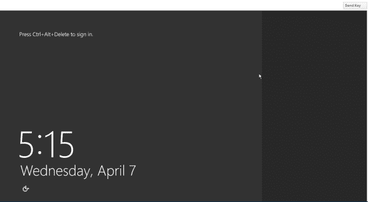](/sites/default/files/blog/2021/04/create_vm_log_on-1.png)

Figure 11: The virtual machine has started.

然后，我在浏览器和`localhost:8081/api/quotes`中打开 IIS 应用程序，期望看到它工作。但是没有用。应用程序无法连接到 Azure 中运行的数据库。

事实证明，在安装 VirtIO 网络驱动程序之前，虚拟机无法连接到网络。

## 如何安装虚拟网络驱动程序

如果到目前为止您已经了解了我的内容，那么您可以进入您的 CD 驱动器并安装客户工具，包括 VirtIO 驱动程序。之后，您的应用程序将连接到互联网。图 12 显示了列出了 CD ROM 的 Windows 文件资源管理器。

[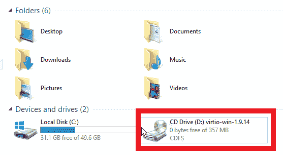](/sites/default/files/blog/2021/04/create_vm_drives.png)

Figure 12: Windows file explorer showing the VirtIO driver.

现在，您的服务应该能够到达您的数据库，并且应该已经启动并运行。下一步是将服务转换成 OpenShift 服务，并使其对集群中的其他应用程序可用。

## 在集群中创建和公开服务

我们希望将应用程序公开为集群中的服务，这从创建服务开始。命令行工具`virtctl`对此很有用。对于我的例子，我指定了 VM 的名称、我想要公开的端口——在我的例子中是 8081——并为服务分配了一个名称。我使用以下命令来完成所有这些工作:

```
virtctl expose vm quotesvm --port=8081 --name=quotes --type=NodePort

```

现在，我们有了一个在集群中按名称(在本例中是“引号”)提供的服务。一项服务。在 OpenShift 集群中运行。在 IIS 上运行。在 Windows 虚拟机内部。

脑子，炸了。

最后，就像集群中的任何其他服务一样，我们可以使用 OpenShift 的`oc`命令向外界公开这个服务，如图 13 所示。

[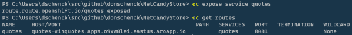](/sites/default/files/blog/2021/04/create_vm_expose_service.png)

Figure 13: Expose the service on the command line.

现在，我们应该能够在任何连接互联网的机器上打开浏览器，并在列出的 URL 上看到服务结果。除了，它不工作。

为什么不呢？

## 虚拟机是虚拟机是虚拟机

让我们回到虚拟机。尽管我们集群中的一切都已对齐并正确配置，但虚拟机仍然需要一个新的 Windows 防火墙规则来访问端口 8081。不要忘记:它仍然是一个虚拟机，并且像一个虚拟机一样工作。您可以在 OpenShift 的上下文中像管理 OpenShift 应用程序一样管理和处理这个 VM，但是底层技术仍然是 VM。相应调整。

一旦我们建立了新的防火墙规则，我们就成功了。我们的服务面向全世界。图 14 显示了我的手机上的服务(顺便说一下，是 Surface Duo)。

[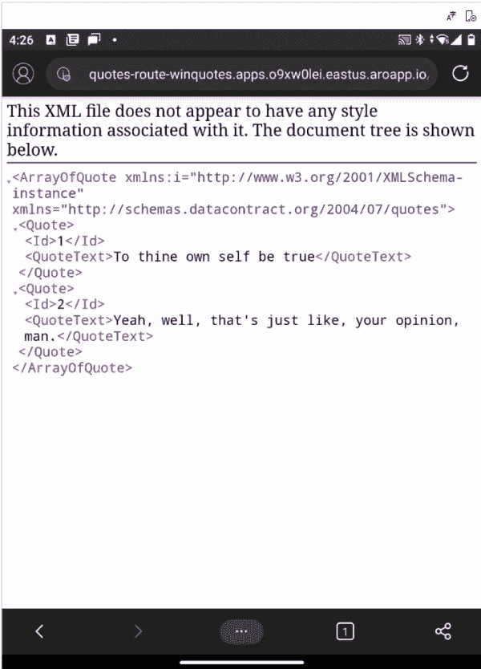](/sites/default/files/blog/2021/04/create_vm_running_on_phone.png)

Figure 14: The live service on a mobile phone browser.

## 结论:你还在等什么？

您可以在 Red Hat OpenShift 中运行 Windows 虚拟机，并将它们视为容器。你可以在 OpenShift 上[运行 Windows 容器中的 Windows 应用。您可以使用](/blog/2021/04/22/containerize-net-for-red-hat-openshift-windows-containers-and-net-framework/)[创建 Linux 容器。网芯](/blog/2021/04/15/containerize-net-for-red-hat-openshift-linux-containers-and-net-core/)。

没有阻挡者。你有工具。拥抱未来。

*Last updated: October 14, 2022*