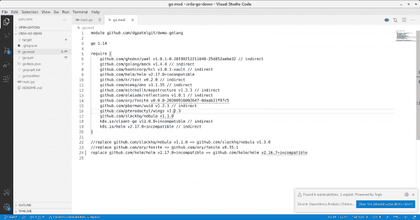
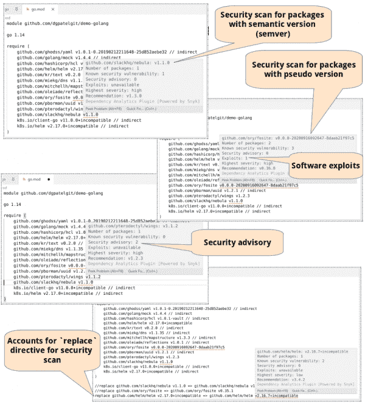
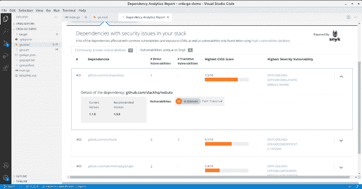
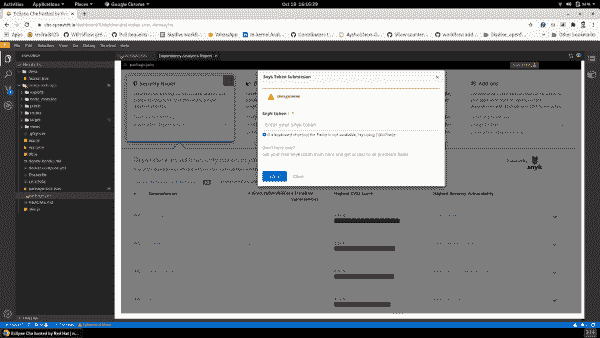
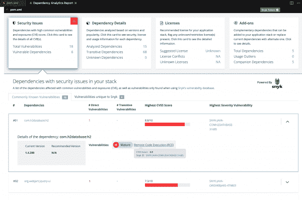
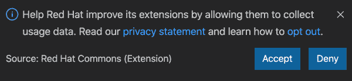
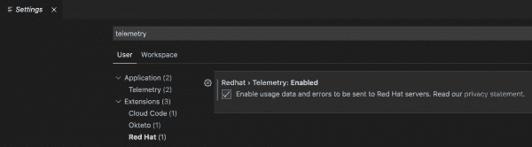

# 使用 Red Hat CodeReady 依赖分析对 Golang 应用程序进行漏洞分析

> 原文：<https://developers.redhat.com/blog/2021/04/15/vulnerability-analysis-for-golang-applications-with-red-hat-codeready-dependency-analytics>

red Hat code ready Dependency Analytics 由 Snyk 英特尔漏洞数据库提供支持，帮助开发人员发现、识别和修复代码中的安全漏洞。在最新的 0.3.2 版本中，我们专注于支持对 [Golang](https://developers.redhat.com/blog/category/go/) 应用依赖关系的漏洞分析，提供对 Snyk 独有的漏洞细节的更轻松访问，以及其他用户体验改进。

## Golang 应用程序的漏洞分析

在这个版本中，开发人员可以对他们的 Golang 应用程序堆栈进行漏洞分析。该分析确定了 Golang 模块和包级别的漏洞，包括直接依赖和传递依赖。它还支持 semver 和 pseudo 版本。

### go.mod 文件组件分析

在 IDE 编辑器窗口中打开一个`go.mod`文件会触发插件的组件分析。组件分析突出显示了`go.mod`文件中列出的每个依赖项的漏洞。该插件提供了检查每个漏洞详细信息的选项。然后，您可以通过使用**快速修复**选项切换到推荐的版本来补救漏洞。

编辑、保存或重新打开`go.mod`文件也将启动成分分析。

图 1 显示了 IDE 编辑器组件分析的输出，在右下角的通知窗口中显示了结果的摘要。此摘要列出了清单中发现的漏洞和利用的总数。

Figure 1: Output from Component Analysis of go.mod file

Figure 1: Output from Component Analysis of go.mod file

IDE 编辑器中用红色和蓝色下划线突出显示了漏洞和攻击。将鼠标悬停在某个问题上，会显示特定包的漏洞概要的诊断摘要，如图 2 所示。

Figure 2: Various diagnostic messages displayed for a specific package.

每条诊断消息提供以下信息:

*   漏洞的总数
*   特定于 Snyk 的安全建议的数量
*   已知利用的计数
*   所有漏洞中最高的严重性级别
*   源中使用的包和模块的数量

## 关于安全漏洞的详细信息

要访问一个`go.mod`文件中的安全问题的详细报告(见图 3)，单击通知窗口中的按钮；然后右键单击`go.mod`文件并选择**依赖分析报告**。或者，您可以点击右上角标有**打开漏洞报告**的饼图图标。

Figure 3: Detailed Vulnerability Report for a go.mod file

Figure 3: Detailed Vulnerability Report for a go.mod file

Figure 4: Details about a vulnerable dependency

Figure 4: Details about a vulnerable dependency.

## 访问漏洞详细信息

CodeReady Dependency Analytics 插件由 Snyk Intel 提供支持，这是一个由 Snyk 提供的漏洞数据库。通过注册一个免费的 Snyk 帐户，您可以查看每个漏洞的已知利用和 Snyk 特有的漏洞的详细信息。

图 5 展示了如何向 Snyk 注册并使用 CodeReady 依赖分析插件保存您的令牌。

Figure 5: Enter an existing Snyk token or register a new one to view each vulnerability’s known exploits.

图 6 显示了保存 Snyk 令牌后的漏洞和利用细节。

Exploit details of vulnerability after saving Snyk token

Figure 6: Viewing details of vulnerabilities that are uniquely identified by Snyk after the token is saved.

## 启用遥测

依赖性分析扩展现在与 Red Hat Commons 扩展集成在一起。这使得 Red Hat 能够收集特定于以下各项的遥测数据:

*   运行 Visual Studio 代码的操作系统的类型
*   依赖项分析扫描的清单文件的开发语言
*   使用堆栈分析和组件级分析生成漏洞报告的时间和频率
*   向 Snyk 注册

通过收集遥测数据，Red Hat 可以获得关于扩展使用模式的有价值的反馈，并为开发人员提供未来的增强功能。

Dependency Analytics 扩展仅在开发人员选择启用遥测时收集遥测。您可以通过点击**接受**(见图 7)或选择**首选项** → **设置**下的红帽遥测复选框(见图 8)随时选择加入。

Figure 7: Opt in to sending telemetry data or decline via the pop-up window.

Figure 8: Configuring telemetry in the extension's settings.

## Red Hat CodeReady 依赖分析入门

Red Hat Code ready Dependency Analytics 作为插件可用于 [Visual Studio 代码](https://marketplace.visualstudio.com/items?itemName=redhat.fabric8-analytics)、 [Eclipse Che](https://www.eclipse.org/che/) 、 [Red Hat CodeReady 工作区](https://developers.redhat.com/products/codeready-workspaces/overview)和[基于 JetBrains IntelliJ 的 ide](https://plug-ins.jetbrains.com/plug-in/12541-dependency-analytics/)。

要开始使用 code ready Dependency Analytics IDE 扩展或提供反馈，请查看以下链接。

*   [获取用于 CodeReady 依赖项分析的 Visual Studio 代码扩展](https://marketplace.visualstudio.com/items?itemName=redhat.fabric8-analytics)。
*   [获得基于 IntelliJ 的 IDE 扩展，用于 CodeReady 依赖分析](https://plug-ins.jetbrains.com/plug-in/12541-dependency-analytics/)。
*   通过[fabric 8-Analytics-server](https://github.com/fabric8-analytics/fabric8-analytics-server/tree/master/api_specs/v2)API 访问 CodeReady 依赖分析。
*   通过 [Git 问题库提供您的反馈。](https://github.com/fabric8-analytics/fabric8-analytics-vscode-extension/issues)

## 关于 Snyk

Snyk 是一家开发者至上的安全公司，帮助软件驱动的企业快速发展并保持安全。Snyk 查找并修复开源依赖项和容器映像中的漏洞和许可证违规。Snyk 的解决方案基于 Snyk Intel，这是一个全面的专有漏洞数据库，由以色列和伦敦的专家安全研究团队维护。Snyk 与现有的开发人员工作流程、源代码控制和 CI/CD 管道紧密集成，可实现高效的安全工作流程，并缩短平均修复时间。欲了解更多信息或立即免费开始使用 Snyk，请访问 [https://snyk.io](https://snyk.io) 。

*Last updated: October 14, 2022*