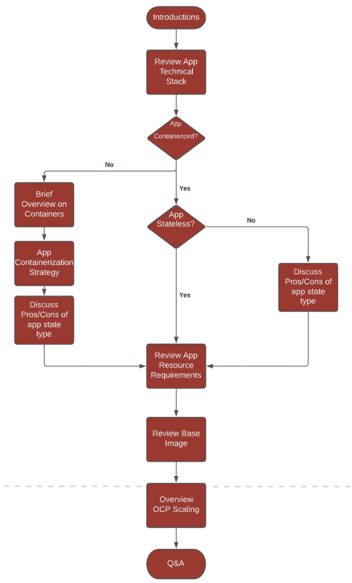

# 在 Red Hat OpenShift 上规划您的集装箱化策略

> 原文：<https://developers.redhat.com/blog/2021/03/15/planning-your-containerization-strategy-on-red-hat-openshift>

毫无疑问，[容器](https://developers.redhat.com/topics/containers)的好处包括更快的应用交付、弹性和可伸缩性。有了 [Red Hat OpenShift](https://developers.redhat.com/products/openshift/overview) ，利用云原生平台来容器化您的应用程序的时机再好不过了。

然而，转变您的应用交付周期并从传统基础架构转向云原生可能会令人望而生畏。与任何解决方案一样，将流程分解成几个部分有助于更好地理解如何从 A 点到达 b 点。本文提供了一个框架，用于与您的应用程序团队进行对话，以确保您的应用程序尽可能快速、轻松地在 OpenShift 上进行容器化和托管。

图 1 概述了如何组织有效的集装箱化对话。我们将在接下来的章节中讨论每个步骤。

Figure 1: Framing the containerization conversation.

## 介绍:从建立信任开始

第一印象和友好可以走很长的路。就我个人而言，我发现，当团队成员对某个话题感到不确定时，敦促他们提出问题可以从一开始就营造一种友好的氛围。总结你对这个话题的经验也能建立可信度。信任、积极的强化和耐心为找到有效的解决方案创造了最佳环境，尤其是对于集装箱化这样复杂的问题。

## 查看技术堆栈

对话的这一部分应该围绕应用程序的功能、使用的语言和中间件以及组成应用程序的其他组件(如数据库和外部服务)的高级描述。

注意应用程序的总体架构也很重要:您是否正在处理一个整体，您的团队希望将其分解为一系列[微服务](https://developers.redhat.com/topics/microservices/)，共享公共配置模式的现有微服务，或者一系列由于不依赖而应该分离的服务？

技术概述将规定集装箱化策略的各个方面。重要的是要涵盖应用程序的每个重要部分，以确定采用哪个解决方案，但要避免在技术堆栈上花费太多时间。你只需要知道应用使用了什么技术，如何运行；除此之外的任何事情，你都有讨论应用程序不必要的方面的风险。

## 你的应用是容器化的吗？

您的应用程序是否被容器化将从技术概述中变得显而易见。如果答案是肯定的，您可以直接讨论应用程序的状态。

[应用程序状态](https://www.redhat.com/en/topics/cloud-native-apps/stateful-vs-stateless)是指应用程序数据的存储方式。*有状态*应用需要持久存储，而*无状态*应用不需要存储服务器信息或会话数据。这两种类型的应用程序都有好处，使用哪种体系结构在很大程度上取决于应用程序的用途及其工作方式。幸运的是，容器非常适合管理有状态和无状态架构。与您的团队讨论每种方法的成本和优势是另一个突出容器的力量以及它们如何改变应用程序交付和维护的机会。

如果应用程序还没有容器化，不要担心！借此机会向您的团队介绍容器的概念，并描述如何使用它们来改进应用程序在 [Red Hat OpenShift 容器平台](https://developers.redhat.com/courses/openshift/getting-started)上的部署生命周期和管理。您的团队可能对容器和 OpenShift 有些熟悉。如果不是，一个简单的类比可以帮助解释 OpenShift 容器平台和容器如何协同工作。

将 OpenShift 集装箱平台想象成一艘由三个主要部分组成的巨型货船:

*   **海运集装箱**:把码头集装箱想象成海运集装箱。它们是轻量级的、独立的、可执行的软件包，包括运行应用程序所需的一切:源代码、运行时、系统工具、系统库和设置。运输容器可以包含大量对象，就像 Docker 容器包含应用程序运行所需的各种依赖项和源代码一样。
*   **吊车**:我们知道，OpenShift 集装箱平台建造在 [Kubernetes](https://developers.redhat.com/topics/kubernetes) 上。在这个类比中，Kubernetes 充当我们的起重机，管理、缩放和编排货船上的集装箱。
*   **船**:货船本身是 OpenShift。船将集装箱和起重机保持在一起，并提供了接口、安全性和开发工具的额外好处，用于为集装箱化的应用程序创建高效的工作流。

一旦团队对什么是容器以及如何在 OpenShift 中使用容器有了高层次的理解，他们就可以考虑容器化策略了。如何容器化主要取决于应用程序的复杂性。如果应用程序有许多依赖项，并且需要许多步骤来构建和运行，那么最好使用 Docker 策略。对于简单、轻量级的微服务，[源到图像(S2I)](https://developers.redhat.com/search?t=s2i&f=type%7Earticle) 是一个不错的选择。

在讨论集装箱化策略时，提问将有助于您确定具体的集装箱化方法。诸如“构建过程看起来像什么？”以及“我们在应用程序构建过程中使用什么脚本？”更深入地了解哪种集装箱化方法最适合这种情况。您甚至可以开始探索[持续集成(CI)管道](Continuous Integration and Continuous Deployment with Tekton on Kubernetes)的概念，以增加一层自动化和安全性。

[Pathfinder](https://www.redhat.com/en/resources/consulting-pathfinder-datasheet) 也可用于确定哪些应用程序可以容器化，所涉及的工作量，以及容器化的任何障碍。Pathfinder 可以帮助您根据业务重要性、技术和执行风险以及所需的工作量等因素来确定应用程序迁移到容器的顺序。

## 应用程序资源需求

在设置计算资源时，有相当多的变量会发挥作用。应用程序的大小和复杂性通常有助于确定容器需要多少 CPU 和内存。考虑分配给部署环境的资源也很重要。虽然您的 OpenShift 集群可能在最初没有设置资源请求和限制的情况下工作，但是随着集群上项目和团队数量的增加，您将会遇到稳定性问题。

资源配额等工具为限制命名空间中的资源消耗提供了约束，而限制范围为每种类型的资源设置了资源使用限制，这些工具为成功的资源需求规划提供了基础。您可以执行初步测试，以确定每个集装箱的资源可用性和需求，并使用此信息作为能力计划和预测的基础。但是，请记住，资源使用分析需要时间，您的团队将在应用程序的生产生命周期中继续对其进行微调。

## 基础图像

虽然基础映像有许多来源，但从已知的可信来源获取它们可能是一项挑战。使用最新且无已知漏洞的安全基础映像非常重要。如果发现漏洞，您必须更新基本映像。幸运的是，您可以使用诸如[Red Hat open shift Container Registry](https://docs.openshift.com/container-platform/4.7/registry/architecture-component-imageregistry.html)和 [Red Hat Quay](https://www.redhat.com/en/technologies/cloud-computing/quay) 这样的选项来安全地存储和管理应用程序的基本映像。

OpenShift Container Registry 运行在现有集群基础设施之上，为用户管理运行其工作负载的映像提供了现成的解决方案。带有 OpenShift 容器注册表的本地管理图像的额外好处是，开发人员可以使用存储的图像快速启动他们的应用程序。另一方面，Quay 是一个企业级的集装箱图像注册中心，具有高级注册功能，包括地理复制、图像扫描和回滚图像的能力。

使用这些工具作为如何安全部署和存储基础映像的示例，将有助于突出 OpenShift 提供的安全性。您还可以探索使用基于[红帽企业 Linux 8](https://developers.redhat.com/products/rhel/download) 的免费可再发行的[红帽通用基础映像](https://developers.redhat.com/products/rhel/ubi)，这是一个轻量级映像，具有企业 [Linux](https://developers.redhat.com/topics/linux) 的优点和安全功能。

## 使用 OpenShift 容器平台进行扩展

许多工作负载具有随时间变化的动态特性，使得固定的扩展配置难以实施。幸运的是，您可以使用 OpenShift 的自动伸缩特性来定义变化的应用程序容量，该容量不是固定的，而是确保刚好有足够的容量来处理不同的负载。

当与您的团队一起审查扩展时，一定要注意可能出现的许多配置，例如，水平扩展与垂直扩展。水平扩展比垂直扩展更可取，因为它的破坏性更小，尤其是对于无状态服务。这不是有状态服务的情况，在有状态服务中，您可能更喜欢垂直伸缩。垂直伸缩有用的另一个场景是基于实际负载模式调整服务的资源需求。还有手动缩放与自动缩放的对比——手动缩放应被视为在人类交互环境下进行缩放的预期解决方案，而自动缩放是一种更具反应性的方法。

## 留出问答时间

对话的问答(Q & A)部分提供了一个机会来详细阐述任何可能会分散整个讨论流程的话题。这些主题由应用程序团队决定。当然，你的目标应该是确保团队对手头的概念感到舒服。然而，你的集装箱化讨论的目的是收集必要的信息，以确定一个合适的集装箱化战略。一旦制定了策略，你就可以开始以更深入的方式教导团队，确保你有效地利用宝贵的会议时间。例如，您可以使用问答来解释 S2I 如何作为集装箱化策略运行的技术细节，或者如何使用[秘密](https://developers.redhat.com/blog/2020/09/07/keeping-kubernetes-secrets-secret/)为您的工作流程增加额外的安全层。

## 结论

当与您的应用程序团队一起探索容器化时，认识到容器并不总是最有益的方法是很重要的。对于已经在实践好的容器化方法并对更多的云原生方法感兴趣的团队来说，[无服务器](https://developers.redhat.com/topics/serverless-architecture)可能是更好的选择。团队可以轻松地配置他们的环境，用很少的资源来部署应用程序，可能不需要使用容器。

容器对于改善应用程序的上市时间非常有用。当与 OpenShift 一起使用时，您可以轻松地管理容器的维护、伸缩和生命周期。随着您的团队越来越熟悉容器基础和 OpenShift，可以考虑使用[持续集成/持续交付](https://developers.redhat.com/topics/ci-cd/) (CI/CD)工具，如 [Tekton](https://developers.redhat.com/blog/2019/07/19/getting-started-with-tekton-on-red-hat-openshift/) 和 [ArgoCD](https://developers.redhat.com/search?t=ArgoCD&f=type%7Earticle) 来自动化和改进应用交付周期。

不同的变量在每个开发环境中发挥作用。一个关于容器效用的精心构建的对话将帮助您为您的团队确定最佳的应用程序部署方法。

*Last updated: October 7, 2022*