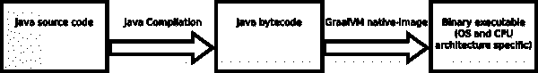
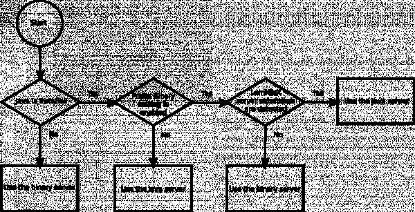

# vscode-xml 0.15.0 中不再有 Java！

> 原文：<https://developers.redhat.com/blog/2021/03/12/no-more-java-in-vscode-xml-0-15-0>

在`vscode-xml`扩展 0.15.0 版本的其他改进和错误修复中，你现在可以运行扩展而不需要 [Java](https://developers.redhat.com/topics/enterprise-java) 。我们知道 Java 需求[阻碍了许多人尝试扩展](https://marketplace.visualstudio.com/items?itemName=redhat.vscode-xml&ssr=false#review-details)。我们包含了一个新的设置，**prefere Binary**(`xml.server.preferBinary`)，让您在 Java 服务器和新的二进制服务器之间进行选择。我们很高兴在`vscode-xml` 0.15.0 中从 [Red Hat 的 Visual Studio 代码](https://developers.redhat.com/products/vscode-extensions/overview)的 XML 扩展中移除 Java 限制。请继续阅读，了解我们是如何做到的。

## LemMinX、Java 和 vscode-xml

[Eclipse LemMinX](https://github.com/eclipse/lemminx) 是提供`vscode-xml`的 XML 编辑特性的语言服务器。通过创建语言服务器，我们不仅可以为 Visual Studio 代码( [VS 代码](https://developers.redhat.com/blog/category/vs-code/))提供 XML 编辑功能，还可以为其他文本编辑器提供 XML 编辑功能，比如 Sublime、Eclipse IDE、Emacs 和 Vim。

**注**:要了解更多关于语言服务器和语言服务器协议(LSP)的信息，请参见*一个构建开发者工具的通用接口，它很好地解释了这个主题。*

 *LemMinX 是用 Java 写的。使用 Java 编写 LemMinX 允许使用现有的 XML 库。例如，LemMinX 使用 Xerces 库根据模式验证 XML 文件。在 0.15.0 发布之前，我们需要一个 Java 运行时环境(JRE ),因为我们将 LemMinX 作为一个 JAR 文件发布，必须由 Java 运行时解释。LemMinX 还支持许多有用的扩展，可以是单独的 JAR 文件，也可以是包含多个 JAR 的 ZIP 文件。目前的扩展包括 [lemminx-maven](https://github.com/eclipse/lemminx-maven) (针对 Maven `pom.xml`文件)、 [liquibase-lsp](https://github.com/Treehopper/liquibase-lsp) (针对 liquibase XML 文件)、以及 [lemminx-liberty](https://github.com/OpenLiberty/liberty-language-server/tree/master/lemminx-liberty) (针对 OpenLiberty `server.xml`文件)。

为了允许用户在不安装 Java 的情况下运行`vscode-xml`,我们需要重新考虑如何向用户提供 LemMinX 功能。

## GraalVM 本机映像

GraalVM native-image 是一个可以将 Java 程序编译成独立的、特定于平台的可执行二进制文件的工具。与其他工具不同，它不是简单地将 Java 的副本与程序打包在一起。GraalVM 将 Java 字节码编译成本机指令，并包含一个管理内存的小库。当我们使用 GraalVM 时，生成的二进制文件并不包含 Java 安装中通常包含的所有代码。LemMinX 中的可执行二进制文件甚至比[这些最小的 Java 安装](https://download.eclipse.org/justj/jres/11/downloads/latest/)还要小。

图 1 显示了 GraalVM 本机映像创建可执行文件的顺序。Java 编译器将 Java 源代码转换成 Java 字节码。然后，GraalVM native-image 将 Java 字节码转换成本机指令。

Java source code is turned into Java byte code by the Java compiler. Then, GraalVM native-image turns the Java byte code into native instructions.

Figure 1: How GraalVM native-image transforms Java bytecode into native instructions.

GraalVM 本机映像有局限性。GraalVM 生成的二进制文件只适用于特定的操作系统和 CPU 架构。因此，我们需要为 Windows、macOS 和 [Linux](https://developers.redhat.com/topics/linux) 编译和分发单独的二进制文件。macOS 二进制文件是为 x86_64 CPU 架构编译的，但也可以通过 [Rosetta 2 转换层](https://developer.apple.com/documentation/apple_silicon/about_the_rosetta_translation_environment)在苹果芯片上工作。GraalVM 原生映像的另一个限制是，在原生映像过程中，您想要运行的所有代码都必须存在。[对基本 XML 编辑功能](https://github.com/redhat-developer/vscode-xml/blob/master/docs/Extensions.md#custom-xml-extensions)的扩展，如 [lemminx-maven](https://github.com/eclipse/lemminx-maven) 、 [liquibase-lsp](https://github.com/Treehopper/liquibase-lsp) 和 [lemminx-liberty](https://github.com/OpenLiberty/liberty-language-server/tree/master/lemminx-liberty) ，在使用二进制服务器时将无法工作。

## 交付二进制文件

我们不将二进制文件打包到`vscode-xml`中。相反，当`vscode-xml`启动并检测到您没有安装 Java 时，它会下载特定于您计算机操作系统的二进制文件。这种变通方法减少了为使`vscode-xml`工作而下载的数据总量。该扩展附带了二进制文件的 SHA 256 校验和，因此它可以检查下载的二进制文件的完整性。

## vscode-xml 什么时候使用二进制？

您可以使用图 2 中的流程图来判断`vscode-xml`是否会下载并运行一个二进制文件。注意，如果您有一个 Java 运行时，但是仍然希望 VS 代码使用二进制文件，那么您可以启用**首选二进制文件**设置(`xml.server.preferBinary`)。

If Java is not installed, vscode-xml launches the binary server. If Java is installed and the xml.server.preferBinary option is set to false, then vscode-xml launches the Java server. If Java is installed, and the xml.server.preferBinary option is set to true, then if vscode-xml detects LemMinX extensions, the Java server is used, and otherwise a binary server is used.

Figure 2: How vscode-xml determines whether to start a binary or a Java server.

如果没有安装 Java，`vscode-xml`启动二进制服务器。如果安装了并且**首选二进制**设置为*禁用*，`vscode-xml`启动 Java 服务器。如果安装了并且**首选二进制**设置为*启用*，`vscode-xml`在检测到 LemMinX 扩展时启动 Java 服务器；否则，它将启动二进制服务器。

如图 2 所示的 LemMinX 服务器扩展是对`vscode-xml`功能的扩展，正如我前面所描述的。如果扩展与 Java 运行时一起出现，它们会覆盖**首选二进制**设置，因为这些扩展不会与二进制服务器一起工作。

## 结论

这篇文章深入分析了我们如何在`vscode-xml`中去除 Java 需求。感谢所有为这次发布做出贡献的人！要查看所有更改和错误修复的列表，请参见[vs code-XML 0 . 15 . 0 changelog](https://github.com/redhat-developer/vscode-xml/blob/master/CHANGELOG.md)。如果你遇到 bug 或者有改进`vscode-xml`的想法，我们希望你[提交问题](https://github.com/redhat-developer/vscode-xml/issues/new/choose)。

*Last updated: March 31, 2021**