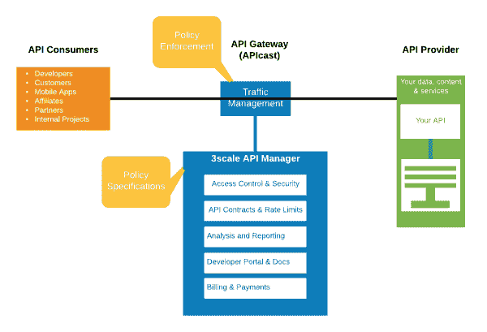
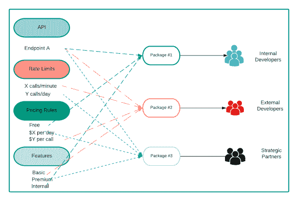
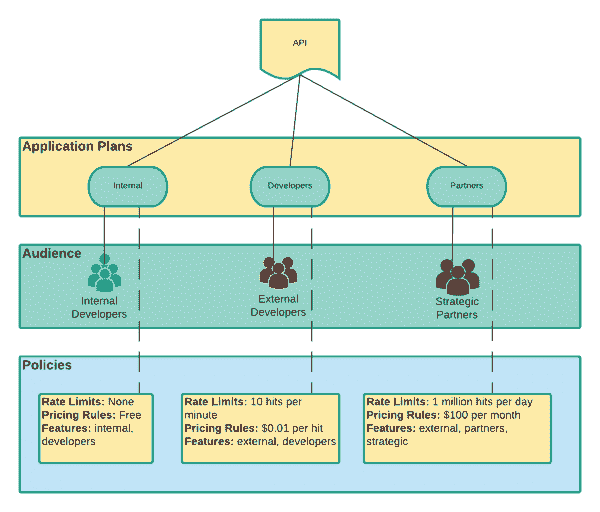
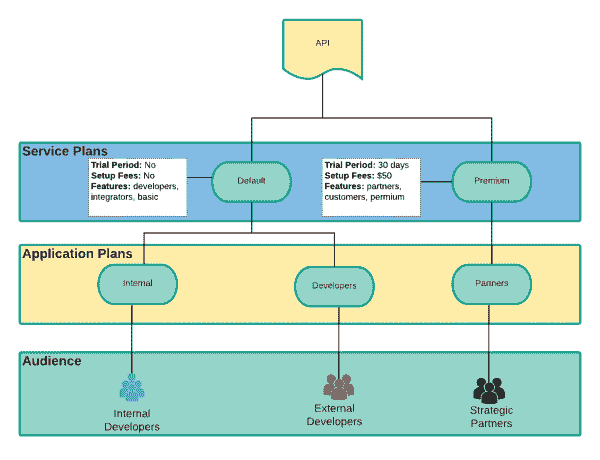
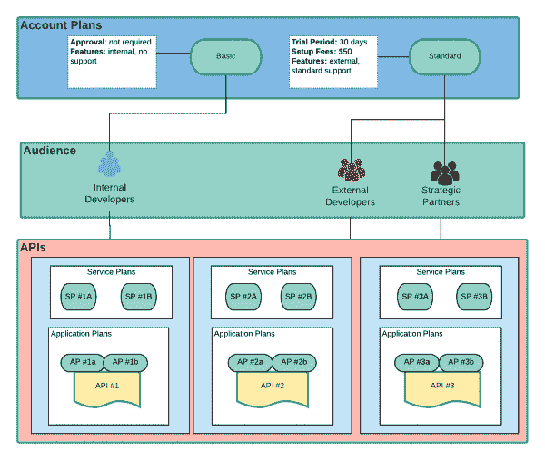

# 通过 Red Hat 3scale API 管理为消费者打包 API

> 原文：<https://developers.redhat.com/blog/2021/03/02/packaging-apis-for-consumers-with-red-hat-3scale-api-management>

API 管理平台的核心功能之一是定义和执行策略、业务域费率限制以及保护 API 端点的定价规则。作为 API 提供者，您有时需要使用这些术语为不同的消费者群体提供相同的后端 API。在本文中，您将了解如何使用[Red Hat 3 scale API Management](https://developers.redhat.com/products/3scale/overview)为不同的消费者打包 API，包括内部和外部开发人员以及战略合作伙伴。请参见文章末尾的视频教程，该教程将指导您使用 3scale API Management 来创建和配置您将在本文中了解的包。

## 关于 Red Hat 3scale API 管理

3scale API Management 是一个可扩展的混合云 API 管理框架，是 [Red Hat Integration](https://developers.redhat.com/integration) 产品组合的一部分。图 1 是[3 规模 API 管理](https://www.3scale.net)框架的简化视图。

Figure 1: A high-level view of 3scale API Management.

API 管理器是框架的控制平面。它为 API 提供者提供了一个创建用户、帐户、策略和服务的接口。 *API 网关* (APIcast)在数据层执行 API 的策略。

## API 访问策略

我们可以使用 3scale API 管理来创建消费者细分市场，其中针对同一 API 实施不同的策略。例如，假设我们需要向三种不同的消费者受众公开单个 API 端点:内部开发人员、外部开发人员和战略合作伙伴。表 1 显示了我们可以为每个受众创建的包的示例场景。

**Table 1: A basic application plan for three audiences**

| **包** | **速率限制** | **定价规则** | **特性** |
| 内部开发人员 | 没有人 | 自由的 | 内部的 |
| 外部开发人员 | 每分钟 10 个电话 | 每次通话 0.01 美元 | 基础 |
| 战略合作伙伴 | 每天 100 万次通话 | 每月 100 美元 | 溢价 |

**注意**:虽然对于内部开发者来说，速率限制设置为“无”，但是最好设置一个较高的速率限制，以防止分布式拒绝服务(DDoS)攻击。此外，虽然战略合作伙伴的速率限制是按天计算的，但最好是按分钟计算。这样做可以防止系统在短时间内过载。

图 2 显示了表 1 中的 API 包。

Figure 2: API packages for internal developers, external developers, and strategic partners.

图 2 所示的*速率限制*策略对 API 实施了调用限制。为每个方法定义了限制，并且同一个包可以为每个 API 方法实施不同的限制。*定价规则*用于对 API 调用进行计量和计费。定价规则是为每个 API 方法定义的，同一个包可以为每个 API 方法实施不同的定价规则。最后，*特性*策略让我们为每个包定义多个特性。3scale API 管理向每个包添加元数据标记，以唯一标识和映射其可用功能。

3scale API 管理的打包场景很常见，大多数 API 管理平台都支持类似的东西。在以下几节中，我们将了解 3scale API Management 提供的不同类型的计划。

## 申请计划

*应用计划*建立使用 API 的规则(限制、定价、特性)。每个应用程序对 API 的请求都在应用程序计划的约束范围内发生。3scale API Management 中的每个 API 必须至少有一个已定义的应用程序计划。使用相同的 API 为不同的受众定义多个计划也是很常见的。图 3 显示了 API 与应用程序计划、消费者受众和策略的关系。

Figure 3: A single API can have multiple application plans enforcing different policies for different users.

每个消费者应用程序都唯一地映射到一个应用程序计划。当应用程序请求 API 时，3scale API Management 会为该应用程序应用费率限制和定价规则，并更新其使用统计数据。应用程序计划是 3 级 API 管理中可用的最低控制粒度。大多数打包要求可以通过使用每个 API 的一个或多个应用程序计划来满足。

## 超越应用程序计划

在某些情况下，我们需要使用专门的计划来为一个 API 或开发人员帐户的多个应用程序计划定义策略。所有 API 提供者都可以使用默认计划，但是必须明确启用专门的计划(定义服务、应用程序和帐户之间的复杂关系)。使用一个或多个专门计划的决定应该在原料药设计阶段考虑并详细记录，以避免意外的结果。接下来的部分将介绍服务计划和客户计划。

### 服务计划

我们可以使用服务计划为消费者订阅 API。在 3scale API 管理中，默认情况下启用服务订阅，并且每个订阅仅启用一个服务计划。服务计划为根据该计划使用服务的所有应用程序提供服务级别功能和计划。

例如，表 2 中描述的计划为我们在上一节中开发的应用程序计划添加了一个新特性。

**Table 2: Adding new features to the three basic application plans**

| **包** | **速率限制** | **定价规则** | **特性** |
| 内部开发人员 | 没有人 | 自由的 | 内部，**开发者** |
| 外部开发人员 | 每分钟 10 个电话 | 每次通话 0.01 美元 | 基本，**开发者** |
| 战略合作伙伴 | 每天 100 万次通话 | 每月 100 美元 | Premium，**合作伙伴** |

我们可以为每个应用程序计划单独设置新功能。但是，最好定义“默认”服务计划功能，并根据需要在应用计划中启用相应的功能。

表 3 描述了一个更复杂的场景，其中 API 提供者需要为合作伙伴提供两个或更多的应用程序计划。

**Table 3: Multiple application plans**

| **包** | **速率限制** | **定价规则** | **特性** |
| 战略合作伙伴青铜计划 | 每天 10 万个电话 | 每月 30 美元 | 高级、合作伙伴、青铜、开发人员 |
| 战略合作伙伴白银计划 | 每天 50 万个电话 | 每月 60 美元 | 高级、合作伙伴、银牌、测试 |
| 战略合作伙伴黄金计划 | 每天 100 万次通话 | 每月 100 美元 | 高级、合作伙伴、金牌、生产 |

在这种情况下，API 提供商可以允许一个合作伙伴帐户注册多个计划。例如，战略合作伙伴可以对开发中的应用程序使用青铜计划，对质量保证(QA)使用白银计划，对生产应用程序使用黄金计划。为了向合作伙伴提供所有应用程序计划的标准定价，我们可以使用表 4 中描述的服务计划。

**Table 4: Introducing a service plan**

| **服务计划** | **设置费用** | **定价规则** | **特性** |
| 战略合作伙伴高级计划 | $50 | 每月 100 美元 | 高级、合作伙伴、客户 |

图 4 展示了一个串联使用服务计划和应用程序计划的典型场景。

Figure 4: Combining service plans and application plans in 3scale API Management.

概括来说，考虑对这些类型的使用情形使用定制服务计划:

*   多个应用程序计划可以继承的自定义功能。
*   适用于同一 API 的多个应用程序计划的自定义试用期。
*   设置适用于同一 API 的多个应用计划的费用或固定费用。

### 客户计划

*账户计划*用于将订阅标准应用于消费者账户。与管理 API 访问(如应用程序计划和服务计划)不同，此计划将帐户打包，并将帐户计划应用于给定帐户访问的所有 API。客户计划在开发人员门户内创建使用“层”,允许您区分不同级别的合作伙伴获得的支持、内容和其他服务的等级。

假设一个 API 提供者想要迎合三个不同的合作伙伴级别，每个级别都有相应的策略，如表 5 所示。

**Table 5: A sample account plan for three levels of partners**

| **包** | **设置成本** | **月成本** | **特性** |
| 战略合作伙伴青铜计划 | 自由的 | 每月 30 美元 | 高级、合作伙伴、铜牌、无支持 |
| 战略合作伙伴白银计划 | $50 | 每月 60 美元 | 特优、合作伙伴、银牌、标准支持 |
| 战略合作伙伴黄金计划 | $100 | 每月 100 美元 | 特优、合作伙伴、金牌、24/7 支持、专用帐户 |

提供商选择收取固定的月费用和安装费用，而不是按 API 或应用程序计划收费。在这种情况下，让计划在帐户级别运行是有意义的，这样就可以将相同的策略应用于与该帐户相关联的所有 API 和应用程序。API 提供者还可以为不同的客户帐户集创建不同的设置成本和支持计划。图 5 说明了客户计划和 API 之间的关系。

Figure 5: Use an account plan to apply the same policies to all APIs and applications associated with an account.

3scale API 管理为所有开发人员帐户提供默认帐户计划。默认计划确保通过单独的服务和应用程序计划来控制应用程序访问。如果您需要为一组独立于应用程序数量的开发人员帐户定义功能，您可以考虑实现一个帐户计划。当帐户的安装费、使用费或试用期的长度是固定的，而不考虑订阅的 API 数量时，帐户计划也可以很好地工作。

## 观看视频

观看以下视频，了解如何使用 3scale API Management 为各种消费者打包和组合 API 计划。

[https://www.youtube.com/embed/rs-iRUgN8Ok?autoplay=0&start=0&rel=0](https://www.youtube.com/embed/rs-iRUgN8Ok?autoplay=0&start=0&rel=0)

## 结论

如您所见，使用 3scale API 管理以及客户计划、服务计划和应用计划的正确组合，可以完成许多复杂的 API 打包方案。本文讨论了打包单个 API 后端端点的策略。3 规模 API 管理还支持 [API 即产品](https://developers.redhat.com/blog/2019/12/03/apis-as-a-product-get-started-in-no-time/)功能，让我们能够使用相同的策略和计划打包多个后端 API。本系列的下一篇文章将介绍 API 即产品的功能和用例。