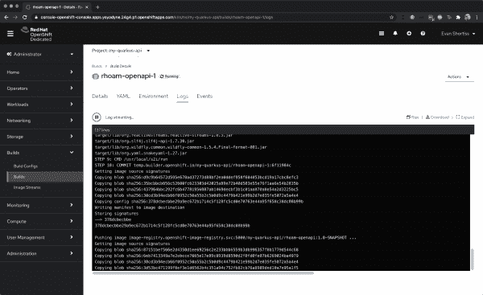
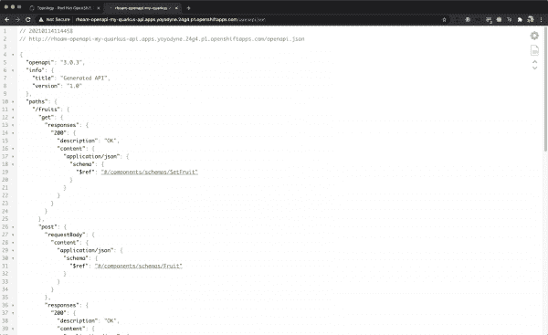
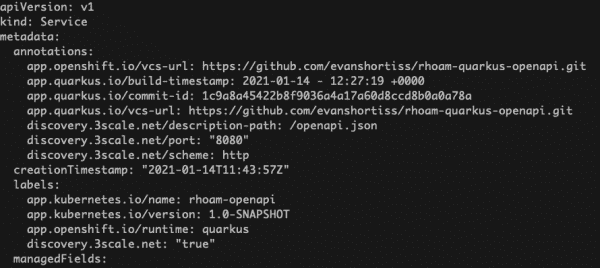
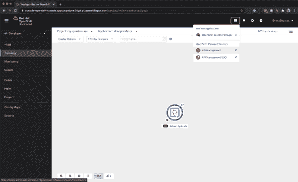
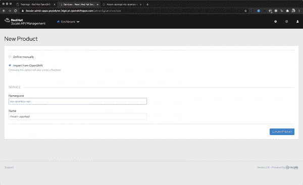
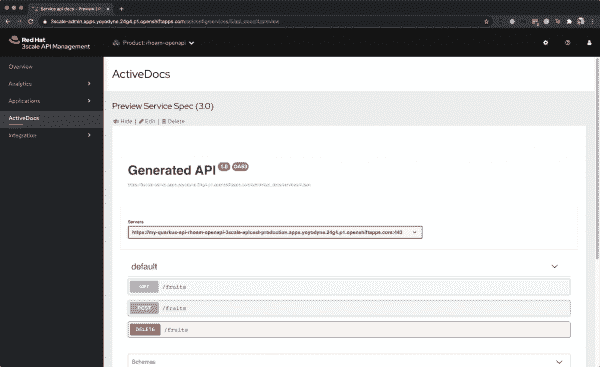
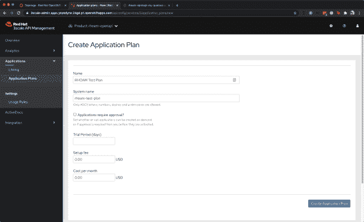
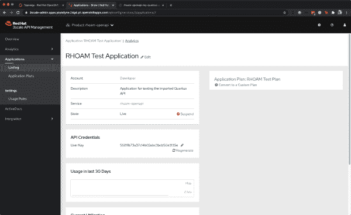
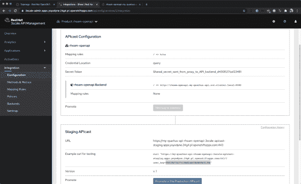

# 使用 Red Hat OpenShift API 管理管理您的第一个 API 的 5 个步骤

> 原文：<https://developers.redhat.com/blog/2021/02/23/5-steps-to-manage-your-first-api-using-red-hat-openshift-api-management>

公司越来越多地使用托管和托管服务来交付应用程序现代化工作，并减轻管理云基础架构的负担。最近发布的 [Red Hat OpenShift API 管理](https://developers.redhat.com/products/rhoam/overview)使得在 [Red Hat OpenShift 专用](https://www.openshift.com/products/dedicated/)上运行 [Red Hat 3scale API 管理](https://developers.redhat.com/products/3scale/overview)的专用实例变得前所未有的容易。

本文面向希望学习如何使用 Red Hat 的托管和管理服务来自动导入和管理公开的 API 的开发人员。我们将在 OpenShift Dedicated 上部署一个 [Quarkus](https://developers.redhat.com/products/quarkus/getting-started) 应用程序，然后使用 OpenShift API 管理来增加 API 密钥安全性。参见文章末尾的视频演示所描述的工作流程。

## 先决条件

本文假设您已经拥有以下内容:

*   进入[cloud.redhat.com](https://cloud.redhat.com)账户。
*   现有的 OpenShift 专用集群或部署集群的能力。
*   部署 Red Hat OpenShift API 管理插件的权利。
*   开发环境具有:
    *   Git CLI
    *   Java 8 或 11 以上版本
    *   Maven 3.6.2
    *   open shift CLI 4.5 或更高版本

## 步骤 1:获得一个 OpenShift 专用集群

使用像 OpenShift API Management 这样的托管和管理服务可以使这一步变得简单明了。参见[本视频指南](https://www.youtube.com/watch?v=sd2TlBm5KHs&feature=youtu.be)获取 OpenShift 专用集群并安装 OpenShift API 管理插件。你也可以在[这篇文章](https://developers.redhat.com/blog/2021/02/23/installing-red-hat-openshift-api-management)和 [OpenShift API 管理文档](https://access.redhat.com/documentation/en-us/red_hat_openshift_api_management/1/)中找到说明。

一旦您获得了 OpenShift 专用集群并安装了 Red Hat OpenShift API 管理插件，我们就可以进入下一步了。

## 步骤 2:使用 OpenShift CLI 创建一个项目

通过 OpenShift 命令行界面登录到 OpenShift 专用集群需要一个登录令牌和 URL。您可以通过网络浏览器登录到 OpenShift 控制台，并使用配置的 [IdP](https://en.wikipedia.org/wiki/Identity_provider) 来获得这两者。点击右上角用户名下显示的下拉菜单中的**复制登录命令**。或者，直接导航到 **https://oauth-openshift。$ CLUSTER _ HOSTNAME/oauth/token/request**并使用您的网络浏览器获取有效的登录命令。

有了令牌后，发出登录命令，然后创建一个新项目:

1.  `$ oc login --token=$TOKEN --server=$URL`
2.  `$ oc new-project my-quarkus-api`

## 步骤 3:将 Quarkus 应用程序部署到 OpenShift

您将为本次演示部署的 Java 应用程序基于来自 [Quarkus OpenAPI 和 Swagger UI 指南](https://quarkus.io/guides/openapi-swaggerui)的示例。这是一个简单的 CRUD 应用程序，支持使用 REST API 修改内存中的水果列表。你会在[这个 GitHub 库](https://github.com/evanshortiss/rhoam-quarkus-openapi)中找到源代码。

我们的应用程序的代码库与 Quarkus OpenAPI 和 Swagger UI Guide 的例子略有不同。我做了以下更改:

1.  在`application.properties`中设置`quarkus.smallrye-openapi.store-schema-directory`。
2.  将`.gitignore`更新为`openapi.json`和`openapi.yaml`。
3.  增加了`quarkus-openshift`扩展名。

这些修改创建了 JSON 格式的 OpenAPI 规范的本地副本，并包含了简化部署过程的工具。

### 构建并部署 Quarkus 应用程序

首先将存储库克隆到您的本地环境中:

```
$ git clone https://github.com/evanshortiss/rhoam-quarkus-openapi

```

发出以下命令启动本地开发服务器，并查看位于**http://localhost:8080/Swagger-UI**的 Swagger UI:

```
$ ./mvnw quarkus:dev
```

输入以下命令在 OpenShift 专用集群上构建和部署应用程序:

```
$ ./mvnw clean package -Dquarkus.kubernetes.deploy=true -Dquarkus.openshift.expose=true
```

构建进度将从 OpenShift 构建窗格传输到您的终端。您还可以在 OpenShift 控制台的项目的 **Builds** 部分跟踪构建日志和状态，如图 1 所示。

[](/sites/default/files/blog/2021/01/fig1.png)Viewing Build logs in the OpenShift Console

Figure 1: Viewing build logs in the OpenShift console.

一旦构建和部署过程完成，访问应用程序的 URL 将打印在您的终端上。使用这个 URL 来验证应用程序的 OpenAPI 规范在`/openapi?format=json`端点是否可用。验证是否返回了 JSON 响应非常重要。您将需要它来将 API 导入 3 规模 API 管理，并自动生成 3 规模 API 管理活动文档。图 2 显示了该端点返回的响应示例。

[](/sites/default/files/blog/2021/01/fig2.png)Figure 2: Viewing the Open API Specification in JSON Format

Figure 2: Viewing the OpenAPI specification in JSON format.

## 步骤 4:应用服务发现注释

接下来，我们将使用其服务发现功能将 API 导入 3scale API Management。对于这一步，我们需要将一组特定的注释和标签应用到与 Quarkus 应用程序相关的服务中。服务发现注释和标签[记录在这里](https://access.redhat.com/documentation/en-us/red_hat_3scale_api_management/2.9/html/admin_portal_guide/service-discovery)。

使用以下命令应用必要的注释:

```
$ oc annotate svc/rhoam-openapi "discovery.3scale.net/description-path=/openapi?format=json"
$ oc annotate svc/rhoam-openapi discovery.3scale.net/port="8080"
$ oc annotate svc/rhoam-openapi discovery.3scale.net/scheme=http
```

使用以下命令添加`discovery`标签:

```
$ oc label svc/rhoam-openapi discovery.3scale.net="true"
```

使用以下方法验证标签和注释:

```
$ oc get svc/rhoam-openapi -o yaml
```

输出应该类似于图 3 中显示的示例。

[](/sites/default/files/blog/2021/01/fig3.png)Figure 3: The Quarkus API Service definition in YAML format with annotations and labels applied.

Figure 3: The Quarkus API Service definition in YAML format with annotations and labels.

## 步骤 5:使用服务发现来导入 API

此时，您可以导入 Quarkus Fruits API，并使用 3scale API 管理的服务发现功能对其进行管理。使用 OpenShift 专用应用程序启动器导航至 3scale API 管理控制台。图 4 显示了 OpenShift 专用控制台右上角的应用程序启动器。

[](/sites/default/files/blog/2021/01/fig4.png)Figure 4: Using the Application Launcher in the OpenShift Dedicated Console to access 3scale API Management

Figure 4: Using the application launcher to access 3scale API Management.

### 导入 API

使用您配置的 IdP 登录 3scale API Management，并点击仪表板上的**新产品**链接。在**新产品**屏幕上执行以下步骤:

1.  选择**从 OpenShift** 导入(必要时认证)。
2.  从**名称空间**下拉菜单中选择 **my-quarkus-api** 名称空间。
3.  从**名称**下拉菜单中选择 **rhoam-openapi** 服务。
4.  点击**创建产品**按钮。

图 5 显示了 3scale API 管理中的新产品屏幕。

[](/sites/default/files/blog/2021/01/fig5.png)Figure 5: Using the Import from OpenShift option on the New Product screen in 3scale API Management

Figure 5: Creating a new product in 3scale API Management.

此时，您应该会被重定向回 3scale API 管理控制面板。如果几分钟后您的新 API 没有在**API**部分列出，请尝试刷新页面。一旦 API 被导入并在仪表板上列出，展开它并点击 **ActiveDoc** 链接。在随后的屏幕上选择 **rhoam-openapi** ，查看由 openapi 规范生成的实时文档，如图 6 所示。

[](/sites/default/files/blog/2021/01/fig6.png)Figure 6: Viewing the generated ActiveDocs in 3scale API Management

Figure 6: Viewing the generated ActiveDocs in 3scale API Management.

### 在 3 规模 API 管理中创建应用计划

接下来，您需要配置一个*应用程序计划*来通过一个受保护的路由与 API 交互:

1.  从顶部导航栏中选择**产品:rhoam-openapi** 。
2.  从左侧菜单中选择**应用>应用计划**。
3.  点击**创建应用计划**链接。
4.  在**名称**字段输入“RHOAM 测试计划”。
5.  在**系统名称**字段中输入“rhoam-test-plan”。
6.  点击**创建应用计划**按钮。
7.  当重定向到**应用计划**屏幕时，点击**发布**链接。

图 7 显示了在 3scale API 管理中创建新应用计划的对话框。

[](/sites/default/files/blog/2021/01/fig7.png)Figure 7: Creating an Application Plan in 3scale API Management

Figure 7: Creating an application plan in 3scale API Management.

### 配置开发人员帐户以使用该应用程序

现在您已经创建了一个应用程序计划，您需要注册一个开发人员帐户来使用该应用程序。通常，API 消费者使用您的 API 开发者门户注册。出于本演示的目的，您将手动为默认开发人员帐户提供 API 访问权限:

1.  从顶部导航栏中选择**观众**。
2.  从**账户**列表中选择**开发商**账户。
3.  从屏幕顶部的面包屑链接中单击 **1 应用程序**链接。
4.  点击**创建应用**链接，您将被引导至**新应用**屏幕。
5.  选择 **RHOAM 测试计划**作为**应用计划**。
6.  在**名称**字段输入“RHOAM 测试应用”。
7.  输入 API 的描述。
8.  点击**创建应用**。

一旦创建了应用程序，您会看到在 **API 凭证**部分下面列出了一个 API 键，如图 8 所示。记下钥匙。

[](/sites/default/files/blog/2021/01/fig8.png)Figure 8: An API Key is generated when an Application is created for a user in 3scale API Management

Figure 8: Creating an application for a user generates an API key.

### 测试应用程序

使用顶部导航栏导航回 Quarkus API 的产品页面，然后打开**集成>配置**部分。 **Staging APIcast** 部分应该包括一个用于测试的示例 cURL 命令，如图 9 所示。复制该命令并将`/fruits`添加到 URL，例如`https://my-quarkus-api-3scale-staging.$CLUSTER_HOSTNAME:443/fruits?user_key=$YOUR_API_KEY`

[](/sites/default/files/blog/2021/01/fig9.png)Figure 9: The example cURL command now contains a valid API Key

Figure 9: The example cURL command now contains a valid API key.

发出 cURL 命令或将 URL 粘贴到 web 浏览器中会从 Quarkus API 返回水果列表。恭喜:您已经在 OpenShift 上部署了一个基于 Quarkus 的 REST API，并使用 Red Hat 3scale API 管理对其进行了保护。

## 视频演示:Red Hat OpenShift API 管理

如果您想再次回顾本文中的步骤，请参见本视频指南，使用 Red Hat OpenShift API 管理、Quarkus 和 3scale API 管理来自动导入和管理公开的 API。

[https://www.youtube.com/embed/NzNgc0f75pc?autoplay=0&start=0&rel=0](https://www.youtube.com/embed/NzNgc0f75pc?autoplay=0&start=0&rel=0)

## 总结和后续步骤

如果你已经做到了这一步，你就成功了:

*   调配了一个 OpenShift 专用集群。
*   已安装 Red Hat OpenShift API 管理插件。
*   在您的 OpenShift 专用集群上部署一个 Quarkus 应用程序。
*   使用 OpenShift CLI 将自定义标签和注释应用于服务。
*   将 Quarkus API 导入 3scale API 管理，并使用 API 密钥安全性对其进行保护。

既然您已经了解了 OpenShift 专用和 3scale API 管理的基础知识，为什么不探索其他 OpenShift 专用和 Red Hat OpenShift API 管理特性呢？以下是一些想法:

*   熟悉您的 Red Hat OpenShift API 管理附加组件中包含的单点登录实例。你可以考虑使用 Red Hat 的单点登录(SSO)技术，而不是 API 密匙安全来[保护使用 OpenID Connect](https://access.redhat.com/documentation/en-us/red_hat_3scale_api_management/2.9/html/administering_the_api_gateway/openid-connect#configure-3scale) 的路由。(SSO 可从 OpenShift 专用应用程序启动器访问。)
*   通过跟随 OpenShift web 控制台的[开发者视角](https://docs.openshift.com/container-platform/4.2/web_console/odc-about-developer-perspective.html)的快速入门，了解更多关于 OpenShift 和您的集群的信息。
*   使用 OpenShift 控制台或 CLI 删除到 Quarkus API 的无保护路由。这是您用来查看 JSON 格式的 OpenAPI 的路径。

编码快乐！

*Last updated: October 7, 2022*