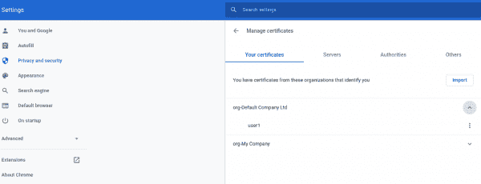
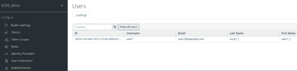
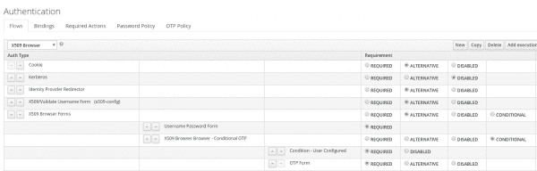
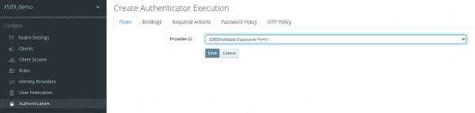
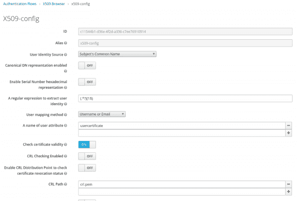
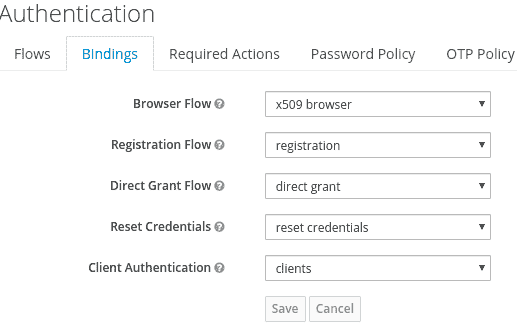
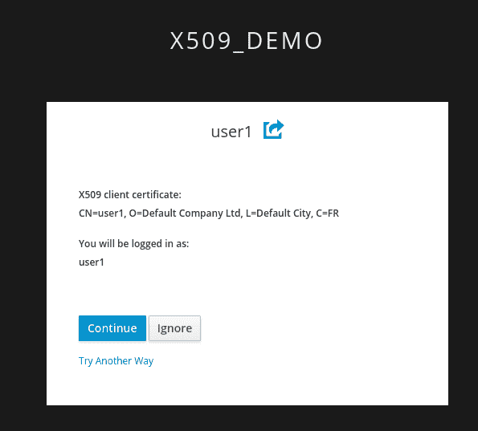

# 采用 Red Hat 单点登录技术的 X.509 用户证书认证

> 原文：<https://developers.redhat.com/blog/2021/02/19/x-509-user-certificate-authentication-with-red-hats-single-sign-on-technology>

本文阐释了如何使用 X.509 用户签名证书配置浏览器身份验证流。一旦您使用 X.509 用户签名证书设置了身份验证，您的用户在使用 [Red Hat 的单点登录技术](https://access.redhat.com/products/red-hat-single-sign-on) (SSO)进行身份验证时将不需要输入用户名和密码。相反，他们将向 SSO 实例提供 X.509 证书。

## 概观

为单点登录身份验证配置和使用 X.509 用户签名证书的主要步骤是:

1.  创建本地证书颁发机构(CA)。
2.  使用私钥、证书签名请求(CSR)和公钥创建用户证书。
3.  生成一个 PFX 用户证书并上传到 Chrome。
4.  配置 SSO 密钥库和信任库。
5.  创建 X.509 浏览器身份验证流。
6.  测试 X.509 浏览器身份验证流程。

我们将详细讨论每一个步骤。

## 先决条件

您需要在开发环境中设置以下组件:

*   一个运行[红帽的单点登录技术 7](https://access.redhat.com/articles/2342881) 的本地虚拟机。
*   OpenSSL 工具箱。
*   Chrome 网络浏览器。
*   JDK 8 号或 JDK 11 号。

## 步骤 1:创建本地证书颁发机构

X.509 用户证书由证书颁发机构签名。用户首先向证书颁发机构发送一个 CSR 文件，然后 CA 返回一个签名证书和根 CA，两者都采用 [PEM 格式](https://www.ssl.com/guide/pem-der-crt-and-cer-x-509-encodings-and-conversions/)。

如果您还没有证书颁发机构，下面是创建证书颁发机构的说明。

```
openssl genrsa -aes256 -passout pass:<password> -out ca.pass.key 4096
openssl rsa -passin pass:<password> -in ca.pass.key -out ca.key
openssl req -new -x509 -days 3650 -key ca.key -out ca.pem

```

以下是一个证书生成请求示例:

```
genrsa -aes256 -passout pass:password -out ca.pass.key 4096
Generating RSA private key, 4096 bit long modulus (2 primes)
.......................................................................................................................................................................................................++++
..............................++++
e is 65537 (0x010001)

openssl rsa -passin pass:password -in ca.pass.key -out ca.key
writing RSA key
openssl req -new -x509 -days 3650 -key ca.key -out ca.pem
You are about to be asked to enter information that will be incorporated into your certificate request.
What you are about to enter is what is called a Distinguished Name or a DN.
There are quite a few fields but you can leave some blank
For some fields there is a default value,
If you enter '.', the field will be left blank.
-----
Country Name (2 letter code) [XX]:US
State or Province Name (full name) []:Carolina
Locality Name (eg, city) [Default City]:Raleigh
Organization Name (eg, company) [Default Company Ltd]:Red Hat
Organizational Unit Name (eg, section) []:RH-SSO
Common Name (eg, your name or your server's hostname) []:localhost
Email Address []:

```

## 步骤 2:创建用户证书

注意，我们的目标测试用户是`user1`。测试用户也将在 SSO 领域中创建。

生成用户证书的任务包括:

*   生成用户私钥。
*   生成用户签名的证书请求。
*   生成由 CA 签名的用户签名请求。

### 生成用户私钥

以下命令生成用户私钥:

```
CLIENT_ID="user1"
CLIENT_SERIAL=01

openssl genrsa -aes256 -passout pass:<password> -out ${CLIENT_ID}.pass.key 4096
openssl rsa -passin pass:<password> -in ${CLIENT_ID}.pass.key -out ${CLIENT_ID}.key

```

**注** : `CLIENT_SERIAL`代表序号。它需要在 CA 中是唯一的。`CLIENT_ID`对应于用户名，在本例中是`user1`。

下面是一个生成的用户私钥的示例:

```
CLIENT_ID="user1"
CLIENT_SERIAL=01
openssl genrsa -aes256 -passout pass:password -out ${CLIENT_ID}.pass.key 4096
Generating RSA private key, 4096 bit long modulus (2 primes)
........................................................................................................................................................................................................++++
....................++++
e is 65537 (0x010001)
openssl rsa -passin pass:password -in ${CLIENT_ID}.pass.key -out ${CLIENT_ID}.key
writing RSA key

```

### 生成用户签名的证书请求

以下命令生成用户签名的证书请求密钥:

```
openssl req -new -key ${CLIENT_ID}.key -out ${CLIENT_ID}.csr

```

下面是一个生成的用户签名证书请求的示例:

```
openssl req -new -key ${CLIENT_ID}.key -out ${CLIENT_ID}.csr
You are about to be asked to enter information that will be incorporated into your certificate request.
What you are about to enter is what is called a Distinguished Name or a DN.
There are quite a few fields but you can leave some blank
For some fields there will be a default value,
If you enter '.', the field will be left blank.
-----
Country Name (2 letter code) [XX]:FR
State or Province Name (full name) []:
Locality Name (eg, city) [Default City]:
Organization Name (eg, company) [Default Company Ltd]:
Organizational Unit Name (eg, section) []:
Common Name (eg, your name or your server's hostname) []:user1
Email Address []:

Please enter the following 'extra' attributes
to be sent with your certificate request
A challenge password []:
An optional company name []:

```

### 生成由 CA(公共证书)签名的用户签名请求

CA 接收 CSR，并以 PEM 文件格式提供签名证书。该证书由根 CA 签名。

以下是生成由 CA 签名的用户签名请求的命令:

```
openssl x509 -req -days 3650 -in ${CLIENT_ID}.csr -CA ca.pem -CAkey ca.key -set_serial ${CLIENT_SERIAL} -out ${CLIENT_ID}.pem

```

以下是一个示例响应:

```
openssl x509 -req -days 3650 -in ${CLIENT_ID}.csr -CA ca.pem -CAkey ca.key -set_serial ${CLIENT_SERIAL} -out ${CLIENT_ID}.pem
Signature ok
subject=C = FR, L = Default City, O = Default Company Ltd, CN = user1
Getting CA Private Key

```

## 第三步:生成一个 PFX 用户证书并上传到 Chrome

网络浏览器希望上传使用 PFX ( [PKCS #12](https://en.wikipedia.org/wiki/PKCS_12) )文件格式的证书，其中包含一个私钥和一个公钥。我们在这个例子中使用了 Chrome。

### 生成用户 PFX 文件

输入以下命令以生成用户 PFX 文件:

```
openssl pkcs12 -export -out ${CLIENT_ID}.pfx -inkey ${CLIENT_ID}.key -in ${CLIENT_ID}.pem

```

以下是一个示例响应:

```
Enter Export Password:
Verifying - Enter Export Password:

```

### 将用户证书上传到 Chrome

接下来，进入**chrome://settings/certificates**，将用户 PFX 证书导入 Chrome 浏览器，如图 1 所示。

[](/sites/default/files/blog/2020/11/img_5fc4ff669688b.png)

Figure 1: Use Chrome settings to import the PFX certificate.

## 步骤 4:配置 SSO 密钥库和信任库

Red Hat 的单点登录技术要求使用密钥库和信任库进行相互安全套接字层(SSL)认证。此外，您需要将密钥库和信任库都放在您的`<jboss-home-dir>/standalone/configuration`目录中。SSO 安装在`<jboss-home-dir>`目录中。

我们将执行以下操作来创建和使用 X.509 密钥库和信任库:

*   使用`keytool`实用程序创建一个密钥库。
*   使用`keytool`实用程序创建一个信任库。
*   将密钥库和信任库添加到`standalone.xml`。
*   增加`ssl-realm`证券为`https-listener`。

注意`keytool`是一个用于创建 Java 密钥库的 Java SDK 命令。

### 使用 keytool 创建密钥库

输入以下命令，使用`keytool`创建密钥库:

```
keytool -genkey -alias localhost -keyalg RSA -keystore keystore.jks -validity 10950

```

这里有一个例子:

```
Enter keystore password:
Re-enter new password:
What is your first and last name?
[Unknown]: localhost
What is the name of your organizational unit?
[Unknown]: Keycloak
What is the name of your organization?
[Unknown]: Red Hat
What is the name of your City or Locality?
[Unknown]: Westford
What is the name of your State or Province?
[Unknown]: MA
What is the two-letter country code for this unit?
[Unknown]: US
Is CN=localhost, OU=Keycloak, O=Red Hat, L=Westford, ST=MA, C=US correct?
[no]: yes

Enter key password for <localhost>
(RETURN if same as keystore password):

Warning:
The JKS keystore uses a proprietary format. It is recommended to migrate to PKCS12 which is an industry standard format using "keytool -importkeystore -srckeystore keycloak.jks -destkeystore keycloak.jks -destst

```

**注**:关于创建密钥库的更详细指导，请参见 [*为密钥库服务器*](https://www.keycloak.org/docs/latest/server_installation/#enabling-ssl-https-for-the-keycloak-server) 启用 SSL/HTTPS。

### 使用 keytool 创建信任库

下面的命令使用`keytool`创建一个信任库。(注意，我们通过导入 PEM 证书来创建信任库。这里，我们使用根 CA。)

```
keytool -import -alias HOSTDOMAIN -keystore truststore.jks -file host-certificate.cer

```

这里有一个例子:

```
keytool -import -alias root-ca -keystore truststore.jks -file ca.pem
Enter keystore password:
Re-enter new password:
Owner: CN=localhost, OU=RH-SSO, O=Red Hat, L=Raleigh, ST=Carolina, C=US
Issuer: CN=localhost, OU=RH-SSO, O=Red Hat, L=Raleigh, ST=Carolina, C=US
Serial number: 22834205f8cb27b0528338669e74c0e4c37f47be
Valid from: Fri Nov 27 14:56:33 CET 2020 until: Mon Nov 25 14:56:33 CET 2030
Certificate fingerprints:
MD5: D0:D1:AC:6F:9E:5C:6B:FF:AD:DD:FA:69:1F:46:2E:D4
SHA1: 54:E9:79:E0:ED:7C:72:F5:3A:C1:88:1A:FA:3D:64:3E:69:16:0C:21
SHA256: 30:FF:C8:5C:D2:DF:0F:16:00:00:DC:1D:CB:85:C2:67:32:FB:E7:66:6C:A6:7C:E1:CB:58:32:F3:61:56:1C:79
Signature algorithm name: SHA256withRSA
Subject Public Key Algorithm: 4096-bit RSA key
Version: 3

```

扩展:

```
#1: ObjectId: 2.5.29.35 Criticality=false
AuthorityKeyIdentifier [
KeyIdentifier [
0000: CA 65 3A 64 27 B7 C9 19 5C 98 8F A2 83 80 45 86 .e:d'...\.....E.
0010: 7A 36 89 00 z6..
]
]

#2: ObjectId: 2.5.29.19 Criticality=true
BasicConstraints:[
CA:true
PathLen:2147483647
]

#3: ObjectId: 2.5.29.14 Criticality=false
SubjectKeyIdentifier [
KeyIdentifier [
0000: CA 65 3A 64 27 B7 C9 19 5C 98 8F A2 83 80 45 86 .e:d'...\.....E.
0010: 7A 36 89 00 z6..
]
]

Trust this certificate? [no]: yes
Certificate was added to keystore

```

**注**:关于创建信任库的更多信息，请参见 [*外发 HTTPS 请求信任库*](https://www.keycloak.org/docs/latest/server_installation/#_truststore) 。

### 将密钥库和信任库添加到 standalone.xml 中

接下来，我们需要添加一个`security-realm`、`ssl-realm/`，它包含密钥库和信任库:

```
  <security-realm name="ssl-realm">
              <server-identities>
                  <ssl>
                      <keystore path="keystore.jks"
                                relative-to="jboss.server.config.dir"
                                keystore-password=<keystore-password>/>
                  </ssl>
              </server-identities>
              <authentication>
                  <truststore path="truststore.jks"
                              relative-to="jboss.server.config.dir"
                              keystore-password=<trust-store-password>/>
              </authentication>
  </security-realm>

```

### 将 ssl 领域安全性添加为 https 侦听器

最后，我们将`ssl-realm` security 添加为`https-listener`。注释掉之前的`https-listener`，和`ApplicationRealm`安全领域有关。然后，让`https-listener`指向`ssl-realm`安全领域。以下是所需配置的示例:

```
 <server name="default-server">
	<http-listener name="default" socket-binding="http" redirect-socket="https" enable-http2="true"/>
	<!--
	<https-listener name="https" socket-binding="https" security-realm="ApplicationRealm" enable-http2="true"/>
        -->
	<https-listener name="https" socket-binding="https" security-realm="ssl-realm" verify-client="REQUESTED"/>
        <host name="default-host" alias="localhost">
           <location name="/" handler="welcome-content"/>
           <http-invoker security-realm="ApplicationRealm"/>
           </host&gt;
 </server>

```

## 步骤 5:创建 X.509 浏览器身份验证流

在使用 SSO 实例之前，我们需要创建一个名为`X509_demo`的新领域。

转到左侧面板，点击**添加领域**并输入领域名称`X509_demo`。

一旦创建了域名`X509_demo`，您就可以使用**添加用户**按钮来添加新用户**用户 1** ，如图 2 所示。

[](/sites/default/files/blog/2020/12/img_5fc5fb82d849e.png)

Figure 2: Create the X509_demo and add user1 to the realm.

现在，我们可以执行以下任务:

*   创建 SSO X.509 浏览器身份验证流。
*   在 SSO 中配置 X.509 证书。
*   设置身份验证绑定。

### 创建 SSO X.509 浏览器身份验证流

我们将使用**认证**页面来创建 SSO X.509 浏览器认证流，如图 3 所示。

[](/sites/default/files/blog/2020/11/img_5fc5027161733.png)

Figure 3: Set up a new SSO browser authentication flow.

执行以下操作来设置 SSO 浏览器流:

*   复制默认浏览器流程，重命名为 **X.509 浏览器**。
*   在**身份提供者重定向器**行下添加`X.509 validate username form (X.509-config)`。
*   将该执行步骤设置为**替代**。

**注**:进一步说明参见 SSO 文档中 [*将 X.509 客户端证书认证添加到浏览器流程*](https://access.redhat.com/documentation/en-us/red_hat_single_sign-on/7.4/html/server_administration_guide/authentication#adding_x_509_client_certificate_authentication_to_a_browser_flow) 。

图 4 显示了将 **X509 验证用户名表单**添加到执行流的对话框。

[](/sites/default/files/blog/2021/02/img_602ba4a7de400.png)

Figure 4: Add the X509 Validate Username Form to the execution flow.

### 在 SSO 中配置 X.509 证书

要在 SSO 中设置 X.509 证书，进入 X.509 浏览器流程，从 **X509 验证用户名表单**中选择**配置动作**。您将被重定向到 **X509-Config** 表单，在这里您可以使用`cn=user1`作为`username`来完成证书认证。

在该表单上，将**用户身份源**切换到**主题的常用名**，将**用户映射方法**切换到**用户名或电子邮件**。图 5 显示了这些更新。

[](/sites/default/files/blog/2020/11/img_5fc50e63c9ffc.png)

Figure 5: Use the X509-Config form to complete the certificate authentication.

### 设置身份验证绑定

在**认证**页面上，使用**绑定**选项卡将认证绑定设置为您刚刚创建的新认证流，如图 6 所示。

[](/sites/default/files/blog/2020/11/img_5fc50ee34c32f.png)

Figure 6: Set the new authentication flow in the Bindings tab.

## 步骤 6:测试 X.509 浏览器身份验证流

要测试认证流，请转到测试 URL:**https://localhost:8443/auth/realms/x509 _ demo/account**。您应该会看到如图 7 所示的屏幕。

[](/sites/default/files/blog/2020/11/img_5fc504bf0396c.png)

Figure 7: Use the X.509 demo to automatically authenticate the user1 X.509 certificate.

如果您点击**继续**，您应该会自动通过您的 user1 X.509 证书进行身份验证，而不会被提示输入用户名和密码。

## 结论

使用 X.509 证书进行身份验证通过向服务器验证用户来加强安全性，因此用户名和密码不会暴露。如果需要保留用户名-密码身份验证方案，可以使用第二个身份验证因素，比如 SSO 提供的[一次性密码(OTP)](https://access.redhat.com/documentation/en-us/red_hat_single_sign-on/7.4/html/server_administration_guide/authentication) 。红帽的单点登录技术还提供了对 W3C Web 认证(WebAuthn) 的[技术预览支持。](https://access.redhat.com/documentation/en-us/red_hat_single_sign-on/7.4/html/server_administration_guide/authentication#webauthn)

*Last updated: October 7, 2022*