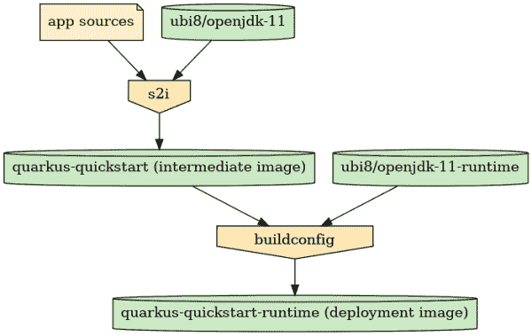

# 使用新的 Red Hat 通用基础映像 OpenJDK 运行时映像构建精益 Java 容器

> 原文：<https://developers.redhat.com/articles/2021/05/24/build-lean-java-containers-new-red-hat-universal-base-images-openjdk-runtime>

[红帽通用基础镜像](/products/rhel/ubi) (UBI)包含了 [OpenJDK](/products/openjdk/overview) 的完整红帽构建。根据 [UBI 最终用户许可协议](/articles/ubi-faq)的条款，任何人都可以使用 Universal Base Images，并且完全支持 Red Hat 客户。这些“构建器”映像旨在适用于构建和运行各种基于 Java 的应用程序，尤其是在 [Red Hat OpenShift](/products/openshift/overview) 环境中使用时。它们包含完整的 Java 开发工具包(JDK ),包括开发工具、Java 编译器、Maven 和相关的构建工具。

[OpenShift source-to-image(S2I)流程](https://docs.openshift.com/container-platform/4.7/openshift_images/using_images/using-s21-images.html)使得在 open shift 集群中构建和更新您的应用源代码变得非常简单，只要底层映像或应用源代码更新，您的部署也会随之更新。有了这个工作流，应用程序就位于构建器映像之上，因此部署包含了完整的 JDK 和 [Maven](https://maven.apache.org/index.html) 工具。一些开发人员希望他们的部署基于更薄的基础映像；也许没有 Maven，或者没有完整的 JDK 工具，或者两者都有。

为了满足这一需求，Red Hat 发布了新的 OpenJDK *运行时*容器映像，其中不包含完整的 JDK 或其他构建工具。本文解释了如何在 OpenShift 环境中使用这些新映像，通过 S2I 工作流自动部署您的应用程序。我们将使用一个 [Quarkus](/products/quarkus/getting-started) quickstart 作为应用程序源。

## S2I 和夸库斯快速入门

要开始使用 Quarkus 快速入门，请确保您已登录到 OpenShift 实例，并运行以下命令:

```
# Build the image on OpenShift
$ oc new-app  --context-dir=getting-started --name=quarkus-quickstart \
 'registry.access.redhat.com/ubi8/openjdk-11~https://github.com/quarkusio/quarkus-quickstarts.git#1.13.3.Final'

# Watch the build, to see when it completes
$ oc logs -f bc/quarkus-quickstart

# Create a route
$ oc expose svc/quarkus-quickstart

# Get the route URI
$ export URI="http://$(oc get route | grep quarkus-quickstart | awk '{print $2}')"

# Test the app!
$ curl $URI/hello/greeting/quarkus
```

第一个命令`oc new-app`，创建构建和部署 quickstart 应用程序所需的所有 OpenShift 组件，即用于`ubi8/openjdk-11`基础映像和结果应用程序映像的`BuildConfig`、`ImageStreams`，以及`DeploymentConfig`和`Service`。该命令还实例化一个构建和一个部署。`oc expose`命令为部署创建了一个`Route`，允许我们测试正在运行的 web 应用程序。

这种设置的优点在于，每当应用程序源代码在其 Git 存储库中更新时，或者每当底层构建器映像更新时，都可以触发新的构建。

## 运行时映像

现在是新的部分:我们将为精简运行时映像定义一个新的`ImageStream`。作为该图像的一部分，我们将从上一步中创建的应用程序`ImageStream`中复制应用程序工件。我们还需要定义其他 OpenShift 部分来启动和运行应用程序，就像最初的快速启动自动完成的一样:一个`DeploymentConfig`、`Service`和`Route`。图 1 显示了我们的流程。

[](/sites/default/files/blog/2021/01/moo.png)Figure 1: The OpenShift process for generating a DIY runtime image.

The OpenShift process for generating a DIY runtime image

首先，我们需要精益的基础形象。我们将使用红帽 UBI8 最小基础图像。我们需要将它作为`ImageStream`导入到 OpenShift 中。这就像下面的命令一样简单:

```
$ oc create -n openshift -f https://raw.githubusercontent.com/jboss-container-images/openjdk/release/templates/runtime-image-streams.json
```

现在我们为我们的精益应用程序定义 OpenShift 组件，我们将一次创建一个。首先，我们创建`ImageStream`，我们将在其中发布精益运行时应用程序映像:

```
$ oc create imagestream quarkus-quickstart-runtime
```

现在我们需要一个`BuildConfig`来构建图像。这更复杂，所以我们将在 YAML 文件中定义它，而不是在命令行中。对于这篇文章以及本文后面的所有 YAML 片段，请将该片段保存到一个文件中，并使用以下命令将其加载到 OpenShift 中:

```
$ oc create -f snippet.yaml
```

构建配置如下:

```
apiVersion: v1
kind: BuildConfig
metadata:
  name: quarkus-quickstart-runtime
spec:
  output:
    to:
      kind: ImageStreamTag
      name: quarkus-quickstart-runtime:latest
  source:
    images:
    - from:
        kind: ImageStreamTag
        name: quarkus-quickstart:latest
      paths:
      - sourcePath: /deployments
        destinationDir: ./deployments
    dockerfile: |-
      FROM -
      COPY deployments /
      CMD  java -jar /deployments/quarkus-run.jar
  strategy:
    type: Docker
    dockerStrategy:
      from:
        kind: ImageStreamTag
        name: ubi8-openjdk-11-runtime:latest
  triggers:
  - type: ConfigChange
  - type: ImageChange
    imageChange:
      automatic: true
      from:
        kind: ImageStreamTag
        name: quarkus-quickstart:latest
  - type: ImageChange
    imageChange:
      automatic: true
      from:
        kind: ImageStreamTag
        name: ubi8-openjdk-11-runtime:latest
```

**注意**:图片的 docker 文件在 YAML 内联。我们使用一个占位符`FROM`图像中的“-”；YAML 的`dockerStrategy`部分告诉 OpenShift 用代表`ubi8-openjdk-11-runtime`图像流中最新图像的值覆盖`FROM`行。

我们将 Quarkus 快速启动映像中的`/deployments`目录复制到我们新的精益映像中。我们知道整个 Quarkus quickstart 应用程序都在这个目录中，所以这是我们需要复制的全部内容。根据具体的应用，可能需要进一步的步骤。最后，我们将精益容器的`CMD`设置为直接调用`java`，在命令行上传递应用程序的 JAR。

对此配置、底层`quarkus-quickstart`映像或基础`ubi8-openjdk-11-runtime`映像的任何更改都将触发此映像的重建。

将代码片段保存到一个临时文件中，并如前所述将其加载到 OpenShift 中。OpenShift 现在应该计划并开始构建映像。和以前一样，您可以通过查看日志来了解进度:

```
$ oc logs -f bc/quarkus-quickstart-runtime
```

### 图像尺寸

一旦构建完成，我们就可以检查结果并检查它的大小。首先，获取普通 quickstart `ImageStream`的大小，层叠在构建器图像之上:

```
$ oc get istag quarkus-quickstart:latest -o json | jq .image.dockerImageMetadata.Size
308976772
=> 295 MiB
```

为了便于比较，请获取新的运行时映像:

```
$ oc get istag quarkus-quickstart-runtime:latest -o json | jq .image.dockerImageMetadata.Size
135747392
=> 129 MiB
```

新的运行时映像的大小不到完整的 UBI8 OpenJDK builder 映像的一半，后者包含完整的 OpenJDK 和 Maven。

### 收尾

接下来我们需要定义`DeploymentConfig`、`Service`和`Route`。关于这些没有太多要说的，所以我把它们放在一个 YAML 片段中。您可以保存它并通过`oc create -f`一次性加载它们，就像我们之前做的那样:

```
apiVersion: v1
kind: DeploymentConfig
metadata:
    name: quarkus-quickstart-runtime
spec:
  replicas: 1
  selector:
    app: quarkus-quickstart-runtime
  template:
    metadata:
      labels:
        app: quarkus-quickstart-runtime
    spec:
      containers:
      - image: ' '
        name: quarkus-quickstart-runtime
        ports:
        - containerPort: 8080
          protocol: TCP
  triggers:
  - type: ConfigChange
  - imageChangeParams:
      automatic: true
      containerNames:
      - quarkus-quickstart-runtime
      from:
        kind: ImageStreamTag
        name: quarkus-quickstart-runtime:latest
    type: ImageChange
---
apiVersion: v1
kind: Service
metadata:
  name: quarkus-quickstart-runtime
spec:
  selector:
    app: quarkus-quickstart-runtime
  ports:
  - port: 8080
    protocol: TCP
    targetPort: 8080
---
apiVersion: v1
kind: Route
metadata:
  name: quarkus-quickstart-runtime
spec:
  to:
    kind: Service
    name: quarkus-quickstart-runtime
```

一旦这些都被加载，使用相同的技术获得路线，并获取一个“Hello world”URI，以确保一切正常:

```
$ export URI="http://$(oc get route | awk '/quarkus-quickstart-runtime/ {print $2}')"
curl $URI/hello/greeting/quarkus
```

## 总结

通用基础映像 OpenJDK builder 映像旨在满足希望在 OpenShift 上构建和部署其软件的各种客户的需求。然而，图像的灵活性是以图像尺寸为代价的。一些开发人员希望有较小的图像或者没有构建工具的图像。Red Hat 推出了新的 UBI OpenJDK 运行时映像来满足这一需求。本文描述的方法允许您在 OpenShift 中基于新的运行时映像定制和构建一个自己动手(DIY)的应用程序映像。这种方法还可以确保在组成部分发生变化时重建图像。

## 未来的工作

新运行时映像的主要驱动力是确保它们包含尽可能少的内容。现有的构建器映像包含许多运行时映像中不存在的功能，包括(但不限于)功能丰富的运行脚本；米制收集的普罗米修斯代理:开放式换档准备探针；默认 JVM 和垃圾收集参数；和大量用于调整图像的环境变量。如果您想要这些功能，完整的构建器图像可能适合您。相反，如果您想要尽可能小的运行时映像，使用最少的活动部件，并且不介意自己动手，那么运行时映像可能更合适。

在 Red Hat，我们不断改进我们的容器，以利用最新的技术和工艺。我们知道映像大小和部署表面积对许多开发人员来说是重要的问题，我们一直在努力减少每个版本的 OpenJDK builder 和运行时映像的大小。我们已经有了一些有希望的进展。看好这个空间！

*Last updated: April 25, 2022*