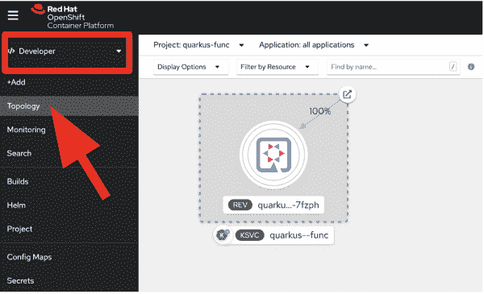
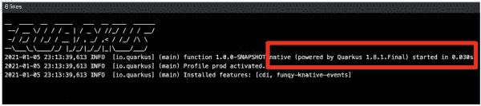
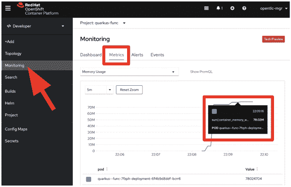

# 在 Red Hat OpenShift Serverless 上分两步编写一个 Quarkus 函数

> 原文：<https://developers.redhat.com/blog/2021/01/29/write-a-quarkus-function-in-two-steps-on-red-hat-openshift-serverless>

[无服务器功能](https://developers.redhat.com/blog/2021/01/04/create-your-first-serverless-function-with-red-hat-openshift-serverless-functions/)正在推动当今 DevApps 开发和部署实践的快速采用。为了成功采用无服务器功能，开发人员必须了解如何结合使用云计算、数据基础设施和面向功能的编程来指定无服务器功能。我们还需要考虑资源优化(内存和 CPU)以及开发和生产环境中的高性能启动和首次响应时间。如果我们不必担心所有这些呢？

在本文中，我将带您通过两个步骤来编写一个无服务器的函数，它具有超快的启动和响应时间以及内置的资源优化。首先，我们将使用一个预定义的 [Quarkus](https://developers.redhat.com/products/quarkus/getting-started) function 项目模板来编写一个无服务器函数。然后，我们将使用[Red Hat open shift server less](https://developers.redhat.com/topics/serverless-architecture)将该功能部署为本机可执行文件。通过这两个步骤，我们可以避免额外的工作，即从头开发一个功能，优化应用程序，并将其作为 [Knative](https://developers.redhat.com/topics/serverless-architecture#assembly-field-sections-38375) 服务部署在 [Kubernetes](https://developers.redhat.com/topics/kubernetes) 中。

## 步骤 1:创建一个 Quarkus 函数项目

Knative 命令行界面(`kn`)支持与[红帽 OpenShift 容器平台](https://developers.redhat.com/products/openshift/overview)上 Knative 组件的简单交互。在这一步，我们将使用`kn`创建一个基于 Quarkus 运行时的新函数项目。请参阅 OpenShift 无服务器文档，了解为您的操作系统安装`kn`的说明。

假设您已经安装了`kn`，移动到您的本地开发环境中的一个首选目录。然后，在您的终端中执行以下命令:

```
$ kn func create quarkus-func -l quarkus

```

该命令生成一个包含新 Quarkus 项目的`quarkus-func`目录。以下是我们示例的输出:

```
Project path: /Users/danieloh/Downloads/func-demo/quarkus-func
Function name: quarkus-func
Runtime: quarkus
Trigger: http

```

接下来，使用文本编辑器或您喜欢的 IDE 在`quarkus-func`项目中打开一个`func.yaml`文件。将构建器的值更新为*本地*，以构建一个 Quarkus 本地可执行文件。本机可执行文件允许您获得 Quarkus 的超快速启动和首次响应时间以及亚原子内存占用。您应该会看到类似这样的内容:

```
name: quarkus-func
namespace: ""
runtime: quarkus
image: ""
imageDigest: ""
trigger: http
builder: native
builderMap:
  default: quay.io/boson/faas-quarkus-jvm-builder
  jvm: quay.io/boson/faas-quarkus-jvm-builder
  native: quay.io/boson/faas-quarkus-native-builder
envVars: {}

```

就是这样。我们可以进入下一步，也是最后一步。

**注**:CLI`kn`不包含登录机制。要登录到 OpenShift 集群，在下一步中，您需要安装`oc` CLI。一旦安装完毕，你就可以使用`oc login`命令了。`oc`的安装选项会因您的操作系统而异。更多信息，请参见 [OpenShift CLI 文档](https://docs.openshift.com/container-platform/4.6/cli_reference/openshift_cli/getting-started-cli.html#cli-getting-started)。此外，我们将使用 OpenShift 无服务器特性来部署无服务器功能，因此您必须将 OpenShift 无服务器操作符安装到您的 OpenShift 集群中。有关安装的更多信息，请参见 OpenShift 无服务器文档。

## 步骤 2:部署一个 Quarkus 函数到 OpenShift Serverless

在这一步中，我们将基于刚刚创建的 Quarkus 函数构建和部署一个容器映像。首先，将您的工作目录移动到 Quarkus 项目。然后，在终端中运行以下命令:

```
$ oc new-project quarkus-func
$ cd quarkus-func
$ kn func deploy -r registry_string -n quarkus-func -v

```

**注意**:一定要用自己的注册表和名称空间替换上面的`registry_string` ( `quay.io/myuser`或者`docker.io/myuser`)。

构建一个本地可执行文件并封装应用程序需要几分钟时间，我们将使用 [Boson 项目构建包](https://github.com/boson-project/buildpacks)来完成。构建包将用户功能从源代码转换成可运行的 [OCI 映像](https://github.com/opencontainers/image-spec)的过程自动化。

一旦 Knative 服务将该功能部署到 OpenShift 集群，您将看到以下消息:

```
Deploying function to the cluster
Creating Knative Service: quarkus--func
Waiting for Knative Service to become ready
Function deployed at URL: http://quarkus--func-quarkus-func.apps.cluster-boston-c079.boston-c079.sandbox1545.opentlc.com

```

**注意**:此输出中的部署 URL 将因您的环境而异。

现在，让我们为 Quarkus pod 添加一个`label`以获得乐趣。运行以下命令:

```
$ REV_NAME=$(oc get rev | awk '{print $1}')
$ oc label rev/$REV_NAME app.openshift.io/runtime=quarkus --overwrite

```

接下来，转到 OpenShift 集群中的开发人员控制台，并导航到拓扑视图，如图 1 所示。

[](/sites/default/files/blog/2021/01/Screen-Shot-2021-01-11-at-8.06.50-AM.png)Figure 1\. Function topology

Figure 1: Find your Quarkus serverless function in the Topology view.

无服务器功能可能会终止，因为缩放到零的时间间隔默认为 30 秒。我们可以通过输入以下命令启动该功能:

```
$ curl -v FUNC_URL  \
  -H 'Content-Type:application/json' \
  -d '{"message": "Quarkus Native function on OpenShift Serverless"}'

```

您应该会看到类似这样的内容:

```
...
* Connection #0 to host quarkus--func-quarkus-func.apps.cluster-boston-c079.boston-c079.sandbox1545.opentlc.com left intact
{"message":"Quarkus Native function on OpenShift Serverless"}* Closing connection 0

```

**注意**:一定要把上面的`FUNC_URL`替换成自己的 URL，这个 URL 应该和上一步的部署 URL 相同。(输入`oc get rt`也可以找到。)

现在，让我们回到开发人员控制台。向端点发送流量会触发自动缩放器来缩放函数，因此您会看到 Quarkus 函数窗格已经自动上升，如图 2 所示。

[](/sites/default/files/blog/2021/01/Screen-Shot-2021-01-11-at-8.07.06-AM.png)Figure 2\. Scale-up a function

Figure 2: The autoscaler automatically scales the Quarkus function pod.

点击图 3 中的**查看日志**选项，发现应用程序惊人的快速启动时间。

[](/sites/default/files/blog/2021/01/Screen-Shot-2021-01-11-at-8.07.19-AM.png)Figure 3\. Resources view

Figure 3: Click View logs in the Resources view.

您应该会看到如图 4 所示的启动时间。

[](/sites/default/files/blog/2021/01/Screen-Shot-2021-01-11-at-8.07.26-AM.png)Figure 4\. Pod logs

Figure 4: The pod logs show a startup time of 30 milliseconds.

在我的例子中，应用程序启动花费了 *30 毫秒*。在您的环境中，启动时间可能有所不同。

最后，如果您想在函数运行时检查(极低的)内存使用情况，请转到 **Monitoring** 页面并检查内存使用情况，如图 5 所示。

[](/sites/default/files/blog/2021/01/Screen-Shot-2021-01-11-at-8.07.38-AM.png)Figure 5\. Memory usage metrics

Figure 5: Memory usage while the function is running.

这表明我们的进程占用了大约 78MB 的内存。这是非常紧凑的！

### 结论

本文向您展示了如何使用 OpenShift Serverless 创建一个基于 Quarkus 运行时并带有本机编译的函数，然后只需使用*两个* `kn func`命令将它部署到 OpenShift 集群。也可以选择不同的函数运行时(如 [Node.js](https://developers.redhat.com/topics/nodejs) 或 [Go](https://developers.redhat.com/blog/category/go/) )和函数触发器(如 HTTP 或 CloudEvents)，而不是我们在这个例子中使用的。有关使用 Node.js 运行时和 OpenShift 无服务器创建前端应用程序的指南，请参见 [*使用 Red Hat OpenShift 无服务器函数*](https://developers.redhat.com/blog/2021/01/04/create-your-first-serverless-function-with-red-hat-openshift-serverless-functions/) 创建您的第一个无服务器函数。有关 Quarkus 的无服务器策略的更多信息，请参见[quar kus Funqy](https://quarkus.io/guides/funqy)——一种可移植的 Java API，您可以使用它来编写可部署到功能即服务(FaaS)环境的功能，如 AWS Lambda、Azure Functions、 [Knative](https://developers.redhat.com/coderland/serverless/serverless-knative-intro) 和 Knative Events。

*Last updated: October 7, 2022*