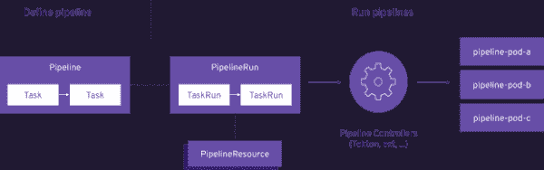

# Tekton 和管道入门

> 原文：<https://developers.redhat.com/blog/2021/01/13/getting-started-with-tekton-and-pipelines>

Tekton 是一个功能强大的、 [Kubernetes-native](https://developers.redhat.com/blog/2020/04/08/why-kubernetes-native-instead-of-cloud-native/) 框架，用于创建持续集成和交付(CI/CD)系统。在本文中，我们将使用真实的例子向您展示如何安装 Tekton、创建任务，并最终创建我们自己的管道。

## 什么是管道？

很棒的问题！在软件开发中，管道是通过构建、测试和部署代码的过程来驱动软件的自动化过程。这种高效的流程有助于最大限度地减少人为错误，并保持部署的一致性。由于 [Tekton](https://developers.redhat.com/topics/ci-cd) 是云原生的，它的管道是容器化的，不依赖于其他项目，减少了潜在的问题并节省了您的时间。

[](/sites/default/files/blog/2020/12/pipeline-concepts.png)The structure of a pipeline.

The structure of a pipeline.

## 关于泰克顿

[Tekton](https://github.com/tektoncd/pipeline) 是一个基于 [Knative](https://developers.redhat.com/topics/serverless-architecture) 的 CI/CD 管道框架，但它的独特之处在于它的解耦性质——这意味着一个管道可以用于跨多个混合云提供商部署到任何 Kubernetes 集群。此外，Tekton 将与管道相关的所有内容作为[定制资源](https://kubernetes.io/docs/concepts/extend-kubernetes/api-extension/custom-resources/) (CRs)存储在集群中，允许跨多个管道使用。

## 安装 Tekton

对于本指南，我们将假设您正在为您的 Kubernetes 集群使用 [Minikube](https://kubernetes.io/docs/tasks/tools/install-minikube/) ，尽管如果您没有 Minikube 的访问权限，我们已经创建了一个 [Katacoda Tekton 场景](https://developers.redhat.com/courses/middleware/openshift-pipelines)。一旦您的集群运行，通过应用来自[最新版本](https://github.com/tektoncd/pipeline/releases)的 YAML 来安装最新版本的 Tekton:

```
kubectl apply -f https://storage.googleapis.com/tekton-releases/pipeline/previous/v0.16.3/release.yaml
```

这个命令将创建一个`tekton-pipelines`名称空间，以及其他资源来完成 Tekton 的安装。记住这个名称空间，我们可以使用下面的命令轻松地跟踪安装进度:

`kubectl get pods --namespace tekton-pipelines --watch`

最后，要通过控制台与 Tekton 交互，我们需要安装 Tekton CLI，也称为`tkn`。根据您的操作系统，请使用来自[官方库](https://github.com/tektoncd/cli)的说明来安装最新的二进制可执行文件。

## 可选:安装教程 repo

[Red Hat open shift](https://developers.redhat.com/openshift)developer advocate 团队已经创建了一个[资源库](https://github.com/joellord/handson-tekton)来帮助你开始并掌握 Tekton 概念。如果您有兴趣了解更多概念并亲自动手，请随意将我们的回购复制到您的本地目录:

`git clone https://github.com/joellord/handson-tekton`

一旦您克隆了教程存储库，请确保使用以下内容将`cd`放入文件夹:

`cd handson-tekton`

## 创建我们的第一个任务

对于我们的任务介绍，让我们从一个简单的“Hello World”任务开始。任务资源是创建管道的基本构件，第一个任务将允许我们使用一个[红帽通用基础映像](https://developers.redhat.com/blog/category/ubi/)并回显一个“Hello World”。首先，让我们打开`/demo`文件夹中的文件`01-hello.yaml`:

```
apiVersion: tekton.dev/v1beta1
kind: Task
metadata:
  name: hello
spec:
  steps:
    - name: say-hello
      image: registry.access.redhat.com/ubi8/ubi
      command:
        - /bin/bash
      args: ['-c', 'echo Hello World']
```

您会注意到上面的几个细节，从作为任务的`kind`，到“say-hello”的`step`,`args`只是简单地向控制台输出一个`echo`命令。让我们将这个任务应用到我们的集群，类似于任何其他 Kubernetes 对象:

`kubectl apply -f ./demo/01-hello.yaml`

`tkn task start --showlog hello`

干得好！运行这个`tkn`命令后，您将很快在控制台中看到任务的输出，如下所示:

```
TaskRun started: hello-run-6cgf5
Waiting for logs to be available...
[say-hello] Hello World
```

## 向任务添加参数

任务的一个重要特性是接受和传递参数的能力。如果你正在寻找建立各种管道，参数，或`params`，是有用的。这些属性由一个`name`和`type`构成，但是也可以接受一个`description`和`default`值。为了更好地了解参数是如何工作的，让我们打开`/demo`文件夹中的文件`02-param.yaml`:

```
apiVersion: tekton.dev/v1beta1
kind: Task
metadata:
  name: hello
spec:
  params:
    - name: person
      description: Name of person to greet
      default: World
      type: string
  steps:
    - name: say-hello
      image: registry.access.redhat.com/ubi8/ubi
      command:
        - /bin/bash
      args: ['-c', 'echo Hello $(params.person)']
```

基于我们的“Hello World”示例，我们添加了一个带有通用值的`person`参数。此外，要访问新的 param，我们可以使用`$(params.person)`调用它。为了运行这个新任务，我们可以将它添加到我们的集群中，并使用以下命令运行该任务:

`kubectl apply -f ./demo/02-param.yaml`

`tkn task start --showlog hello`

看起来不错！现在，看起来好像控制台要求我们在命令行中指定参数，如下所示:

```
? Value for param `person` of type `string`? (Default is `World`) Cedric
TaskRun started: hello-run-z4gsw
Waiting for logs to be available...
[say-hello] Hello Cedric
```

## 创建管道

现在您已经了解了任务和参数，让我们开始创建管道。为了一致性，任务意味着单个操作，而管道是一系列可以并行或顺序运行的任务。对于这个例子，我们将使用管道的`/demo`文件夹中的`04-tasks.yaml`文件:

```
apiVersion: tekton.dev/v1beta1
kind: Task
metadata:
  name: say-something
spec:
  params:
    - name: say-what
      description: What should I say
      default: hello
      type: string
    - name: pause-duration
      description: How long to wait before saying something
      default: 0
      type: string
  steps:
    - name: say-it
      image: registry.access.redhat.com/ubi8/ubi
      command:
        - /bin/bash
      args: ['-c', 'sleep $(params.pause-duration) && echo $(params.say-what)']
```

有了这个通用的任务文件，我们就可以构建我们的第一个管道。使用`/demo`文件夹中的`05-pipeline.yaml`文件，我们可以操作`04-tasks.yaml`任务两次，输出不同的结果:

```
apiVersion: tekton.dev/v1beta1
kind: Pipeline
metadata:
  name: say-things
spec:
  tasks:
    - name: first-task
      params:
        - name: pause-duration
          value: "2"
        - name: say-what
          value: "Hello, this is the first task"
      taskRef:
        name: say-something
    - name: second-task
      params:
        - name: say-what
          value: "And this is the second task"
      taskRef:
        name: say-something
```

我们现在准备将通用任务和新管道应用到我们的集群，并正式启动管道。使用`tkn pipeline start`，我们自动创建一个随机命名的`PipelineRun`资源:

`kubectl apply -f ./demo/04-tasks.yaml`

`kubectl apply -f ./demo/05-pipeline.yaml`

`tkn pipeline start say-things --showlog`

恭喜你。您会注意到控制台必须输出来自`PipelineRun.`的日志，但是顺序似乎有些混乱。

```
PipelineRun started: say-things-run-ncfsq
Waiting for logs to be available...
[second-task : say-it] And this is the second task
[first-task : say-it] Hello, this is the first task
```

您会注意到第一个任务似乎发生在第二个任务之后，这是因为 Tekton 自然地同时运行所有的任务。

## 并行或顺序运行

对于按特定顺序运行的任务，在管道的任务定义中需要使用`runAfter`参数。让我们打开`/demo`文件夹中的`06-pipeline-order.yaml`文件:

```
apiVersion: tekton.dev/v1beta1
kind: Pipeline
metadata:
  name: say-things-in-order
spec:
  tasks:
    - name: first-task
      params:
        - name: pause-duration
          value: "2"
        - name: say-what
          value: "Hello, this is the first task"
      taskRef:
        name: say-something
    - name: second-task
      params:
        - name: say-what
          value: "Happening after task 1, in parallel with task 3"
        - name: pause-duration
          value: "2"
      taskRef:
        name: say-something
      runAfter:
        - first-task
    - name: third-task
      params:
        - name: say-what
          value: "Happening after task 1, in parallel with task 2"
        - name: pause-duration
          value: "1"
      taskRef:
        name: say-something
      runAfter:
        - first-task
    - name: fourth-task
      params:
        - name: say-what
          value: "Happening after task 2 and 3"
      taskRef:
        name: say-something
      runAfter:
        - second-task
        - third-task
```

`runAfter`参数被应用于特定编号的任务，在将这个管道应用于我们的集群之后，我们将能够看到每个任务的日志，但是是有序的:

`kubectl apply -f ./demo/06-pipeline-order.yaml`

`tkn pipeline start say-things-in-order --showlog`

运行`tkn`之后，您的 CLI 输出应该类似于以下示例:

```
PipelineRun started: say-things-in-order-run-5dklz
Waiting for logs to be available...
[first-task : say-it] Hello, this is the first task
[second-task : say-it] Happening after task 1, in parallel with task 3
[third-task : say-it] Happening after task 1, in parallel with task 2
[fourth-task : say-it] Happening after task 2 and 3
```

## 结论

您可以在这里随意继续演示，也可以在这里尝试我们的[引导的 Katacoda 场景，它在您的浏览器中提供了一个互动环境。](https://developers.redhat.com/courses/middleware/openshift-pipelines)

更多你在这里看到的例子的互动演示，请查看我们的视频！

No video provider was found to handle the given URL. See [the documentation](https://www.drupal.org/node/2842927) for more information.

## 资源

如果您想继续了解 Tekton，请从这些关于 Red Hat Developer 的文章开始:

*   [Tekton 云原生 CI/CD 简介](https://developers.redhat.com/blog/2020/08/14/introduction-to-cloud-native-ci-cd-with-tekton-kubecon-europe-2020/)(简·克莱纳特&乔尔·洛德)
*   Visual Studio 代码的新 Tekton 管道扩展(丹尼斯·戈洛文&林赛·图洛赫)
*   [使用 OpenShift 4.4 的新管道构建器和 Tekton 管道创建管道](https://developers.redhat.com/blog/2020/04/30/creating-pipelines-with-openshift-4-4s-new-pipeline-builder-and-tekton-pipelines/) (Joel Lord)

*Last updated: May 18, 2021*