# 如何用 Red Hat Business Optimizer 实现员工排班

> 原文：<https://developers.redhat.com/articles/2021/06/09/how-implement-employee-rostering-red-hat-business-optimizer>

本文讨论并演示了如何使用 [Red Hat Business Optimizer](https://access.redhat.com/documentation/en-us/red_hat_decision_manager/7.0/html/installing_and_configuring_red_hat_business_optimizer/optimizer-about-optimizer-con) 实现[排班](https://access.redhat.com/documentation/en-us/red_hat_decision_manager/7.1/html/running_and_modifying_the_employee_roster_starter_application_for_red_hat_business_optimizer_using_an_ide/optashift-er-overview-con)。业务优化器是[红帽决策管理器](/products/red-hat-decision-manager/overview)中的一个组件，它是一个 [AI](/topics/ai-ml) (人工智能)约束求解器，可以优化决策管理器的计划和调度问题。

值班排班用例要求我们根据员工各自的职责为他们分配班次——例如，打扫、烘干、送货等等。必须满足以下硬约束条件:

*   员工每天只分配一个班次。
*   任何需要特定员工职责的班次都被分配给能够执行该特定职责的员工。
*   一旦一个员工安排了一个班次，该班次将被重新分配给另一个员工。
*   没有员工被分配到其前一班次结束后不到 10 小时开始的班次。

此外，还有一个软约束，即所有员工都应该被分配到相同的班次。

## 规划员工花名册域模型

在开始值班排班实现之前，让我们首先计划一下绘制领域模型所需的资源，如图 1 所示。

这里需要的资源类有`Employee`、`Duty`、`Timeslot`、`Shift`和`DayOfRequest`。这些类是*问题事实*，在计划期间不会改变。

规划结果类为`ShiftAssignment`。它保存了一个雇员的信息和他们被分配的班次，表示一对一的关系。这种关系被称为在求解过程中变化的*规划实体*。例如，该班次可以分配给另一个员工。`Employee`是在计划过程中变化的*计划变量*。

保存计划所需一切的类称为`DutyRoster`类。这是包含求解器要求解的数据集的*规划解决方案*。`DutyRoster`类包含构成*计划范围*的雇员列表。这是计划变量的一组可能的计划值。

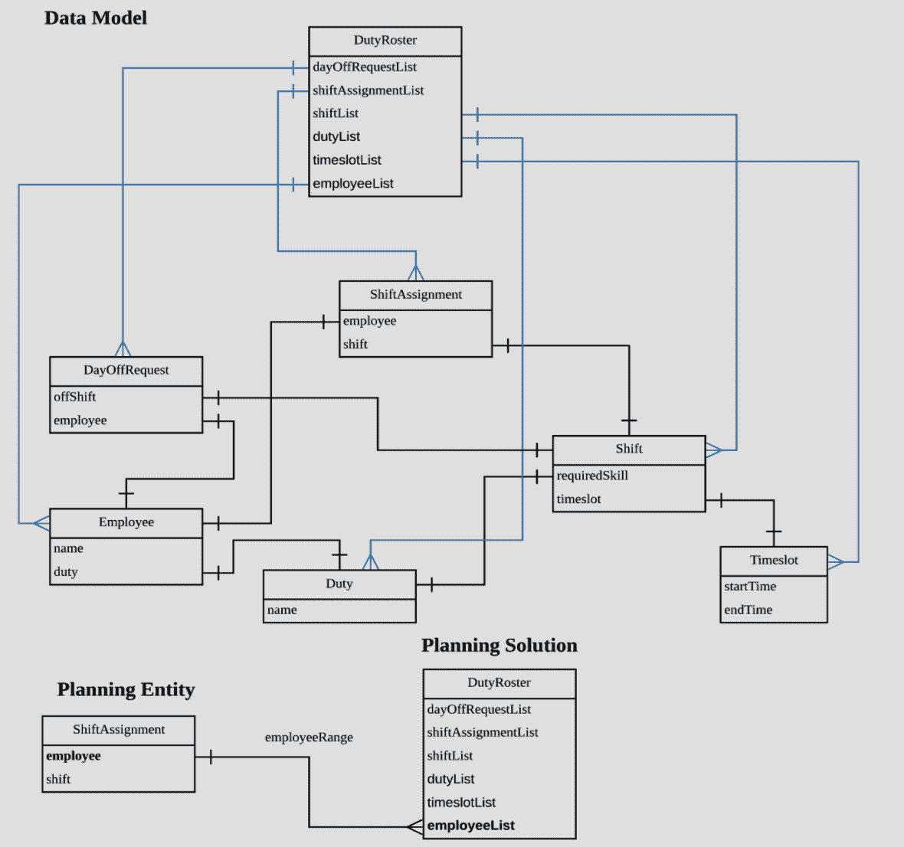

Figure 1: The example `DutyRoster` domain model.

为了分享我的思考过程，下面是我创建这个数据模型的步骤:

1.  列出所有需要的资源。
2.  确定资源之间的关系。通过消除冗余和不一致的依赖来规范化它。
3.  创建类来保存有关排班的信息(如班次、时间段或员工)以及该类中的哪些信息将在求解过程中发生变化。对于这个用例，它是雇员，因为它将根据定义的规则而变化。
4.  创建保存所有信息的类(例如`DutyRoster`)。
5.  检查数据模型结构，看它是否与规则所需的属性相匹配(在本例中，是软约束和硬约束)。重复这个过程，直到一切就绪。

## Red Hat 决策管理器的用例实现

我们将使用 Red Hat Decision Manager 7.7 开发我们的用例。安装后，登录决策中心并执行以下步骤:

1.  创建新项目。
2.  为`Employee`、`Duty`、`Timeslot`、`Shift`、`DayOfRequest`创建数据对象作为问题事实，如图 2 所示。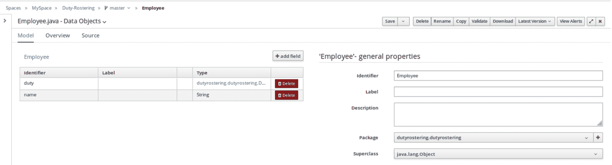

    图 2:使用 Decision Central 创建一个新的项目和数据对象作为问题事实。

    
3.  为`ShiftAssignment`创建数据对象作为规划实体，如图 3 所示。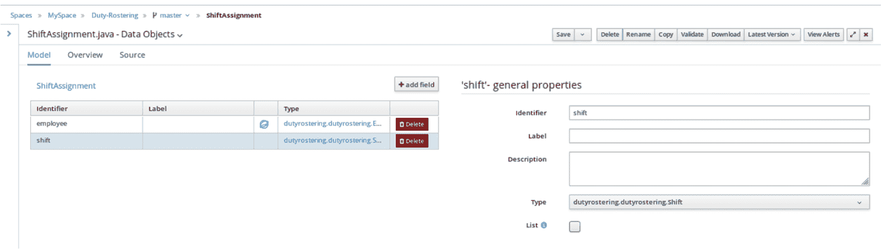

    图 3:创建数据对象为`ShiftAssignment`为规划实体。

4.  为`DutyRoster`创建数据对象作为规划解决方案，如图 4 所示。点击`employeeList`属性对应的“蓝色星球”图标，选择**计划值范围提供者**复选框，将**标识**指定为`employeeRange`。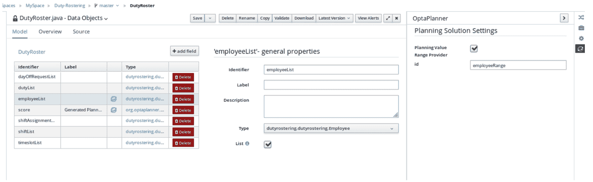

    图 4:创建数据对象`DutyRoster`作为规划方案。

    
5.  重新打开`shiftAssignment`。点击`employee`属性对应的蓝色星球图标，选中**规划变量**复选框，将`employeeRange`指定为**值域 Id** 。参见图 5。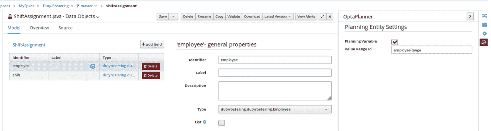

    图 5:选择规划值(规划变量)和值范围 ID。

    
6.  定义第三个约束:如果员工请求休假，他们将不会被分配到该班次。将负值分配给硬分数意味着它不能被打破。参见图 6。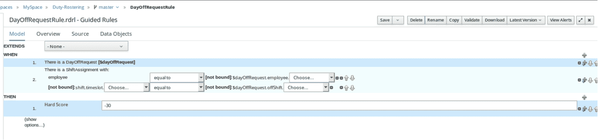

    图 6:创建并分配`DayOffRequests`作为硬约束。

7.  定义第五个约束(图 7):所有员工都被分配相同的班次。理想情况下，这种软约束不应该被打破。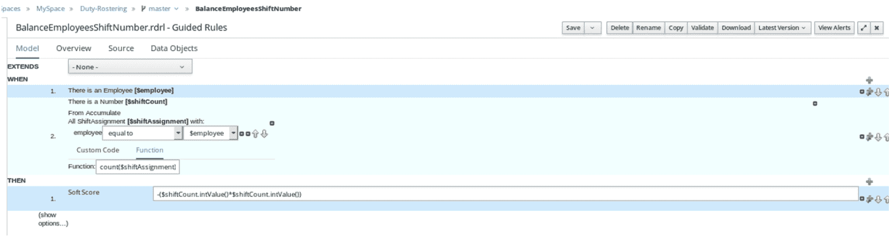

    图 7:创建并平衡员工班次作为软约束。

8.  在图 8 所示的 Score Director Factory 页面上添加求解器配置。此配置使用默认算法、构造启发式算法和延迟接受。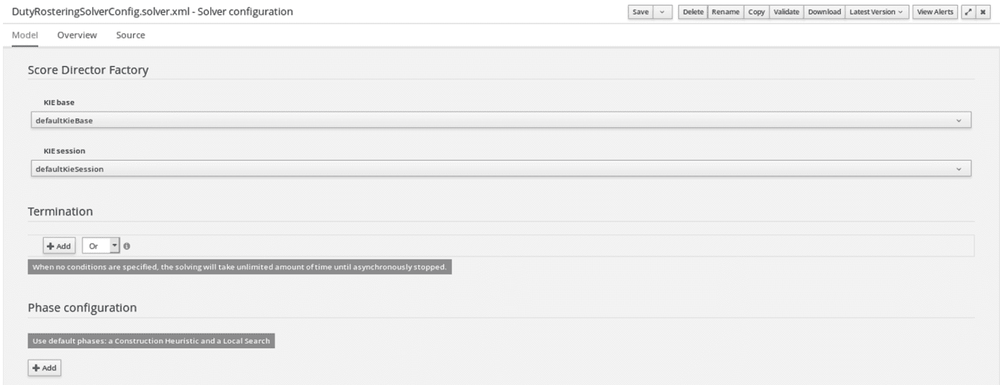

    图 8:在评分主任工厂页面添加值班排班求解器配置。

9.  点击**构建**。确保构建成功。
10.  构建成功后，点击**部署**。确保部署成功。
11.  获取 Kie 服务器上规则的 URL。
12.  导航到执行服务器。获取 URL 作为`<Copied URL>`(参见图 9)。

    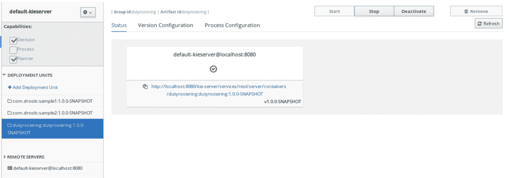

    Figure 9: Get the URL from the Kie Server.

13.  开[邮递员](https://www.postman.com/)。打开一个标签页，URL 为 *<复制的 URL > /solvers/ <求解器名称>* ，使用 PUT 方法指定并发布主体，如图 10 所示。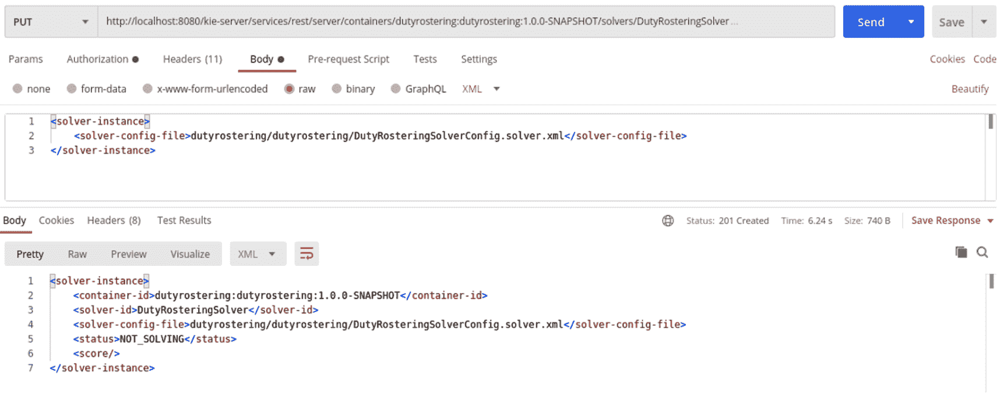

    图 10:打开 URL，使用 PUT 方法指定并发布主体。

14.  打开 URL 为`<Copied URL>/solvers/<Solver name>/state/solving`的另一个选项卡，并使用 POST 方法。这以 XML 格式发布了`DutyRoster`类——也就是计划解决方案的内容(参见图 11)。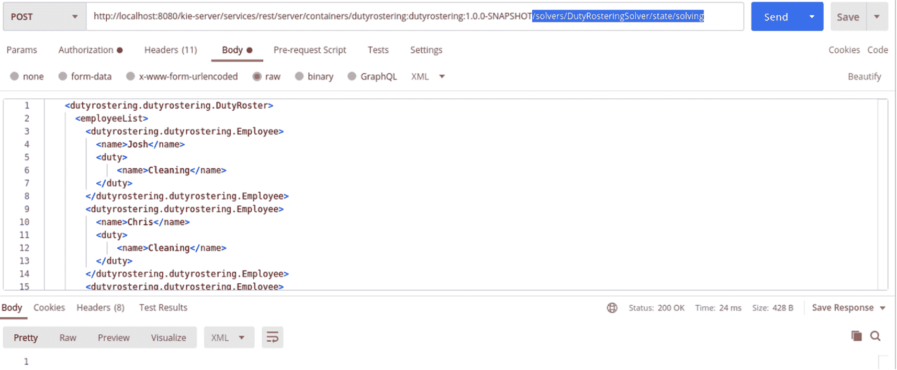

    图 11:打开网址，使用 POST 方法发布策划方案内容。

15.  打开 URL 为`<Copied URL>/solvers/<solver name>/bestsolution`的另一个选项卡，并使用 GET 方法，如图 12 所示。这将从计划引擎返回结果。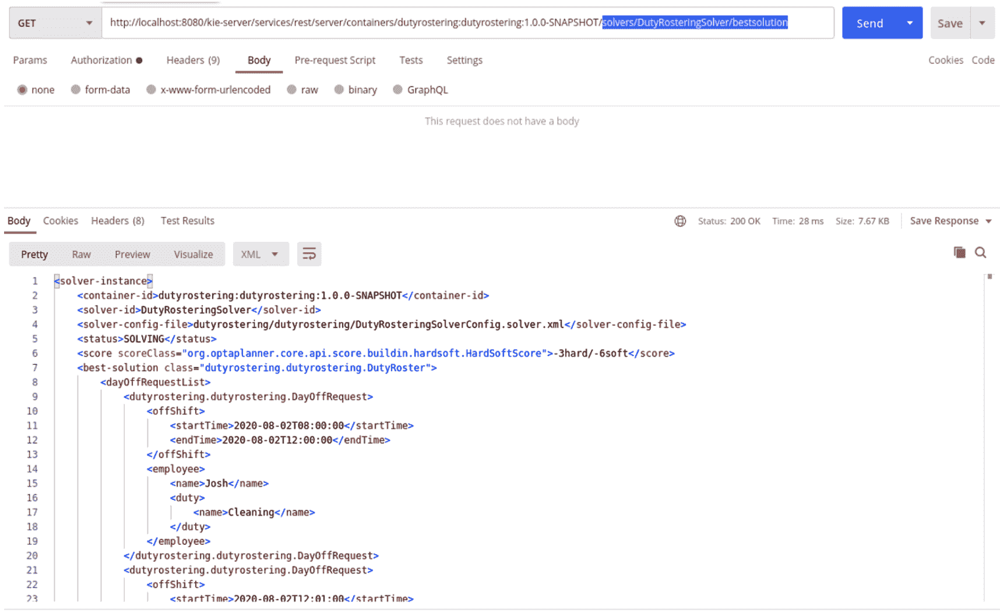

    图 12:打开 URL，使用 GET 方法从计划引擎返回结果。

## 结论

已完成的项目和样本输入文件见 GitHub 上的[值班表项目。](https://github.com/likhia/DutyRosterProject)

*Last updated: August 15, 2022*