# 使用 Red Hat 的应用程序迁移工具包分析多个工作区中的单一 Java 应用程序

> 原文：<https://developers.redhat.com/blog/2020/12/11/analyze-monolithic-java-applications-in-multiple-workspaces-with-red-hats-migration-toolkit-for-applications>

将单片 [Java](https://developers.redhat.com/topics/enterprise-java) 应用转化为分布式云原生[微服务](https://developers.redhat.com/topics/microservices)绝非易事，但 Red Hat 的[应用迁移工具包](https://developers.redhat.com/products/mta/overview)可以帮助您理解和评估迁移路径。作为一名开发人员，您可以将以下特性应用于广泛的[转换用例](https://developers.redhat.com/products/mta/use-cases):

*   计划和工作评估
*   识别迁移问题并提供解决方案
*   详细报告
*   内置规则和迁移路径
*   规则可扩展性和定制
*   源代码或应用程序存档分析

本文将指导您配置 Red Hat 的 migration toolkit for applications，以分析现有的单一 Java 应用程序。我们将在[Red Hat code ready work spaces](https://developers.redhat.com/products/codeready-workspaces/overview)中设置我们的开发环境。之后，我将向您展示如何使用该工具包来分析迁移问题并生成潜在的解决方案。

**注意**:Migration toolkit for applications 是一个可扩展和可定制的基于规则的工具，有助于简化 Java 应用迁移。该工具包有一套全面的云和容器就绪性规则，用于评估用于 [Kubernetes](https://developers.redhat.com/topics/kubernetes) 部署的应用程序。它可以通过[红帽运行时间](https://www.redhat.com/en/products/runtimes)获得。

## 安装 CodeReady 工作区操作员

首先，我们将创建一个新项目并安装一个 CodeReady Workspaces 操作符。用集群管理员凭证登录到一个 [OpenShift 4 集群](https://developers.redhat.com/products/openshift/overview)，然后使用控制台左侧的菜单导航到**主页>项目**。点击屏幕右上角的**创建项目**，然后创建一个项目。如图 1 所示，我将示例项目命名为`che-test`。

[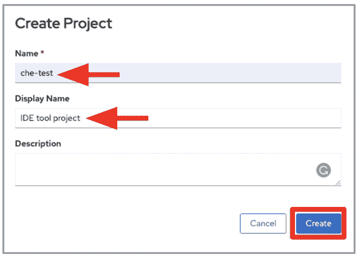](/sites/default/files/blog/2020/11/1.create_project.png)

Figure 1: Create a new project in your OpenShift 4 cluster.

导航到 **Operators > OperatorHub** 并在搜索框中键入“`codeready`”。选择 Red Hat CodeReady Workspaces 操作符，如图 2 所示。

[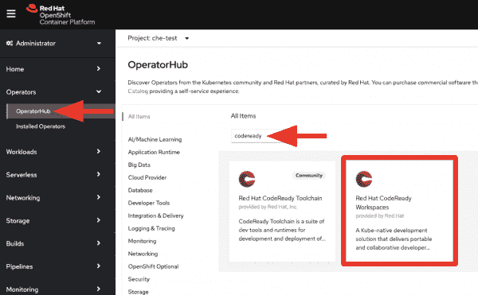](/sites/default/files/blog/2020/11/2.operator.png)

Figure 2: Install a CodeReady Workspaces Operator from the OpenShift OperatorHub.

选择`che-test`名称空间，然后点击**安装**，如图 3 所示。

[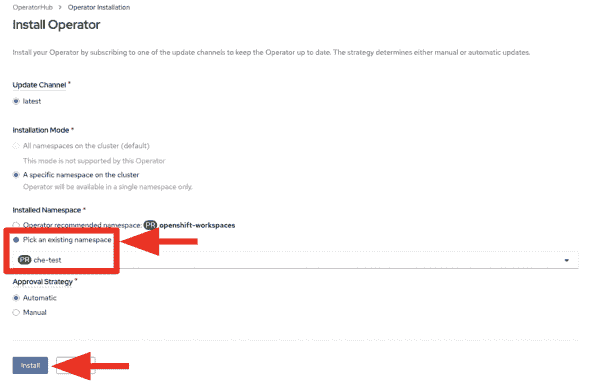](/sites/default/files/blog/2020/11/3.operator.png)

## 创建新的 CheCluster

选择`che-test`命名空间后，您将看到创建一个新的 CheCluster 的选项，如图 4 所示。

[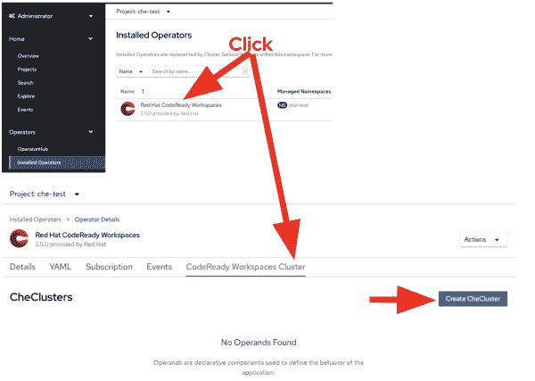](/sites/default/files/blog/2020/11/4.checluster.png)

Figure 4: Create a new CheCluster.

选择用于创建 CheCluster 的 YAML 视图，如图 5 所示，然后在服务器配置中添加以下自定义 Che 属性:

```
customCheProperties:
CHE_LIMITS_WORKSPACE_IDLE_TIMEOUT: "0"
CHE_INFRA_KUBERNETES_NAMESPACE_DEFAULT: <username>-che

```

这些属性允许 CodeReady 工作区服务器为任意数量的用户工作区创建命名空间。图 5 显示了使用`customCheProperties`创建 CheCluster 的服务器配置。

[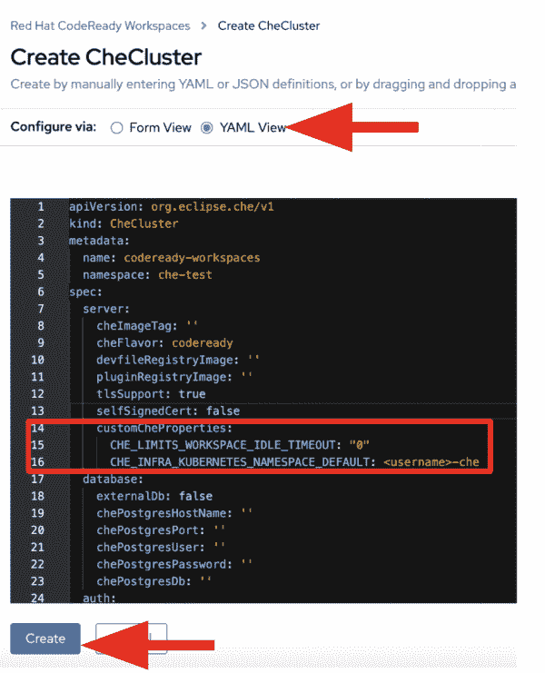](/sites/default/files/blog/2020/11/5.checluster.png)

Figure 5: Add the custom Che properties to your server configuration.

CodeReady 工作区将为每个用户工作区创建部署 CodeReady 工作区 pod 所需数量的命名空间。

## 安装工具包的 IDE 插件

接下来，我们将配置一个 devfile 来安装 migration toolkit for applications IDE 插件。将以下开发组件添加到您的 CodeReady 工作区`devfile.json`:

```
{

"alias": "mta-ide-plugin",
"type": "chePlugin",
"reference": "https://raw.githubusercontent.com/redhat-cop/agnosticd/development/ansible/roles/ocp4-workload-ccnrd/files/cheplugin-meta.yaml",
"memoryLimit": "1500M"

}

```

注意，我们正在配置一个有多个用户的开发环境。您还可以使用 devfile 来定义源代码、应用程序运行时和一系列预定义的命令。参见 [quarkus-quickstarts 库](https://github.com/maxandersen/quarkus-quickstarts/blob/che/devfile.yaml)中的示例。

### 使用钥匙锁进行访问

假设您已经用用户名`(developer1...developer10)`创建了 10 个开发人员凭证。每个凭证的密码与 Keycloak 中的用户名相同。您可以使用 Keycloak API 和访问令牌来创建开发人员帐户:

```
KEYCLOAK_TOKEN=$(curl -s -d "username=<YOUR_KEYCLOAK_ADMIN_USERNAME>&password=<YOUR_KEYCLOAK_ADMIN_PASSWORD>&grant_type=password&client_id=admin-cli" \
-X POST https://keycloak-che-test.<YOUR_ROUTE_SUBDOMAIN>/auth/realms/codeready/protocol/openid-connect/token | \
jq  -r '.access_token')

curl -v -H "Authorization: Bearer ${KEYCLOAK_TOKEN}" -H "Content-Type:application/json" \
-d '{"username":"developer1","enabled":true,"emailVerified": true,"firstName": "developer1","lastName": "Developer","email": "developer1@no-reply.com", "credentials":[{"type":"password","value":"developer1","temporary":false}]}' \
-X POST "https://keycloak-che-test.<YOUR_ROUTE_SUBDOMAIN>/auth/admin/realms/codeready/users"

```

### 预热开发人员工作区

最后，让我们配置 devfile 来预热每个开发人员的工作区。预热让我们避免了开始工作时的等待:

```
for i in $(eval echo "{1..10}") ; do

DEVELOPER_TOKEN=$(curl -s -d "username=developer${i}&password=developer${i}&grant_type=password&client_id=admin-cli" \
-X POST https://keycloak-che-test.<YOUR_ROUTE_SUBDOMAIN>/auth/realms/codeready/protocol/openid-connect/token | \
jq  -r '.access_token')

curl -X POST --header 'Content-Type: application/json' --header 'Accept: application/json' \
--header "Authorization: Bearer ${DEVELOPER_TOKEN}" -d @devfile.json \
"http://codeready-che-test.<YOUR_ROUTE_SUBDOMAIN>/api/workspace/devfile?start-after-create=true&namespace=developer1"

done

```

## 在 CodeReady 工作区中打开工作区

返回 OpenShift 开发人员控制台，导航到`userXX-che`项目，其中“`XX`是用户号。例如，如图 6 所示，您可能会看到一个工作区 pod 在`user1-che`项目中运行。

[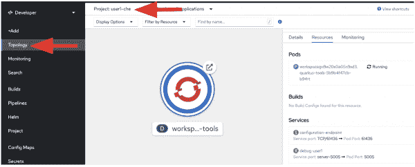](/sites/default/files/blog/2020/11/6.use1-che.png)

Figure 6: A user workspace in the developer console's topology view.

在开发人员控制台中导航到`che-test`项目，然后单击一个 URL 打开 CodeReady 工作区中的一个窗格，如图 7 所示。

[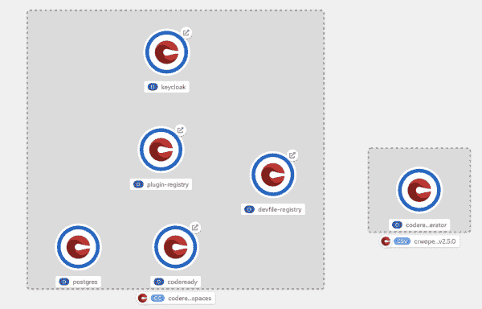](/sites/default/files/blog/2020/12/pasted-image-0.png)

Figure 7: Open a pod in CodeReady Workspaces.

登录后，您将被移至您的个人控制面板。单击左侧预先创建的工作区的名称，如图 8 所示。

[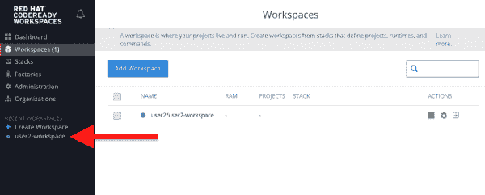](/sites/default/files/blog/2020/11/crw-landing-1.png)

Figure 8: Click the name of the pre-created user workspace.

几秒钟后，您将被转移到工作区登录页面，如图 9 所示。

[](/sites/default/files/blog/2020/11/che-workspace.png)

Figure 9: The workspace landing page in CodeReady Workspaces.

## 为应用程序配置迁移工具包

单击图 10 中标记为“MTA 浏览器”的图标，然后单击加号(+)图标，为应用程序配置添加一个新的迁移工具包。

[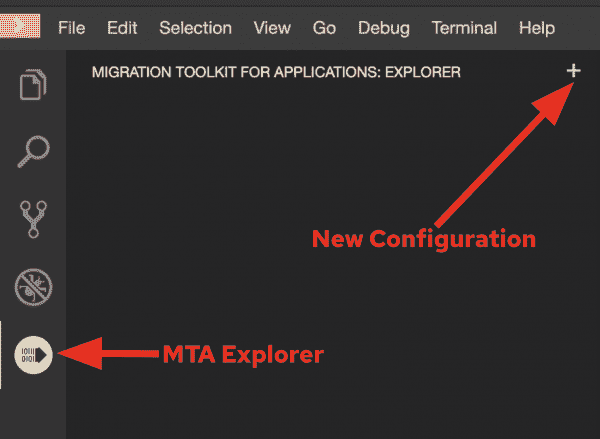](/sites/default/files/blog/2020/11/mta_newconf.png)

Figure 10: Add a new migration toolkit for applications configuration.

添加所需的配置元素(如`--input`、`--source`、`--target server`后，点击**运行**运行分析。工具包的命令行界面(CLI)将在新的终端中自动执行。几分钟后，您将看到分析已经完成。点击**打开报告**，如图 11 所示。

[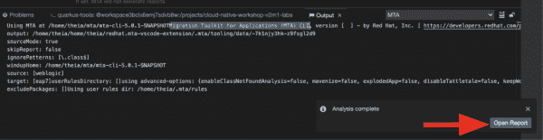](/sites/default/files/blog/2020/11/mta-analysis-complete.png)

Figure 11: Open the migration analysis report.

接下来，您将看到检查迁移报告的选项，如图 12 所示。

[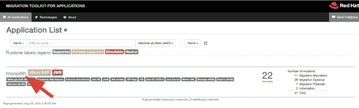](/sites/default/files/blog/2020/11/rhamt_result_landing_page.png)

Figure 12: View the report details.

你可能会注意到在这个报告中有 22 个故事点。一个*故事点*是敏捷软件开发中常用的一个抽象指标，用来估计实现一个特性或一个变更所需的工作量。Red Hat 的应用程序迁移工具包使用故事点来表达迁移特定应用程序结构和整个应用程序所涉及的工作。工作量的大小取决于您要迁移的一个或多个应用程序的大小和复杂性。

## 你转型之路的下一步是什么

使用 migration toolkit for applications 分析您的转换路径仅仅是现代化单一 Java 应用程序的开始。下一步，您可以使用云原生运行时将应用程序分解为微服务，如 [Quarkus](https://developers.redhat.com/products/quarkus/getting-started) 、 [Spring Boot](https://developers.redhat.com/topics/spring-boot) 和 [Node.js](https://developers.redhat.com/topics/nodejs) 。有了来自 [Red Hat Runtimes](https://www.redhat.com/en/products/runtimes) 的支持，你可以逐渐地将你的整个单片应用重构为一组分布式云原生微服务。

*Last updated: May 17, 2021*