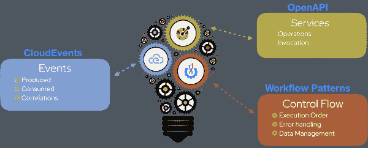
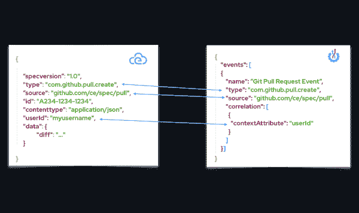
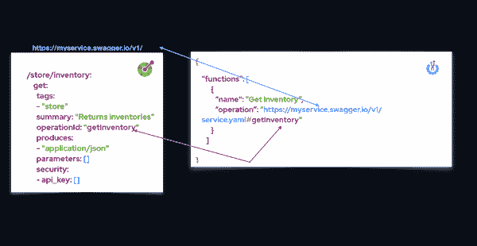
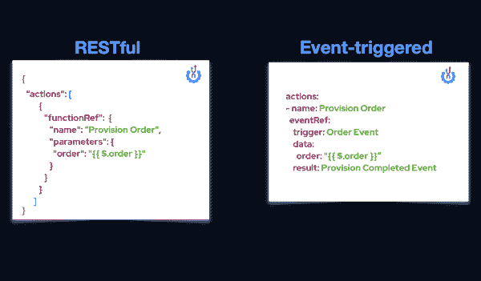
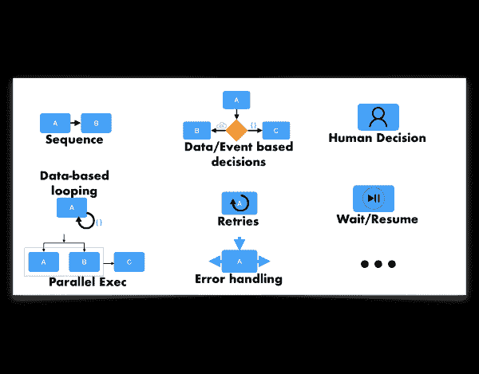

# 利用无服务器工作流和 Kubernetes 协调事件驱动的分布式服务

> 原文：<https://developers.redhat.com/blog/2020/11/26/event-driven-distributed-service-orchestration-with-serverless-workflow>

随着[无服务器架构](https://developers.redhat.com/topics/serverless-architecture)的兴起，无服务器工作流获得了新的兴趣和用途。曾经被视为集中和单一的，现在它们在基于云的事件和服务编排中扮演着关键角色。直到最近，还没有厂商中立的方法来描述服务编排，所以开发人员依赖于厂商和厂商实现。我们意识到我们需要一种通用的、基于标准的语言来描述无服务器工作流。

在本文中，我们介绍了[无服务器工作流](https://serverlessworkflow.io/)规范，现在在其 [0.5 版本发布](https://github.com/serverlessworkflow/specification/releases)。我们这个项目的目标是让任何人都能够开发无服务器工作流库、工具和基础设施，用于跨不同云平台的工作流建模。

## 关于无服务器工作流规范

无服务器工作流规范为工作流定义了一种通用的、声明性的、特定于领域的语言。开发人员可以用它来描述无状态和有状态的编排。说明书是由 CNCF [无服务器工作组](https://github.com/cncf/wg-serverless)主持的[云原生计算基金会](https://www.cncf.io/) (CNCF) [沙盒项目](https://www.cncf.io/sandbox-projects/)。

无服务器工作流项目的主要焦点是托管一种基于标准而非专有定义的供应商中立的、可移植的、社区驱动的工作流语言。我们的目标是[事件驱动的](https://developers.redhat.com/topics/event-driven)分布式服务的编排。您可以使用 YAML 和 JSON 格式来描述使用无服务器工作流规范的工作流。

## 无服务器工作流语言的结构

图 1 显示了无服务器工作流语言的结构。该结构包括三个主要部分。每个部分都建立在现有标准的基础上。

Figure 1: Serverless Workflow's language structure consists of three main parts.

在接下来的部分中，我们将描述无服务器工作流语言结构的三个主要部分。

### 第 1 部分:定义事件

无服务器工作流利用 [CloudEvents](https://cloudevents.io/) 规范来定义可以在工作流执行期间消费或产生的事件。该规范在如何在 CloudEvents 格式中定义事件和如何在工作流语言定义中定义它们之间定义了清晰的一对一映射。您可以使用 CloudEvents 上下文属性来定义一个或多个事件关联规则。无服务器工作流中的事件定义是可重用的，这意味着您可以在多个工作流之间重用它们。图 2 显示了 CloudEvent 格式的事件定义与无服务器工作流格式的相同事件定义的比较。

Figure 2: Compare the event definitions in the Serverless Workflow and CloudEvents formats.

### 第 2 部分:定义服务或功能

无服务器工作流使用 [OpenAPI](https://swagger.io/specification/) 规范来定义将在编排期间调用的服务和相关操作。要定义服务操作，您只需指定 OpenAPI 服务定义的路径，并为您想要调用的服务操作选择唯一的操作 ID。图 3 显示了与 OpenAPI 定义相关的无服务器工作流服务定义。

Figure 3: Serverless Workflow service definitions in relation to their OpenAPI definition.

如图 4 所示，无服务器工作流允许您描述 RESTful 和事件触发的服务或功能的调用。

Figure 4: Describing the invocation of RESTful and event-triggered services.

Figure 4: Describing the invocation of RESTful and event-triggered services.

### 第 3 部分:定义控制流逻辑

无服务器工作流定义了基于模式的控制流逻辑结构，用于定义工作流执行期间将发生的事情。您可以定义工作流状态或步骤及其相关的转换、错误处理、重试、数据管理等。图 5 显示了无服务器工作流中的控制流逻辑结构。您可以使用这些来定义简单的序列和更复杂的结构，例如并行执行、循环、重试和用户交互，或者用于控制整个编排的决策步骤。

Figure 5: Control-flow logic constructs in Serverless Workflow.

Figure 5: Control-flow logic constructs in Serverless Workflow.

## 无服务器工作流的附加组件

除了在 [JSON 模式定义](https://github.com/serverlessworkflow/specification/tree/master/schema)中描述的[工作流语言定义](https://github.com/serverlessworkflow/specification/blob/master/specification.md)之外，无服务器工作流还提供了一组语言扩展。这些扩展增强了工作流定义，从而提高了编排的整体性能、成本和效率。无服务器工作流还为 [Java](https://github.com/serverlessworkflow/sdk-java) 和 [Go](https://github.com/serverlessworkflow/sdk-go) 提供软件开发工具包(SDK)，未来还会有更多计划。此外，它还包括一个 [Visual Studio 代码扩展](https://developers.redhat.com/blog/category/vs-code/)和一个[在线编辑器](https://serverlessworkflow.io/editor.html)，为 JSON 和 YAML 工作流格式提供代码完成和图表生成等有用功能。图 6 显示了无服务器工作流项目的组件。

Figure 6: Components of the Serverless Workflow project.

Figure 6: Components of the Serverless Workflow project.

## 无服务器工作流的使用案例

您可以将无服务器工作流规范语言用于各种用例，包括支付处理、数据分析、持续集成部署等。规范的[用例文档](https://github.com/serverlessworkflow/specification/tree/master/usecases)详细描述了几个用例。图 7 显示了一个样例用例的流程图。

Figure 7: A sample Serverless Workflow use case.

## 视频演示:Kubernetes 用例

无服务器工作流非常适合容器环境。您可以直接将其事件和服务定义转换成特定于 Kubernetes 的结构，比如代理、接收器等等。参见我们的 [KubeCon + CloudNativeCon 北美 2020 演讲](https://kccncna20.sched.com/event/ekEn/serverless-workflow-new-approach-to-container-orchestration-tihomir-surdilovic-ricardo-zanini-fernandes-red-hat)，了解如何部署无服务器工作流来管理和编排在 Kubernetes 集群上运行的服务。

## 参与无服务器工作流

无服务器工作流项目的成功取决于社区的参与。我们邀请任何人加入我们的[每周社区会议](https://github.com/serverlessworkflow/specification#meetings)。社区会议是提出项目问题的好地方。你也可以使用无服务器工作流 GitHub 库来[提出问题](https://github.com/serverlessworkflow/specification/issues)或者通过[无服务器工作流社区 Slack 频道](https://github.com/serverlessworkflow/specification#communication)联系我们。

## 结论

无服务器工作流是一种基于现有标准的可移植的、社区驱动的工作流语言。作为 [CNCF 云原生环境](https://landscape.cncf.io/)的一部分，确保其持续增长、发展和可用性。无服务器工作流是无服务器领域领先的供应商中立的工作流语言。我们这个项目的目标是让任何人都有能力在容器编排的发展中有所作为。

您可以使用以下资源来了解有关无服务器工作流规范以及如何在您的项目中使用它的更多信息:

*   查看[无服务器工作流主页](https://serverlessworkflow.io/)。
*   访问[无服务器工作流 GitHub 库](https://github.com/serverlessworkflow)。
*   探索无服务器工作流的[示例用例](https://github.com/serverlessworkflow/specification/tree/master/usecases)。
*   从各种[无服务器工作流演示视频](https://www.youtube.com/playlist?list=PLaumrVCUsTHXUvwSUaTEZwysyY0xwFg_p)中学习。

*Last updated: May 19, 2021*