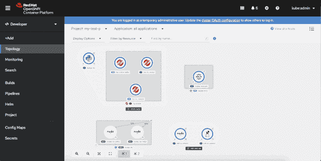
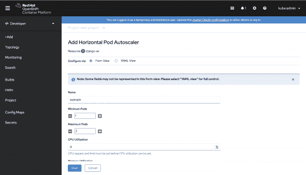
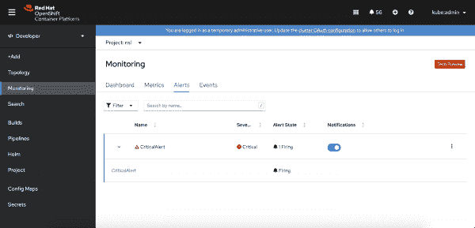
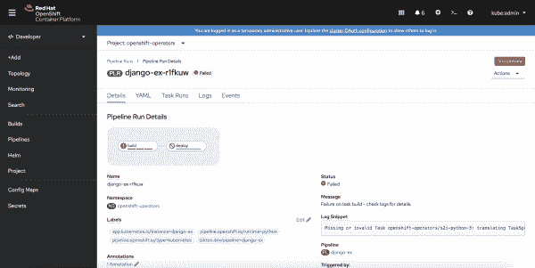
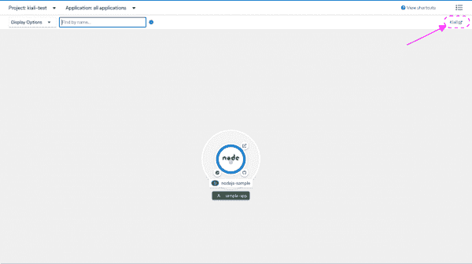
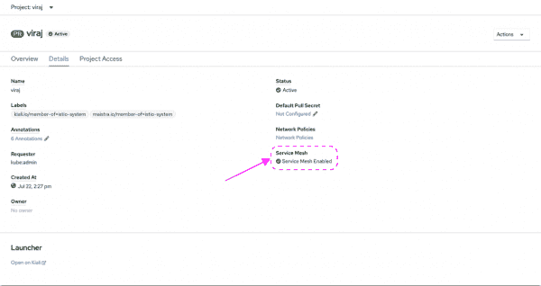

# 新的 Red Hat OpenShift 4.6 web 控制台为开发人员提供了更多信息

> 原文：<https://developers.redhat.com/blog/2020/11/24/more-for-developers-in-the-new-red-hat-openshift-4-6-web-console>

[Red Hat OpenShift 4.6](https://developers.redhat.com/products/openshift/getting-started) 简化了 OpenShift web 控制台中的开发人员入职流程，但这还不是全部。本文详细介绍了拓扑视图中的改进和新特性，并介绍了 OpenShift 新的基于表单的方法来创建水平 pod 自动缩放器和舵图。我还谈到了应用程序监控方面的改进，以及 OpenShift 4.6 中的 [Red Hat OpenShift 管道](https://developers.redhat.com/courses/middleware/openshift-pipelines)、 [Red Hat OpenShift 无服务器](https://developers.redhat.com/topics/serverless-architecture)和 [Kiali 操作符](https://developers.redhat.com/topics/service-mesh)的最新更新。

**注意**:本文概述了 OpenShift 4.6 的新特性。请参见文章末尾的视频，了解如何访问和使用 OpenShift web 控制台中的新功能。

## OpenShift 4.6 入门

在 OpenShift 4.6 中，我们对[做了一些补充，以改善开发人员的入职体验](https://developers.redhat.com/blog/2020/11/20/new-developer-onboarding-features-in-red-hat-openshift-4-6):

*   开发人员透视图现在是非特权用户的默认登录页面。首次登录 OpenShift web 控制台时，您会直接进入该页面。
*   首次进入开发人员视角的用户会被邀请选择加入一个有指导的游览。本教程介绍了开发人员视角的用户界面(UI)以及您可以在每个 UI 区域中做什么。
*   您可以使用各种示例应用程序轻松高效地创建新应用程序，并在 OpenShift 上运行它们。
*   开发人员快速入门指导您创建新的无服务器或管道项目，配置健康检查等。

**了解更多**:参见*[Red Hat open shift 4.6](https://developers.redhat.com/blog/2020/11/20/new-developer-onboarding-features-in-red-hat-openshift-4-6/)*中新的开发人员入职特性，了解更多关于 OpenShift 4.6 web 控制台的更新。

## 开发人员视角拓扑视图

我们对开发人员视角的拓扑视图进行了重大更新:

*   应用程序拓扑图中现在有两种模式:连接和消费。
*   我们改进了过滤器和 Find 功能，以更好地支持需要扩展的大型项目。
*   在管理方面，您将在项目详细信息页面的**工作负载**选项卡下找到更多功能。

图 1 中的演示介绍了拓扑视图中的这些更新和新特性。

Figure 1: A guide to the new topology features in the OpenShift developer perspective.

Figure 1: A guide to the new topology features in the OpenShift developer perspective (click to enlarge).

## 水平 pod 自动缩放

您可以使用水平机架自动缩放器(HPA)在使用量增加期间自动缩放机架。在 OpenShift 4.6 中，我们在 web 控制台中添加了一个表单，使创建 HPA 变得更加容易。如图 2 所示，您可以使用这个表单向您的`Deployment`和`DeploymentConfig`快速添加一个或多个自动缩放器。

Figure 2: HPA Form

Figure 2: Adding a horizontal pod autoscaler in the OpenShift console.

创建新的自动缩放器时，需要确保设置了 CPU 或内存限制。一旦定义了自动缩放，您将无法再修改 pod 计数。您还可以使用拓扑视图来编辑或删除与`Deployment`或`DeploymentConfig`相关联的 HPA。

## 舵图用户的改进

OpenShift 4.5 [引入了访问和管理舵图](https://developers.redhat.com/blog/2020/07/20/advanced-helm-support-in-the-openshift-4-5-web-console/)的新功能。现在，我们已经为舵图用户增加了更多的新功能。OpenShift 4.6 控制台具有表单驱动的使用舵图的体验。我们还简化了用户界面，这样添加了多个版本的图表将只在目录中显示一次。此外，与当前 Kubernetes 版本不兼容的图表将不会显示在 OpenShift 目录中。

## 应用程序监控

从 OpenShift 控制台，您现在可以使用应用程序监视仪表板来过滤特定于资源的指标。通过打开 **Alerts** 选项卡，您可以查看正在触发的警报，使它们静音，并快速查看为您的项目配置了哪些警报规则。图 3 显示了新的**警报**选项卡。

Figure 3: Alerts tab in the Monitoring page

Figure 3: The Alerts tab in the monitoring view.

## OpenShift 无服务器事件

[OpenShift 无服务器事件组件](https://www.redhat.com/en/blog/introducing-using-openshift-serverless-event-driven-applications)现已在 OpenShift 无服务器 1.11 中正式提供。事件支持强大的应用程序结构，如事件源、代理和通道。此外， [Camel K](https://developers.redhat.com/topics/camel-k) 现在扩展了亚马逊简单队列服务(SQS)、亚马逊 Kinesis、Salesforce 和其他服务的事件源。

## OpenShift 管道故障排除

我们提高了解决构建和管道故障的效率，以便您可以快速修复问题并重新开始编码。现在，您将在每个工作流的详细信息页面上找到管道运行和任务运行的失败详细信息。您还可以在拓扑视图的侧面板中找到这些信息，如图 4 所示。

Figure 4: Pipeline Run failure details

Figure 4: Pipeline failure details in the topology view.

## 更轻松地访问 Kiali 用户界面

当[Red Hat OpenShift Service Mesh](https://developers.redhat.com/topics/service-mesh)在您的 open shift 集群上启用时，我们已经使访问 [Kiali 用户界面](https://kiali.io/)变得更加容易。如图 5 所示，您可以从拓扑视图、项目概述和项目页面导航到 Kiali 仪表板。

Figure 5: Kiali link in Topology

Figure 5: A link lets you navigate to Kiali from the topology view.

如图 6 所示，我们也很容易知道服务网格对于上下文中的项目是否是活动的。

Figure 6: Indicator if Project is Service Mesh Enabled

Figure 6: A new indicator tells you whether Service Mesh is active in your project.

## 观看 OpenShift 4.6 的视频

你想知道更多关于使用 OpenShift 4.6 中的新特性吗？看看红帽开发者倡导者布莱恩·坦诺斯的视频之旅。

[https://www.youtube.com/embed/cTePAegBf8s?autoplay=0&start=0&rel=0](https://www.youtube.com/embed/cTePAegBf8s?autoplay=0&start=0&rel=0)

## OpenShift 的下一步是什么？

请关注 OpenShift 4.7 中的新特性。我们正在努力改进，我们很高兴能与我们的 OpenShift 开发者社区分享这些改进。

同时，请让我们知道您对 OpenShift 4.6 中新的 web 控制台功能的看法！直接听取开发人员的意见有助于我们不断改善您在 OpenShift 上的体验。您可以在上班时间通过 [OpenShift Twitch 频道](https://www.twitch.tv/redhatopenshift)分享您的反馈。或者，如果您愿意，您可以[使用此表格](https://forms.gle/8tHfTeYZV6H4AaAs6)让我们知道您的想法。我们还邀请您加入 [OpenShift 开发者体验 Google 小组](https://groups.google.com/forum/#!forum/openshift-dev-users)，在这里您可以分享您的 web 控制台技巧，获得其他开发者的支持，并提供反馈，帮助我们塑造 OpenShift 的未来。你准备好开始了吗？[今天试试 OpenShift】。](http://www.openshift.com/try)

*Last updated: November 20, 2020*