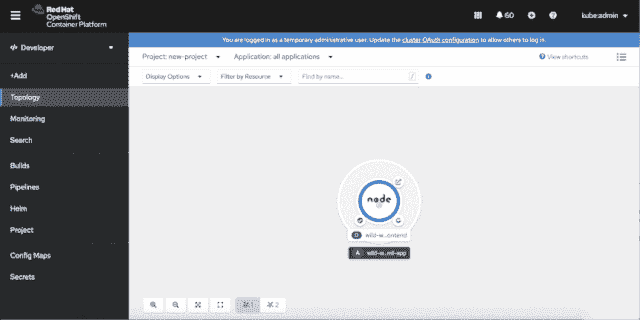
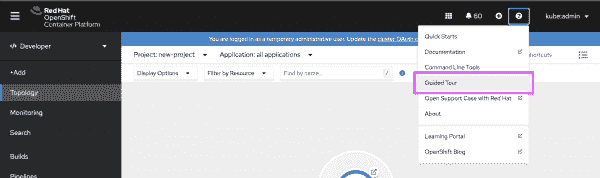
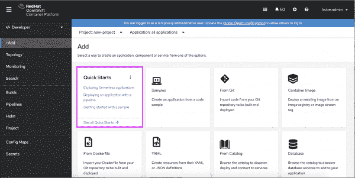
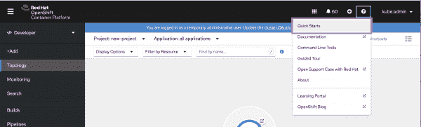
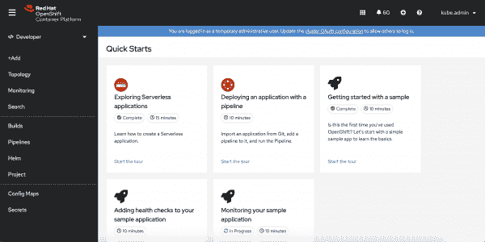
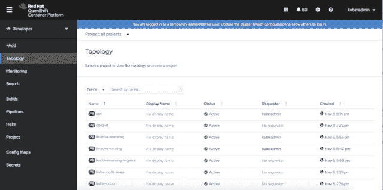

# Red Hat OpenShift 4.6 中新的开发人员入职特性

> 原文：<https://developers.redhat.com/blog/2020/11/20/new-developer-onboarding-features-in-red-hat-openshift-4-6>

我们在 [Red Hat OpenShift 4.6](https://www.openshift.com/blog/red-hat-openshift-4.6-is-now-available) 版本中添加了新功能，以帮助开发人员更快地开始使用 [OpenShift web 控制台](https://developers.redhat.com/blog/2020/07/16/whats-new-in-the-openshift-4-5-console-developer-experience/):

*   默认的开发人员视角是根据您的权限设置的。
*   开发人员视角包括一个导游。
*   快速入门指导您完成常见的用户流程。
*   示例使在 OpenShift 上部署新应用变得容易。

请继续阅读，了解这些新特性，以便使用 [OpenShift](https://developers.redhat.com/products/openshift/overview) 4.6 中的 OpenShift web 控制台改进开发人员的入门。

## 从开发人员的角度开始

开发人员要求更直观的开发人员视角，所以我们创建了一个。从 OpenShift 4.6 开始，第一次登录 OpenShift 控制台的非特权用户将默认登陆开发者视角。

从开发人员的角度来看，第一次使用的用户会有一个用户界面(UI)的向导。选择加入该教程的开发人员将被引导通过 UI 区域，从拓扑视图开始。图 1 中的演示展示了如何启动该向导。

Figure 1: Launch the guided tour from the OpenShift console.

Figure 1: Launch the guided tour from the OpenShift console.

如果您对旅程不感兴趣，可以点击**跳过旅程**跳过旅程。除非您登录到另一个集群，否则该旅程不会再次显示。如果您稍后想要访问该向导，您可以在**帮助**菜单中找到它，如图 2 所示。

Figure 1 - Guided tour

Figure 2: Use the Help menu to access the guided tour anytime.

## OpenShift 4.6 中的快速启动

在此版本中，我们提供了快速入门，帮助您开始使用 OpenShift web 控制台中最常见的用户流程。

您可以使用 OpenShift 控制台的添加页面导航到快速入门。打开添加页面，找到快速入门卡，然后点击**查看所有快速入门**链接，进入快速入门目录。图 3 显示了**添加**页面上的快速启动卡。

Figure 3 - Accessing quick starts from the +Add page

您也可以从**帮助**菜单访问快速启动。如图 4 所示，点击**帮助**菜单中的**快速启动**，将会进入快速启动目录。

Figure 4 - Accessing quick starts from the Help menu

Figure 4: Accessing quick starts from the Help menu.

当您进入 quick starts 目录时，您将看到所有可用于 OpenShift 控制台的快速入门，如图 5 所示。

Figure 5 - Quick start catalog

Figure 5: Open the quick starts catalog to view all of the quick start options.

### 开发人员快速入门

4.6 版本中的 OpenShift 控制台附带了七个快速启动功能。其中两个是专门针对管理员的，重点是安装 OpenShift 管道和 OpenShift 无服务器[操作符](https://developers.redhat.com/topics/kubernetes/operators)。其他五个快速入门是为开发人员准备的:

*   **探索无服务器应用**在安装了 OpenShift 无服务器操作器后可用。这个快速入门介绍了如何部署一个[无服务器应用程序](https://developers.redhat.com/topics/serverless-architecture)，并演示了它如何在上下文中工作。
*   **安装了 [OpenShift Pipelines 操作符](https://developers.redhat.com/courses/middleware/openshift-pipelines)后，就可以用管道**部署应用了。它向您展示了如何从 Git 导入一个应用程序，向它添加一个管道，并运行该管道。
*   **使用示例入门**向您展示如何在 OpenShift 中[部署示例应用程序](https://developers.redhat.com/courses/openshift/playground-openshift)。
*   **向您的示例应用程序添加健康检查**引导您查看您的 OpenShift 应用程序的详细信息，以及[向其添加健康检查](https://developers.redhat.com/blog/2020/07/20/best-practices-using-health-checks-in-the-openshift-4-5-web-console/)。
*   **监控您的示例应用程序**引导您完成监控应用程序的可用流程，包括查看监控细节、监控仪表板和定制指标。

### 访问快速入门

当您选择快速启动时，快速启动面板会打开。一旦开始快速启动，说明将引导您完成该示例的用户流程。

## 在 OpenShift 控制台中创建一个示例应用程序

从 OpenShift 4.6 开始，您可以创建一个示例应用程序来测试在 OpenShift 上运行的应用程序。图 6 中的演示向您展示了如何从开发人员的角度从 Add 页面访问一个示例应用程序。

Figure 6: How to create a sample application.

Figure 6: How to create a sample application.

## OpenShift 的下一步是什么？

请密切关注 OpenShift 4.7 中的新特性。我们正在进行新的改进，并且很高兴能与我们的 OpenShift 开发者社区分享这些改进。

同时，请让我们知道您对 OpenShift 4.6 中新的 web 控制台功能的看法！直接听取开发人员的意见有助于我们不断改善您在 OpenShift 上的体验。您可以在上班时间通过 [OpenShift Twitch 频道](https://www.twitch.tv/redhatopenshift)分享您的反馈。或者，如果您愿意，您可以[使用此表格](https://forms.gle/8tHfTeYZV6H4AaAs6)让我们知道您的想法。我们还邀请您加入 [OpenShift 开发者体验 Google 小组](https://groups.google.com/forum/#!forum/openshift-dev-users)，在这里您可以分享您的 web 控制台技巧，获得其他开发者的支持，并提供反馈，帮助我们塑造 OpenShift 的未来。你准备好开始了吗？[今天试试 OpenShift】。](http://www.openshift.com/try)

*Last updated: November 26, 2020*