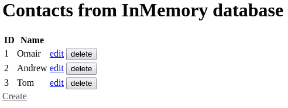
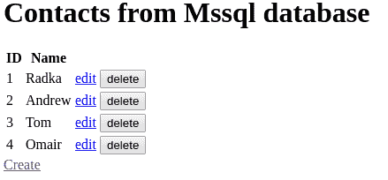
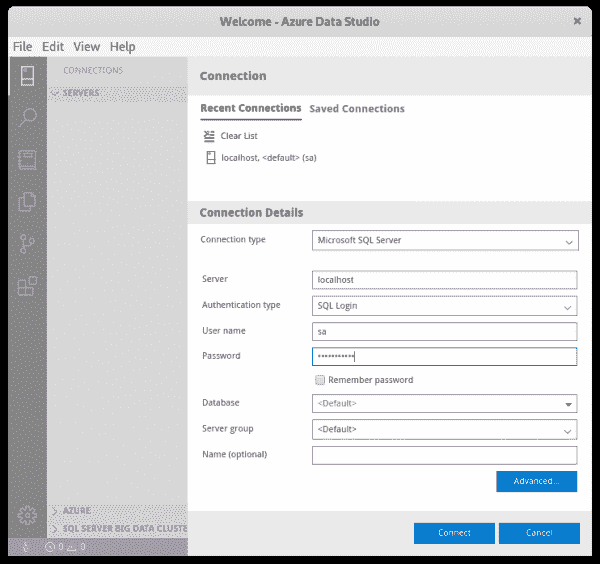
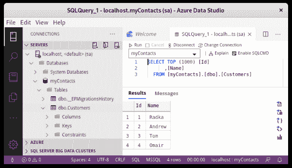

# 在 Red Hat OpenShift 上使用 Microsoft SQL Server

> 原文：<https://developers.redhat.com/blog/2020/10/27/using-microsoft-sql-server-on-red-hat-openshift>

在本文中，你将学习如何在[红帽 OpenShift](https://developers.redhat.com/products/openshift/overview) 上部署[微软 SQL Server 2019](https://docs.microsoft.com/en-us/sql/sql-server/what-s-new-in-sql-server-ver15) 。然后，我们将使用部署在 OpenShift 上的[ASP.NET 核心](https://developers.redhat.com/topics/dotnet)应用程序中的 SQL Server。接下来，我将向您展示如何在本地开发机器上处理应用程序时连接到 SQL Server。最后，我们将使用 [Azure Data Studio](https://docs.microsoft.com/en-us/sql/azure-data-studio/what-is?view=sql-server-ver15) 连接到服务器。

请注意，我正在使用[Red Hat code ready Containers](https://developers.redhat.com/products/codeready-containers)在我的开发机器上本地运行 [OpenShift 4.3](https://docs.openshift.com/container-platform/4.3/welcome/index.html) 。

## 部署 Microsoft SQL Server

首先，使用`oc login`命令登录到 OpenShift 集群。通过输入以下内容创建一个新项目:

```
$ oc new-project mssqldemo

```

使用以下模板来帮助部署基于 [Red Hat Enterprise Linux (RHEL)的 SQL Server 映像](https://catalog.redhat.com/software/containers/mssql/rhel/server/5ba50865f5a0de06555a2ee7):

```
$ oc create -f https://raw.githubusercontent.com/redhat-developer/s2i-dotnetcore-persistent-ex/dotnetcore-3.1-mssql/openshift/mssql2019.json
template.template.openshift.io/mssql2019 created
$ oc process --parameters mssql2019
NAME                DESCRIPTION                                                                  GENERATOR           VALUE
NAME                The name assigned to all of the frontend objects defined in this template.                       mssql
SA_PASSWORD                                                                                      expression          aA1[a-zA-Z0-9]{8}
ACCEPT_EULA         'Y' to accept the EULA (https://go.microsoft.com/fwlink/?linkid=857698).
MSSQL_PID           Set to 'Developer'/'Express'/'Standard'/'Enterprise'/'EnterpriseCore'.                           Developer
VOLUME_CAPACITY     Volume space available for data, e.g. 512Mi, 8Gi                                                 512Mi

```

对于此部署，您可以保留默认参数。接受最终用户许可协议(EULA)，如下所示:

```
$ oc new-app --template=mssql2019 -p ACCEPT_EULA=Y
--> Deploying template "mssqldemo/mssql2019" to project mssqldemo

 	Microsoft SQL Server 2019
 	---------
 	Relational database management system developed by Microsoft.

 	* With parameters:
    	* Name=mssql
    	* Administrator Password=aA1qxWYb8ME # generated
    	* Accept the End-User Licensing Agreement=Y
    	* Product ID or Edition=Developer
    	* Persistent Volume Capacity=512Mi

--> Creating resources ...
	secret "mssql-secret" created
	service "mssql" created
	deploymentconfig.apps.openshift.io "mssql" created
	persistentvolumeclaim "mssql-pvc" created
--> Success
	Application is not exposed. You can expose services to the outside world by executing one or more of the commands below:
 	'oc expose svc/mssql'
	Run 'oc status' to view your app.

```

除了在容器中部署 SQL Server 之外，该模板还创建了一个存储管理员密码的密码(`mssql-secret`)。它还为存储创建了一个持久的卷声明(`mssql-pvc`)。请注意，这个秘密包括 SQL Server 服务名，这有助于以后绑定到 SQL Server。

您可以使用`oc status`命令或 OpenShift web 控制台来监控部署进度。

## 从使用 SQL Server。OpenShift 上的 NET Core

对于这个演示，我们将使用[s2i-dotnetcore-persistent-ex](https://github.com/redhat-developer/s2i-dotnetcore-persistent-ex)示例应用程序。这是一个创建、读取、更新和删除(CRUD)应用程序。`dotnetcore-3.1-mssql`分支支持内存、PostgreSQL 或 SQL Server 后端。

您可以使用环境变量来配置应用程序，以支持您选择的后端。我们为 SQL Server 使用了`MSSQL_SA_PASSWORD`和`MSSQL_SERVICE_NAME`环境变量。以下是相关的代码片段:

```
// Detect that we should use a SQL Server backend:
string saPassword = Configuration.GetValue("MSSQL_SA_PASSWORD");
if (saPassword != null)
{
    dbProvider = DbProvider.Mssql;
}
...
// Determine the connection string:
case DbProvider.Mssql:
{
    string server = Configuration["MSSQL_SERVICE_NAME"] ?? "localhost";
    string password = Configuration["MSSQL_SA_PASSWORD"];
    string user = "sa";
    string dbName = "myContacts";
    connectionString = $@"Server={server};Database={dbName};User Id={user};Password={password};";
}
...
// Configure EF Core to use SQL Server:
case DbProvider.Mssql:
    Logger.LogInformation("Using Mssql database");
    services.AddDbContext(options =>
                options.UseSqlServer(connectionString));

```

我们要部署的应用程序需要。网芯 3.1。让我们看看这个版本在 OpenShift 集群上是否可用:

```
$ oc get is -n openshift dotnet
NAME      IMAGE REPOSITORY                                                           TAGS                 UPDATED
dotnet    default-route-openshift-image-registry.apps-crc.testing/openshift/dotnet   3.0,latest,2.2,2.1   2 months ago

```

。NET Core 3.1 没有列出，但是我们可以通过导入所需的[基于通用基础映像(UBI) 8 的映像](https://www.redhat.com/en/blog/introducing-red-hat-universal-base-image)来添加它:

```
# note: only needed when .NET Core 3.1 is not available
$ oc create -f https://raw.githubusercontent.com/redhat-developer/s2i-dotnetcore/master/dotnet_imagestreams_rhel8.json
imagestream.image.openshift.io/dotnet created
imagestream.image.openshift.io/dotnet-runtime created

```

现在，我们准备好部署应用程序了:

```
$ oc new-app dotnet:3.1~https://github.com/redhat-developer/s2i-dotnetcore-persistent-ex#dotnetcore-3.1-mssql --context-dir app
--> Found image 45eae59 (28 hours old) in image stream "mssqldemo/dotnet" under tag "3.1" for "dotnet:3.1"

	.NET Core 3.1
	-------------
	Platform for building and running .NET Core 3.1 applications

	Tags: builder, .net, dotnet, dotnetcore, dotnet-31

	* A source build using source code from https://github.com/redhat-developer/s2i-dotnetcore-persistent-ex#dotnetcore-3.1-mssql will be created
  	* The resulting image will be pushed to image stream tag "s2i-dotnetcore-persistent-ex:latest"
  	* Use 'start-build' to trigger a new build
	* This image will be deployed in deployment config "s2i-dotnetcore-persistent-ex"
	* Port 8080/tcp will be load balanced by service "s2i-dotnetcore-persistent-ex"
  	* Other containers can access this service through the hostname "s2i-dotnetcore-persistent-ex"

--> Creating resources ...
	imagestream.image.openshift.io "s2i-dotnetcore-persistent-ex" created
	buildconfig.build.openshift.io "s2i-dotnetcore-persistent-ex" created
	deploymentconfig.apps.openshift.io "s2i-dotnetcore-persistent-ex" created
	service "s2i-dotnetcore-persistent-ex" created
--> Success
	Build scheduled, use 'oc logs -f bc/s2i-dotnetcore-persistent-ex' to track its progress.
	Application is not exposed. You can expose services to the outside world by executing one or more of the commands below:
 	'oc expose svc/s2i-dotnetcore-persistent-ex'
	Run 'oc status' to view your app.

```

使用`oc status`命令或 OpenShift web 控制台监控部署进度。一旦部署了应用程序，就对外公开它并获取 URL:

```
$ oc expose service s2i-dotnetcore-persistent-ex
route.route.openshift.io/s2i-dotnetcore-persistent-ex exposed
$ oc get route s2i-dotnetcore-persistent-ex
NAME                       	HOST/PORT                                             	PATH  	SERVICES                   	PORT   	TERMINATION   WILDCARD
s2i-dotnetcore-persistent-ex   s2i-dotnetcore-persistent-ex-mssqldemo.apps-crc.testing         	s2i-dotnetcore-persistent-ex   8080-tcp             	None

```

当浏览到 URL 时，请注意应用程序是从内存数据库中运行的。

## 添加联系人

接下来，我们将添加几个联系人，如图 1 所示。

[](/sites/default/files/blog/2020/07/in_memory3.png)

图 1:从应用程序的内存数据库添加联系人。">

我们将使用`oc set env`命令来配置应用程序以连接到 SQL Server。然后，我们将把来自`mssql-secret`的数据添加到应用程序的部署配置中:

```
$ oc set env --from=secret/mssql-secret dc/s2i-dotnetcore-persistent-ex --prefix=MSSQL_

```

`oc set env`命令重新启动应用程序，并连接到 OpenShift 上运行的 Microsoft SQL Server。现在，您可以在数据库中创建、删除和更新联系人。图 2 显示了联系人列表。

[](/sites/default/files/blog/2020/07/mssql2.png)

图 Microsoft SQL Server 数据库中的联系人。">

## 从本地连接。网络应用

从运行在开发机器上的. NET 应用程序连接到 OpenShift 上的 SQL Server 有时会很有用。接下来我将向您展示如何做到这一点。

首先，让我们获得应用程序源代码:

```
$ git clone https://github.com/redhat-developer/s2i-dotnetcore-persistent-ex
$ cd s2i-dotnetcore-persistent-ex
$ git checkout dotnetcore-3.1-mssql
$ cd app

```

使用`oc get pod`命令识别 SQL Server pod。然后，输入`oc port-forward`命令在本地机器上公开 SQL Server:

```
$ oc get pod | grep mssql | grep Running
mssql-1-288cm                           1/1       Running     0          34m
$ oc port-forward mssql-1-288cm 1433:1433
Forwarding from 127.0.0.1:1433 -> 1433
Forwarding from [::1]:1433 -> 1433

```

为了将应用程序连接到数据库，我们设置了`MSSQL_SA_PASSWORD`环境变量。密码是在我们部署 SQL 数据库时打印出来的。如果你错过了，试着从`oc get secret mssql-secret -o yaml`输出做一个 Base64 解码。

让我们运行设置了环境变量的应用程序:

```
$ MSSQL_SA_PASSWORD=aA1qxWYb8ME dotnet run
info: RazorPagesContacts.Startup[0]
      Using Mssql database
info: Microsoft.EntityFrameworkCore.Infrastructure[10403]
      Entity Framework Core 3.1.0 initialized 'MssqlDbContext' using provider 'Microsoft.EntityFrameworkCore.SqlServer' with options: None
...
info: Microsoft.EntityFrameworkCore.Migrations[20405]
      No migrations were applied. The database is already up to date.
info: Microsoft.AspNetCore.DataProtection.KeyManagement.XmlKeyManager[0]
      User profile is available. Using '/home/redhat-developer/.aspnet/DataProtection-Keys' as key repository; keys will not be encrypted at rest.
Hosting environment: Production
Content root path: /tmp/s2i-dotnetcore-persistent-ex/app
Now listening on: http://localhost:5000
Now listening on: https://localhost:5001
Application started. Press Ctrl+C to shut down.

```

浏览到本地主机 web 服务器，显示您之前添加的联系人。

请注意，演示是从命令行开始操作的。您还可以将环境变量设置为 IDE 调试配置的一部分，并从 IDE 中启动应用程序。

## 管理 SQL Server

在 Windows 桌面上，您可以像往常一样使用 SQL Server Management Studio 管理 SQL Server。在 Linux 或 Mac 桌面上，可以使用 Azure Data Studio。你可以在这里找到 Azure Data Studio [的安装说明。](https://docs.microsoft.com/en-us/sql/azure-data-studio/download-azure-data-studio?view=sql-server-ver15)

要连接到 SQL Server，您需要设置端口转发，就像我们在上一节中所做的那样。接下来，您可以打开 Azure Data Studio 并为用户`localhost`添加一个连接`sa`和来自`mssql-secret`的密码，如图 3 所示。

[](/sites/default/files/blog/2020/07/ads_login.png)

Figure 3: Add a connection and secret for a localhost user.

连接后，您可以从 Azure Data Studio 执行操作。例如，您可以对客户数据库执行 SQL 查询，如图 4 所示。

[](/sites/default/files/blog/2020/07/ads_query3.png)

Figure 4: Execute an SQL query against the Customer database.

## 结论

在本文中，您了解了如何在 Red Hat OpenShift 上部署 Microsoft SQL Server。我向您展示了如何从运行在 OpenShift 上的 ASP.NET 核心应用程序和运行在您的开发机器上的. NET 应用程序使用 SQL Server。您还看到了如何使用 Azure Data Studio 连接到 OpenShift 上的 SQL Server 数据库。您可以在您的开发机器上使用 [CodeReady 容器](https://developers.redhat.com/products/codeready-containers)来尝试这种方法。

*Last updated: April 7, 2022*