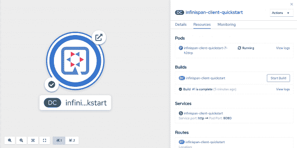
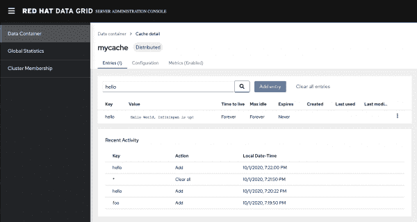

# 在 Red Hat OpenShift 上安全连接 Quarkus 和 Red Hat 数据网格

> 原文：<https://developers.redhat.com/blog/2020/10/15/securely-connect-quarkus-and-red-hat-data-grid-on-red-hat-openshift>

[红帽数据网格](https://developers.redhat.com/products/datagrid/overview) 8.1 的发布为部署在[红帽 OpenShift](https://developers.redhat.com/products/openshift/overview) 上的应用提供了新的安全特性。自然，我想检查他们的[夸库](https://developers.redhat.com/products/quarkus/getting-started)。使用 [Quarkus 数据网格扩展](https://quarkus.io/guides/infinispan-client)可以轻松做到这一点。

数据网格是一个基于 [Infinispan](https://infinispan.org) 的内存分布式 NoSQL 数据存储解决方案。因为数据网格管理您的数据，所以它应该尽可能的安全。因此，它使用需要 HTTPS 的默认属性领域，并在远程端点上自动实施用户身份验证。作为 OpenShift 上的附加安全层，数据网格提供由 [OpenShift 服务签名者](https://docs.openshift.com/container-platform/4.5/security/certificates/service-serving-certificate.html)签名的证书。在实践中，这意味着数据网格是尽可能安全的，从第一个请求开始就需要加密连接和身份验证。Data Grid 生成一组默认的凭证(当然，您可以覆盖这些凭证)，但是未经身份验证的访问会被拒绝。

在本文中，我将向您展示如何使用数据网格配置 Quarkus 应用程序，并将其部署在 OpenShift 上。

## 数据网格 8.1 入门

OpenShift 的[数据网格操作符](https://access.redhat.com/documentation/en-us/red_hat_data_grid/8.1/html-single/red_hat_data_grid_8.1_release_notes/index#data_grid_operator)使得在各种配置中部署数据网格变得容易。运营商还管理数据网格的安全、存储、升级和日志功能。一旦您从 OpenShift [OperatorHub](https://docs.openshift.com/container-platform/4.5/operators/understanding/olm-understanding-operatorhub.html) 部署了数据网格操作符，它[就会公开定制资源](https://access.redhat.com/documentation/en-us/red_hat_data_grid/8.1/html-single/running_data_grid_on_openshift/index#start_operator)(称为 Infinispan 集群和 Infinispan 缓存)，数据网格使用这些资源在现有集群上提供缓存。

在接下来的小节中，我们将部署一个三节点数据网格集群，配置一个示例 Quarkus 应用程序来安全地连接到数据网格，然后在 OpenShift 上部署并验证我们的应用程序。

## 部署三节点数据网格集群

要部署一个三节点数据网格集群，只需将下面的定制资源添加到任何 OpenShift 项目中(注意，在这个例子中，我的项目名称是`dgdemo`):

```
apiVersion: infinispan.org/v1
kind: Infinispan
metadata:
  name: example-infinispan
  namespace: dgdemo
spec:
  replicas: 3
  expose:
    type: LoadBalancer

```

添加定制资源后，Data Grid 会部署节点并设置网络。该设置包括一个解析集群成员的 [Kubernetes](https://developers.redhat.com/topics/kubernetes) 服务。Kubernetes 服务使用 OpenShift 服务签名程序支持 HTTPS。

### 使用签名证书连接数据网格和 quartus

当您的应用程序访问数据网格时，它们将通过 Kubernetes 服务这样做，因此它们将受其证书的约束。可以使用带注释的`ConfigMap`来简化将这些证书注入 pod 的过程。但是，因为我们使用的是 Java，所以我们需要 Java 应用程序可以使用的格式的证书，比如 JKS 或 PKCS12。

当我们的 Quarkus 应用程序启动与数据网格的 TLS 握手时，我们将使用签名证书。在将它们装入我们的应用程序的运行窗格之前，我们需要手动提取它们并将其转换为 JKS 格式。

### 提取证书

为了生成 Java 密钥库，我们首先需要从 OpenShift 服务签名者的证书颁发机构提取证书。然后，我们可以使用 JDK 的`keytool`来生成密钥库文件。使用`oc`、`openssl`和`keytool`命令行界面(CLI)，输入以下内容:

```
$ oc get secrets/signing-key -n openshift-service-ca -o template='{{index .data "tls.crt"}}' | openssl base64 -d -A > /tmp/server.crt
$ keytool -importcert -keystore /tmp/server.jks -storepass password -file /tmp/server.crt -trustcacerts -noprompt

```

这一系列命令获取 Base64 编码的证书内容，然后使用`keytool`格式将密码短语`password`保存到文件`/tmp/server.jks`中。

### 创造一个秘密

接下来，我们需要使用 Quarkus 应用程序名称空间(`dgdemo`)中的证书。我们将创建一个秘密`clientcerts`，它的内容被设置为我们的证书文件的内容。下面是执行此操作的命令:

```
$ oc create secret generic clientcerts -n dgdemo --from-file=clientcerts=/tmp/server.jks

```

## 配置 quartus 应用程序

我们已经创建了名为`clientcerts`的秘密，并将其值设置为`server.jks`的内容。接下来，我们需要配置 Quarkus 应用程序，在给定的挂载点挂载这个秘密，读取内容，并在连接到数据网格时使用证书。

我为演示的这一部分创建了一个[示例应用程序](https://github.com/jamesfalkner/quarkus-dg-tls)。打开它，你会看到我已经安装了`infinispan-client`和`openshift`扩展。这是一个简单的应用程序，它用关键字`hello`下的数据网格条目的值来响应`GET /infinispan`端点。正如你可能猜到的，条目是“Hello World，Infinispan 启动了！”

你可以在`src/main/resources/application.properties`中找到配置。我也会在这里展示:

```
# The DNS name and port of the Service fronting Data Grid
quarkus.infinispan-client.server-list=example-infinispan:11222

# Auth info, including server name and super secret password for the developer
quarkus.infinispan-client.auth-server-name=example-infinispan
quarkus.infinispan-client.auth-realm=default

# DG user credentials. You'll need to change these
quarkus.infinispan-client.auth-username=developer
quarkus.infinispan-client.auth-password=I@TIR7awMPvYATGl
quarkus.infinispan-client.sasl-mechanism=PLAIN
quarkus.infinispan-client.client-intelligence=BASIC

# Where the application can read the trust store from when it runs
quarkus.infinispan-client.trust-store=/mnt/clientcerts

# trust store password
quarkus.infinispan-client.trust-store-password=password

# trust store type
quarkus.infinispan-client.trust-store-type=jks

# which secret to mount and where to mount it
quarkus.openshift.mounts.my-volume.path=/mnt
quarkus.openshift.secret-volumes.my-volume.secret-name=clientcerts

# instructs quarkus to build and deploy to kubernetes/openshift, and
# create an ingress Route, and to trust the Kubernetes API since we're using self-signed,
quarkus.container-image.build=true
quarkus.kubernetes.deploy=true
quarkus.openshift.expose=true
quarkus.kubernetes-client.trust-certs=true
quarkus.kubernetes.deployment-target=openshift

```

### 得到秘密

我们的应用程序将使用`quarkus.infinispan-client.auth-username`和`quarkus.infinispan-client.auth-password`的值作为与数据网格对话的凭证。输入以下命令以发现自动生成的用户名`developer`及其相关密码:

```
$ oc get secret/example-infinispan-generated-secret -o template='{{index .data "identities.yaml"}}' | openssl base64 -d -A

```

获取用户名和密码，并将它们插入到您的`application.propeties`文件中。

一切就绪后，我们就可以开始部署了！

## 部署到 OpenShift

我们现在要做的就是登录 OpenShift 并切换到我们的演示项目，然后进行构建和部署。在这种情况下， [Quarkus OpenShift 插件](https://quarkus.io/guides/deploying-to-openshift)为我们完成了大部分工作；我们只要输入:

```
$ oc project dgdemo
$ mvn clean package

```

构建和部署大约需要一分钟。构建完成后，应用程序应该部署并显示在 OpenShift 开发人员控制台中，如图 1 所示。

[](/sites/default/files/blog/2020/10/Screen-Shot-2020-10-01-at-6.58.39-PM.png)Data Grid Quarkus app in OpenShift Developer Console

Figure 1: The Quarkus application with Data Grid in the OpenShift developer console.

### 测试应用程序

在测试应用程序之前，让我们看一下它的日志文件:

```
$ oc logs -n dgdemo dc/infinispan-client-quickstart
__  ____  __  _____   ___  __ ____  ______
 --/ __ \/ / / / _ | / _ \/ //_/ / / / __/
 -/ /_/ / /_/ / __ |/ , _/ ,< / /_/ /\ \
--\___\_\____/_/ |_/_/|_/_/|_|\____/___/
2020-10-01 22:53:32,096 INFO  [org.inf.SECURITY] (HotRod-client-async-pool-1-1) ISPN000947: Using Java SSL Provider
2020-10-01 22:53:37,612 INFO  [org.inf.HOTROD] (main) ISPN004021: Infinispan version: Infinispan 'Corona Extra' 11.0.3.Final
2020-10-01 22:53:37,863 INFO  [InfinispanClientApp] (main) Create or get cache named mycache with the default configuration
2020-10-01 22:53:37,909 INFO  [io.quarkus] (main) infinispan-client-quickstart 1.0-SNAPSHOT on JVM (powered by Quarkus 1.8.0.Final) started in 1.676s. Listening on: http://0.0.0.0:8080
2020-10-01 22:53:37,909 INFO  [io.quarkus] (main) Profile prod activated.
2020-10-01 22:53:37,909 INFO  [io.quarkus] (main) Installed features: [cdi, infinispan-client, kubernetes, resteasy]

```

看起来很健康。现在，让我们用`curl`来测试一下:

```
$ curl http://$(oc get route -n dgdemo infinispan-client-quickstart -o jsonpath="{.spec.host}")/infinispan
Hello World, Infinispan is up!

```

是的，我们得到了显示连接成功的预期值。

### 验证数据网格 8.1 web 控制台中的值

作为我们的最后一步，让我们使用新的[数据网格 8.1 web 控制台](https://access.redhat.com/webassets/avalon/d/red-hat-data-grid/8.1/videos/console_tour.html)来验证该值。要访问它，您可以使用以下命令找到 URL:

```
$ echo http://$(oc get service/example-infinispan-external
 jsonpath='{.status.loadBalancer.ingress[0].hostname}'):11222

```

此命令输出 URL，然后您可以将其复制并粘贴到您的浏览器中。您可以使用之前指定的凭据登录。然后，找到 **mycache** 缓存，使用关键字 **hello** 搜索条目，如图 2 所示。

[](/sites/default/files/blog/2020/10/Screen-Shot-2020-10-01-at-7.22.40-PM.png)Data Grid Web Console

Figure 2: The application's key and value in the new Data Grid web console.

## 包裹

Red Hat Data Grid 为 OpenShift 上的混合云部署提供了许多特性。在本文中，您看到了如何使用默认配置将 Quarkus 应用程序安全地连接到数据网格，并在 OpenShift 上部署它们。

虽然默认配置被认为是尽可能安全的，但还有许多其他功能有待探索。示例包括 OpenShift 上的跨数据中心异步复制和自动扩展，以动态扩展和收缩集群大小。

无论您选择默认配置还是需要探索额外的安全特性， [Red Hat Data Grid](https://www.redhat.com/en/technologies/jboss-middleware/data-grid) 对于跨大型云的大型数据集来说都是一个有价值的解决方案。

*Last updated: October 14, 2020*