# 使用 Red Hat OpenShift 管道和 Argo CD 为无服务器应用程序构建现代 CI/CD 工作流，第 2 部分

> 原文：<https://developers.redhat.com/blog/2020/10/14/building-modern-ci-cd-workflows-for-serverless-applications-with-red-hat-openshift-pipelines-and-argo-cd-part-2>

在本文的[前半部分，我介绍了](https://developers.redhat.com/blog/2020/10/01/building-modern-ci-cd-workflows-for-serverless-applications-with-red-hat-openshift-pipelines-and-argo-cd-part-1) [Tekton](https://developers.redhat.com/blog/2020/08/14/introduction-to-cloud-native-ci-cd-with-tekton-kubecon-europe-2020/) 作为云原生 [CI/CD](https://developers.redhat.com/topics/ci-cd) 管道的框架，以及 [Argo CD](https://argoproj.github.io/argo-cd/) 作为其在 [Red Hat OpenShift](https://developers.redhat.com/products/openshift/overview) 上 GitOps 的完美合作伙伴。我们的演示示例是一个部署并服务于一个 [Quarkus](https://developers.redhat.com/products/quarkus/getting-started) 应用程序的 [Knative service](https://developers.redhat.com/topics/serverless-architecture) 。我们的目标是开发一个完整的持续集成和交付流程，从在应用程序的 GitHub 存储库中启动提交开始，到在开发、试运行和生产环境中部署新的应用程序版本结束。

在第 1 部分中，我们使用 Tekton 来实现工作流的持续集成(CI)任务。现在，我们将通过使用 Argo CD 实现连续交付(CD)任务来完成 CI/CD 过程。作为复习，考虑图 1 中的 CI/CD 工作流程图。

[](/sites/default/files/blog/2020/09/cicd-knative.png)

Figure 1: The sample CI/CD workflow for the demonstration.

**注意**:我建议[在继续第二部分之前阅读本文的前半部分](https://developers.redhat.com/blog/2020/10/01/building-modern-ci-cd-workflows-for-serverless-applications-with-red-hat-openshift-pipelines-and-argo-cd-part-1/)。这里的所有讨论和示例都基于我们在第 1 部分中开发的演示应用程序和工作流。

在第 2 部分中，我们将添加 Argo CD 的功能来完全自动化应用程序的部署。Argo CD 将从 Kustomize 文件中提取更改，这些更改由 CI 管道推入部署存储库，并在目标名称空间中同步这些更改。作为自动化的最后一步，我们将定义一个 [Tekton 触发器](https://github.com/tektoncd/triggers)，它将触发 CI/CD 工作流。

## Argo CD 入门

这些天来，《逃离德黑兰》的 CD 越来越受欢迎。作为 [Kubernetes](https://developers.redhat.com/topics/kubernetes) 生态系统中的一等公民，它促进了 [GitOps](https://developers.redhat.com/devnation/tech-talks/gitops/watch) 的采用，其中团队利用来自 Git 的声明性配置和基础设施定义作为事实的单一来源。我们已经为 CI/CD 工作流开发了 Tekton 任务。Argo CD 能完美弥补我们当前工作流程中的缺失吗？

### 安装 Argo 光盘

打开 OpenShift web 控制台，导航到我们演示工作流的`cicd`名称空间。使用以下脚本安装 Argo CD 操作器:

```
$ ./bootstrap-argo.sh cicd
------------------------------
Installing argo operator
Release "argocd" does not exist. Installing it now.
NAME: argocd
LAST DEPLOYED: Thu Sep 10 18:37:23 2020
NAMESPACE: default
STATUS: deployed
REVISION: 1
TEST SUITE: None

```

如图 2 所示，您应该看到在`cicd`名称空间中安装了一个新的操作符:

[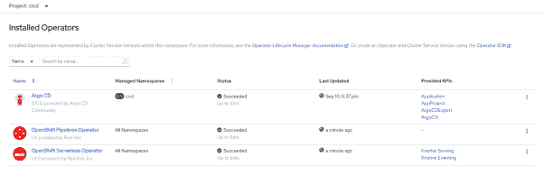](/sites/default/files/blog/2020/09/argo-installed.png)

Figure 2: Argo CD installed in the CICD project namespace.

### 创建 Argo CD 实例

接下来，创建一个 [Argo CD](https://argocd-operator.readthedocs.io/en/latest/reference/api.html/#argoproj.io/v1alpha1.ArgoCDSpec) 实例。这个实例将管理我们在`cicd`名称空间下创建的所有 [AppProject](https://argocd-operator.readthedocs.io/en/latest/reference/api.html/#argoproj.io/v1alpha1.ArgoCDSpec) 和[应用程序](https://argocd-operator.readthedocs.io/en/latest/reference/api.html/#argoproj.io/v1alpha1.ArgoCDSpec)。运行以下脚本会创建:

*   名称空间中的 Argo CD 实例。
*   一个名为`rh-developers`的 AppProject。
*   `rh-developers` AppProject 下的三个应用。每个应用程序都引用主分支中的部署存储库。应用程序分别与开发、暂存和生产文件夹保持一致。

执行以下命令(不要忘记使用您自己的`quarkus-hello-world-deployment`库):

```
$ ./add-argo-apps.sh cicd rh-developers https://github.com/dsanchor/quarkus-hello-world-deployment.git master
----------------------------------------------------------------------------------------------------------------
Installing basic Argo CD server instance
argocd.argoproj.io/argocd created
Adding edit role to argocd-application-controller ServiceAccount in projects development, staging and production
rolebinding.rbac.authorization.k8s.io/edit-rh-developers-dev created
rolebinding.rbac.authorization.k8s.io/edit-rh-developers-staging created
rolebinding.rbac.authorization.k8s.io/edit-rh-developers-production created
Creating rh-developers AppProject in namespace cicd
appproject.argoproj.io/rh-developers created
Creating Applications in namespace cicd in rh-developers AppProject
application.argoproj.io/quarkus-hello-world-development created
application.argoproj.io/quarkus-hello-world-staging created
application.argoproj.io/quarkus-hello-world-production created

```

输入 Argo CD 路径，您需要它来访问 Argo CD 主仪表板:

```
$ oc get routes argocd-server -n cicd
---------------------------------------
NAME            HOST/PORT                                             PATH   SERVICES        PORT    TERMINATION            WILDCARD
argocd-server   argocd-server-cicd.apps.ocp4.mydomain.com          argocd-server   https   passthrough/Redirect   None

```

等待 Argo CD 服务器运行，然后使用您的 OpenShift 凭据登录。然后，*瞧啊*！您应该会收到应用程序的当前状态，如图 3 所示。

[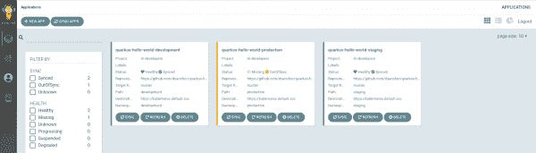](/sites/default/files/blog/2020/09/argodash-1.png)

Figure 3: Log in to the Argo CD dashboard to view all of the application versions and their respective health status.

**注意**:您可能会注意到开发和试运行应用程序都显示其状态为**同步**，而生产应用程序则为**不同步**。虽然前两个配置为启用自动同步，但我们将在生产中使用手动配置。

## 部署第一个应用程序版本

在接下来的部分中，我们将对我们的示例`quarkus-hello-world`应用程序进行多次修改，我们将在部署周期的开发、准备和生产阶段对其进行同步。请参阅第 1 部分，了解我们在本次演示中使用的 Quarkus 应用程序的更多信息。

### 开发环境中的应用程序版本 1

单击`quarkus-hello-world-development`应用程序，您将看到该版本中的每个对象都已被同步，如图 4 所示。

[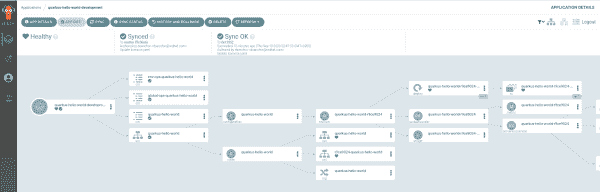](/sites/default/files/blog/2020/09/dev-rev1.png)

Figure 4: Click an application version to check its health status.

同步所有对象意味着成功部署了应用程序的第一个版本。现在，获取路由，以便我们可以访问服务(注意， [Knative](https://knative.dev/) 服务的入口路由是在`knative-serving-ingress`名称空间中自动创建的):

```
$ oc get routes -n knative-serving-ingress | grep development
--------------------------------------------------------------
route-e387d9ca-9f1b-4c15-9b83-7bea4d2d290c-313361326363   quarkus-hello-world-development.apps.ocp4.mydomain.com                   kourier    http2   edge/Allow    None
route-e387d9ca-9f1b-4c15-9b83-7bea4d2d290c-613962613835   r9ce9024-quarkus-hello-world-development.apps.ocp4.mydomain.com          kourier    http2   edge/Allow    None

```

`get routes`命令应该至少返回两条路径:主路径(`quarkus-hello-world-development.apps.ocp4.mydomain.com`)和一条我们刚刚部署的新版本路径(`r9ce9024-quarkus-hello-world-development.apps.ocp4.mydomain.com`)。请注意，主路由后面可能有几个修订，但是因为这是我们的第一次部署，所以它只有一个。

测试两条路线并观察结果。如果没有 pod 正在运行，这是因为 [Knative 缩减了不活动的 pod](https://knative.dev/docs/serving/autoscaling/)。如果需要重新创建 pod，则第一个请求可能会比通常需要更长的时间。

添加`/hello.`，然后使用`curl`测试终点:

```
$ curl http://quarkus-hello-world-development.apps.ocp4.mydomain.com/hello
hola dev! Yeap!

$ curl http://r9ce9024-quarkus-hello-world-development.apps.ocp4.mydomain.com/hello
hola dev! Yeap!

```

现在，您可以在 OpenShift web 控制台中导航到**无服务器**菜单，选择**开发**项目，并浏览它，如图 5 所示。

[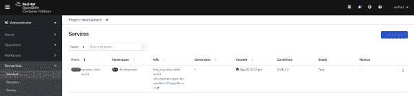](/sites/default/files/blog/2020/09/serverless-ocp.png)

Figure 5: View the development project in the OpenShift Serverless menu.

### 暂存环境中的应用程序版本 1

重新进入阿尔戈光盘仪表板，看看登台申请。目前，您应该看到一个单独的`ConfigMap`，如图 6 所示。

[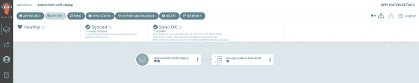](/sites/default/files/blog/2020/09/staging-1.png)

Figure 6: View the staging application in the Argo CD dashboard.

我们只有`ConfigMap`，因为我们还没有创建`kustomization.yaml`。您可能还记得第 1 部分，我们有一个名为`kustomization-REVISION.yaml`的文件。为了同步`REVISION`文件中的变更，您必须重命名该文件并将变更推送到 Git。

导航到签出部署存储库的文件夹，并运行:

```
$ git pull && \
mv staging/kustomization-r9ce9024.yaml staging/kustomization.yaml && \
git add  staging && git commit -m "Revision 9ce9024 is now active in staging" && \
git push

```

等待几分钟，让 Argo CD 同步更改。如果您不耐烦，您可以点击 **Sync** 让修订自动部署到 staging 中，如图 7 所示。

[](/sites/default/files/blog/2020/09/staging-1-changes.png)

Figure 7: Argo CD synchronizes and deploys the changes that you have just made.

就像我们对开发应用程序所做的那样，获取路由并对分段端点运行一些测试:

```
$ oc get routes -n knative-serving-ingress | grep staging
------------------------------------------------------------
route-fd38a613-ea42-4809-af13-cd02503980bf-346238393864   quarkus-hello-world-staging.apps.ocp4.mydomain.com                       kourier    http2   edge/Allow    None
route-fd38a613-ea42-4809-af13-cd02503980bf-623763373761   r9ce9024-quarkus-hello-world-staging.ocp4.mydomain.com              kourier    http2   edge/Allow    None

$ curl http://quarkus-hello-world-staging.apps.ocp4.mydomain.com/hello
hola staging! Yeap!
$ curl http://r9ce9024-quarkus-hello-world-staging.apps.ocp4.mydomain.com/hello
hola staging! Yeap!

```

### 生产环境中的应用程序版本 1

现在，我们将应用程序转移到生产环境，在那里我们还没有设置自动同步。因此，所有候选应用程序的对象都 **OutOfSync** ，如图 8 所示。

[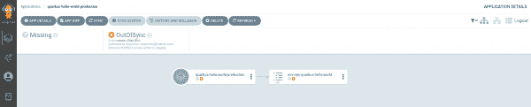](/sites/default/files/blog/2020/09/prod-rev1.png)

图 8:生产环境中的对象必须手动同步。">

我们需要手动批准，以使新的应用程序版本可用于同步。执行我们在试运行中对应用程序采取的相同步骤:

```
$ git pull && \
mv production/kustomization-r9ce9024.yaml production/kustomization.yaml && \
git add production && git commit -m "Revision 9ce9024 is now ready to be sync in production" && \
git push

```

稍等一两分钟，您将看到新的对象，它们当前被标记为 **OutOfSync** ，如图 9 所示。

[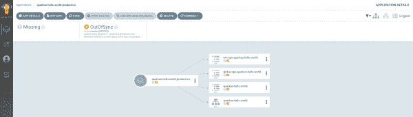](/sites/default/files/blog/2020/09/prod-1-chanes-outofsync.png)

Figure 9: Add the new objects for the current revision and verify them in the Argo CD console.

如果这些更改是您所期望的，您可以进行手动同步，以便在生产环境中部署新版本。点击 **Sync** 按钮，你将最终获得新版本，准备测试。该屏幕如图 10 所示。

[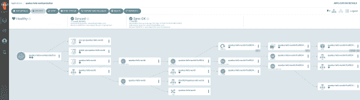](/sites/default/files/blog/2020/09/prod-1-changes-synced.png)

Figure 10: Click the Sync button to synchronize your changes in the current revision.

现在，按照您在开发和试运行周期中使用的相同过程，针对生产路线运行一些测试:

```
$ oc get routes -n knative-serving-ingress | grep production
------------------------------------------------------------
route-8c948175-70a8-4c1c-ae70-846aa3b2081f-643262313638   quarkus-hello-world-production.apps.ocp4.mydomain.com                    kourier    http2   edge/Allow    None
route-8c948175-70a8-4c1c-ae70-846aa3b2081f-663561353830   r9ce9024-quarkus-hello-world-production.apps.ocp4.mydomain.com           kourier    http2   edge/Allow    None

$ curl http://quarkus-hello-world-production.apps.ocp4.mydomain.com/hello
hola production! Yeap!
$ curl http://r9ce9024-quarkus-hello-world-production.apps.ocp4.mydomain.com/hello
hola production! Yeap!

```

如图 11 所示，所有 Argo CD 应用程序现在都是同步的。

[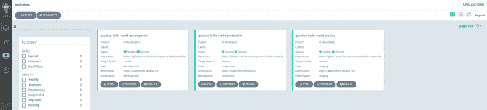](/sites/default/files/blog/2020/09/rev-1-all-synced.png)

Figure 11: View all of your projects in the Argo CD dashboard.

## 部署应用程序的新版本

现在，让我们看看当我们部署新版本的`quarkus-hello-world`应用程序时会发生什么。在这种情况下，我们将简单地使用不同的提交 ID 再次运行 CI/CD 管道。请注意，我们现在仍然手动触发管道。我们将在文章的最后一部分向管道介绍 webhooks。

导航到`rh-developers-cicd` repo 并使用以下参数触发管道:

```
$ cat tekton/pipelines/knative-pipeline-run.yaml | \
  SOURCE_REPO=https://github.com/dsanchor/quarkus-hello-world.git \
  COMMIT=c076ee940b1f1d9576b7af3250bbbd7114e82263 \
  SHORT_COMMIT=c076ee9 \
  DEPLOYMENT_REPO=https://github.com/dsanchor/quarkus-hello-world-deployment.git \
  IMAGES_NS=cicd envsubst | \
  oc create -f - -n cicd
------------------------------------------------------------------------------------
pipelinerun.tekton.dev/knative-pipeline-run-j5knc created

```

如果您喜欢使用`tkn` CLI 启动管道，请运行以下命令:

```
$ tkn pipeline start knative-pipeline -p application=quarkus-hello-world \
  -p source-repo-url=https://github.com/dsanchor/quarkus-hello-world.git \
  -p source-revision=c076ee940b1f1d9576b7af3250bbbd7114e82263 \
  -p short-source-revision=c076ee9 \
  -p deployment-repo-url=https://github.com/dsanchor/quarkus-hello-world-deployment.git \
  -p deployment-revision=master \
  -p dockerfile=./src/main/docker/Dockerfile.jvm \
  -p image-registry=image-registry.openshift-image-registry.svc.cluster.local:5000 \
  -p image-repository=cicd \
  -w name=source,claimName=source-pvc \
  -w name=maven-settings,config=maven \
  -w name=knative-kustomize-base,config=knative-kustomize-base \
  -w name=knative-kustomize-environment,config=knative-kustomize-environment \
  -n cicd

```

**注意**:管道的执行可能需要五分钟。同时，我推荐阅读这篇关于[在 Tekton](https://developers.redhat.com/blog/2020/02/26/speed-up-maven-builds-in-tekton-pipelines/) 中加速 Maven 构建的文章。

当管道完成时，我们将会把一个新的图像—`quarkus-hello-world:c076ee940b1f1d9576b7af3250bbbd7114e82263`—推到 OpenShift 内部注册表的`cicd`名称空间下。我们还会将新的库定制文件推送到`quarkus-hello-world-deployment`仓库。

### 执行日志

检查管道的执行日志可以让我们看到我们正在推送给 Git 的更改。请注意`push-knative-manifest`任务的日志，特别是:

```
add 'development/kustomization.yaml'
remove 'development/r9ce9024/configmap.yaml'
remove 'development/r9ce9024/revision-patch.yaml'
remove 'development/r9ce9024/routing-patch.yaml'
add 'development/rc076ee9/configmap.yaml'
add 'development/rc076ee9/revision-patch.yaml'
add 'development/rc076ee9/routing-patch.yaml'
add 'production/kustomization-rc076ee9.yaml'
add 'production/rc076ee9/configmap.yaml'
add 'production/rc076ee9/revision-patch.yaml'
add 'production/rc076ee9/routing-patch.yaml'
add 'staging/kustomization-rc076ee9.yaml'
add 'staging/rc076ee9/configmap.yaml'
add 'staging/rc076ee9/revision-patch.yaml'
add 'staging/rc076ee9/routing-patch.yaml'

```

总而言之:

*   通过覆盖引用新版本资源的`kustomization.yaml`文件，可以在`development`中访问新版本。请注意，`traffic-routing.yaml`没有变化，因此我们将保留任何现有的路由规则。(作为一个例子，我们可能会保留以前迭代中配置的蓝色/绿色或淡黄色路由规则，如果有的话。)
*   我们只为新版本添加了一条新路线，并删除了对以前路线的任何引用。主路由可能仍然包含对以前版本的引用，在这种情况下，可以通过主路由临时访问该版本。一旦一个修订变得不可路由，Knative 最终(在预定的时间量之后)垃圾收集它。使用 Knative serving 意味着更少的维护和操作，这使我们更快乐。
*   我们还在登台和生产环境中为这个新版本创建了必要的 Kustomize 文件，但是它们还没有被`kustomization.yaml`引用。

### 开发环境中的应用程序版本 2

我们有了一个新的 Knative 服务版本，但是主要路线仍然针对以前的应用程序，如图 12 所示。

[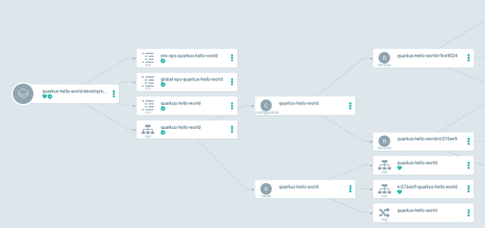](/sites/default/files/blog/2020/09/rev-2-dev.png)

Figure 12: The main route points to the previous application revision.

获取在`development`环境中运行的应用程序的当前路线:

```
$ oc get routes -n knative-serving-ingress | grep development
--------------------------------------------------------------
route-e387d9ca-9f1b-4c15-9b83-7bea4d2d290c-313361326363   quarkus-hello-world-development.apps.ocp4.mydomain.com                   kourier    http2   edge/Allow    None
route-e387d9ca-9f1b-4c15-9b83-7bea4d2d290c-353136303164   rc076ee9-quarkus-hello-world-development.apps.ocp4.mydomain.com          kourier    http2   edge/Allow    None

```

测试这两个版本，您会注意到主路径以先前的版本为目标:

```
$ curl http://quarkus-hello-world-development.apps.ocp4.mydomain.com/hello
hola dev! Yeap!

$ curl rc076ee9-quarkus-hello-world-development.apps.ocp4.mydomain.com/hello
hola dev! Nice to see you back!

```

如果您想在主路由下的新版本中添加流量，只需修改`traffic-routing.yaml`。导航到`quarkus-hello-world-deployment`存储库并进行`git pull`。然后，切换到开发文件夹，编辑`traffic-routing.yaml`文件。

更改以下文件:

```
- op: add
  path: /spec/traffic
  value:
    - revisionName: quarkus-hello-world-r9ce9024
      percent: 100

```

对此:

```
- op: add
  path: /spec/traffic
  value:
    - revisionName: quarkus-hello-world-r9ce9024
      percent: 50
    - revisionName: quarkus-hello-world-rc076ee9
      percent: 50

```

然后推动变革:

```
$ git add development/traffic-routing.yaml && git commit -m "Splitted traffic between r9ce9024 %50 and rc076ee9 50" && \
git push

```

在两分钟或更短的时间内，Argo CD 将自动同步这些更改，或者如果您想立即应用更改，您可以强制手动同步。

如果您检查主路由，您现在将看到它从两个修订中返回响应:

```
$ watch -n1 curl http://quarkus-hello-world-production.apps.ocp4.mydomain.com/hello

```

如果您想确保流量不会流向任何旧的应用程序版本，只需从`traffic-routing.yaml`文件中删除该版本。Knative 最终会对其进行垃圾收集，您可以自行测试。

### 暂存环境中的应用程序版本 2

我们还没有在`staging`环境中收到新的版本或路线。原因是 CI 管道没有更改`kustomization.yaml`文件。相反，它只是创造了一个可能的候选人:`kustomization-REVISION.yaml`。

让我们部署这个新版本(`mv staging/kustomization-rc076ee9.yaml staging/kustomization.yaml`)。我们将配置我们在开发中使用的相同路由，在我们当前的两个修订版之间划分流量:

```
$ git pull && \
mv staging/kustomization-rc076ee9.yaml staging/kustomization.yaml && \
cp development/traffic-routing.yaml staging/traffic-routing.yaml && \
rm -rf staging/r9ce9024 && \
git add  staging && git commit -m "Split traffic between r9ce9024 %50 and  rc076ee9 50%" && \
git push

```

请注意，我们还删除了一个旧的修订文件夹(`rm -rf staging/r9ce9024`)。CI 管道为开发自动完成这一工作，但不为登台或生产。删除旧版本将开发与演示中的其他两种环境区分开来。

应用程序在阶段中的最终结果将与开发环境中的结果相同，如图 13 所示。

[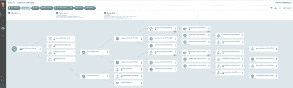](/sites/default/files/blog/2020/09/staging-rev-2sync.png)

Figure 13: The development and staging applications are in sync.

测试主路由，您应该会看到从两个 Knative 服务版本中得到响应:

```
$ watch -n1 curl http://quarkus-hello-world-staging.apps.ocp4.mydomain.com/hello

```

### 生产环境中的应用程序版本 2

如前所述，生产场景不同于转移，因为没有为生产设置自动同步。我们将执行与在试运行环境中完全相同的步骤，并查看结果。

```
$ git pull && \
mv production/kustomization-rc076ee9.yaml production/kustomization.yaml && \
cp staging/traffic-routing.yaml production/traffic-routing.yaml && \
rm -rf production/r9ce9024 && \
git add production && git commit -m "Split traffic between r9ce9024 %50 and rc076ee9 50%" && \
git push

```

### 不同步

当您检查 Argo CD 仪表板时，如图 14 所示，您应该观察到`quarkus-hello-world-production`应用程序是 **OutOfSync** 。无效的服务对象是受影响的对象。

[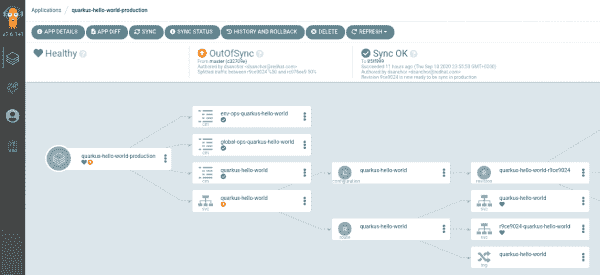](/sites/default/files/blog/2020/09/prod-oos-rev-2.png)

Figure 14: The Knative service object is out of sync.

点击`quarkus-hello-world`下的 **OutOfSync** 框，检查 **DIFF** 选项卡，如图 15 所示。

[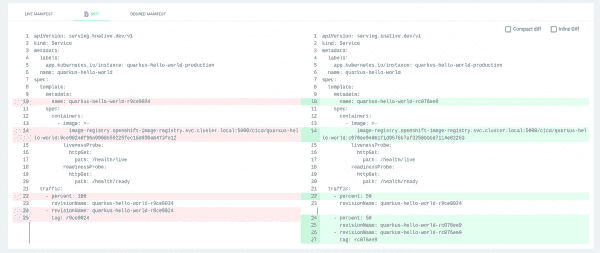](/sites/default/files/blog/2020/09/prod-diff.png)

Figure 15: Use the Diff tool to find the differences between application versions.

图 15 中的屏幕显示了实时清单和所需清单之间的差异，左侧显示的是实时版本。这些差异是我们所期望的，所以让我们在生产中手动同步和部署新的修订和路由规则。

同步后，测试主路由:

```
$ watch -n1 curl http://quarkus-hello-world-production.apps.ocp4.mydomain.com/hello

```

## 回滚到以前的状态

到目前为止，您已经看到了如何在每个环境中部署新的应用程序版本。如果您在生产应用程序的最新版本中发现了意外行为，该怎么办？让我们使用 Argo CD 回滚到以前的应用程序状态。

有了 Argo CD，我们可以回滚到 Git 库历史上的任何代码或应用程序修订。对于这个例子，我们将回滚到以前的版本。从 Argo CD 仪表板，点击**历史和回滚**，如图 16 所示。

[](/sites/default/files/blog/2020/09/rollbakc-menu.png)

Figure 16: Use the History and Rollback feature to return to a previous version of the application.

一旦你找到了你想要回滚到的版本，点击屏幕右上角的虚线菜单，然后选择你唯一拥有的操作:**回滚**。

[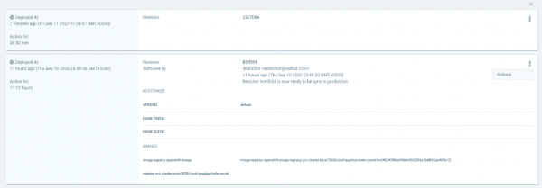](/sites/default/files/blog/2020/09/rollback-action.png)

Figure 17: Choose the revision that you want, then click Rollback.

如图 17 所示，结果是应用程序状态当前是 **OutOfSync** ，但是它与我们选择回滚的修订版同步。通过运行测试来验证回滚是否有效:

```
$ watch -n1 curl http://quarkus-hello-world-production.apps.ocp4.mydomain.com/hello

```

您应该能够确认响应来自以前的应用程序版本，而不是最新的版本。

**注意**:如果您为生产环境启用了自动同步，您需要在执行回滚之前禁用它。否则，您将再次自动同步到最新版本。

## 闭环:全自动 CI/CD

到目前为止，我们只手动触发了管道。作为这个工作流程的最后一步，我们将引入自动化来触发管道。

我把这一部分留在了文章的最后，这样我们就可以使用[完整的源代码库](https://github.com/dsanchor/quarkus-hello-world.git)来运行管道。我们将向这个存储库添加一个 webhook，当新的提交被推送到存储库时，它会自动触发管道。

开始之前，在[https://github.com/dsanchor/quarkus-hello-world.git](https://github.com/dsanchor/quarkus-hello-world.git)分叉源代码库。我们将在最后一个例子中使用它。

### 添加 Tekton 触发器

在 Tekton 方面，我们将创建三种不同类型的对象，它们一起工作:

*   [触发模板](https://github.com/tektoncd/triggers/blob/master/docs/triggertemplates.md)
*   [触发绑定](https://github.com/tektoncd/triggers/blob/master/docs/triggerbindings.md)
*   [事件监听器](https://github.com/tektoncd/triggers/blob/master/docs/eventlisteners.md)

在`EventListener`中，我们将添加两个拦截器:

*   GitHub 拦截器添加了一个基于共享令牌的简单检查。
*   [CEL 拦截器](https://github.com/tektoncd/triggers/blob/master/docs/eventlisteners.md#cel-interceptors)应用一个基本函数来缩短提交 ID，并使其对管道可用。

作为第一步，用随机令牌创建一个`secret`:

```
$ oc create secret generic webhook --from-literal=token=XXXXXXXXXXXXXX -n cicd

```

然后，创建一个公共的`TriggerTemplate`和`TriggerBinding`，它们将在不同的应用程序之间共享:

```
$ oc apply -f tekton/webhook/knative-pipeline-trigger.yaml -n cicd
--------------------------------------------------------------------
triggerbinding.triggers.tekton.dev/webhook-body-binding created
triggertemplate.triggers.tekton.dev/knative-pipeline-template created

```

接下来，创建特定于应用程序的`EventListener`和`TriggerBinding`。**重要的**:在`DEPLOYMENT_REPO_URL`使用你自己的部署库:

```
$ cat tekton/webhook/app-custom-trigger.yaml | \
  GITHUB_SECRET=webhook \
  APPLICATION=quarkus-hello-world \
  NS=cicd \
  DEPLOYMENT_REPO_URL=https://github.com/dsanchor/quarkus-hello-world-deployment \
  DEPLOYMENT_REPO_REVISION=master \
  envsubst | oc apply -f - -n cicd
-------------------------------------------------------------------------------------
eventlistener.triggers.tekton.dev/quarkus-hello-world-listener created
triggerbinding.triggers.tekton.dev/quarkus-hello-world-binding created

```

公开事件监听器服务，它将成为 GitHub 中 webhook 的目标端点:

```
$ oc expose svc el-quarkus-hello-world-listener -n cicd

```

并得到路线:

```
$ oc get route el-quarkus-hello-world-listener -n cicd
--------------------------------------------------------
NAME                              HOST/PORT                                                               PATH   SERVICES                          PORT            TERMINATION   WILDCARD
el-quarkus-hello-world-listener   el-quarkus-hello-world-listener-cicd.apps.ocp4.mydomain.com          el-quarkus-hello-world-listener   http-listener                 None

```

### 在 GitHub 中配置一个 webhook

现在，转到您的应用程序的 GitHub 存储库。在**设置**下，点击**网页钩子- >添加网页钩子**，如图 18 所示。

[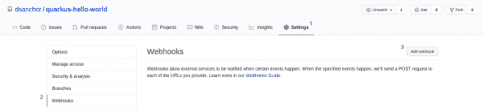](/sites/default/files/blog/2020/09/webhook-1.png)

Figure 18: Add a webhook in the project's GitHub repository.

添加路由作为有效负载 URL，将内容类型设置为 JSON，最后，将令牌内容复制到 secret box 中，如图 19 所示。

[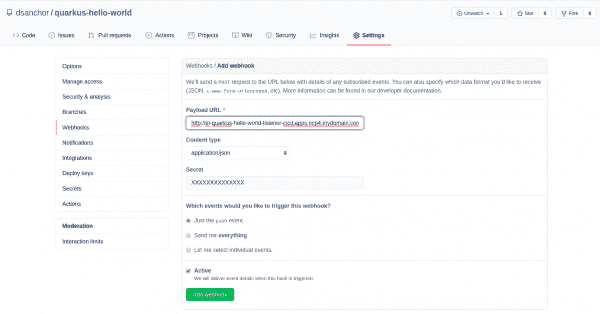](/sites/default/files/blog/2020/09/webhook-2.png)

Figure 19: Configure the webhook.

一旦您添加了这些最后的元素，您应该会在屏幕上看到一个 webhook。

### 尝试一下

我将在 [GreetingResource](https://github.com/dsanchor/quarkus-hello-world/blob/master/src/main/java/org/acme/quickstart/GreetingResource.java) 类中做一个简单的修改。您必须在您的[欢迎源测试](https://github.com/dsanchor/quarkus-hello-world/blob/master/src/test/java/org/acme/quickstart/GreetingResourceTest.java)中应用相同的更改。在我的例子中，我将消息的最后一部分改为“Webhooks 工作”

在本地通过所有测试之后，将您的更改推送到远程存储库:

```
$ git add src  && \
git commit -m "Changed greeting message" && \
git push

```

管道应该已经开始了。如果您遇到错误，您可能想要查看我们为管理`EventListener`的事件而创建的事件监听器 pod。要获得 pod 的名称，请运行:

```
$ oc get pod -l eventlistener=quarkus-hello-world-listener -n cicd

```

等待管道完成。一旦完成，您应该有一个新的 Knative service 版本在您的开发环境中运行。您可以使用 OpenShift web 控制台中的 [new developer 透视图来验证 Knative 服务正在运行。选择**开发**项目并检查拓扑，如图 20 所示。](https://developers.redhat.com/blog/2020/07/16/whats-new-in-the-openshift-4-5-console-developer-experience/)

[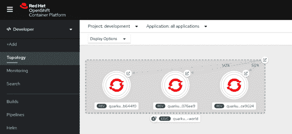](/sites/default/files/blog/2020/09/dev-console.png)

Figure 20: Use OpenShift's developer perspective to verify that the Knative service is running.

您应该会看到三个不同的修订在运行(尽管它们都由于不活动而缩小)。我们在本文的前几个步骤中部署的两个版本位于同一条主路由下，每个版本管理一半的流量。最后一个版本有自己的路线，是我们的管道创建的。让我们点击它，看看结果:

```
$ curl r1b644f0-quarkus-hello-world-development.apps.ocp4.mydomain.com/hello
hola dev! Webhooks work!

```

您还可以看到 Knative 自动将该修订扩展到一个 pod，如图 21 所示。

[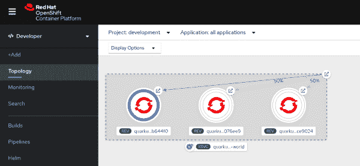](/sites/default/files/blog/2020/09/pod-scaled-up.png)

Figure 21: Knative auto-scales the newest application version.

## 结论

我关于构建现代 CI/CD 工作流的第二部分介绍了如何使用 Argo CD 来实现无服务器 CI/CD 工作流的连续交付。将 Tekton 与由 Argo CD 实现的 GitOps 相结合，是全自动 CI/CD 越来越受欢迎的选择。我希望您喜欢这次演示。

*Last updated: April 7, 2022*