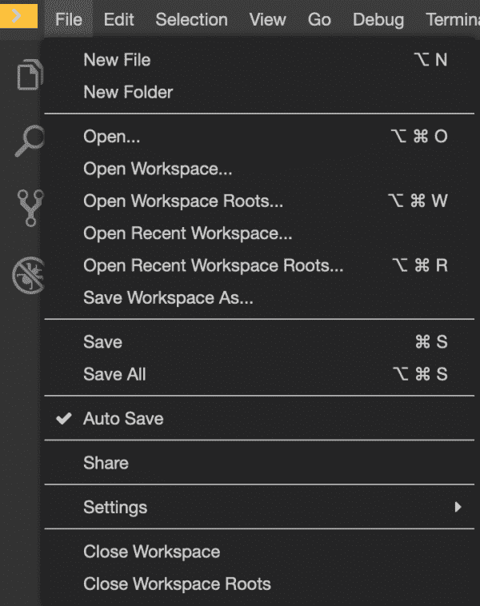

# 在 CodeReady Workspaces 2.4 中支持 IBM Z 和更多内容

> 原文：<https://developers.redhat.com/blog/2020/10/13/support-for-ibm-z-and-more-in-codeready-workspaces-2-4>

[Red Hat CodeReady work spaces 2.4](https://developers.redhat.com/products/codeready-workspaces/overview)现已推出。在这个版本中，我们专注于增加对 [IBM Z](https://www.ibm.com/it-infrastructure/z) 的支持，并改进 IDE 编辑器和配置元素。

CodeReady Workspaces (CRW) 2.4 在 [Red Hat OpenShift 3.11](https://access.redhat.com/documentation/en-us/red_hat_codeready_workspaces/2.0/html/installation_guide/installing-codeready-workspaces-on-openshift-3-using-the-operator_crw) 和 [OpenShift 4.4](https://developers.redhat.com/products/openshift/overview) 及更高版本上可用。CodeReady Workspaces 2.4 也可通过附加功能在 [OpenShift 专用 4.3](https://www.openshift.com/products/dedicated/) 上获得。

**注**:基于 [Eclipse Che](https://www.eclipse.org/che/getting-started/cloud) ，CodeReady Workspaces 是一个 OpenShift 原生开发者环境，支持云原生开发。

## 对 IBM Z 的支持

现在可以在 IBM Z 大型机系统上运行的 [OpenShift](https://developers.redhat.com/openshift) 集群上部署 CodeReady 工作区[操作员](https://developers.redhat.com/topics/kubernetes/operators)。如果您在一台 [Windows](https://developers.redhat.com/blog/category/windows/) 、macOS 或 [Linux](https://developers.redhat.com/topics/linux) 机器上使用 CodeReady 工作区，您可以使用 CRW 命令行界面(CLI)`crwctl`来达到相同的目的。

CodeReady Workspaces 不正式支持在 IBM Z 上部署到断开连接的 OpenShift 集群。为 IBM Z 和一些语言提供的 devfiles 和示例较少，比如[。不支持网络核心](https://developers.redhat.com/topics/dotnet)。

## IDE 和配置改进

在这个版本中，我们重点关注了 IDE 和配置的一些改进。

### 从 IDE 中切换或关闭工作区

如图 1 所示，您现在可以使用 CodeReady Workspaces IDE 来关闭一个正在运行的工作区，或者切换到一个不同的工作区，同时保持当前工作区处于活动状态:

Figure 1\. Close or Switch workspaces from the IDE

Figure 1: Close or switch workspaces from the CodeReady Workspaces IDE.

### 来自 OpenShift 信任的 CA 捆绑包的支持证书

当 OpenShift 配置了可信证书颁发机构(CA)签名的证书时，CodeReady 工作区会自动处理所有这些证书以及明确分配给它的证书。

### 使用自定义主机名进行配置

现在，您可以在 CheCluster 自定义资源中使用自定义的`hostname`值来设置配置属性`cheHost`。然后，定制的`hostname`值将用于与 CodeReady Workspaces 服务器的所有通信。您必须确保自定义资源配置有自定义`hostname`值的可信证书。

### 支持. devfile.yaml 名称格式

在您的源项目文件夹中，您现在可以包含一个文件名格式为`.devfile.yaml`或`devfile.yaml</`的 devfile。如果没有找到任何名为`devfile.yaml`的文件，CodeReady Workspaces 会自动搜索名为`.devfile.yaml`的文件。

## 试用 CodeReady Workspaces 2.4

CodeReady Workspaces 2.4 现已在 OpenShift 3.11 和 OpenShift 4.x 上推出。

*   如果你使用的是 OpenShift 3.11，你可以在这里找到安装说明[。](https://access.redhat.com/documentation/en-us/red_hat_codeready_workspaces/2.0/html/installation_guide/installing-codeready-workspaces-on-openshift-3-using-the-operator_crw)
*   如果您使用的是 OpenShift 4.x，您可以直接从 OpenShift OperatorHub 安装，并遵循此处的文档。
*   如果您在 IBM Z 上使用 OpenShift 4.x，您可以直接从 OperatorHub 安装，并遵循这里的文档。
*   [下载](https://developers.redhat.com/products/codeready-workspaces/download)Red Hat CodeReady work spaces CLI。
*   [访问](https://developers.redhat.com/products/codeready-workspaces)code ready work spaces 产品页面。

*Last updated: October 12, 2020*