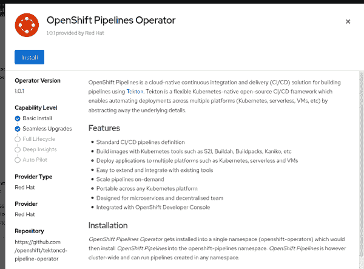
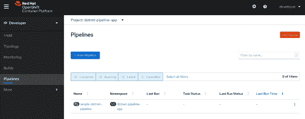
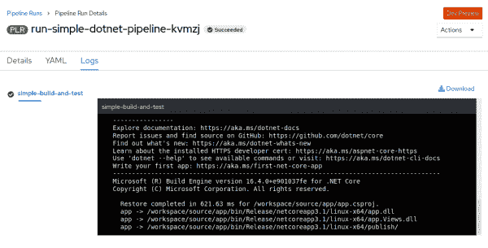
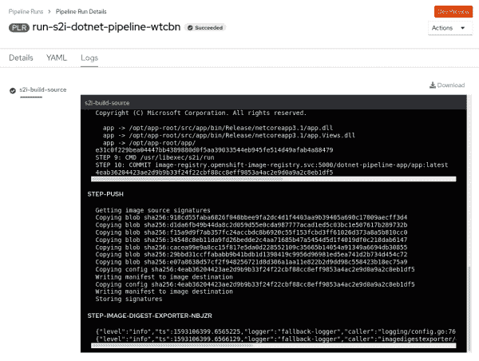

# 为设置持续集成。具有 OpenShift 流水线的网络核心

> 原文：<https://developers.redhat.com/blog/2020/09/24/set-up-continuous-integration-for-net-core-with-openshift-pipelines>

有没有想过为[设立](https://developers.redhat.com/topics/dotnet)[持续集成](https://developers.redhat.com/topics/ci-cd) (CI)。NET Core 以云原生的方式，但是你不知道从哪里开始？这篇文章提供了一个概述、例子和建议，供那些想开始为{\\ lang 1033 {\\ lang 1033 ,}建立一个有效的{\\ lang 1033 {\\ lang 1033 ,} T4 {\\ lang 1033 {\\ lang 1033 ,}云-原生 CI {\\ lang 1033 {\\\ F2 ,}系统的开发人员参考。网芯。

我们将使用新的 [Red Hat OpenShift Pipelines](https://developers.redhat.com/blog/2020/04/30/creating-pipelines-with-openshift-4-4s-new-pipeline-builder-and-tekton-pipelines/) 特性来实现。网芯 CI。 [OpenShift 管道](https://developers.redhat.com/blog/2020/04/27/modern-web-applications-on-openshift-part-4-openshift-pipelines)基于开源 [Tekton](https://github.com/tektoncd/pipeline#-tekton-pipelines) 项目。OpenShift 管道提供了一种云原生方式来定义管道，以便在持续集成工作流中构建、测试、部署和推出您的应用程序。

在本文中，您将学习如何:

1.  建立一个简单的。NET 核心应用程序。
2.  在[红帽开档](https://developers.redhat.com/products/openshift/overview)上安装开档管线。
3.  手动创建简单的管道。
4.  创建基于源到图像(S2I)的管道。

## 先决条件

您将需要对 OpenShift 实例的集群管理员访问权限，以便能够访问示例应用程序并遵循本文中描述的所有步骤。如果您无权访问 OpenShift 实例，或者如果您没有集群管理权限，您可以使用[Red Hat code ready Containers](https://developers.redhat.com/products/codeready-containers/overview)在您的机器上本地运行 OpenShift 实例。本地运行 OpenShift 应该像`crc setup`后跟`crc start`一样简单。另外，一定要将[安装](https://docs.openshift.com/container-platform/4.4/cli_reference/openshift_cli/getting-started-cli.html)工具`oc`；我们将在整个例子中使用它。

当我写这篇文章的时候，我用的是:

```
$ crc version
CodeReady Containers version: 1.12.0+6710aff
OpenShift version: 4.4.8 (embedded in binary)

```

## 示例应用程序

首先，让我们回顾一下。NET 核心项目，我们将在本文的剩余部分使用它。这是一个简单的“Hello，World”风格的 web 应用程序，构建在 ASP.NET 核心之上。

完整的应用程序可以从 Red Hat 开发者 [s2i-dotnetcore-ex](https://github.com/redhat-developer/s2i-dotnetcore-ex) GitHub 资源库获得，在分支[dotnetcore-3.1-open shift-manual-pipeline](https://github.com/redhat-developer/s2i-dotnetcore-ex/tree/dotnetcore-3.1-openshift-manual-pipeline)中。对于本文中描述的步骤，您可以直接使用这个存储库和分支。如果您想要进行更改并测试它们如何影响您的管道，那么您可以派生存储库并使用 fork。

一切都包含在源存储库中，包括我们持续集成所需的一切。这种方法至少有几个优点:我们的完整设置是可跟踪和可复制的，并且我们可以很容易地对以后可能做的更改进行代码审查，包括对 CI 渠道的任何更改。

### 项目目录

在我们继续之前，让我们回顾一下存储库的`dotnetcore-3.1-openshift-manual-pipeline`分支。

这个项目包含两个主目录:`app`和`app.tests`。`app`目录包含应用程序代码。这个应用程序本质上是由`dotnet new mvc`创建的。`app.tests`目录包含我们在构建应用程序时想要运行的单元测试。这是由`dotnet new xunit`创作的。

另一个名为`ci`的目录包含我们将用于 CI 设置的配置。在我们浏览示例时，我将详细描述该目录中的文件。

现在，让我们开始有趣的部分。

## 安装 OpenShift 管道

以管理员身份登录 OpenShift 集群，安装 OpenShift 管道。您可以在 OpenShift 控制台中使用 **OperatorHub** ，如图 1 所示。

[](/sites/default/files/blog/2020/07/blog-image-01.png)

Figure 1: Use the OpenShift OperatorHub to install OpenShift Pipelines.

关于安装 OpenShift 管道操作器的完整指南，参见 [OpenShift 文档](https://docs.openshift.com/container-platform/4.4/pipelines/installing-pipelines.html)。

## 手动开发管道

现在我们有了。NET 核心应用程序代码和 OpenShift 实例，我们可以创建一个基于 Openshift 管道的系统来构建这些代码。对于我们的第一个例子，我们将手动创建一个管道。

在我们创建管道之前，让我们先了解一些关于 OpenShift 管道的事情。

### 关于 OpenShift 管道

OpenShift 管道提供了一种构建和部署应用程序的灵活方式。OpenShift 管道不是固执己见的:作为管道的一部分，你可以做任何你想做的事情。为了实现这种灵活性，OpenShift 管道允许我们定义几种不同类型的对象。这些对象表示管道的各个部分，例如输入、输出、阶段，甚至这些元素之间的连接。我们可以根据需要组装这些对象，以获得我们想要的构建-测试-部署管道。

以下是我们将使用的几种类型的对象:

*   一个 **OpenShift 管道`Task`** 是我们想要按顺序运行的`step`的集合。有许多预定义的`Task`，我们可以根据需要创建更多。`Task`可以有输入和输出。它们也可以有控制`Task`方面的参数。
*   一个 **`Pipeline`** 是一个`Task`的集合。它让我们将`Task`分组并以特定的顺序运行它们，它让我们将一个`Task`的输出连接到另一个`Task`的输入。
*   一个 **`PipelineResource`** 表示一个`Task`或的输入或输出。有几种类型，包括`git`和`image`。`git` `PipelineResource`表示一个 Git 存储库，它经常被用作`Pipeline`或`Task`的输入。一个`image` `PipelineResource`表示一个容器映像，我们可以通过内置的 OpenShift 容器注册表来使用它。

这些对象描述了什么是`Pipeline`。我们至少还需要两样东西来运行管道。在 OpenShift 中，创建和运行管道是两个不同的操作。您可以创建一个管道，但永远不运行它。或者，您可以多次重新运行同一管道。

*   一个 **`TaskRun`** 描述了如何运行一个`Task`。它将一个`Task`的输入和输出与`PipelineResource` s 相连
*   一个 **`PipelineRun`** 描述了如何运行一个`Pipeline`。它用`PipelineResource` s 连接管道的输入和输出。一个`PipelineRun`隐式包含一个或多个`TaskRun`，所以我们可以跳过手动创建`TaskRun` s。

现在我们准备将所有这些元素付诸行动。

### 步骤 1:创建新的管道项目

首先，我们将创建一个在 OpenShift 中工作的新项目:

```
$ oc new-project dotnet-pipeline-app
```

为了创建一个功能管道，我们需要定义一些对象，我们可以将它们添加到一个文件中， [simple-pipeline.yaml](https://github.com/redhat-developer/s2i-dotnetcore-ex/blob/dotnetcore-3.1-openshift-manual-pipeline/ci/simple/simple-pipeline.yaml) 。这个文件位于我们正在使用的存储库中的`ci/simple/simple-pipeline.yaml`文件中。为了区分这些对象，我们将在一行中单独使用一个破折号(`---`)。

### 步骤 2:定义 PipelineResource

接下来，我们将定义一个`PipelineResource`。`PipelineResource`将为管道的其余部分提供源 Git 存储库:

```
apiVersion: tekton.dev/v1alpha1
kind: PipelineResource
metadata:
  name: simple-dotnet-project-source
spec:
  type: git
  params:
    - name: revision
      value: dotnetcore-3.1-openshift-manual-pipeline
    - name: url
      value: https://github.com/redhat-developer/s2i-dotnetcore-ex

```

`kind: PipelineResource`的对象有一个名字(`metadata.name`)和一个资源类型(`spec.type`)。这里，我们使用类型`git`来表示这个`PipelineResource`代表一个 Git 仓库。这个`PipelineResource`的参数指定了我们想要使用的 Git 存储库。

如果您使用自己的分支，请调整 URL 和分支名称。

### 步骤 3:定义管道

接下来，我们定义一个管道。`Pipeline`实例将协调我们想要运行的所有任务:

```
apapiVersion: tekton.dev/v1beta1
kind: Pipeline
metadata:
  name: simple-dotnet-pipeline
spec:
  resources:
    - name: source-repository
      type: git
  tasks:
    - name: simple-build-and-test
      taskRef:
        name: simple-publish
      resources:
        inputs:
          - name: source
            resource: source-repository

```

这个`Pipeline`使用了一个名为`source-repository`的资源(一个`PipelineResource`),这个资源应该是一个`git`仓库。它只使用一个`Task`(通过`taskRef`和`simple-publish`的`name`)来构建我们的源代码。我们将把管道的输入(`source-repository`资源)连接到任务的输入(`source`输入资源)。

### 步骤 4:定义并构建一个任务

接下来，我们定义一个简单的`Task`，它接受一个`git`源存储库。然后，我们构建任务:

```
apiVersion: tekton.dev/v1beta1
kind: Task
metadata:
  name: simple-publish
spec:
  resources:
    inputs:
      - name: source
        type: git
  steps:
    - name: simple-dotnet-publish
      image: registry.access.redhat.com/ubi8/dotnet-31 # .NET Core SDK
      securityContext:
        runAsUser: 0  # UBI 8 images generally run as non-root
      script: |
          #!/usr/bin/bash
          dotnet --info
          cd source
          dotnet publish -c Release -r linux-x64 --self-contained false "app/app.csproj"

```

这个`Task`接受一个代表应用程序源代码的`git`类型的`PipelineResource`。它运行列出的`steps`来使用`ubi8/dotnet-31`容器映像构建源代码。这个容器图像是由 Red Hat 发布的，并针对构建进行了优化。NET 核心应用在[红帽企业版 Linux](https://developers.redhat.com/topics/linux) (RHEL)和 OpenShift。我们还通过`script`指定了构建我们的。NET 核心应用程序，本质上只是一个`dotnet publish`。

### 步骤 5:描述和应用管道

我们拥有描述管道所需的一切。我们最终的[ci/simple/simple-pipeline . YAML](https://github.com/redhat-developer/s2i-dotnetcore-ex/blob/dotnetcore-3.1-openshift-manual-pipeline/ci/simple/simple-pipeline.yaml)文件应该是这样的:

```
apiVersion: tekton.dev/v1alpha1
kind: PipelineResource
metadata:
  name: simple-dotnet-project-source
spec:
  type: git
  params:
    - name: revision
      value: dotnetcore-3.1-openshift-manual-pipeline
    - name: url
      value: https://github.com/redhat-developer/s2i-dotnetcore-ex
---
apiVersion: tekton.dev/v1beta1
kind: Pipeline
metadata:
  name: simple-dotnet-pipeline
spec:
  resources:
    - name: source-repository
      type: git
  tasks:
    - name: simple-build-and-test
      taskRef:
        name: simple-publish
      resources:
        inputs:
          - name: source
            resource: source-repository
---
apiVersion: tekton.dev/v1beta1
kind: Task
metadata:
  name: simple-publish
spec:
  resources:
    inputs:
      - name: source
        type: git
  steps:
    - name: simple-dotnet-publish
      image: registry.access.redhat.com/ubi8/dotnet-31 # .NET Core SDK
      securityContext:
        runAsUser: 0  # UBI 8 images generally run as non-root
      script: |
          #!/usr/bin/bash
          dotnet --info
          cd source
          dotnet publish -c Release -r linux-x64 --self-contained false "app/app.csproj"

```

我们现在可以将它应用到 OpenShift 实例中:

```
$ oc apply -f ci/simple/simple-pipeline.yaml
```

将管道应用到我们的 OpenShift 实例会使 OpenShift 修改其当前活动的配置，以匹配我们在 YAML 文件中指定的内容。这包括创建以前不存在的任何对象(如`Pipeline`、`PipelineResource`和`Task`)。如果相同名称和类型的对象已经存在，它们将被修改以匹配我们在 YAML 文件中指定的内容。

如果您查看 OpenShift 开发人员控制台的**管道**部分(如果您正在使用 CodeReady 容器，则查看`crc console`，您应该看到该管道现在是可用的，如图 2 所示。

[](/sites/default/files/blog/2020/07/blog-image-02.png)

Figure 2: The new pipeline in the OpenShift developer console.

你注意到管道没有运行吗？我们接下来会处理这个问题。

### 步骤 6:运行管道

为了运行管道，我们将创建一个`PipelineRun`对象，该对象将`PipelineResource`与`Pipeline`本身相关联，并且实际上运行一切。本例中的`PipelineRun`对象是[ci/simple/run-simple-pipeline . YAML](https://github.com/redhat-developer/s2i-dotnetcore-ex/blob/dotnetcore-3.1-openshift-manual-pipeline/ci/simple/run-simple-pipeline.yaml)，如下图所示:

```
apiVersion: tekton.dev/v1beta1
kind: PipelineRun
metadata:
  generateName: run-simple-dotnet-pipeline-
spec:
  pipelineRef:
    name: simple-dotnet-pipeline
  resources:
    - name: source-repository
      resourceRef:
        name: simple-dotnet-project-source

```

这个 YAML 文件定义了一个对象`kind: PipelineRun`，它使用了`simple-dotnet-pipeline`(用`pipelineRef`表示)。它将我们之前定义的`simple-dotnet-project-source` `PipelineResource`与`simple-dotnet-pipeline`期望的输入资源相关联。

接下来，我们将使用`oc create`(而不是`oc apply`)来创建和运行管道:

```
$ oc create -f ci/simple/run-simple-pipeline.yaml
```

这里我们需要使用`oc create`,因为每个`PipelineRun`代表一个管道的实际调用。我们不希望`apply`升级到之前运行的`Pipeline`。我们想(再次)运行管道。

这也是我们在定义管道 YAML 时使用`generateName`而不是`name`的原因。每个 OpenShift 对象都有一个唯一的名称，包括一个`PipelineRun`。如果我们给我们的管道一个具体的名字，我们就不能再`oc create`它了。为了解决这个问题，我们告诉 OpenShift 生成一个新的名称，在名称前面加上我们提供的值。这允许我们多次运行`oc create -f ci/simple/simple-pipeline.yaml`。每次我们输入这个命令，它都会在 OpenShift 中运行管道。

您现在应该看到管道在 OpenShift 控制台中运行，如图 3 所示。稍等一会儿，它就会完成。

[](/sites/default/files/blog/2020/07/blog-image-03.png)

Figure 3: The manually created pipeline running in the OpenShift console.

## 开发基于 S2I 的管道

在上一节中，我们手动创建了一个管道。为此，我们必须写出发布应用程序的所有步骤。我们必须列出构建代码的具体步骤，以及我们想要用来构建代码的容器映像。我们还必须列出任何其他步骤，比如运行测试。

通过重用预定义的任务，我们可以让生活变得更轻松。预定义的`s2i-dotnet-3` `Task`已经知道如何使用`s2i-dotnetcore`映像构建一个. NET 核心应用程序。在这一节中，您将学习如何构建基于 S2I 的管道。

### 步骤 1:安装。网络核心`s2i`任务

让我们从为安装`s2i`任务开始。网络核心 3.x:

```
$ oc apply -f https://raw.githubusercontent.com/openshift/pipelines-catalog/master/task/s2i-dotnet-3-pr/0.1/s2i-dotnet-3-pr.yaml

```

### 步骤 2:向存储库中添加一个`.s2i/environment`文件

我们还需要使用代码库中的一些新文件来告诉 S2I 构建系统什么。用于测试和部署的. NET 核心项目。我们可以通过向存储库添加一个`.s2i/environment`文件来实现这一点，该文件包含以下两行:

```
DOTNET_STARTUP_PROJECT=app/app.csproj
DOTNET_TEST_PROJECTS=app.tests/app.tests.csproj

```

指定我们想要在最终构建的容器中运行什么项目(或应用程序)。`DOTNET_TEST_PROJECTS`指定在构建应用程序容器之前，我们希望运行哪些项目(如果有的话)来测试我们的代码。

### 步骤 3:定义管道

现在，让我们在单个管道文件中定义一个`Pipeline`、`PipelineResource` s 和`Task` s。这一次，我们将使用`s2i-dotnet-3-pr`任务。我们还将包含另一个带有`type: image`的`PipelineResource`，它代表输出容器图像。该管道将构建源代码，然后将刚刚构建的应用程序映像推入 OpenShift 的内置容器注册表中。我们的 [ci/s2i/s2i-pipeline.yaml](https://github.com/redhat-developer/s2i-dotnetcore-ex/blob/dotnetcore-3.1-openshift-manual-pipeline/ci/s2i/s2i-pipeline.yaml) 应该是这样的:

```
apiVersion: tekton.dev/v1alpha1
kind: PipelineResource
metadata:
  name: s2i-dotnet-project-source
spec:
  type: git
  params:
    - name: revision
      value: dotnetcore-3.1-openshift-manual-pipeline
    - name: url
      value: https://github.com/redhat-developer/s2i-dotnetcore-ex
---
apiVersion: tekton.dev/v1alpha1
kind: PipelineResource
metadata:
  name: s2i-dotnet-image
spec:
  type: image
  params:
    - name: url
      value: image-registry.openshift-image-registry.svc:5000/dotnet-pipeline-app/app:latest
---
apiVersion: tekton.dev/v1beta1
kind: Pipeline
metadata:
  name: s2i-dotnet-pipeline
spec:
  resources:
    - name: source-repository
      type: git
    - name: image
      type: image
  tasks:
    - name: s2i-build-source
      taskRef:
        name: s2i-dotnet-3-pr
      params:
        - name: TLSVERIFY
          value: "false"
      resources:
        inputs:
          - name: source
            resource: source-repository
        outputs:
          - name: image
            resource: image

```

请注意我们是如何为`s2i-dotnet-3-pr`任务提供`source-repository`资源和`image`资源的。这个任务已经知道如何从源代码(基于`.s2i/environment`文件的内容)构建一个. NET 核心应用程序，并创建一个包含刚刚构建的应用程序的容器映像。

**注意**:请记住，您只能将容器映像推送到与您的 OpenShift 项目相同的名称空间，在本例中是`dotnet-pipeline-app`。如果我们尝试使用一个容器名，将容器图像放在除了`/dotnet-pipeline-app/`以外的地方，我们会遇到权限问题。

### 步骤 4:在 OpenShift 中应用管道

现在让我们在 OpenShift 中设置这个管道:

```
$ oc apply -f ci/s2i/s2i-pipeline.yaml

```

新的`s2i-dotnet-pipeline`现在应该出现在 OpenShift 开发人员控制台的**管道**部分，如图 4 所示。

[](/sites/default/files/blog/2020/07/blog-image-04.png)

Figure 4: The new pipeline in the OpenShift developer console.

### 步骤 5:运行管道

为了运行这个管道，我们将创建另一个`PipelineRun`，就像我们在前面的例子中所做的一样。这里是我们的 ci/s2i/run-s2i-pipeline。 [yaml](https://github.com/redhat-developer/s2i-dotnetcore-ex/blob/dotnetcore-3.1-openshift-manual-pipeline/ci/s2i/run-s2i-pipeline.yaml) 文件:

```
apiVersion: tekton.dev/v1beta1
kind: PipelineRun
metadata:
  generateName: run-s2i-dotnet-pipeline-
spec:
  serviceAccountName: pipeline
  pipelineRef:
    name: s2i-dotnet-pipeline
  resources:
    - name: source-repository
      resourceRef:
        name: s2i-dotnet-project-source
    - name: image
      resourceRef:
        name: s2i-dotnet-image

```

运行时使用:

```
$ oc create -f ci/s2i/run-s2i-pipeline.yaml

```

当您查看 OpenShift 开发人员控制台时，您可以看到管道正在运行(或者已经完成)。管道日志应该如图 5 所示:

[](/sites/default/files/blog/2020/07/blog-image-05.png)

Figure 5: The new pipeline running in the OpenShift developer console.

这一次，我们可以看到管道启动了，运行了我们所有的测试，发布了我们的应用程序，用它创建了一个容器映像，并将刚刚构建的容器推入 OpenShift 中的内置容器注册表。

很好，不是吗？

## 结论

如果您阅读了本文，那么您现在应该知道如何创建云就绪 CI 管道的代码优先实现，以便为您的构建、测试和发布容器映像。NET 核心应用程序。既然您已经熟悉了这个过程，为什么不在您的应用程序中尝试一下呢？

如果你正在寻找进一步加深你所学知识的想法，这里有一些建议:

1.  我们手动触发了所有的管道运行，但这显然不是您想要的真正的持续集成设置。考虑扩展管道，从您的源存储库中在触发器和 webhooks 上运行[。](https://docs.openshift.com/container-platform/4.4/pipelines/creating-applications-with-cicd-pipelines.html#about-triggers_creating-applications-with-cicd-pipelines)
2.  我们将 CI 管道限制为在构建和发布容器映像后停止。尝试创建一个管道，一直到在 OpenShift 中部署您的项目。

## 额外资源

*   了解更多关于 Red Hat [CodeReady 容器](https://code-ready.github.io/crc)的信息。
*   获取关于[使用 OpenShift 管道](https://docs.openshift.com/container-platform/4.4/pipelines/creating-applications-with-cicd-pipelines.html)创建应用程序的完整说明。
*   查看 [Tekton 任务/管道目录](https://github.com/tektoncd/catalog)。
*   同样，参见 [OpenShift 管道目录](https://github.com/openshift/pipelines-catalog)。
*   得到 [s2i 点网任务](https://github.com/openshift/pipelines-catalog/tree/master/task)。
*   获取 S2I 集装箱图片。网芯。

*Last updated: April 7, 2022*