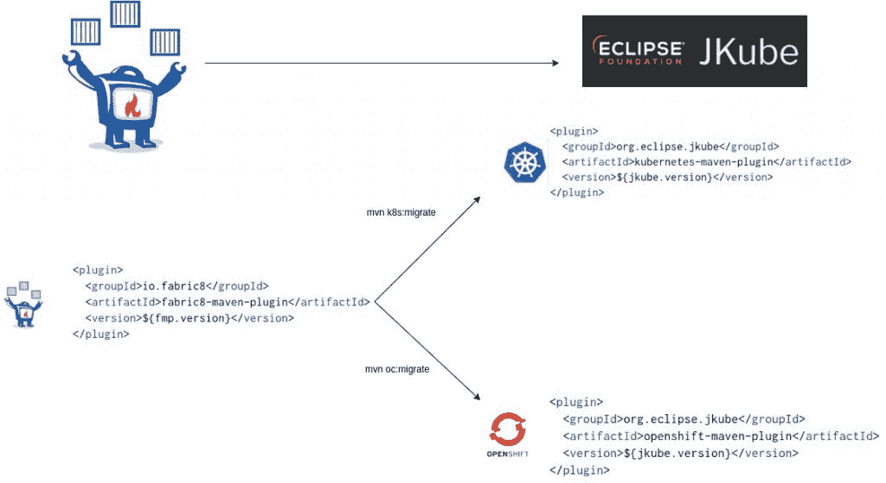

# 从 Fabric8 Maven 插件迁移到 Eclipse JKube 1.0.0

> 原文：<https://developers.redhat.com/blog/2020/09/21/migrating-from-fabric8-maven-plugin-to-eclipse-jkube-1-0-0>

最近发布的 Eclipse JKube 1.0.0 意味着不再支持 [Fabric8 Maven 插件](https://github.com/fabric8io/fabric8-maven-plugin)。如果你目前正在使用 Fabric8 Maven 插件，这篇文章提供了迁移到 [JKube](https://www.eclipse.org/jkube/) 的指导。我还将解释 Eclipse JKube 和 Fabric8 Maven 插件之间的关系(它们是同一个东西)，并介绍新的 Eclipse JKube 1.0.0 版本的亮点。这些迁移说明适用于在 [Kubernetes](https://developers.redhat.com/topics/kubernetes) 和 [Red Hat OpenShift](https://developers.redhat.com/products/openshift/overview) 平台上工作的开发人员。

## Eclipse JKube 是 Fabric8 Maven 插件

Eclipse JKube 和 Fabric8 Maven 插件是同一个插件。Eclipse JKube 最早发布于 2014 年，名为 Fabric8 Maven Plugin。我们在 2019 年 12 月预发布 Eclipse JKube 0.1.0 时，开发团队更改了名称。关于名称更改的更多信息，请参见我最近的[对 Eclipse JKube 的介绍](https://developers.redhat.com/blog/2020/01/28/introduction-to-eclipse-jkube-java-tooling-for-kubernetes-and-red-hat-openshift/)。本文主要关注向 JKube 1.0.0 的迁移。

## Eclipse JKube 1.0.0 中的新特性

如果您对迁移到 JKube 犹豫不决，新 1.0.0 版本中的以下亮点可能会改变您的想法:

*   使用新的 [Kubernetes Maven 插件](https://search.maven.org/artifact/org.eclipse.jkube/kubernetes-maven-plugin)和 [OpenShift Maven 插件](https://search.maven.org/search?q=a:openshift-maven-plugin)进行目标迁移。
*   [基于](https://quay.io/organization/jkube)[红帽通用基础图像](https://developers.redhat.com/articles/ubi-faq) (UBI)和 [JDK 11](https://developers.redhat.com/topics/enterprise-java) 的改进基础图像。(Fabric8 Maven 插件的图片基于 JDK 8。)
*   没有耦合到 [fabric8.io](http://fabric8.io/) 平台。
*   对 web 应用程序和 [Quarkus](https://developers.redhat.com/products/quarkus/getting-started) 的源到图像(S2I)支持。
*   通过 [JIB 集成](https://www.eclipse.org/jkube/docs/kubernetes-maven-plugin#_jib_java_image_builder)更好地支持[容器化](https://developers.redhat.com/topics/containers)您的应用程序。
*   Kubernetes Maven 插件和 OpenShift Maven 插件中的[头盔支持](https://www.eclipse.org/jkube/docs/kubernetes-maven-plugin#jkube:helm)。
*   基于独立于 [Maven](https://maven.apache.org/) 和 [Gradle](https://gradle.org/) 的 [JKube Kit](https://github.com/eclipse/jkube/tree/master/jkube-kit) 。
*   在 Eclipse JKube 1.1.0 中，对 Podman 和 Buildah 的支持即将到来。

Fabric8 Maven 插件生成 Kubernetes 和 Red Hat OpenShift 工件，并自动检测和部署资源到底层集群。但是使用 Kubernetes 的开发者不需要 OpenShift 工件，OpenShift 开发者也不需要 Kubernetes 清单。我们通过将 Fabric8 Maven 插件分成两个插件来解决这个问题:Kubernetes Maven 插件和 OpenShift Maven 插件。

## Eclipse JKube 迁移变得简单

Eclipse JKube 有一个`migrate`目标，自动将您的`pom.xml`中的 Fabric8 Maven 插件引用更新为 Kubernetes Maven 插件或 OpenShift Maven 插件。在接下来的几节中，我将向您展示如何将一个基于 Fabric8 Maven 插件的项目迁移到任一平台。

[](https://developers.redhat.com/blog/wp-content/uploads/2020/09/Untitled-Diagram.jpg)

出于演示的目的，我们可以使用我以前的随机生成器应用程序，它在一个`/random`端点显示一个随机的 JSON 响应。首先，克隆此存储库:

```
$ git clone https://github.com/rohanKanojia/fmp-demo-project.git
cd fmp-demo-project

```

然后构建项目:

```
$ mvn clean install

```

## 面向 Kubernetes 用户的 Eclipse JKube 迁移

使用下面的目标迁移到 Eclipse JKube 的 Kubernetes Maven 插件。注意，我们必须指定一个完整的`artifactId`和`groupId`，因为插件不会自动包含在`pom.xml`中:

```
$ mvn org.eclipse.jkube:kubernetes-maven-plugin:migrate

```

以下是`migrate`目标的日志:

```
fmp-demo-project : $ mvn org.eclipse.jkube:kubernetes-maven-plugin:migrate
[INFO] Scanning for projects...
[INFO]
[INFO] ----------------------< meetup:random-generator >-----------------------
[INFO] Building random-generator 0.0.1
[INFO] --------------------------------[ jar ]---------------------------------
[INFO]
[INFO] --- kubernetes-maven-plugin:1.0.0-rc-1:migrate (default-cli) @ random-generator ---
[INFO] k8s: Found Fabric8 Maven Plugin in pom with version 4.4.1
[INFO] k8s: Renamed src/main/fabric8 to src/main/jkube
[INFO] ------------------------------------------------------------------------
[INFO] BUILD SUCCESS
[INFO] ------------------------------------------------------------------------
[INFO] Total time:  3.154 s
[INFO] Finished at: 2020-09-08T19:32:01+05:30
[INFO] ------------------------------------------------------------------------
fmp-demo-project : $

```

您会注意到所有的 Fabric8 Maven 插件引用都被 Eclipse JKube 的引用所取代。Kubernetes Maven 插件与 Fabric8 Maven 插件相同。唯一的区别是前缀`k8s`,它生成 Kubernetes 清单。

一旦安装了 Kubernetes Maven 插件，就可以像往常一样部署应用程序了:

```
$ mvn k8s:build k8s:resource k8s:deploy

```

## 面向 OpenShift 用户的 Eclipse JKube 迁移

对 OpenShift Maven 插件使用与 Kubernetes Maven 插件相同的迁移过程。运行`migrate`目标，但指定 OpenShift MavenPlugin:

```
$ mvn org.eclipse.jkube:openshift-maven-plugin:migrate

```

以下是这个`migrate`目标的日志:

```
fmp-demo-project : $ mvn org.eclipse.jkube:openshift-maven-plugin:migrate
[INFO] Scanning for projects...
[INFO]
[INFO] ----------------------< meetup:random-generator >-----------------------
[INFO] Building random-generator 0.0.1
[INFO] --------------------------------[ jar ]---------------------------------
[INFO]
[INFO] --- openshift-maven-plugin:1.0.0-rc-1:migrate (default-cli) @ random-generator ---
[INFO] k8s: Found Fabric8 Maven Plugin in pom with version 4.4.1
[INFO] k8s: Renamed src/main/fabric8 to src/main/jkube
[INFO] ------------------------------------------------------------------------
[INFO] BUILD SUCCESS
[INFO] ------------------------------------------------------------------------
[INFO] Total time:  4.227 s
[INFO] Finished at: 2020-09-08T19:41:34+05:30
[INFO] ------------------------------------------------------------------------

```

这个目标是用对 [OpenShift Maven 插件](https://www.eclipse.org/jkube/docs/openshift-maven-plugin)的引用替换你所有的 Fabric8 Maven 插件引用。然后，您可以像平常一样将应用程序部署到 Red Hat OpenShift:

```
$ mvn oc:build oc:resource oc:deploy

```

## 结论

关于从 OpenShift 或 Kubernetes 上的 Fabric8 Maven 插件迁移的更多信息，请参见 [Eclipse JKube 迁移指南](https://www.eclipse.org/jkube/docs/migration-guide/)。请随意创建一个 [GitHub 问题](https://github.com/eclipse/jkube/issues/new)来报告您在迁移过程中遇到的任何问题。我们非常重视您的反馈，因此请报告错误，要求改进，并告诉我们您的迁移体验。

无论您已经在使用 Eclipse JKube 还是只是好奇，请不要羞于加入我们的欢迎社区:

*   在 [GitHub](https://github.com/eclipse/jkube/issues) 上提供反馈。
*   Craft code 和 [push](https://github.com/quarkusio/quarkus/pulls) a [pull 请求](https://github.com/eclipse/jkube/pulls)到 Eclipse JKube 仓库。
*   在 [Gitter](https://gitter.im/eclipse/jkube) 和[jbuibe 邮件列表](https://accounts.eclipse.org/mailing-list/jkube-dev)上与 Eclipse JKube 团队互动。
*   在[栈溢出](https://stackoverflow.com/questions/tagged/jkube)上提问并得到答案。

*Last updated: September 17, 2020*