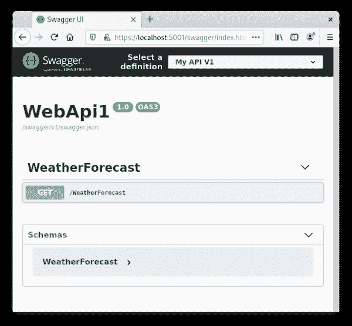

# 使用 OpenAPI。网络核心

> 原文：<https://developers.redhat.com/blog/2020/09/16/using-openapi-with-net-core>

在本文中，我们将看看如何使用 [OpenAPI](https://swagger.io/specification/) 和[。网芯](https://developers.redhat.com/topics/dotnet)。OpenAPI 是描述 RESTful APIs 的规范。首先，我将向您展示如何使用 OpenAPI 来描述由 ASP.NET 核心服务提供的 API。然后，我们将使用 API 描述来生成一个强类型客户端，以便使用 C#来使用 web 服务。

## 编写 OpenAPI 描述

开发者使用 [OpenAPI 规范](https://swagger.io/specification/)来描述 RESTful APIs。然后，我们可以使用 OpenAPI 描述来生成能够访问 API 的强类型客户端库。

**注意** : *Swagger* 有时与 OpenAPI 同义。它指的是一个广泛使用的工具集，用于处理 OpenAPI 规范。

### 构建 web 服务

在这一节中，我们将使用[开源](https://developers.redhat.com/topics/open-source) [Swashbuckle。AspNetCore](https://github.com/domaindrivendev/Swashbuckle.AspNetCore) 包提供了一个 ASP.NET 核心应用程序的 OpenAPI 描述。

我们首先创建一个`webapi`模板应用程序:

```
$ dotnet new webapi -o WebApi1
$ cd WebApi1

```

`webapi`模板包含一个 REST API 来获取天气预报。API 在`WeatherForecastController.cs`文件中实现。

接下来，我们添加`Swashbuckle.AspNetCore`包:

```
$ dotnet add package Swashbuckle.AspNetCore

```

现在，我们对`Startup.cs`文件进行一些编辑:

```
public void ConfigureServices(IServiceCollection services)
  {
    services.AddControllers();
+
+   services.AddSwaggerGen();
  }

  public void Configure(IApplicationBuilder app, IWebHostEnvironment env)
  {
    ....

    app.UseHttpsRedirection();

+   app.UseSwagger();
+
+   app.UseSwaggerUI(c =>
+   {
+     c.SwaggerEndpoint("/swagger/v1/swagger.json", "My API V1");
+   });
+
    app.UseRouting();

    app.UseAuthorization();

```

在`ConfigureServices`方法中，我们称之为`AddSwaggerGen`。调用`AddSwaggerGen`使 API 描述可用。然后，可以通过 ASP.NET 核心的依赖注入(DI)系统消费该 API。`UseSwagger`使用这些描述在`/swagger/v1/swagger.json`创建一个 HTTP 端点。然后，`UseSwaggerUI`在`/swagger`提供一个用户界面(UI ),允许用户轻松地从浏览器使用暴露的 API。

**注意**:在`Startup.cs`中调用的方法接受一个委托进行配置。有关有用的选项，请参见 ASP.NET 核心文档，【Swashbuckle 入门和 ASP.NET 核心。

### 运行应用程序

您可以运行应用程序并浏览到 Swagger UI，如图 1 所示。

[](/sites/default/files/blog/2020/07/swagger_ui.png)

Figure 1: The weather app in the Swagger UI.

`Swashbuckle.AspNetCore`包拿起 ASP.NET 端点。公开的 UI 使得调用 REST 端点变得容易。

## 使用 OpenAPI 描述

在这一节中，我们将看看如何使用一个具有 OpenAPI 描述的 RESTful API。为了使用这个 API，我们将使用开源包。ApiDescription.Client 。

首先，我们创建一个新的`console`项目，并从我们的 ASP.NET 应用程序下载 OpenAPI 描述:

```
$ dotnet new console -o console
$ cd console
$ mkdir openapi
$ wget --no-check-certificate https://localhost:5001/swagger/v1/swagger.json -O openapi/weather.json

```

现在，我们将对项目文件进行一些编辑。时，这些编辑将用于生成强类型客户端。NET 项目已生成:

```
<Project Sdk="Microsoft.NET.Sdk">
   <PropertyGroup>
     <OutputType>Exe</OutputType>
     <TargetFramework>netcoreapp3.1</TargetFramework>
   </PropertyGroup>
+  <ItemGroup>
+    <PackageReference Include="Newtonsoft.Json" Version="12.0.2" />
+    <PackageReference Include="NSwag.ApiDescription.Client" Version="13.0.5" />
+  </ItemGroup>
+  <ItemGroup>
+    <OpenApiReference Include="openapi/weather.json" Namespace="WeatherService">
+      <ClassName>WeatherClient</ClassName>
+      <OutputPath>WeatherClient.cs</OutputPath>
+    </OpenApiReference>
+  </ItemGroup>
 </Project>

```

我们已经添加了对`NSwag.ApiDescription.Client`和`Newtonsoft.Json`包的引用。一个`OpenApiReference`元素指的是我们之前下载的 API 描述。它添加了生成代码所需的属性，如类名、命名空间和文件名。

### 构建客户端

现在，我们将调用`build`命令。调用该命令会生成一个`WeatherClient.cs`文件，该文件位于`obj`目录下:

```
$ dotnet build

```

我们现在可以编辑`Program.cs`文件并使用我们刚刚生成的强类型`WeatherClient`类:

```
static async Task Main(string[] args)
{
  // Configure HttpClientHandler to ignore certificate validation errors.
  using var httpClientHandler = new HttpClientHandler();
  httpClientHandler.ServerCertificateCustomValidationCallback = (message, cert, chain, errors) => { return true; };

  // Create WeatherClient.
  using var httpClient = new HttpClient(httpClientHandler);
  var weatherClient = new WeatherService.WeatherClient("http://localhost:5000", httpClient);

  // Call WeatherForecast API.
  var forecast = await weatherClient.WeatherForecastAsync();
  foreach (var item in forecast)
  {
    Console.WriteLine($"{item.Date} - {item.Summary}");
  }
}

```

### 运行应用程序

最后，我们运行应用程序:

```
$ dotnet run
7/1/2020 1:18:18 PM +02:00 - Mild
7/2/2020 1:18:18 PM +02:00 - Bracing
7/3/2020 1:18:18 PM +02:00 - Freezing
7/4/2020 1:18:18 PM +02:00 - Balmy
7/5/2020 1:18:18 PM +02:00 - Bracing

```

正如你所看到的，天气预报是复杂的。

## 结论

在本文中，您了解了 OpenAPI 规范，它有时与 Swagger 同义。开发人员使用 OpenAPI 规范来描述 RESTful APIs，为客户端使用做准备。我向你展示了如何使用十字扣。AspNetCore 包，提供使用 ASP.NET 核心实现的 API 的 OpenAPI 描述。然后，我们使用了 [NSwag。ApiDescription.Client](https://github.com/RicoSuter/NSwag) 包来生成能够使用 API 的强类型客户端。

*Last updated: September 14, 2020*