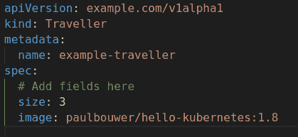
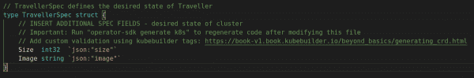
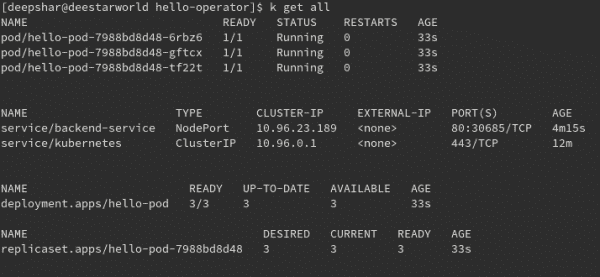
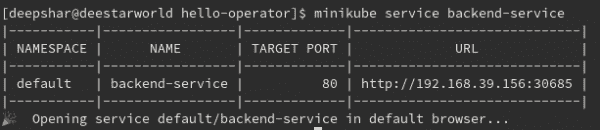
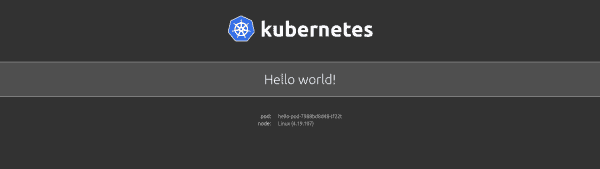

# 你好，世界'教程与 Kubernetes 运营商

> 原文：<https://developers.redhat.com/blog/2020/08/21/hello-world-tutorial-with-kubernetes-operators>

[Kubernetes](https://developers.redhat.com/topics/kubernetes) 操作员减少了人工操作员或现场可靠性工程师的工作。我向您推荐 Kubernetes [操作符](https://developers.redhat.com/topics/kubernetes/operators/)框架的创建者的原始定义: [*操作符是 Kubernetes 应用程序*。](https://coreos.com/blog/introducing-operator-framework)

当我开始用 [operator-sdk](https://github.com/operator-framework/operator-sdk) 构建运算符时，我发现了几个难以解决的未知数。我决定创建一个关于 Kubernetes Operator SDK 的引导性介绍。

抓紧了。

**注意**:关于本文的最新版本，请参见[用六个步骤构建 Kubernetes 操作符](/articles/2021/09/07/build-kubernetes-operator-six-steps)。

## Kubernetes 操作员入门

开发人员使用 Kubernetes Operator SDK 在 Kubernetes 中制作和部署复杂的应用程序。在本文中，为了简洁和理解，我们将在 [Golang](https://golang.org/) 中创建一个简单的、[名称空间范围的操作符](https://developers.redhat.com/blog/2020/06/26/migrating-a-namespace-scoped-operator-to-a-cluster-scoped-operator/)。我们将构建一个部署并设置一个服务。我们还将创建一个定制的控制器协调循环来监视我们部署的资源。

此导游旅程的先决条件如下:

*   熟悉任何编程语言，尽管 Golang 知识对这个例子会有帮助。
*   在您的开发环境中安装 [Minikube](https://github.com/kubernetes/minikube)

## 设置您的环境

我们将从安装构建操作符所需的实用程序开始。

### 建立 Golang

我们将使用 Golang 来构建操作符。[安装 Golang](https://golang.org/dl/) ，然后配置以下环境设置，以及您喜欢的任何其他设置:

```
$GOPATH=/your/preferred/path/
$GO111MODULE=on

```

接下来，验证安装:

```
# Verify
$ go version
go version go1.13.3 linux/amd64

```

### 设置 SDK

我们将使用 Kubernetes 操作员 SDK 来构建我们的操作员。[安装操作员 SDK](https://v0-19-x.sdk.operatorframework.io/docs/install-operator-sdk/) ，然后验证安装:

```
# Verify
$ operator-sdk version
operator-sdk version: "v0.17.0", commit: "2fd7019f856cdb6f6618e2c3c80d15c3c79d1b6c", kubernetes version: "unknown", go version: "go1.13.10 linux/amd64"

```

## 构建操作符

在本节中，我们将构建操作符。在每一个指令之后，我将共享到目前为止的例子的文件树。请在每个步骤验证文件树，以确保您与示例同步。

### 生成示例应用程序代码

前往`$GOPATH/src/operators`并运行:

```
$ operator-sdk new hello-operator

```

这个命令为我们的示例应用程序生成样板代码。默认的运算符类型是 GO。

此时，[你的文件树应该是这样的](https://github.com/deepak1725/hello-operator/tree/c7ec102fc9940af906fdc066902f129e2d578801)。

### 添加自定义资源定义

我们使用自定义资源定义(CRD)来引入 k8s 部署可以理解的自定义资源。本例中的 CRD 如下:

```
$ operator-sdk add api --api-version=example.com/v1alpha1 --kind=Traveller

```

注意，我们使用`api-version`来连接示例应用程序的名称空间操作符。格式为组/版本。`kind`定义是指应用示例中的自定义`kind`。它将被我们接下来创建的定制资源(CRs)使用。

您的文件树[现在应该看起来像这样](https://github.com/deepak1725/hello-operator/tree/39219cd2317be4390c46d335875ac70fdb8fec03)。

### 更新自定义资源

规格(specs)类似于硬编码的配置值，也称为集群的*期望状态*。为了创建本例的规范，我们将编辑两个文件中的定制资源。

#### 更新 example . com _ v1 alpha 1 _ traveller _ Cr . YAML

在这个文件中，我们可以添加控制器功能可能需要的任何自定义值。在这里，我们将添加保罗·布维尔创建的 Hello Kubernetes 图像。图 1 显示了更新后的文件，可以在**deploy>crds>example . com _ v1 alpha 1 _ traveller _ Cr . YAML**找到。

[](/sites/default/files/blog/2020/07/1_5oHAQxw85LpAKrnD2njS8g.png)

图 1:为控制器函数添加自定义值。">

#### 更新 traveller_types.go

我们使用这个文件为控制器提供自定义值。变量区分大小写，所以所有变量的标题都要大写。例如:

```
{Variable} {type} {json:"name in *_cr.yaml" }
```

图 2 显示了为控制器带来自定义值的更新。这个文件应该在**pkg>API>示例>v1 aplha 1>traveller _ types . go**中。

[](/sites/default/files/blog/2020/07/1_tGx2FKdMhlb51FPGSqrrUA.png)

Figure 2: Add custom values to the controllers.

要更新给定资源类型的生成代码，请运行以下命令:

```
$ operator-sdk generate k8s

```

在`*_types.go`中的每次编辑之后，您必须更新 CRD，以针对新引入的值添加开放 API 验证。这个过程是完全自动化的，只需输入以下命令:

```
$ operator-sdk generate crds

```

你现在应该可以看到[这个差异](https://github.com/deepak1725/hello-operator/commit/bdf9f30d63855aa073a362e7c9414397454cdc7d)。

## 添加控制器

控制器定义协调逻辑和要监视的集群资源。被监视的资源的任何变化都会触发控制器中的协调。以下是将控制器添加到 Operator SDK 的命令:

```
>$ operator-sdk add controller --api-version=example.com/v1alpha1 --kind=Traveller
```

一如既往，在继续之前，[验证代码差异](https://github.com/deepak1725/hello-operator/commit/c6bed9a53486ec35a04248b91ea501e970ee410e)。

我们添加了具有默认设置的控制器，即默认 API、基于角色的访问控制(RBAC)和服务帐户。接下来，我们将添加用于创建应用程序部署和服务的定制逻辑。我们写什么逻辑都应该是[幂等](https://en.wikipedia.org/wiki/Idempotence)。

## 向 Operator SDK 添加自定义逻辑

我们将向 Operator SDK 添加五个自定义函数:

*   [backendDeployment](https://github.com/deepak1725/hello-operator/blob/77cf069f74a364405faf03424deefe96ee9d0b22/pkg/controller/traveller/traveller_controller.go#L162-L199) :部署 pod 并在端口 8080 暴露它。
*   [backendService](https://github.com/deepak1725/hello-operator/blob/77cf069f74a364405faf03424deefe96ee9d0b22/pkg/controller/traveller/traveller_controller.go#L136-L160) :为暴露的端口创建一个新的后端服务。
*   [ensureDeployment](https://github.com/deepak1725/hello-operator/blob/77cf069f74a364405faf03424deefe96ee9d0b22/pkg/controller/traveller/traveller_controller.go#L235-L267) :确保给定名称空间中存在部署。否则，它通过调用`1`创建一个部署。
*   [ensureService](https://github.com/deepak1725/hello-operator/blob/77cf069f74a364405faf03424deefe96ee9d0b22/pkg/controller/traveller/traveller_controller.go#L201-L233) :确保后端服务存在并运行在给定的名称空间中。否则，它通过调用`2`来创建服务。
*   [标签](https://github.com/deepak1725/hello-operator/blob/77cf069f74a364405faf03424deefe96ee9d0b22/pkg/controller/traveller/traveller_controller.go#L126-L134):设置部署和 pod 上的标签。

[更改协调功能](https://github.com/deepak1725/hello-operator/blob/master/pkg/controller/traveller/traveller_controller.go#L88-L124)以触发新定义的功能。

您的代码 diff [现在应该看起来像这样](https://github.com/deepak1725/hello-operator/commit/77cf069f74a364405faf03424deefe96ee9d0b22)。

## 在本地测试操作员

我们已经完成了自定义逻辑的添加和功能的构建。现在，我们将在本地测试操作符:

```
# Please deploy in Sequence only
$ kubectl apply -f deploy/role.yaml
$ kubectl apply -f deploy/service_account.yaml
$ kubectl apply -f deploy/role_binding.yaml
$ kubectl apply -f deploy/crds/example.com_travellers_crd.yaml
$ kubectl apply -f deploy/crds/*_cr.yaml

```

假设上述所有构件都部署成功，我们可以在本地运行操作符:

```
$ operator-sdk run up --local

```

这个命令应该启动操作员。通过对照命名空间检查自定义资源，确保所有自定义资源都已部署。为简洁起见，我们使用默认的名称空间:

```
$ kubectl get all
```

结果如图 3 所示，其中 k 是 kubectl 的别名。

[](/sites/default/files/blog/2020/08/1_xZbkePASBx2PCLUpc-4Kcg.png)

Figure 3: Get all Kubernetes resources deployed in the default namespace.

## 测试服务

最后，通过打开一个隧道来测试 Minikube 中的服务:

```
$ minikube service backend-service

```

结果如图 4 所示。

[](/sites/default/files/blog/2020/08/1_pXvimQD1cUe2-LnxjmvxVg.png)

图 4:获取部署在 Minikube 中的后端服务的端点。">

Minikube 隧道应该会将我们重定向到我们刚刚创建的服务:

[](/sites/default/files/blog/2020/07/1_30D09VyYFygRqLwvURjelg.png)

图 5:“Hello，world”Kubernetes 应用程序的主屏幕。">

就是这样！您刚刚开发了一个基本的 Kubernetes 操作符。

## 导出运算符

对于真正的集群部署，您还需要导出操作符:

```
$ operator-sdk build docker_username/repo:v0.0.1
$ docker push docker_username/repo
$ sed -i "" 's|REPLACE_IMAGE|quay.io/example/memcached-operator:v0.0.1|g' deploy/operator.yaml
$ kubectl apply -f deploy/operator.yaml

```

一旦您导出了操作符，您就可以通过 Git 或源代码控制管理(SCM)发布它，压缩并邮寄它，或者您需要做的任何事情。

## 结论

我想再次强调，运营商的存在是为了简化 Kubernetes 上复杂的应用程序部署。运营商尤其支持日常活动，如升级和降级 Kubernetes 应用程序等。本文中的指导练习是与操作员一起工作的良好起点。请参阅下面的参考资料以了解更多信息。此外，查看 GitHub 资源库中的本教程， *[初学者的基本操作符](https://github.com/deepak1725/hello-operator)* ，其中包括本文的完整示例代码。

## 更多参考

这些额外的参考资料对于学习 Kubernetes 操作符和操作符框架非常有用:

*   [*【Kubernetes Operators:自动化容器编排平台*](https://developers.redhat.com/books/kubernetes-operators/old/) (奥莱利，2020 年 4 月)
*   本文中使用的示例应用程序的源代码， [Hello Kubernetes！](https://github.com/paulbouwer/hello-kubernetes/)

*Last updated: January 18, 2022*