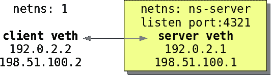

# Red Hat Enterprise Linux 8.3 上的多路径 TCP:从 0 到 1 子流

> 原文：<https://developers.redhat.com/blog/2020/08/19/multipath-tcp-on-red-hat-enterprise-linux-8-3-from-0-to-1-subflows>

[多路径 TCP](https://en.wikipedia.org/wiki/Multipath_TCP) (MPTCP)扩展了传统的 TCP，允许在多个并发 TCP 路径上进行可靠的端到端传输，并作为[Red Hat Enterprise Linux](https://developers.redhat.com/topics/linux)8.3 的技术预览版推出。这是两篇文章中的第一篇，面向希望在实际系统上使用新的 MPTCP 功能的用户。在第一部分中，我们将向您展示如何在内核中启用该协议，并让客户机和服务器应用程序使用 MPTCP 套接字。然后，我们在一个示例测试网络中的内核上运行诊断，其中端点使用单个子流。

## Red Hat Enterprise Linux 8 中的多路径 TCP

多路径 TCP 是传输控制协议(TCP)相对较新的[扩展](https://tools.ietf.org/html/rfc8684)，其官方 Linux 实现[甚至更近](https://twitter.com/davem_dokebi/status/1220715287365943298)。早期用户可能想知道 RHEL 8.3 会有什么变化。在本文中，您将学习如何:

*   在内核中启用多路径 TCP 协议。
*   让应用程序打开一个`IPPROTO_MPTCP`套接字。
*   使用`tcpdump`检查实时流量的 MPTCP 选项。
*   用`ss`检查子流状态。

## 在内核中启用多路径 TCP

[多路径 TCP](https://www.multipath-tcp.org/) 注册为 TCP 的上层协议(ULP)。用户可以通过检查可用的 ulp 来确保`mptcp`在内核中可用:

```
# sysctl net.ipv4.tcp_available_ulp
net.ipv4.tcp_available_ulp = espintcp mptcp

```

与上游 Linux 不同，MPTCP 在默认的 Red Hat Enterprise Linux (RHEL) 8.3 运行时是禁用的。为了能够创建套接字，系统管理员需要发出一个适当的`sysctl`命令:

```
# sysctl -w net.mptcp.enabled=1
# sysctl net.mptcp.enabled
net.mptcp.enabled = 1

```

## 为第一个 MPTCP 套接字准备系统

在 RHEL 8.3 内核中启用了 MPTCP 之后，用户空间程序有了一个新的协议可用于`socket`系统调用。新协议有两个潜在的用例。

### 本机 MPTCP 应用程序

原生支持 MPTCP 的应用程序可以打开一个指定`IPPROTO_MPTCP`为协议、`AF_INET`或`AF_INET6`为地址族的`SOCK_STREAM`套接字:

```
fd = socket(AF_INET, SOCK_STREAM, IPPROTO_MPTCP);

```

在应用程序创建一个套接字之后，内核将运行一个或多个 TCP 子流，这些子流将使用标准的 MPTCP 选项(`IANA number = 30`)。客户端和服务器语义与常规 TCP 套接字使用的语义相同(这意味着它们将使用`bind()`、`listen()`、`connect()`和`accept()`)。

### 转换为 MPTCP 的传统 TCP 应用程序

大多数用户空间应用程序都不知道`IPPROTO_MPTCP`，修补和重建它们来添加对 MPTCP 的本地支持也是不现实的。正因为如此，社区选择使用一个 eBPF 程序来包装`socket()`系统调用和[覆盖`protocol`](https://github.com/multipath-tcp/mptcp_net-next/issues/18) 的值。

在 RHEL 8.3 中，该程序将在 CPU 组上运行，以便系统管理员可以指定哪些应用程序应该运行 MPTCP，而其他应用程序则继续使用 TCP。我们将在接下来的几周讨论 eBPF helper upstream，但是我们希望支持那些想用 MPTCP 尝试自己的应用程序的早期 RHEL 8.3 用户。

您可以使用一个 [systemtap](https://linux.die.net/man/1/stap) 脚本作为一种变通方法来拦截内核中对`__sys_socket()`的调用。然后，您可以允许内核探测器用`IPPROTO_MPTCP`替换`IPPROTO_TCP`。您将需要添加包，以便用`stap`在内核中安装一个探针。您还将使用`nmap-ncat`包中的老式`ncat`工具来运行客户机和服务器:

```
# dnf -y install \
> kernel-headers \
> kernel-devel \
> kernel-debuginfo
> kernel-debuginfo-common_x86_64 \
> systemtap-client \
> systemtap-client-devel \
> nmap-ncat

```

使用以下命令启动`systemtap` [脚本](https://github.com/multipath-tcp/mptcp_net-next/issues/18#issuecomment-650529642):

```
# stap -vg mpctp.stap
```

### 协议烟雾测试:使用`ncat`的单个子流程

图 1 所示的测试网络拓扑由运行在不同名称空间中的客户机和服务器组成，通过虚拟以太网设备(`veth`)连接。

[](/sites/default/files/blog/2020/07/mptcp-1-topology.png)network topology for basic MPTCP testingFigure 1: A network topology for basic MPTCP testing.">

添加额外的 IP 地址将模拟端点之间的多条 L4 路径。首先，服务器打开一个被动套接字，侦听 TCP 端口:

```
# ncat -l 192.0.2.1 4321
```

然后，客户端连接到服务器:

```
# ncat 192.0.2.1 4321
```

从功能的角度来看，交互与使用常规 TCP 的`ncat`相同:当用户在客户机的标准输入中写下一行时，服务器在标准输出中显示该行。类似地，在服务器的标准输入中键入一行会导致将它传输回客户机的标准输出。在这个例子中，我们使用`ncat`向服务器发送一条`hello world (1)\n`消息。它等待一秒钟，然后发回“【T3”，然后关闭连接。

**注意**:当前的 Linux MPTCP 不支持混合 IPv4/IPv6 地址。因此，客户端/服务器连接中涉及的所有地址必须属于同一系列。

## 用`tcpdump`捕捉流量并进行检查

Red Hat Enterprise Linux 8 版本的`tcpdump`还不支持解析 TCP 报头中的 MPTCP v1 子选项。我们可以通过从上游存储库构建二进制文件来解决这个问题。或者，我们可以用一个更近的二进制文件来代替它。通过这些更改，可以检查 MPTCP 子选项。

### 三次握手:MP_CAPABLE 子选项

在三次握手期间，客户端和服务器使用`MP_CAPABLE`子选项交换 64 位密钥，这可以在`tcpdump`的输出中看到，在`mptcp capable`后面的大括号({})中。这些密钥随后用于计算 DSN/DACK 和令牌。在成功建立连接后，源自客户端的`MP_CAPABLE`子选项也会出现。它将一直存在，直到服务器使用数据序列信号(DSS)子选项明确确认它:

```
# tcpdump -#tnnr capture.pcap
1  IP 192.0.2.2.44176 > 192.0.2.1.4321: Flags [S], seq 1721499445, win 29200, options [mss 1460,sackOK,TS val 33385784 ecr 0,nop,wscale 7,mptcp capable v1], length 0
2  IP 192.0.2.1.4321 > 192.0.2.2.44176: Flags [S.], seq 3341831007, ack 1721499446, win 28960, options [mss 1460,sackOK,TS val 4061152149 ecr 33385784,nop,wscale 7,mptcp capable v1 {0xbb206e3023b47a2d}], length 0
3  IP 192.0.2.2.44176 > 192.0.2.1.4321: Flags [.], ack 1, win 229, options [nop,nop,TS val 33385785 ecr 4061152149,mptcp capable v1 {0x41923206b75835f5,0xbb206e3023b47a2d}], length 0
4  IP 192.0.2.2.44176 > 192.0.2.1.4321: Flags [P.], seq 1:17, ack 1, win 229, options [nop,nop,TS val 33385785 ecr 4061152149,mptcp capable v1 {0x41923206b75835f5,0xbb206e3023b47a2d},nop,nop], length 16

```

### MPTCP 级序列号:DSS 子选项

之后，TCP 数据段将携带包含 MPTCP 序列号的 DSS 子选项。更具体地说，我们可以观察数据序列号(DSN)和数据确认(DACK)值，如下所示:

```
5  IP 192.0.2.1.4321 > 192.0.2.2.44176: Flags [.], ack 17, win 227, options [nop,nop,TS val 4061152149 ecr 33385785,mptcp dss ack 1711754507747579648], length 0
6  IP 192.0.2.2.44176 > 192.0.2.1.4321: Flags [P.], seq 17:33, ack 1, win 229, options [nop,nop,TS val 33386778 ecr 4061152149,mptcp dss ack 1331650533424046587 seq 1711754507747579648 subseq 17 len 16,nop,nop], length 16
7  IP 192.0.2.1.4321 > 192.0.2.2.44176: Flags [.], ack 33, win 227, options [nop,nop,TS val 4061153142 ecr 33386778,mptcp dss ack 1711754507747579664], length 0

```

使用单个子流时，DSN 和 DACK 的增量与 TCP 序列号和确认号的增量相同。当连接结束时，子流用一个`FIN`包关闭，就像常规的 TCP 流一样。因为它还关闭了 MPTCP 套接字，所以在 DSS 子选项中设置了 data `fin`位，如下所示:

```
8  IP 192.0.2.2.44176 > 192.0.2.1.4321: Flags [F.], seq 33, ack 1, win 229, options [nop,nop,TS val 33387798 ecr 4061153142,mptcp dss fin ack 1331650533424046587 seq 1711754507747579664 subseq 0 len 1,nop,nop], length 0
9  IP 192.0.2.1.4321 > 192.0.2.2.44176: Flags [.], ack 34, win 227, options [nop,nop,TS val 4061154203 ecr 33387798,mptcp dss ack 1711754507747579664], length 0
10  IP 192.0.2.1.4321 > 192.0.2.2.44176: Flags [F.], seq 1, ack 34, win 227, options [nop,nop,TS val 4061162156 ecr 33387798,mptcp dss fin ack 1711754507747579664 seq 1331650533424046587 subseq 0 len 1,nop,nop], length 0
11  IP 192.0.2.2.44176 > 192.0.2.1.4321: Flags [.], ack 2, win 229, options [nop,nop,TS val 33395793 ecr 4061162156,mptcp dss ack 1331650533424046587], length 0
```

## 用`ss`检查子流程数据

因为 MPTCP 使用 TCP 作为传输协议，所以网络管理员可以查询内核来检索主 MPTCP 套接字正在使用的 TCP 连接的信息。在本例中，我们在服务器监听端口上的客户端过滤上运行`ss`，在`tcp-ulp-mptcp`之后可以读取与 MPTCP 相关的信息:

```
# ss -nti '( dport :4321 )' dst 192.0.2.1
State Recv-Q Send-Q Local Address:Port  Peer Address:PortProcess
ESTAB 0      0          192.0.2.2:44176    192.0.2.1:4321
cubic wscale:7,7 [...] bytes_sent:32 bytes_acked:33 [...] tcp-ulp-mptcp flags:Mmec token:0000(id:0)/768f615c(id:0) seq:127af91ad1b321fb sfseq:1 ssnoff:c7304b5f maplen:0

```

### SS 命令输出解释

`tcp-ulp-mptcp`下面的一行是客户端名称空间中的`ss`的输出，紧跟在前面部分中的数据包 6 的传输之后:

*   `token`的每个值是客户端在三次握手期间接收到的远程对等方密钥的截断散列消息验证码算法(HMAC)。进一步的`MP_JOIN SYN`数据包将使用该值来证明它们没有被欺骗。`id`是 RFC 中规定的子流标识符。对于非`MP_JOIN`套接字，只有本地令牌和 ID 可用。
*   `flags`是包含子流状态信息的位掩码。例如，`M/m`记录了三次握手中`MP_CAPABLE`子选项的存在。`c`表示客户端收到了服务器的密钥(即它确认了 SYN/ACK)，而`e`表示两个 MPTCP 密钥的交换已经完成。
*   `seq`表示端点在接收时期望的下一个 MPTCP 序列号，或者等效地，下一个发送分组的 DACK 值。
*   `sfseq`是子流序列号，意味着它是该子流的当前 TCP ACK 值。
*   `ssnoff`是该子流的 TCP 序列号和 MPTCP 序列号之间的当前差值。如果使用单个子流，则该值在连接期间不会改变。如果您使用多个子流同时传送数据段，则该值会根据路径容量而增加或减少。
*   `maplen`表示还有多少字节可以填充当前的 DSS 映射。

请注意，我们可以通过从 SYN/ACK 中的服务器密钥(即捕获的数据包 2)开始计算`seq`的值，并计算服务器的初始数据序列号(IDSN)，然后将`sha256(ntohll(bb206e3023b47a2d))`截断为最低有效的 64 位，如 [RFC 8684](https://tools.ietf.org/html/rfc8684#section-3.3.2) 所指定的。

还要注意，因为客户端没有从服务器接收任何数据，`seq`在连接的整个生命周期中保持等于 IDSN。出于同样的原因，在示例中,`sfseq`的值始终等于 1。我们可以在数据包 10 的 DSN 号和数据包 6、8 的 DACK 号中看到 IDSN(十进制格式:`1331650533424046587`)，也可以在`ss`的输出中看到(十六进制格式:`127af91ad1b321fb`)。同样，在本例中，SSN 偏移(`ss`输出中的`c7304b5f`)始终等于初始 TCP 序列号(捕获输出的 SYN/ACK 包 2 中的`3341831007`)。

## 结论和下一步

在实际场景中，MPTCP 通常会使用多个子流。这样，即使在事件导致 L4 路径之一出现故障之后，套接字也可以保持连接性。在下一篇文章中，我们将向您展示如何使用`iproute2`在 RHEL 8.3 上配置多个 TCP 路径，以及如何真实地观看`ncat`做多路径。

*Last updated: August 18, 2020*