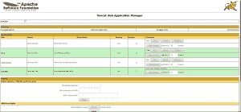

# 在 Red Hat OpenShift 上安装 Apache Tomcat 并部署一个 Java web 应用程序

> 原文：<https://developers.redhat.com/blog/2020/07/01/install-apache-tomcat-and-deploy-a-java-web-application-on-red-hat-openshift>

如果您不熟悉 OpenShift，那么您可能希望在它的基础上安装 Apache Tomcat，以便进行更简单的实验。本文指导您从 Docker 映像安装 Apache Tomcat，然后使用它在 [Red Hat OpenShift](https://developers.redhat.com/products/openshift/getting-started) 上部署 Java web 应用程序。我还将向您展示如何在 OpenShift 上访问 Tomcat 管理控制台。

要了解这些例子，你必须有一个 [OpenShift 账户](https://www.openshift.com/try)。在本次演示中，我们将使用 OpenShift 命令行界面(CLI)，因此在开始之前，请务必[安装 CLI](https://developers.redhat.com/openshift/command-line-tools/) ( `oc`)。

关于示例应用程序的一个注意事项:您将需要一个 Java web 应用程序来用于部署示例。我正在使用来自 [OpenShift Demos](https://github.com/OpenShiftDemos) GitHub 资源库的[样本 Java Web 应用程序](https://github.com/openshiftdemos/os-sample-java-web.git)。这是一个简单的应用程序，有助于理解基本概念。您可以使用提供的示例或选择自己的应用程序。

## 关于 Tomcat 管理控制台

Tomcat 管理器用于部署一个新的 web 应用程序(或者取消部署一个现有的应用程序),而不必关闭和重启整个容器。此外，Tomcat 管理器允许您请求现有的应用程序重新加载自身，即使您没有在 Tomcat 服务器配置文件中将它声明为`reloadable`。

该管理器由一个支持以下功能的 web 应用程序(默认安装在上下文路径`/manager`上)组成:

*   从 WAR 文件的上传内容部署新的 web 应用程序。
*   从服务器文件系统在指定的上下文路径上部署新的 web 应用程序。
*   列出当前部署的 web 应用程序，以及这些 web 应用程序当前活动的会话。
*   重新加载现有的 web 应用程序，以反映`/WEB-INF/classes`或`/WEB-INF/lib`内容的变化。
*   列出 OS 和 JVM 属性值。
*   列出可用的全局 JNDI 资源，用于准备嵌套在`<Context>`部署描述中的`<ResourceLink>`元素的部署工具。
*   启动停止的应用程序(从而使其再次可用)。
*   停止现有应用程序(使其不可用)，但不要取消部署。
*   取消部署已部署的 web 应用程序，并删除其文档基目录(除非它是从文件系统部署的)。

## 步骤 1:在 OpenShift 上安装 Tomcat

首先，让我们从 Docker 映像安装 [Apache Tomcat 9](http://tomcat.apache.org/tomcat-9.0-doc/introduction.html) 。如前所述，我们将使用 OpenShift 命令行工具`oc`进行安装:

1.  从命令行登录到 OpenShift 控制台:

    ```
    $ oc login --server=https://openshift.testcluster.lab.redhat.com -u user -p password
    ```

2.  输入您的 Red Hat 注册服务帐户用户名和密码:

    ```
    sh-4.2# sudo sh -

    sh-4.2# docker login

    Username: {REGISTRY-SERVICE-ACCOUNT-USERNAME}

    Password: {REGISTRY-SERVICE-ACCOUNT-PASSWORD}

    Login Succeeded

    ```

3.  下面是从 Red Hat 容器注册表中提取 Docker 图像的命令，后面是状态输出:

    ```
    sh-4.2# docker pull registry.redhat.io/jboss-webserver-5/webserver53-openjdk8-tomcat9-openshift-rhel7

    Using default tag: latest

    Trying to pull repository registry.redhat.io/jboss-webserver-5/webserver53-openjdk8-tomcat9-openshift-rhel7 ...

    latest: Pulling from registry.redhat.io/jboss-webserver-5/webserver53-openjdk8-tomcat9-openshift-rhel7

    1f1202c893ce: Pull complete

    32be9843afa0: Pull complete

    c927648f9ad0: Pull complete

    8ac7bcea2a65: Pull complete

    Digest: sha256:bd637c88fdc94cd4e4476e00af1baeb3c1f3a6d9a873a73bee646950cdf076fc

    Status: Downloaded newer image for registry.redhat.io/jboss-webserver-5/webserver53-openjdk8-tomcat9-openshift-rhel7:latest

    ```

## 步骤 2:创建新项目

接下来，我们将创建一个新项目来使用 Tomcat 部署 web 应用程序。

1.  输入以下内容创建一个新项目:

    ```
    sh-4.2# oc new-project tomcat

    Now using project "tomcat" on server "https://openshift.testcluster.lab.redhat.com:443".

    ```

2.  转到您的新`tomcat`项目:

    ```
    sh-4.2# oc project tomcat

    Already on project "tomcat" on server "https://openshift.testcluster.lab.redhat.com:443".

    ```

## 步骤 3:创建 Java web 应用程序

现在，我们创建一个 Java web 应用程序。

1.  使用您选择的示例应用程序创建一个`new-app`(我的是`os-sample-java-web`):

    ```
    $ oc new-app registry.redhat.io/jboss-webserver-5/webserver53-openjdk8-tomcat9-openshift-rhel7~https://github.com/openshiftdemos/os-sample-java-web.git
    ```

2.  验证应用程序是否已部署，pod 是否已创建:

    ```
    sh-4.2# oc get pods

    NAME READY STATUS RESTARTS AGE

    os-sample-java-web-1-build 0/1 Completed 0 2m

    os-sample-java-web-1-k5sqz 1/1 Running 0 1m
    ```

3.  验证集群服务是否已创建:

    ```
    sh-4.2# oc get svc

    NAME TYPE CLUSTER-IP EXTERNAL-IP PORT(S) AGE

    os-sample-java-web ClusterIP x.x.x.x <none> 8080/TCP,8443/TCP,8778/TCP 1m

    sh-4.2#

    ```

4.  验证路由是否已创建。如果路由不存在(如下所示)，那么运行下面的命令来公开服务:

    ```
    sh-4.2# oc get route

    No resources found.sh-4.2# oc expose svc os-sample-java-web

    route.route.openshift.io/os-sample-java-web exposedsh-4.2# oc get route

    NAME HOST/PORT PATH SERVICES PORT TERMINATION WILDCARD

    os-sample-java-web os-sample-java-web-tomcat.openshift.testcluster.lab.redhat.com os-sample-java-web 8080-tcp None

    ```

5.  使用您刚刚发现的路线，确认您可以访问应用程序:

    ```
    os-sample-java-web-tomcat.openshift.testcluster.lab.redhat.com
    ```

## 步骤 4:在 OpenShift 上访问 Tomcat 管理器

出于安全考虑，您只能在`localhost`访问 Tomcat 管理器。例如，如果您尝试输入以下内容，您将收到“403 禁止”错误:

```
os-sample-java-web-tomcat.openshift.testcluster.lab.redhat.com/manager
```

下面是访问 Tomcat 管理控制台的命令行过程:

1.  将`secure-mgmt-console.sh`和`context.xml`文件从你的吊舱复制到你的主机:

    ```
    sh-4.2# oc cp os-sample-java-web-1-k5sqz:/opt/jws-5.3/tomcat/bin/launch/secure-mgmt-console.sh secure-mgmt-console.sh

    sh-4.2# oc cp os-sample-java-web-1-k5sqz:/opt/jws-5.3/tomcat/webapps/manager/META-INF/context.xml context.xml

    sh-4.2# ls

    ansible.cfg context.xml hosts htpasswd log openshift-ansible secure-mgmt-console.sh

    ```

2.  备份主`secure-mgmt-console.sh`文件:

    ```
    cp -pr secure-mgmt-console.sh secure-mgmt-console.sh_ORIG

    ```

3.  在新的`secure-mgmt-console.sh`文件中进行如下修改(注意，具有`manager-gui`角色的用户应该*而不是*被授予`manager-script`或`manager-jmx`角色):

    ```
    sh-4.2# diff secure-mgmt-console.sh secure-mgmt-console.sh_ORIG

    13c13

    < sed -i -e"s|</tomcat-users>|\n<role rolename=\"manager-gui\"/>\n<user username=\"${JWS_ADMIN_USERNAME}\" password=\"${JWS_ADMIN_PASSWORD}\" roles=\"manager-gui\"/>\n</tomcat-users>|" $JWS_HOME/conf/tomcat-users.xml

    ---

    > sed -i -e"s|</tomcat-users>|\n<user username=\"${JWS_ADMIN_USERNAME}\" password=\"${JWS_ADMIN_PASSWORD}\" roles=\"manager-jmx,manager-script\"/>\n</tomcat-users>|" $JWS_HOME/conf/tomcat-users.xml

    ```

4.  现在，备份主`context.xml`文件:

    ```
    sh-4.2# cp -pr context.xml context.xml_ORIG

    sh-4.2# diff context.xml context.xml_ORIG

    19,20c19,20

    < <!-- <Valve className="org.apache.catalina.valves.RemoteAddrValve"

    < allow="127\.\d+\.\d+\.\d+|::1|0:0:0:0:0:0:0:1" /> -->

    ---

    > <Valve className="org.apache.catalina.valves.RemoteAddrValve"

    > allow="127\.\d+\.\d+\.\d+|::1|0:0:0:0:0:0:0:1" />

    23c23

    < <!-- <Valve className="org.apache.catalina.valves.RemoteAddrValve" allow="127\.\d+\.\d+\.\d+|::1|0:0:0:0:0:0:0:1"/> -->

    ```

    ```
    > <Valve className="org.apache.catalina.valves.RemoteAddrValve" allow="127\.\d+\.\d+\.\d+|::1|0:0:0:0:0:0:0:1"/>

    ```

5.  分别为`secure-mgmt-console.sh`和`context.xml`创建配置图:

    ```
    sh-4.2# oc create configmap mgmtsecure --from-file=secure-mgmt-console.sh

    configmap/mgmtsecure created

    sh-4.2# oc create configmap mgmtcontext --from-file=context.xml

    configmap/mgmtcontext created

    ```

6.  为`mgmtsecure`和`mgmtcontext`配置图设置`volume`:

    ```
    sh-4.2# oc set volume dc/os-sample-java-web --add --name=mgmtsecure --configmap-name=mgmtsecure --default-mode=0777 --mount-path=/opt/jws-5.3/tomcat/bin/launch/secure-mgmt-console.sh --sub-path=secure-mgmt-console.sh

    deploymentconfig.apps.openshift.io/os-sample-java-web volume updated

    sh-4.2# oc set volume dc/os-sample-java-web --add --name=mgmtcontext --configmap-name=mgmtcontext --default-mode=0777 --mount-path=/opt/jws-5.3/tomcat/webapps/manager/META-INF/context.xml --sub-path=context.xml

    deploymentconfig.apps.openshift.io/os-sample-java-web volume updated

    ```

7.  覆盖`JWS_ADMIN_USERNAME`和`JWS_ADMIN_PASSWORD`，如图:

    ```
    sh-4.2# oc set env dc/os-sample-java-web --overwrite JWS_ADMIN_USERNAME=jwsadmin

    deploymentconfig.apps.openshift.io/os-sample-java-web updated

    sh-4.2# oc set env dc/os-sample-java-web --overwrite JWS_ADMIN_PASSWORD=jwsadmin

    deploymentconfig.apps.openshift.io/os-sample-java-web update

    sh-4.2# oc set env dc/os-sample-java-web --overwrite SCRIPT_DEBUG=true

    deploymentconfig.apps.openshift.io/os-sample-java-web updated

    ```

8.  验证应用程序是否已部署，pod 是否已使用您的更改创建:

    ```
    os-sample-java-web-2-build 0/1 Completed 0 27m

    os-sample-java-web-7-rghgk 1/1 Running 0 26m

    ```

## 打开 Tomcat 管理器

最后一步是打开`**/**manager`页面。它将弹出一个登录控制台。输入您的用户 ID ( `jwsadmin`)和密码(`jwsadmin`)来访问 OpenShift 控制台中的 Tomcat 管理器。

[](https://developers.redhat.com/blog/wp-content/uploads/2020/06/managerpage.png)

## 结论

您现在知道了如何在 OpenShift 上安装 Tomcat，使用 Tomcat 将 web 应用程序部署到 OpenShift，以及访问 Tomcat `/manager`页面。我希望这篇教程能帮助你开始你的 OpenShift 探索。

*Last updated: April 7, 2022*