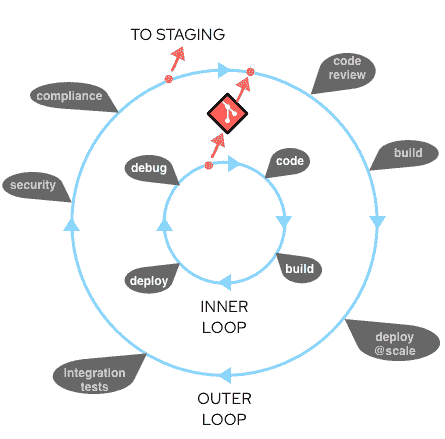
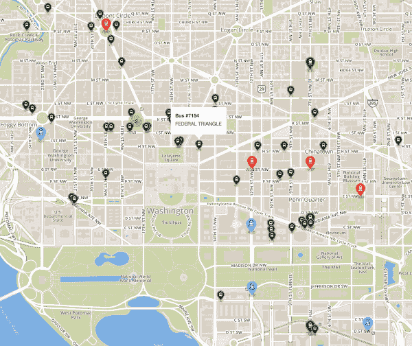
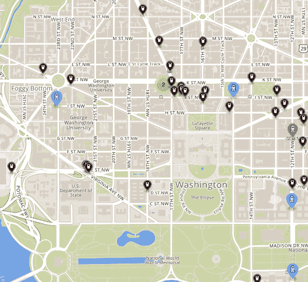
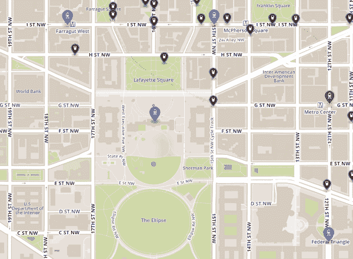

# 使用 odo 进行企业 Kubernetes 开发:面向开发人员的 CLI 工具

> 原文：<https://developers.redhat.com/blog/2020/06/16/enterprise-kubernetes-development-with-odo-the-cli-tool-for-developers>

Kubernetes 的对话很少以开发者的视角为中心。因此，在 k8s 集群中工作通常需要构建复杂的 YAML 资源文件，编写定制的 shell 脚本，并理解`kubectl`和`docker`命令中的无数选项。最重要的是，我们有理解 Kubernetes 术语并像运营团队那样使用它的学习曲线。

为了应对这些挑战，Red Hat 开发人员工具团队创建了 [`odo` (OpenShift Do)](https://developers.redhat.com/products/odo/overview) ，这是一个为开发人员构建的命令行界面(CLI)工具，旨在对开发人员关心的事情进行优先排序。在本文中，我将通过一个实际操作的例子向您介绍将`odo`与 Kubernetes 结合使用的好处。

## 改进开发人员工作流程

首先，让我们考虑一个开发人员的典型工作流，他的团队已经采用了 [Kubernetes](https://developers.redhat.com/topics/kubernetes/) 。工作流从本地开发活动开始，以在一个或多个 Kubernetes 集群中部署[容器](https://developers.redhat.com/topics/containers/)和运行代码结束。为了帮助形象化这个流程，您可以将它想象成一个内部循环和一个外部循环。*内循环*包括本地编码、构建、运行和测试应用程序——作为开发人员，所有这些活动都可以控制。*外部循环*由更大的团队流程组成，您的代码在到达集群的途中会经过这些流程:代码审查、集成测试、安全性和合规性，等等。内部循环可能主要发生在您的笔记本电脑上。外部循环发生在共享服务器上，运行在容器中，并且通常通过持续集成/持续交付(CI/CD)管道来自动化。通常，提交到源代码控制的代码是内部循环和外部循环之间的转换点。图 1 展示了这些循环在 Kubernetes 开发过程中的相互作用。

[](/sites/default/files/blog/2020/05/To-Staging.png)

Figure 1\. A flow diagram of the inner and outer loops in a Kubernetes development process.

请注意，当您编码时，您会不断地重复各种开发活动:您编码、构建、本地部署和调试——并且您会一直继续下去，直到您实现某种程度的功能完整性。在某个时刻，你会准备好从内在过渡到外在，对吗？没那么快。

### 从内环展开

您可能认为您的工作止于本地测试和 Git pull 请求(或`git push`)——但通常情况并非如此。您仍然需要确保您的代码在容器中正确运行，在集群中运行，并且与其他容器化的组件配合良好。因此，您将希望您的内部循环的一些迭代直接部署和调试到 Kubernetes 集群中。

下面列出了从内部循环进行部署时通常要遵循的步骤:

1.  描述如何为您的容器配置操作系统:
    *   写一个 docker 文件来设置 Linux。
2.  描述如何将应用程序打包到容器映像中:
    *   更新 Dockerfile 文件。
3.  创建容器图像:
    *   发出命令`docker build`和`docker tag`。
4.  将容器映像上传到注册表:
    *   发布一个`docker push.`
5.  编写一个或多个 Kubernetes 或 OpenShift 资源文件:
    *   写很多 YAML 的作品。
6.  将您的应用部署到集群:
    *   发出命令:`kubectl apply -f my_app.yaml`。
7.  将其他服务部署到群集:
    *   发出命令:`kubectl apply -f svc*.yaml`。
8.  编写配置(或设置`ENV`)以允许应用程序协同工作:
    *   发出一个`kubectl create configmap`。
9.  配置应用程序以正确协同工作:
    *   发出一个`kubectl apply -f my_configmap.yaml`。

那可是很多步啊！

### 进来，奥多

Red Hat OpenShift 的 CLI 工具有助于简化这些步骤；然而，`oc`是运营聚焦。使用它需要深入理解 Kubernetes 和 OpenShift 概念。另一方面，Odo 的设计简洁明了:

*   其语法和设计中心概念为开发人员所熟悉，如项目、应用程序和组件。
*   它自动创建部署配置、构建配置、服务路由和其他 OpenShift 元素。
*   它是为快速迭代而设计的—例如，它检测本地代码的更改并自动部署到集群，为开发人员提供即时反馈以实时验证更改。
*   它完全基于客户端，因此不需要服务器端组件设置。

Odo 还提供:

*   红帽对 [Node.js](https://developers.redhat.com/blog/category/node-js/) 和 [Java](https://developers.redhat.com/topics/enterprise-java/) 组件的支持。
*   兼容其他语言，如 Ruby、Perl、PHP 和 Python。
*   群集上组件和服务的状态更新。

Odo 可以在 Windows、macOS 和 Linux 操作系统的任何终端上工作，它支持对`bash`和`zsh`命令行 shells 的自动补全。

概述够了。让我们来看看`odo`的行动。

## 与 Odo 一起动手开发

如果你想跟随这个例子，从为你选择的平台下载`odo`开始。

对于 macOS，命令是:

```
> curl -L https://mirror.openshift.com/pub/openshift-v4/clients/odo/latest/odo-darwin-amd64 -o /usr/local/bin/odo && chmod +x /usr/local/bin/odo

```

对于 Linux，它是:

```
> curl -L https://mirror.openshift.com/pub/openshift-v4/clients/odo/latest/odo-linux-amd64 -o /usr/local/bin/odo && chmod +x /usr/local/bin/odo

```

接下来，[克隆示例源代码](https://github.com/RedHatGov/openshift-workshops.git):

```
> git clone https://github.com/RedHatGov/openshift-workshops.git > cd openshift-workshops/dc-metro-map

```

如果您尚未使用`oc`登录到您的集群，请运行以下命令并输入您的登录信息:

```
> odo login https://api.yourcluster.com:6443

```

或者，您可以使用下面的链接获得基于令牌的登录(注意，您必须用您的集群的域名更新 URL):`https://oauth-openshift.apps.yourcluster.com/oauth/token/display`。

我们现在有了一个样例 Node.js 应用程序的设置。在接下来的小节中，我将向您展示如何使用`odo`将应用程序部署到 Kubernetes 集群；配置应用程序并将其连接到其他服务；和更新环境变量，并在 web 浏览器中验证这些更改。最后，我将向您展示如何进行简单的代码更改，并在将本地代码传播回 Kubernetes 集群之前快速迭代开发过程。

### 第 1 部分:部署应用程序

您要做的第一件事是建立一个新项目，并将其部署在 Kubernetes 集群上。

1.  Create a project that only you can work in by entering a command similar to the one below:

    ```
    > odo project create jasons-odo

    ```

    您应该会看到类似下面的输出:

    ```
    ✓ Project 'jasons-odo' is ready for use
    ✓ New project created and now using project: jasons-odo

    ```

2.  Create a Node.js component for the new project:

    ```
    > odo create nodejs

    ```

    输出应该如下所示:

    ```
    ✓ Validating component [61ms]
    Please use `odo push` command to create the component with source deployed

    ```

3.  Push the changes—in this case, a new component and the example application code—to the cluster:

    ```
    > odo push

    ```

    您应该会看到类似这样的内容:

    ```
    Validation
     ✓  Checking component [116ms]

    Configuration changes
     ✓  Initializing component
     ✓  Creating component [336ms]

    Pushing to component nodejs-dc-metro-map-zvff of type local
     ✓  Checking files for pushing [2ms]
     ✓  Waiting for component to start [1m]
     ✓  Syncing files to the component [7s]
     ✓  Building component [32s]
     ✓  Changes successfully pushed to component

    ```

代码现在运行在集群上的一个容器中。但是我们还想在代码中创建一个 URL 路由，这样我们就可以在 web 浏览器中查看正在运行的应用程序。后续步骤:

4.  Expose an HTTP route into your Node.js app:

    ```
    > odo url create --port 8080
    ```

    检查输出:

    ```
    ✓  URL nodejs-dc-metro-map-zvff-8080 created for component: nodejs-dc-metro-map-zvff
    To create URL on the OpenShift Cluster, please use `odo push`

    ```

5.  Push the new URL change to the cluster:

    ```
    > odo push

    ```

    检查输出:

    ```
    Validation
     ✓  Checking component [88ms]

    Configuration changes
     ✓  Retrieving component data [107ms]
     ✓  Applying configuration [107ms]

    Applying URL changes
     ✓  URL nodejs-dc-metro-map-zvff-8080: http://nodejs-dc-metro-map-zvff-8080-app-jasons-odo.apps.yourcluster.com created

    Pushing to component nodejs-dc-metro-map-zvff of type local
     ✓  Checking file changes for pushing [7ms]
     ✓  No file changes detected, skipping build. Use the '-f' flag to force the build.

    ```

要验证部署是否有效，请在刚刚显示的命令输出中找到 URL(或运行`odo url list`)并尝试在您的 web 浏览器中打开它。您应该会看到类似于图 2 中的图。

[](/sites/default/files/blog/2020/05/Map-1.png)

Figure 2\. A map of transit stops in Washington D.C.'s Federal Triangle.

### 第 2 部分:配置应用程序并将其连接到其他服务

接下来，您将使用`odo`向 Node.js 应用程序添加数据库依赖项。为此，您的集群需要安装 OpenShift [服务目录](https://docs.openshift.com/container-platform/4.4/applications/service_brokers/installing-service-catalog.html)和[模板服务代理](https://docs.openshift.com/container-platform/4.4/applications/service_brokers/installing-template-service-broker.html)。

1.  Create the database and pass-in the defaults for config variables:

    ```
    > odo service create mongodb-persistent --plan default --wait \
    -p DATABASE_SERVICE_NAME=mongodb -p MEMORY_LIMIT=512Mi \
    -p MONGODB_DATABASE=sampledb -p VOLUME_CAPACITY=1Gi

    ```

    以下是输出结果:

    ```
    Deploying service mongodb-persistent of type: mongodb-persistent

     ✓  Deploying service [55ms]
     ✓  Waiting for service to come up [3m]
     ✓  Service 'mongodb-persistent' is ready for use

    ```

    或者，通过运行:`odo link`将`mongodb-persistent`链接到您的组件。

2.  Provide your Node.js app with the database credentials and other secrets needed to configure and connect to the database:

    ```
    > odo link mongodb-persistent

    ```

    您应该会看到类似下面的输出:

    ```
    ✓  Service mongodb-persistent has been successfully linked to the component nodejs-dc-metro-map-zvff

    The below secret environment variables were added to the 'nodejs-dc-metro-map-zvff' component:

    admin_password
    database_name
    password
    uri
    username

    You can now access the environment variables from within the component pod, for example:
    $uri is now available as a variable within component nodejs-dc-metro-map-zvff

    ```

### 第 3 部分:更新环境变量

假设您需要为您的容器化 Node.js 应用程序更新一些`env vars`。用`odo`做这件事非常简单。

1.  Tell `odo` what `env var` to add or update:

    ```
    > odo config set --env BEERME=true

    ```

    您应该会看到类似下面的输出:

    ```
     ✓  Environment variables were successfully updated
    Run `odo push --config` command to apply changes to the cluster.

    ```

2.  Push the changes with the new `env var` to the cluster:

    ```
    > odo push --config

    ```

    您应该会看到类似这样的内容:

    ```
    Validation
     ✓  Checking component [84ms]

    Configuration changes
     ✓  Retrieving component data [96ms]
     ✓  Applying configuration [40s]

    Applying URL changes
     ✓  URL nodejs-dc-metro-map-zvff-8080 already exists

    ```

现在，在 web 浏览器中刷新页面。你会看到新的`env`已经生效。您的地图图标现在应该看起来像品脱玻璃杯，如图 3 所示。

[](/sites/default/files/blog/2020/05/Map-2.png)

Figure 3\. The updated map icons verify that changing the environment variable worked.

### 第 4 部分:迭代内部循环

在这最后一部分，我将向您展示如何用`odo`做一个简单的代码更改。我还将演示如何在内部循环中迭代，从而轻松地将本地代码传播到集群部署中。

1.  编辑本地文件`public/assets/stations.geojson`以添加新的公交车站。将它附加到文件的底部，就在罗纳德·里根·华盛顿国家机场之后:
    T1
2.  Push changes to the cluster:

    ```
    > odo push
    ```

    您应该会看到以下输出:

    ```
    Validation
     ✓  Checking component [86ms]

    Configuration changes
     ✓  Retrieving component data [96ms]
     ✓  Applying configuration [114ms]

    Applying URL changes
     ✓  URL nodejs-dc-metro-map-zvff-8080 already exists

    Pushing to component nodejs-dc-metro-map-zvff of type local
     ✓  Checking file changes for pushing [3ms]
     ✓  Waiting for component to start [23ms]
     ✓  Syncing files to the component [1s]
     ✓  Building component [3s]
     ✓  Changes successfully pushed to component

    ```

现在，刷新网页。您应该看到白宫有了一个新的中转站，如图 4 所示。

[](/sites/default/files/blog/2020/05/Map-3.png)

Figure 4\. The updated map shows that code changes have been successfully pushed to the deployed cluster.

## 结论

在本文中，我向您展示了如何使用`odo`进行各种日常开发活动(我称之为基于 Kubernetes 的开发过程的内部循环)。我还展示了如何在 Kubernetes 集群中直接部署和调试内部循环的迭代。

我们完成了开发和部署示例应用程序所需的所有任务，没有编写任何 YAML，没有`bash`脚本，也不需要理解 Kubernetes 操作的深层概念。相反，我们使用 CLI 和一些命令— `odo`、`project`、`create`、`push`、`service`、`url`、`link`、`config`。

Odo 可以做一些我在本文中没有提到的事情。参见官方 odo 文档了解更多关于它的全部功能。

此外，如果您喜欢本文中的概念，但确实不喜欢使用 CLI，Red Hat 可以满足您的需求。我们已经将`odo`嵌入到了 [VS 代码插件](https://marketplace.visualstudio.com/items?itemName=redhat.vscode-openshift-connector)和 [JetBrains 插件](https://plugins.jetbrains.com/plugin/12030-openshift-connector-by-red-hat)中，这样你就可以直接在 IDE 中获得相同的功能。

Odo 只是 Red Hat 一直致力于使开发人员更容易用开源软件构建现代应用程序的一个令人敬畏的工具。请继续关注更多介绍这些专为开发人员定制的工具的文章。

*Last updated: June 25, 2020*