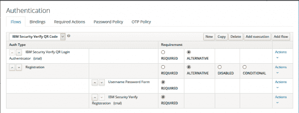
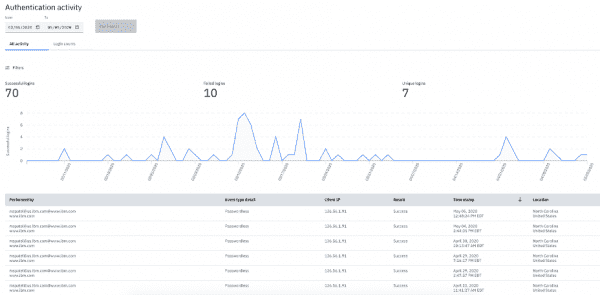

# 用 IBM Security Verify 扩展 Red Hat SSO

> 原文：<https://developers.redhat.com/blog/2020/06/11/extending-red-hat-sso-with-ibm-security-verify>

越来越多的组织使用[Red Hat Single Sign-On(Red Hat SSO)](https://access.redhat.com/products/red-hat-single-sign-on)作为保护企业和消费者应用程序用户身份的基础。对提供强大的安全性和无缝用户体验的关注需要同等考虑。这两个要求都不能妥协，尤其是在 [Red Hat OpenShift](https://developers.redhat.com/openshift) 上为多云世界构建应用程序的时候。

## Red Hat SSO plus IBM 安全验证

有了 Red Hat SSO plus[IBM Security Verify extensions](https://github.com/IBM-Security/verify-keycloak-integration)，开发人员可以继续构建受 Red Hat SSO 保护的应用程序，而且还增加了另一层高级身份验证和无 ID/无密码体验。 [IBM Security Verify](https://www.ibm.com/security/identity-access-management/cloud-identity) 扩展了 Red Hat SSO 开发人员创建身份验证流程的能力，将二维码、移动推送、FIDO、SMS 和电子邮件扩展为不同的身份验证器，可用作第一或第二因素身份验证。对于 QRCode 和 FIDO，它们可用于无 ID 和无密码身份验证，提供顺畅的最终用户体验。

Red Hat SSO 开发人员可以下载扩展并将其放入他们的 Red Hat SSO 环境中，以创建必要的认证流。在电子邮件和 SMS 第二因素身份验证的情况下，Verify 维护和管理 Red Hat SSO 开发人员必须自行配置的所有必要组件，如 SMTP 和 SMPP 服务器，作为 Verify identity-as-a-service 体验的一部分。

以 QRCode 为例，Red Hat SSO 用户可以轻松地在 Red Hat SSO 中本地配置无 ID 和无密码体验，以提供更安全、无摩擦的认证流程。所有 Red Hat SSO 开发人员需要做的就是创建一个带有 Verify 的 API 客户端，在他们的 Red Hat SSO 部署中删除 Verify 扩展，并在 Red Hat SSO 中配置 QRCode 认证流(参见图 1)。添加其他身份验证流的步骤只是修改最后一步:配置身份验证流。

Figure 1: Example authentication flow with IBM Security Verify QRCode.

通过使用 Verify，当不同的授权码与受 Red Hat SSO 保护的应用程序一起使用时，Red Hat SSO 开发人员还可以获得对授权事件的可见性和分析。这为 Red Hat SSO 开发人员提供了检测用户从哪里进行身份验证的能力，通过能够深入每个事件来确定和查看任何潜在的异常，等等。这些类型的报告可用于审计和合规目的，如图 2 所示。

Figure 2: Viewing authentication event summary and details.

## 入门指南

在 20 分钟内，可以将高级身份验证和无摩擦体验添加到 Red Hat SSO 部署中:

1.  创建一个[免费验证租户](https://www.ibm.com/account/reg/signup?formid=urx-44536)。
2.  下载扩展并将其放入 Red Hat SSO 部署中。
3.  配置所需的身份验证流。用户指南可以根据需要提供更多详细信息。

更多信息可以在 [IBM Security GitHub](https://github.com/IBM-Security/verify-keycloak-integration) 中找到。您还可以通过[用户指南](https://github.com/IBM-Security/verify-keycloak-integration#usage)获得更多关于在 Red Hat SSO 中使用 Verify extensions 的详细步骤，以及一个[示例应用程序](https://github.com/jason-choi1/ibm-airways-keycloak-sso)的文档，开发者可以开始使用并进一步探索。

*Last updated: June 25, 2020*