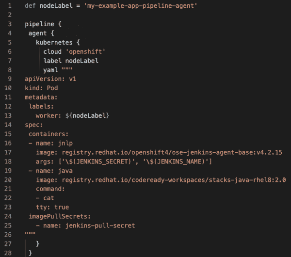
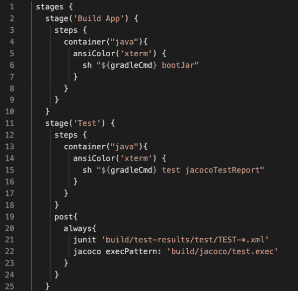
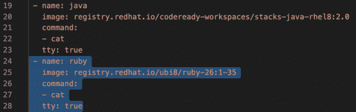
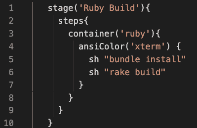

# 创建自定义 Jenkins 容器的更简单方法

> 原文：<https://developers.redhat.com/blog/2020/06/04/an-easier-way-to-create-custom-jenkins-containers>

在许多组织中，开发人员很难创建定制的 Jenkins 容器映像。幸运的是，在工程中，完成工作的方法往往不止一种。在本文中，我将向您展示如何通过在 pod 模板中聚合可用的容器来创建您自己的自定义 Jenkins 容器映像。

注意，对于我的示例应用程序，我使用的是 Kubernetes Plugin for Jenkins 版本 1.18.2 ，它运行在 [Red Hat OpenShift](https://developers.redhat.com/openshift) 中。如果您使用不同的版本，请使用其文档。

## 配置 Jenkinsfile

正如您对 Jenkins 最佳实践的期望一样，我们将从 Jenkins 文件开始。理想情况下，您应该在 Git 存储库的根目录下找到这个文件。对于我的例子，我使用了声明性管道。如果您喜欢使用脚本化管道，请参阅 Jenkins 文档。

这个例子是一个简单的 [Java](https://developers.redhat.com/topics/enterprise-java/) 项目。我们只需要两个容器:一个用于 Java 网络启动协议(JNLP)代理，一个用于 Java 工具。Red Hat 注册表上 JNLP 代理映像的 URL 是`registry.redhat.io/openshift4/ose-jenkins-agent-base`。

对于 Java 工具映像，我们有几个选项:

*   使用在`registry.redhat.io/openjdk/openjdk-11-rhel8`找到的[Red Hat Enterprise Linux 8(RHEL 8)和 OpenJDK 11](https://developers.redhat.com/rhel8/) 的源到映像(S2I)映像。
*   使用在`registry.redhat.io/codeready-workspaces/stacks-java-rhel8`找到的 [CodeReady 工作区(CRW)](https://developers.redhat.com/products/codeready-workspaces/overview) 映像。
*   选择使用您的组织已经采用的通用基础映像(UBI)或社区映像。

我将使用 CodeReady Workspaces (CRW)映像，这可以确保我在 CRW IDE 中获得与在 Jenkins 管道中相同的结果。图 1 显示了到目前为止的 Jenkinsfile。

Figure 1\. The Jenkinsfile with two containers.

注意，每个 Jenkins 代理 pod 都必须有一个名为`jnlp`的容器。如果你不提供这个容器， [Kubernetes](https://developers.redhat.com/topics/kubernetes/) 插件为 Jenkins 硬编码添加一个([这里是该行为的一个例子](https://github.com/jenkinsci/kubernetes-plugin/blob/61d04d714551361ab5f1c1e7f71dd59e0a27aa2d/src/main/java/org/csanchez/jenkins/plugins/kubernetes/PodTemplateBuilder.java#L98))。不幸的是，硬编码图像与 [Red Hat OpenShift 容器平台(OCP)](https://developers.redhat.com/openshift) Jenkins 图像不兼容。OCP 詹金斯的未来版本将通过一个默认的 pod 模板提供一个默认的 JNLP 容器。

您可能还会注意到图 1 中的`imagePullSecrets`配置。我把它包括进来是因为我直接从`registry.redhat.io`中提取图像，并且注册中心要求认证。你也不必使用 OpenShift secrets 你可以探索[多种选择](https://access.redhat.com/containers/?tab=images#/registry.access.redhat.com/openshift4/ose-jenkins)，看看什么最适合你。

## 构建基本应用程序

根据指定，Jenkinsfile 生成一个包含两个容器的 pod。这两个容器共享一个工作目录和一个默认为`/home/jenkins/agent`的卷挂载。`jnlp`容器负责声明性的签出源代码管理(SCM)动作。除非另有说明，否则所有其他操作都在 Jenkins pipeline 工作区中执行。图 2 显示了更多的 Jenkinsfile，我们现在开始在这里构建 Java 应用程序。

Figure 2\. Building the Java application.

注意我如何使用闭包`container`来指定`java`容器，这是来自 pod 模板的 YAML 配置。`jnlp`容器是默认的执行容器。我不会在本文中展示更多的示例应用程序，但是你可以在这里找到完整的版本。

## 添加您需要的所有容器

添加完`jnlp`容器后，您可以向 pod 模板添加任意数量的容器。你的应用需要执行 Ruby 吗？尝试添加如图 3 所示的配置。

Figure 3\. Adding a Ruby container to the configuration.

一旦添加了容器，就可以通过输入如图 4 所示的命令来使用它。请注意，pod 模板和闭包之间的容器名称必须匹配。

Figure 4\. Execute the Ruby build.

如果你正在使用 [CodeReady 工作区](https://developers.redhat.com/blog/2019/12/03/red-hat-codeready-workspaces-2-new-tools-to-speed-kubernetes-development/)，那么你应该在你的`devfile.yaml`和你的 [Jenkinsfile](https://github.com/jenkinsci/kubernetes-plugin/blob/kubernetes-1.18.2/README.md) 中使用相同的图像。在这两个文件中使用相同的图像可以确保在您的工作空间中总是获得相同的结果，这在您进入管道后变得更加重要。

## 结论

在本文中，我已经快速地向您展示了如何将现成的容器聚合到一个 pod 模板中。这是一种发布自定义 Jenkins 容器的有效方式，而不必担心组织障碍——相反，您可以继续交付应用程序。作为一名开发人员，我希望这种方法能让您的生活更轻松。

如果您想从我在本文中使用的示例应用程序中了解更多，您可以研究一下[完整的应用程序代码](https://github.com/jflowers/spring-petclinic/blob/blog-jenkins-agents-through-aggregation/Jenkinsfile)，它包括一个`devfile`，以及我们一起开发的 Jenkinsfile。更多关于在 OCP 开发詹金斯管道的信息，请看我的视频。

[https://www.youtube.com/embed/6Ka9Ag1Lz-s?autoplay=0&start=0&rel=0](https://www.youtube.com/embed/6Ka9Ag1Lz-s?autoplay=0&start=0&rel=0)

*Last updated: December 20, 2021*