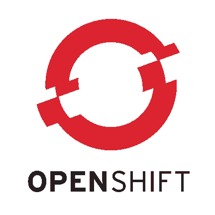

# fabric8 Kubernetes Java 客户端入门

> 原文：<https://developers.redhat.com/blog/2020/05/20/getting-started-with-the-fabric8-kubernetes-java-client>

[Fabric8](https://github.com/fabric8io/kubernetes-client) 从 2015 年开始作为 [Kubernetes](https://developers.redhat.com/topics/kubernetes/) 的 Java 客户端可用，如今是 Kubernetes 最受欢迎的客户端库之一。(最流行的是 [client-go](https://github.com/kubernetes/client-go) ，这是 Kubernetes 上 go 编程语言的客户端库。)近年来，fabric8 已经从 Kubernetes REST API 的一个 Java 客户端发展成为一个成熟的替代工具，取代了用于基于 Java 的开发的命令行工具。

Fabric8 不仅仅是一个简单的 Java Kubernetes REST 客户端。它的特性包括丰富的特定于领域的语言(DSL)、高级代码处理和操作模型、扩展挂钩、用于测试的模拟服务器和许多客户端实用程序。除了用于构建新扩展的钩子之外，fabric8 Kubernetes Java 客户端还具有用于 [Knative](https://developers.redhat.com/topics/serverless-architecture/) 、 [Tekton](https://github.com/tektoncd) 、 [Kubernetes 服务目录](https://github.com/kubernetes-sigs/service-catalog)、 [Red Hat OpenShift 服务目录](https://docs.openshift.com/container-platform/4.1/applications/service_brokers/installing-service-catalog.html)和 [Kubernetes 断言](https://github.com/fabric8io/kubernetes-assertions)的扩展。

| [不可思议的顾客](https://search.maven.org/artifact/io.fabric8/kubernetes-client/4.10.3/jar) | T2

```
<dependency>  
  <groupId>io.fabric8</groupId>  
  <artifactId>kubernetes-client</artifactId>
  <version>4.10.3</version>
</dependency>

```

 |
| [OpenShift 客户端](https://search.maven.org/artifact/io.fabric8/openshift-client/4.10.3/jar) | T2

```
<dependency>  
  <groupId>io.fabric8</groupId>  
  <artifactId>openshift-client</artifactId>
  <version>4.10.3</version>
</dependency>

```

 |
| [泰克顿客户端](https://search.maven.org/artifact/io.fabric8/tekton-client/4.10.3/jar) | T2

```
<dependency>  
  <groupId>io.fabric8</groupId>  
  <artifactId>tekton-client</artifactId>
  <version>4.10.3</version>
</dependency>

```

 |
| [Knative client](https://search.maven.org/artifact/io.fabric8/knative-client/4.10.3/jar) | T2

```
<dependency>  
  <groupId>io.fabric8</groupId>  
  <artifactId>knative-client</artifactId>
  <version>4.10.3</version>
</dependency>

```

 |
| [Istio 客户端](https://search.maven.org/artifact/me.snowdrop/istio-client) | T2

```
<dependency>  
  <groupId>me.snowdrop</groupId>
  <artifactId>istio-client</artifactId>  
  <version>1.6.5-Beta2</version>
</dependency>

```

 |
| [服务目录客户端](https://search.maven.org/artifact/io.fabric8/servicecatalog-client/4.10.3/bundle) | T2

```
<dependency> 
  <groupId>io.fabric8</groupId>  
  <artifactId>servicecatalog-client</artifactId>  
  <version>4.10.3</version>  
  <type>bundle</type>
</dependency>

```

 |

**注意**:Istio 客户端不是 fabric8 存储库的直接组成部分，而是基于 fabric8。

此外，许多流行的项目使用 fabric8 Kubernetes 客户端扩展，包括 [Quarkus](https://developers.redhat.com/products/quarkus/getting-started) 、 [Apache Camel](https://camel.apache.org/) 、 [Apache Spark](https://spark.apache.org/) 等等。点击此处查看哪些项目支持这个 Kubernetes 和 OpenShift Java 客户端。

## 将 fabric8 与 Kubernetes 配合使用

使用 fabric8 很简单，特别是因为它提供了一个访问 Kubernetes 资源的 API。要开始使用 Java 客户端，您只需将它作为一个依赖项添加到您的 Maven `pom.xml`中:

```
  <dependency>
    <groupId>io.fabric8</groupId>
    <artifactId>kubernetes-client</artifactId>
    <version>4.10.3</version>
  </dependency>

```

或者，您可以使用`build.gradle`:

```
dependencies {
    compile 'io.fabric8:kubernetes-client:4.10.3'
}

```

接下来，我们来看几个常见的例子。

### 示例 1:在名称空间中列出窗格

下面是一个列出名称空间中所有客户端窗格的示例:

```
try (KubernetesClient client = new DefaultKubernetesClient()) {

    client.pods().inNamespace("default").list().getItems().forEach(
            pod -> System.out.println(pod.getMetadata().getName())
    );

} catch (KubernetesClientException ex) {
    // Handle exception
    ex.printStackTrace();
}

```

### 示例 2:服务器认证

当您使用`DefaultKubernetesClient`时，它将尝试读取您的主目录中的`~/.kube/config`文件，并加载向 Kubernetes API 服务器认证所需的信息。您可以用系统属性`KUBECONFIG`覆盖此配置。

如果你正在从一个`Pod`里面使用`DefaultKubernetesClient`，它将从安装在`Pod`里面的`ServiceAccount`卷中加载`~/.kube/config`。对于更复杂的配置，您可以简单地在`DefaultKubernetesClient`中传递一个`Config`对象，就像这样:

```
Config config = new ConfigBuilder()
        .withMasterUrl("https://api.rh-idev.openshift.com:443")
        .build();
try (KubernetesClient client = new DefaultKubernetesClient(config)) {

    client.pods().inNamespace("default").list().getItems().forEach(
            pod -> System.out.println(pod.getMetadata().getName())
    );

} catch (KubernetesClientException ex) {
    // Handle exception
    ex.printStackTrace();
}

```

### 示例 3:创建简单部署:

假设您想要构建一个快速的`Deployment`对象，并将其应用到 Kubernetes 集群上。您可以轻松利用 fabric8 提供的丰富的构建器类来动态构建您的 Kubernetes 资源。下面是一个构建简单 Nginx `Deployment`的例子:

```
try (KubernetesClient client = new DefaultKubernetesClient()) {
    Deployment deployment = new DeploymentBuilder()
            .withNewMetadata()
               .withName("nginx-deployment")
               .addToLabels("app", "nginx")
            .endMetadata()
            .withNewSpec()
               .withReplicas(1)
               .withNewSelector()
                   .addToMatchLabels("app", "nginx")
               .endSelector()
               .withNewTemplate()
                   .withNewMetadata()
                      .addToLabels("app", "nginx")
                   .endMetadata()
                   .withNewSpec()
                      .addNewContainer()
                          .withName("nginx")
                          .withImage("nginx:1.7.9")
                          .addNewPort().withContainerPort(80).endPort()
                      .endContainer()
                   .endSpec()
               .endTemplate()
            .endSpec()
            .build();

    client.apps().deployments().inNamespace("default").createOrReplace(deployment);
}

```

### 示例 4:将 Kubernetes 资源 YAMLs 加载到 Java 对象中:

使用 Fabric8 Kubernetes Client，您可以轻松地将资源清单加载到由它的 Kubernetes 模型提供的 Java 对象中。假设你有一辆这样的 YAML:

```
apiVersion: v1
kind: Service
metadata:
  name: my-service
spec:
  selector:
    app: MyApp
  ports:
    - protocol: TCP
      port: 80
      targetPort: 9376
```

现在为了将这个 YAML 对象加载到一个 Kubernetes `Service`对象中。你需要这样做:

```
Service service = client.services()
        .load(LoadServiceYaml.class.getResourceAsStream("/test-svc.yml"))
        .get();
```

### 示例 5:使用客户端对 Kubernetes 资源进行 CRUD 操作:

您可以使用 Fabric8 Kubernetes 客户端 API 轻松创建、替换、编辑或删除您的 Kubernetes 资源。我们提供了丰富的 DSL 来实现这些操作。下面是一个`Deployment`对象的基本 CRUD 操作的例子:

```
    // Create
    client.apps().deployments().inNamespace("default").create(deployment);

    // Get
    Deployment deploy = client.apps().deployments()
            .inNamespace("default")
            .withName("deploy1")
            .get();

    // Update, adding dummy annotation
    Deployment updatedDeploy = client.apps().deployments()
            .inNamespace("default")
            .withName("deploy1")
            .edit()
            .editMetadata().addToAnnotations("foo", "bar").endMetadata()
            .done();

    // Deletion
    Boolean isDeleted = client.apps().deployments()
            .inNamespace("default")
            .withName("deploy1")
            .delete();

    // Deletion with some propagation policy
    Boolean bDeleted = client.apps().deployments()
            .inNamespace("default")
            .withName("deploy1")
            .withPropagationPolicy(DeletionPropagation.BACKGROUND)
            .delete();

```

## 了解更多关于 fabric8 的信息

Fabric8 的开发团队主要由 Java 开发人员组成，因此 Java 开发人员的观点对这个客户有很大影响。在本文中，我只展示了 fabric8 在 Java 环境中使用 Kubernetes APIs 的一些特性。如需更多示例，请参见 Kubernetes Java 客户端示例库。要深入了解如何使用 fabric8，请访问 **[Fabric8 Kubernetes Java 客户端备忘单](https://github.com/fabric8io/kubernetes-client/blob/master/doc/CHEATSHEET.md)** 。

*Last updated: July 17, 2020*