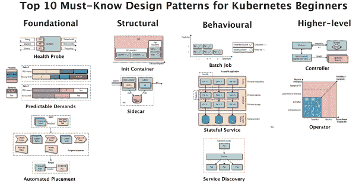

# 10 个必须知道的 Kubernetes 设计模式

> 原文：<https://developers.redhat.com/blog/2020/05/11/top-10-must-know-kubernetes-design-patterns>

以下是从 Kubernetes 模式书综合而来的初学者必须知道的 10 大设计模式。熟悉这些模式将有助于您理解基本的 Kubernetes 概念，这反过来将有助于您讨论和设计基于 Kubernetes 的应用程序。

Kubernetes 中有许多重要的概念，但这些是开始时最重要的概念:

Top 10 Kubernetes Design Patterns

为了帮助您理解，这些模式被组织成下面的几个类别，灵感来自于四人帮的设计模式。

# 基本模式

这些模式代表了容器化应用程序必须遵守的原则和最佳实践，以便成为优秀的云原生公民。不管应用程序的性质如何，您都应该遵循这些准则。遵循这些原则将有助于确保您的应用程序适合 Kubernetes 上的自动化。

### 健康探测模式

*健康探测器*指示每个容器应该实现特定的 API，以帮助平台尽可能以最健康的方式观察和管理应用程序。要实现完全自动化，云原生应用程序必须高度可见，允许推断其状态，以便 Kubernetes 可以检测应用程序是否启动并准备好服务请求。这些观察影响了 pod 的生命周期管理和流量路由到应用程序的方式。

### 可预测的需求模式

*可预测的需求*解释了为什么每个容器都应该声明它的资源配置文件，并保持在指定的资源需求范围内。共享云环境上成功的应用程序部署、管理和共存的基础取决于识别和声明应用程序的资源需求和运行时依赖性。该模式描述了您应该如何声明应用程序需求，无论它们是硬运行时依赖项还是资源需求。声明您的需求对于 Kubernetes 在集群中为您的应用程序找到合适的位置至关重要。

### 自动化布局模式

*自动放置*解释了如何影响多节点集群中的工作负载分布。放置是 Kubernetes 调度器的核心功能，用于将新的 pod 分配给满足容器资源请求和遵守调度策略的节点。该模式描述了 Kubernetes 调度算法的原理以及从外部影响布局决策的方式。

# 结构模式

拥有好的云原生容器是第一步，但还不够。下一步是重用容器并将它们组合成 pod 以达到预期的结果。这个类别中的模式关注于在 Pod 中构造和组织容器，以满足不同的用例。影响吊舱中容器的力导致了这些模式。

### 初始化容器模式

初始化容器为初始化相关的任务和主应用程序容器引入了一个独立的生命周期。Init 容器通过为与主应用程序容器不同的初始化相关任务提供独立的生命周期来实现关注点的分离。这种模式引入了一个基本的 Kubernetes 概念，当需要初始化逻辑时，这种概念会在许多其他模式中使用。

### 边车模式

*Sidecar* 描述了如何在不改变现有容器的情况下扩展和增强其功能。这种模式是基本的容器模式之一，它允许单一用途的容器紧密合作。

# 行为模式

这些模式描述了由管理平台确保的 pod 的生命周期保证。根据工作负载的类型，Pod 可能会作为批处理作业一直运行到完成，或者被安排为定期运行。它可以作为一个守护服务或单例运行。选择正确的生命周期管理原语将帮助您运行具有期望保证的 Pod。

### 批处理作业模式

*批处理作业*描述了如何运行一个独立的原子工作单元，直到完成。这种模式适合在分布式环境中管理孤立的原子工作单元。

### 有状态服务模式

*有状态服务*描述了如何使用 Kubernetes 创建和管理分布式有状态应用程序。此类应用程序需要诸如持久身份、联网、存储和普通性等特性。StatefulSet 原语为这些构件提供了强有力的保证，非常适合于有状态应用程序的管理。

### 服务发现模式

*服务发现*解释了客户端如何访问和发现提供应用服务的实例。为此，Kubernetes 提供了多种机制，这取决于服务消费者和生产者是位于集群之上还是之外。

# 更高级别的模式

这个类别中的模式更复杂，代表更高级别的应用程序管理模式。这里的一些模式(比如 Controller)是永恒的，Kubernetes 本身就是建立在这些模式之上的。

### 控制器模式

*控制器*是一种主动监控并维护一组 Kubernetes 资源处于期望状态的模式。Kubernetes 的核心本身由一组控制器组成，这些控制器定期监视应用程序的当前状态，并使其与声明的目标状态相一致。这个模式描述了如何利用这个核心概念为我们自己的应用程序扩展平台。

### 运算符模式

一个*操作符*是一个控制器，它使用 CustomResourceDefinitions 以算法和自动化的形式封装特定应用程序的操作知识。运算符模式允许我们扩展控制器模式，以获得更大的灵活性和更强的表达能力。Kubernetes 的[操作员](http://operatorhub.io/)越来越多，这种模式正在成为操作复杂分布式系统的主要形式。

# 摘要

今天，Kubernetes 是最流行的容器编排平台。它由所有主要的软件公司联合开发和支持，并由所有主要的云提供商作为服务提供。Kubernetes 支持 Linux 和 Windows 系统，以及所有主要的编程语言。该平台还可以协调和自动化无状态和有状态应用程序、批处理作业、周期性任务和无服务器工作负载。这里描述的模式是 Kubernetes 中最常用的模式，如下所示。

*按不同类别组织的 Kubernetes 模式*

Kubernetes 是新的应用程序可移植层，是云上每个人的共同点。如果你是一名软件开发人员或架构师，Kubernetes 很可能会以某种形式成为你生活的一部分。学习这里描述的 Kubernetes 模式将会改变你对这个平台的看法。我相信 Kubernetes 和源自它的概念将变得和面向对象编程概念一样重要。

这里的模式是创建四人组设计模式的一个尝试，但是用于容器编排。读这篇文章一定不是结束，而是你 Kubernetes 之旅的开始。快乐！

*Last updated: June 26, 2020*