# 使用 Debezium 更改数据捕获:简单的操作方法，第 1 部分

> 原文：<https://developers.redhat.com/blog/2020/05/08/change-data-capture-with-debezium-a-simple-how-to-part-1>

随着组织转向云原生、12 因素和无状态，总会出现一个问题:如何将组织的数据应用到这些新的应用程序中？有许多不同的模式，但我们今天要看的一个模式是变更数据捕获。这篇文章简单介绍了如何在 [OpenShift](https://www.openshift.com/) 环境中使用 [Debezium](https://debezium.io) 构建变更数据捕获解决方案。未来的帖子还将对此进行补充，并添加额外的功能。

## 什么是变更数据捕获？

另一位红帽匠 [Sadhana Nandakumar](https://developers.redhat.com/blog/author/snandaku/) 在[她的一篇关于变更数据捕获的帖子](https://developers.redhat.com/blog/2019/09/03/cdc-pipeline-with-red-hat-amq-streams-and-red-hat-fuse/)中总结得很好:

> “变更数据捕获(CDC)是一种模式，它使数据库变更能够被监控并传播到下游系统。这是实现可靠的微服务集成和解决典型挑战的有效方式，例如从现有的单片中逐步提取微服务。”

这种模式让数据分布在团队中，每个团队可以自我管理他们自己的数据，同时仍然保持与原始数据源的同步。还有其他的模式，比如[命令查询责任分离](https://martinfowler.com/bliki/CQRS.html) (CQRS)，都是建立在这个思想之上的。

## 什么是 Debezium？

[Debezium](https://debezium.io) 是一项开源技术，作为[红帽集成](https://developers.redhat.com/integration/)的一部分，由红帽支持，它允许数据库行级别的更改被捕获为事件并发布到 [Apache Kafka](https://www.redhat.com/en/topics/integration/what-is-apache-kafka) 主题。Debezium 连接器基于流行的 [Apache Kafka Connect API](https://kafka.apache.org/documentation.html#connect) ，可以部署在[红帽 AMQ 流](https://developers.redhat.com/products/amq/overview) Kafka 集群中。

## 应用概述

[我们将使用](https://github.com/edeandrea/summit-lab-spring-music/tree/pipeline)作为“整体”的应用程序是一个 Spring Boot 应用程序，它使用 MySQL 数据库作为后端。应用程序本身采用了[事件源](https://martinfowler.com/eaaDev/EventSourcing.html)和[发件箱](https://debezium.io/blog/2020/02/10/event-sourcing-vs-cdc/)模式。这意味着应用程序在包含域事件的数据库中维护一个单独的表。我们需要监视这个表的变化，以便发布到我们的 Kafka 主题中。在本例中，有一个名为`outbox_events`的表，如下所示:

```
+-----------------+--------------+------+-----+---------+----------------+
| Field           | Type         | Null | Key | Default | Extra          |
+-----------------+--------------+------+-----+---------+----------------+
| event_id        | bigint(20)   | NO   | PRI | NULL    | auto_increment |
| aggregate_id    | varchar(255) | NO   |     | NULL    |                |
| aggregate_type  | varchar(255) | NO   |     | NULL    |                |
| event_timestamp | datetime(6)  | NO   |     | NULL    |                |
| event_type      | varchar(255) | NO   |     | NULL    |                |
| payload         | json         | YES  |     | NULL    |                |
+-----------------+--------------+------+-----+---------+----------------+

```

## 设置数据库

[Debezium 文档](https://access.redhat.com/documentation/en-us/red_hat_integration/2020-04/html/debezium_user_guide/index)中有一节是关于[如何设置 Debezium 连接器与 MySQL 数据库](https://access.redhat.com/documentation/en-us/red_hat_integration/2020-04/html/debezium_user_guide/debezium-connector-for-mysql)一起工作的。我们需要遵循那个文档，但是以一种容器本地的方式，因为我们将在 [Red Hat OpenShift](https://www.openshift.com/) 上运行一切。有许多不同的方法来完成这项任务，但我将描述我决定这样做的方式。

### 创建一个 OpenShift 项目

我们需要做的第一件事是登录我们的 OpenShift 集群。在我的例子中，我使用的是 OpenShift 4.3。数据库设置不需要集群管理员权限，因此任何普通用户都可以正常工作:

```
$ oc login <CLUSTER_API_URL>
```

接下来，让我们创建一个项目来托管我们的工作:

```
$ oc new-project debezium-demo
```

### 创建 MySQL 配置

从[关于设置 MySQL 的 Debezium 文档](//access.redhat.com/documentation/en-us/red_hat_integration/2020-04/html/debezium_user_guide/debezium-connector-for-mysql#setup-the-mysql-server)，我们需要做的第一件事是启用 binlog、GTIDs 和查询日志事件。这通常在 MySQL 配置文件中完成，通常位于`/etc/my.cnf`中。在我们的例子中，我们将使用 [Red Hat 的 MySQL 8.0 容器映像](https://github.com/sclorg/mysql-container/tree/master/8.0)。这个映像已经部署在大多数 OpenShift 安装中的`openshift`名称空间中的`mysql:8.0`标签下。本图来源于`registry.redhat.io/rhscl/mysql-80-rhel7:latest`。

根据[容器映像文档](https://github.com/sclorg/mysql-container/tree/master/8.0#default-mycnf-file)，默认配置文件位于`/etc/my.cnf`，但是有一个环境变量`MYSQL_DEFAULTS_FILE`，可以用来覆盖它的位置。MySQL 配置还允许一个配置文件包含其他配置文件，因此我们将创建一个新的配置文件，首先包含默认配置，然后覆盖其中的一些配置，以启用所需的 Debezium 配置。

为此，我们将首先创建一个包含我们的配置的配置文件。我们将这个文件称为`my-debezium.cnf`:

```
!include /etc/my.cnf

[mysqld]
server-id = 223344
server_id = 223344
log_bin = ON
binlog_format = ROW
binlog_row_image = full
binlog_rows_query_log_events = ON
expire_logs_days = 10
gtid_mode = ON
enforce_gtid_consistency = ON

```

既然我们的 MySQL 配置文件已经创建，让我们在 OpenShift 项目中将它创建为一个`ConfigMap`:

```
$ oc create configmap db-config --from-file=my-debezium.cnf
```

### 创建一个 MySQL 用户

Debezium MySQL 配置的下一部分是[为连接器](https://access.redhat.com/documentation/en-us/red_hat_integration/2020-04/html-single/debezium_user_guide/index#create-a-mysql-user-for-cdc_cdc)创建一个 MySQL 用户。我们将遵循与配置相同的模式，创建一个包含所需 SQL 的文件。这个`initdb.sql`文件将创建一个 ID 为`debezium`和密码为`debezium`的用户:

```
CREATE USER IF NOT EXISTS 'debezium'@'%' IDENTIFIED WITH mysql_native_password BY 'debezium';
GRANT SELECT, RELOAD, SHOW DATABASES, REPLICATION SLAVE, REPLICATION CLIENT ON *.* TO 'debezium'@'%';
FLUSH PRIVILEGES;

```

**注意:**在真实的生产环境中，我们希望更仔细地选择用户名和密码，并且只允许`debezium`用户访问它将监视的表。

现在在我们的 OpenShift 项目中创建一个`ConfigMap`:

```
$ oc create configmap db-init --from-file=initdb.sql
```

配置的最后一部分是创建一个 OpenShift `Secret`来保存我们的数据库凭证。这个`Secret`将被我们的数据库以及连接到数据库的应用程序使用。为了简单起见，我们将使用`music`作为我们的数据库名称、用户名、密码和管理员密码:

```
$ oc create secret generic db-creds --from-literal=database-name=music --from-literal=database-password=music --from-literal=database-user=music --from-literal=database-admin-password=music

```

**注意(再次):**在真实的生产环境中，我们希望更仔细地选择用户名和密码。

### 部署 MySQL

最后一部分是创建数据库，并将其指向我们的两个配置。OpenShift 允许我们获取我们创建的`ConfigMap`并将它们作为文件挂载到容器文件系统中。然后，我们可以使用环境变量来改变 MySQL 容器映像的行为。让我们为数据库`DeploymentConfig`和`Service`创建一个描述符 YAML 文件`mysql.yml`:

```
kind: DeploymentConfig
apiVersion: apps.openshift.io/v1
metadata:
  name: spring-music-db
  labels:
    application: spring-music
    app: spring-music
    app.kubernetes.io/part-of: spring-music
    app.openshift.io/runtime: mysql-database
spec:
  replicas: 1
  strategy:
    type: Recreate
    recreateParams:
      post:
        failurePolicy: Abort
        execNewPod:
          command:
            - /bin/sh
            - '-c'
            - sleep 10 && MYSQL_PWD="$MYSQL_ROOT_PASSWORD" $MYSQL_PREFIX/bin/mysql -h $SPRING_MUSIC_DB_SERVICE_HOST -u root < /config/initdb.d/initdb.sql
          containerName: spring-music-db
          volumes:
            - db-init
  selector:
    name: spring-music-db
  template:
    metadata:
      name: spring-music-db
      labels:
        name: spring-music-db
    spec:
      volumes:
        - name: db-data
          emptyDir: {}
        - name: db-init
          configMap:
            name: db-init
        - name: db-config
          configMap:
            name: db-config
      containers:
        - env:
            - name: MYSQL_DEFAULTS_FILE
              value: /config/configdb.d/my-debezium.cnf
            - name: MYSQL_USER
              valueFrom:
                secretKeyRef:
                  name: db-creds
                  key: database-user
            - name: MYSQL_PASSWORD
              valueFrom:
                secretKeyRef:
                  name: db-creds
                  key: database-password
            - name: MYSQL_DATABASE
              valueFrom:
                secretKeyRef:
                  name: db-creds
                  key: database-name
            - name: MYSQL_ROOT_PASSWORD
              valueFrom:
                secretKeyRef:
                  name: db-creds
                  key: database-admin-password
          name: spring-music-db
          image: ' '
          imagePullPolicy: IfNotPresent
          volumeMounts:
            - name: db-data
              mountPath: /var/lib/mysql/data
            - name: db-init
              mountPath: /config/initdb.d
            - name: db-config
              mountPath: /config/configdb.d
          ports:
            - containerPort: 3306
              protocol: TCP
          livenessProbe:
            failureThreshold: 3
            initialDelaySeconds: 30
            periodSeconds: 10
            successThreshold: 1
            tcpSocket:
              port: 3306
            timeoutSeconds: 1
          readinessProbe:
            exec:
              command:
                - /bin/sh
                - -i
                - -c
                - MYSQL_PWD="$MYSQL_PASSWORD" mysql -h 127.0.0.1 -u $MYSQL_USER -D $MYSQL_DATABASE -e 'SELECT 1'
            failureThreshold: 3
            initialDelaySeconds: 5
            periodSeconds: 10
            successThreshold: 1
            timeoutSeconds: 1
          resources:
            limits:
              memory: 512Mi
          securityContext:
            privileged: false
  triggers:
    - type: ConfigChange
    - type: ImageChange
      imageChangeParams:
        automatic: true
        containerNames:
          - spring-music-db
        from:
          kind: ImageStreamTag
          name: mysql:8.0
          namespace: openshift
---
kind: Service
apiVersion: v1
metadata:
  name: spring-music-db
  labels:
    application: spring-music
    app: spring-music
  annotations:
    template.openshift.io/expose-uri: mysql://{.spec.clusterIP}:{.spec.ports[?(.name=="mysql")].port}
spec:
  ports:
    - name: mysql
      port: 3306
      protocol: TCP
      targetPort: 3306
  selector:
    name: spring-music-db

```

从这个`DeploymentConfig`中，您可以看到我们在第 72-75 行的`/config`目录中将`db-init`和`db-config` `ConfigMap`挂载为容器文件系统中的卷:

```
volumeMounts:
  - name: db-data
    mountPath: /var/lib/mysql/data
  - name: db-init
    mountPath: /config/initdb.d
  - name: db-config
    mountPath: /config/configdb.d
```

第 44-45 行的`/config/configdb.d/my-debezium.cnf`文件也被设置为`MYSQL_DEFAULTS_FILE`环境变量的值:

```
- env:
  - name: MYSQL_DEFAULTS_FILE
    value: /config/configdb.d/my-debezium.cnf
```

来自`db-init` `ConfigMap`的数据库初始化脚本在第 15-24 行作为 post [生命周期钩子](https://docs.openshift.com/container-platform/4.3/applications/deployments/deployment-strategies.html#deployments-lifecycle-hooks_deployment-strategies)执行:

```
post:
  failurePolicy: Abort
  execNewPod:
    command:
      - /bin/sh
      - '-c'
      - sleep 10 && MYSQL_PWD="$MYSQL_ROOT_PASSWORD" $MYSQL_PREFIX/bin/mysql -h $SPRING_MUSIC_DB_SERVICE_HOST -u root < /config/initdb.d/initdb.sql
    containerName: spring-music-db
    volumes:
      - db-init
```

我们这里的 MySQL 实例是短暂的，所以每当创建一个新的容器实例时，脚本将在 pod 内的 sidecar 容器中执行。

现在创建资源并等待数据库窗格启动:

```
$ oc create -f mysql.yml
```

## 启动应用程序

既然我们的数据库已经启动并运行，我们就可以启动应用程序了。让我们转到 OpenShift web 控制台，然后转到**开发人员**透视图的**拓扑**视图，如图 1 所示。

[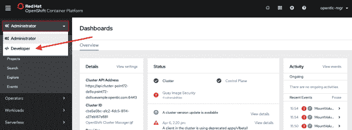](/sites/default/files/blog/2020/04/topology-view.png)

图 1:导航到开发人员视角">

然后点击 **+Add** 按钮，接着是**容器图像**平铺，如图 2 所示。

[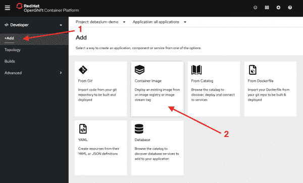](/sites/default/files/blog/2020/04/add-app-container-image.png)

图 2:添加新的容器图像">

用`quay.io/edeandrea/spring-music:latest`填充图像名称，然后单击 search 按钮，如图 3 所示。

[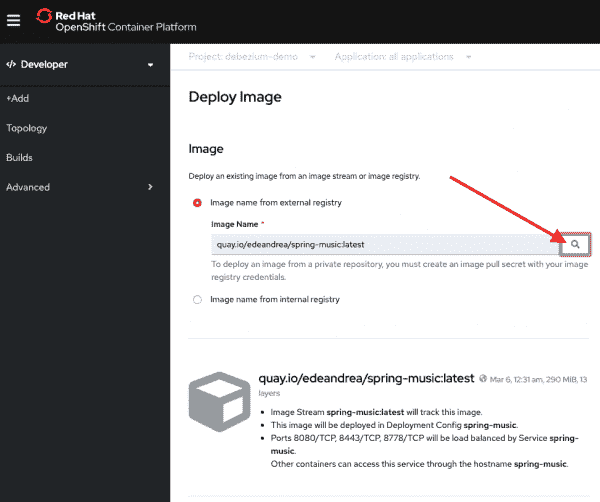](/sites/default/files/blog/2020/04/app-image-name.png)

Figure 3: Load container image

然后填写下面图 4 和图 5 中的其余信息，确保添加正确的标签和环境变量，方法是单击底部带有句子“单击名称以访问路由、部署、扩展、资源限制和标签的高级选项”的链接

字段和值应填写如下:

*   **应用:**春天-音乐
*   **名称**:春天-音乐
*   **展开配置:**已选择
*   **创建到应用程序的路由:**选中
*   **标签**
    *   app.openshift.io/runtime=spring
*   **部署**
    *   **新镜像可用时自动部署**:选中
    *   **部署配置更改时自动部署:**选中
    *   **环境变量**
        *   **从配置图或密码添加**
            *   **名称:**SPRING _ data source _ 用户名
            *   **值:**来自秘密 **db-creds** 字段**数据库-用户**
        *   **从配置图或密码添加**
            *   **名称:** SPRING_DATASOURCE_PASSWORD
            *   **值:**来自秘密 **db-creds** 字段**数据库-密码**
        *   **加值**
            *   **名称:**SPRING _ 数据源 _URL
            *   **值:**JDBC:MySQL://spring-music-db/music

[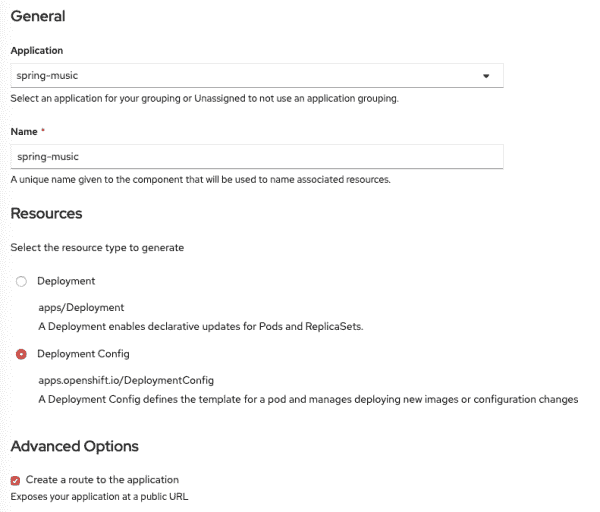](/sites/default/files/blog/2020/04/app-deployment1.png)

Figure 4: Complete application details, Part 1

[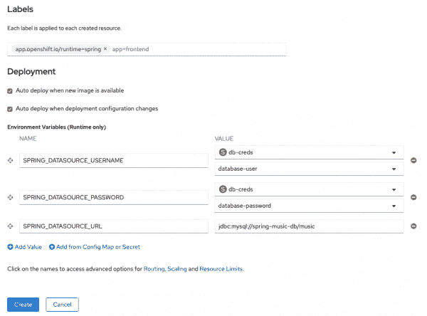](/sites/default/files/blog/2020/04/app-deployment2.png)

Figure 5: Complete application details, Part 2

完成后，点击**创建**按钮。

回到**拓扑**视图，您应该看到应用程序正在加速运行。一旦它被蓝色圆环包围，单击应用程序图标右上角的 route 按钮，如图 6 所示。

[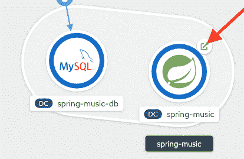](/sites/default/files/blog/2020/04/app-route.png)

图 6:启动应用程序 UI " >

这将启动应用程序。如果你愿意，可以随意摆弄它。尝试删除相册。

## 部署 AMQ 流

现在，我们的数据库和应用程序已经启动并运行，让我们部署我们的 AMQ 流集群。首先，我们需要从 OperatorHub 将 AMQ 流操作器安装到集群中。为此，您需要 OpenShift 集群的集群管理权限。以集群管理员身份登录 web 控制台，然后在左侧展开 **OperatorHub** ，搜索 **AMQ 流**，选择**红帽集成- AMQ 流**，如图 7 所示。

[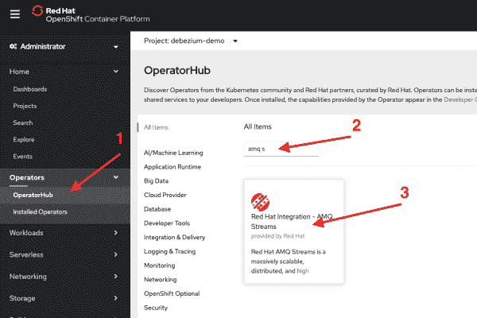](/sites/default/files/blog/2020/04/amq-streams-operator-install.png)

图 7:查找 AMQ 流操作符">

在安装界面上，点击**安装**按钮，如图 8 所示。

[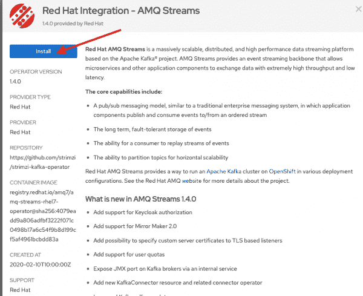](/sites/default/files/blog/2020/04/amq-streams-operator-install2.png)

Figure 8: Install AMQ Streams Operator

在**创建运营商订阅**页面，保留默认设置，点击**订阅**，如图 9 所示。此操作将为集群中的所有项目安装操作员。

[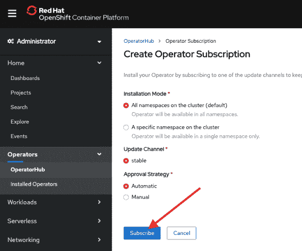](/sites/default/files/blog/2020/04/amq-streams-operator-install3.png)

图 9:创建运营商订阅">

然后，您将被带到**已安装操作员**屏幕。静观其变，等待红色**帽子集成- AMQ 流**操作员以**成功**状态出现，如图 10 所示。不会超过一两分钟。

[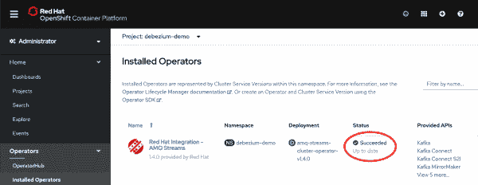](/sites/default/files/blog/2020/04/amq-streams-operator-install4.png)

图 10:等待操作员供应">

现在让我们创建我们的 Kafka 集群。点击 **Red Hat Integration - AMQ 溪流**标签，进入主 AMQ 溪流操作员页面。然后在**提供的 API**下，点击 **Kafka** 部分的**创建实例**标签，如图 11 所示。

[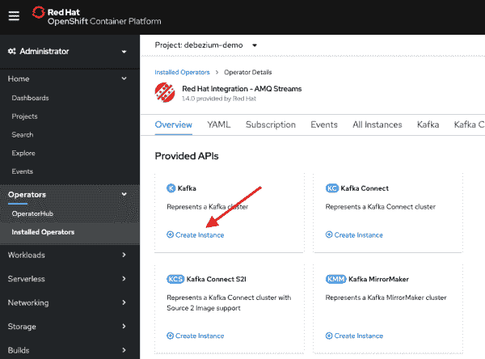](/sites/default/files/blog/2020/04/amq-streams-install1.png)

图 11:创建 Kafka 实例">

创造卡夫卡 YAML 的编辑器将会出现。删除那里的所有内容，粘贴以下内容，并点击屏幕底部的**创建**按钮:

```
kind: Kafka
apiVersion: kafka.strimzi.io/v1beta1
metadata:
  name: db-events
  namespace: debezium-demo
  labels:
    app: spring-music-cdc
    template: spring-music-cdc
    app.kubernetes.io/part-of: spring-music-cdc
spec:
  kafka:
    replicas: 3
    listeners:
      plain: {}
    jvmOptions:
      gcLoggingEnabled: false
    config:
      auto.create.topics.enable: "true"
      num.partitions: 1
      offsets.topic.replication.factor: 3
      default.replication.factor: 3
      transaction.state.log.replication.factor: 3
      transaction.state.log.min.isr: 2
    storage:
      type: persistent-claim
      size: 100Gi
      deleteClaim: true
    template:
      statefulset:
        metadata:
          labels:
            app.kubernetes.io/part-of: spring-music-cdc
            app: spring-music-cdc
            template: spring-music-cdc
          annotations:
            app.openshift.io/connects-to: db-events-zookeeper
  zookeeper:
    replicas: 3
    storage:
      type: persistent-claim
      size: 100Gi
      deleteClaim: true
    template:
      statefulset:
        metadata:
          labels:
            app.kubernetes.io/part-of: spring-music-cdc
            app: spring-music-cdc
            template: spring-music-cdc
  entityOperator:
    topicOperator: {}
    userOperator: {}

```

此操作将部署一个三节点 Kafka 集群和一个三节点 Zookeeper 集群。它还将关闭 JVM 的垃圾收集日志记录，这样，如果我们需要查看任何 Kafka broker pods 中的日志，它们就不会被大量的垃圾收集调试日志所污染。Kafka 和 Zookeeper 代理都由持久存储支持，因此数据将在代理和集群重启后继续存在。

等待几分钟，让 OpenShift 将所有东西旋转起来。您可以通过点击图 12 所示的内容，切换到 OpenShift **Developer** 透视图的**拓扑**视图。

[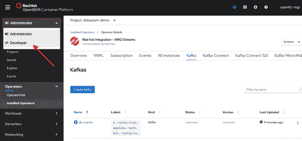](/sites/default/files/blog/2020/04/amq-streams-switch-to-dev.png)

图 12:切换到开发人员视角">

一旦 **db-events-entity-operator、db-events-kafka、**和 **db-events-zookeeper** 项都显示为带有蓝色圆环，如图 13 所示，就大功告成了。

[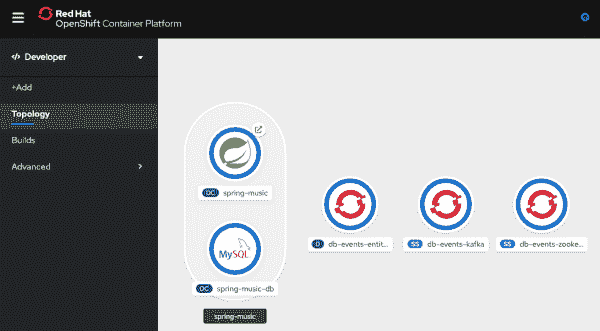](/sites/default/files/blog/2020/04/amq-streams-install-finished.png)

图 13:等待 Kafka 部署">

## 部署 Kafka Connect

Debezium 在 Kafka Connect 集群中运行，这意味着我们需要一个同时包含 Kafka Connect 和 Debezium 库的容器映像。最简单的方法是[从 Kafka Connect 基础映像](https://access.redhat.com/documentation/en-us/red_hat_amq/7.6/html-single/using_amq_streams_on_openshift/index#creating-new-image-from-base-str)创建自己的容器映像。下面是实现这一点所需的步骤。我也已经创建了一个您可以使用的图像，所以如果您愿意，可以随意跳过这一小节，而使用`quay.io/edeandrea/kafka-connect-debezium-mysql:amq-streams-1.4.0-dbz-1.1.0.Final`处的图像。

### 建立你自己的卡夫卡连接图像

要构建您自己的 Kafka Connect 图像:

1.  在本地计算机上创建一个目录(即`debezium-connect-image`)，然后`cd`进入该目录。
2.  在里面创建一个名为`plugins`的目录。
3.  从 [Debezium 发布页面](https://debezium.io/releases/)下载 Debezium MySQL 连接器。

**注意:**这篇文章是用 MySQL 连接器的`1.1.0.Final`版本写的，但是不管列出的是什么最新版本都可以。

4.  将下载的文件解压到`plugins`目录。
5.  在根目录(即`debezium-connect-image`)下创建一个包含以下内容的`Dockerfile`(您将需要一个`registry.redhat.io`帐户，并登录到您机器上的注册表，以便提取 AMQ 流映像):

    ```
    FROM registry.redhat.io/amq7/amq-streams-kafka-24-rhel7:1.4.0
    USER root:root
    COPY ./plugins/ /opt/kafka/plugins
    USER jboss:jboss
    ```

6.  您的目录树现在应该如图 14 所示。
    [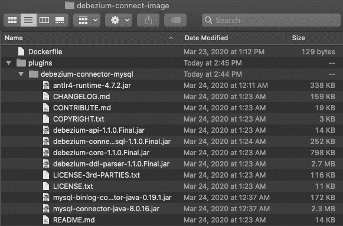](/sites/default/files/blog/2020/04/debezium-filesystem-layout.png)图 14:卡夫卡连接影像的内容>
7.  使用您最喜欢的工具(如 Docker/Buildah/等)构建或标记图像。)并将其推送到您选择的注册表中。

### 创建 Kafka 连接凭据

在创建 KafkaConnect 集群之前，我们需要注意一件小事。Debezium 连接器需要连接到数据库。与其将凭证硬编码到配置中，不如创建一个包含凭证的 OpenShift `Secret`，然后可以将凭证装载到`KafkaConnect` pods 中。

在您的本地文件系统上，创建一个名为`connector.properties`的文件。该文件的内容应该是:

```
dbUsername=debezium
dbPassword=debezium

```

现在让我们创建 OpenShift `Secret`:

```
$ oc create secret generic db-connector-creds --from-file=connector.properties
```

### 部署 Kafka 连接映像

回到 OpenShift 控制台，回到**管理员**视角，进入**已安装操作员**，然后点击**红帽集成- AMQ 流操作员**，如图 15 所示。

[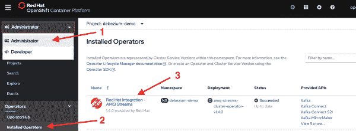](/sites/default/files/blog/2020/04/go-back-to-amq-streams.png)

图 15:安装的操作符">

然后在**提供的 API**下，点击 **Kafka Connect** 部分的**创建实例**标签，如图 16 所示。

[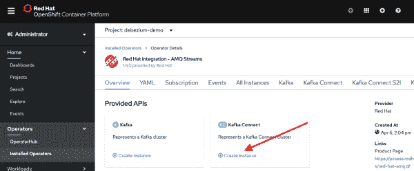](/sites/default/files/blog/2020/04/kafka-connect-install1.png)

图 16:创建 Kafka 连接实例">

然后会出现**创建 KafkaConnect YAML** 编辑器。删除那里的所有内容，粘贴以下内容，并点击屏幕底部的**创建**按钮:

```
kind: KafkaConnect
apiVersion: kafka.strimzi.io/v1beta1
metadata:
  name: db-events
  namespace: debezium-demo
  labels:
    app: spring-music-cdc
    template: spring-music-cdc
  annotations:
    strimzi.io/use-connector-resources: "true"
spec:
  replicas: 1
  image: "quay.io/edeandrea/kafka-connect-debezium-mysql:amq-streams-1.4.0-dbz-1.1.0.Final"
  bootstrapServers: "db-events-kafka-bootstrap:9092"
  jvmOptions:
    gcLoggingEnabled: false
  config:
    group.id: spring-music-db
    offset.storage.topic: spring-music-db-offsets
    config.storage.topic: spring-music-db-configs
    status.storage.topic: spring-music-db-status
    config.storage.replication.factor: 1
    offset.storage.replication.factor: 1
    status.storage.replication.factor: 1
    config.providers: file
    config.providers.file.class: org.apache.kafka.common.config.provider.FileConfigProvider
  externalConfiguration:
    volumes:
      - name: connector-config
        secret:
          secretName: db-connector-creds
  template:
    deployment:
      metadata:
        labels:
          app: spring-music-cdc
          app.kubernetes.io/part-of: spring-music-cdc
          template: spring-music-cdc
        annotations:
          app.openshift.io/connects-to: db-events-kafka,spring-music-db

```

此操作将部署一个单节点 KafkaConnect 群集。它还会关闭 JVM 的垃圾收集日志，这样如果我们需要查看任何`KafkaConnect`容器中的日志，它们就不会被大量的垃圾收集调试日志所污染。

从这个配置中可以看出，我们在第 13 行使用了`quay.io/edeandrea/kafka-connect-debezium-mysql:amq-streams-1.4.0-dbz-1.1.0.Final`图像:

```
image: "quay.io/edeandrea/kafka-connect-debezium-mysql:amq-streams-1.4.0-dbz-1.1.0.Final"
```

然后，我们在第 14 行告诉`KafkaConnect`集群连接到`db-events-kafka-bootstrap:9092`引导服务器:

```
bootstrapServers: "db-events-kafka-bootstrap:9092"
```

我们还添加了一些`externalConfiguration`，它告诉`KafkaConnect`容器将名为`db-connector-creds`的秘密挂载到运行容器内的目录`/opt/kafka/external-configuration/connector-config`中(第 27-31 行):

```
externalConfiguration:
  volumes:
    - name: connector-config
      secret:
        secretName: db-connector-creds
```

如果您返回到 OpenShift **Developer** 透视图的**拓扑**视图，您现在应该看到 **db-events-connect** 部署，其中有一个副本可用，如图 17 所示。它可能需要几分钟才能可用。

[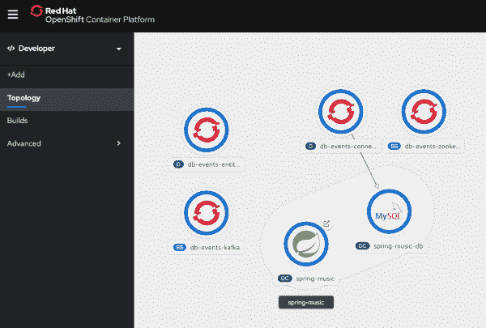](/sites/default/files/blog/2020/04/kafka-connect-available.png)

Figure 17: Wait for Kafka Connect to become available

## 部署 Debezium 连接器

现在我们的 Kafka Connect 集群已经启动并运行，我们可以在其中部署 Debezium 连接器配置了。回到 OpenShift 控制台，回到**管理员**透视图，然后**安装操作员**，再点击**红帽集成- AMQ 流操作员**，如图 18 所示。

[](/sites/default/files/blog/2020/04/go-back-to-amq-streams.png)

图 18:安装的操作符">

然后在**提供的 API**下，点击 **Kafka 连接器**部分的**创建实例**标签，如图 19 所示。

[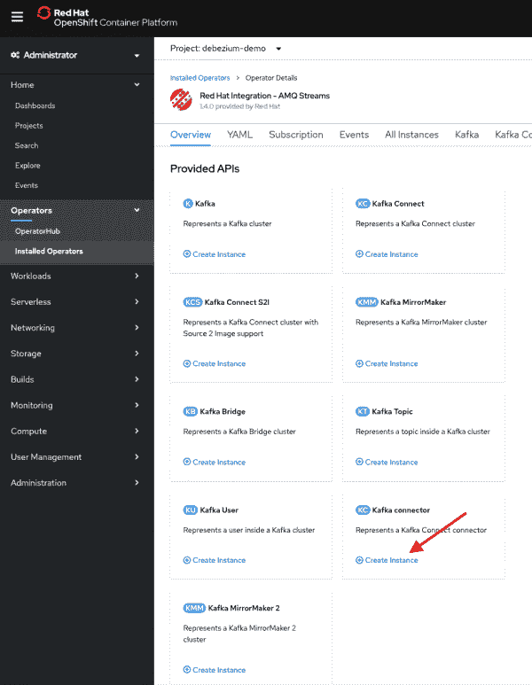](/sites/default/files/blog/2020/04/kafka-connector-install1.png)

图 19:创建 Kafka 连接器实例">

然后会出现**创建 KafkaConnector YAML** 编辑器。删除那里的所有内容，粘贴以下内容，并点击屏幕底部的**创建**按钮。此操作会将连接器配置部署到 Kafka Connect 集群中，并启动连接器:

```
kind: KafkaConnector
apiVersion: kafka.strimzi.io/v1alpha1
metadata:
  name: db-events
  namespace: debezium-demo
  labels:
    app: spring-music-cdc
    strimzi.io/cluster: db-events
spec:
  class: io.debezium.connector.mysql.MySqlConnector
  tasksMax: 1
  config:
    database.hostname: spring-music-db
    database.port: 3306
    database.user: "${file:/opt/kafka/external-configuration/connector-config/connector.properties:dbUsername}"
    database.password: "${file:/opt/kafka/external-configuration/connector-config/connector.properties:dbPassword}"
    database.dbname: music
    database.server.name: spring-music
    database.server.id: 223344
    database.whitelist: music
    database.allowPublicKeyRetrieval: true
    database.history.kafka.bootstrap.servers: db-events-kafka-bootstrap:9092
    database.history.kafka.topic: dbhistory.music
    table.whitelist: music.outbox_events
    tombstones.on.delete : false
    transforms: outbox
    transforms.outbox.type: io.debezium.transforms.outbox.EventRouter
    transforms.outbox.route.topic.replacement: "outbox.${routedByValue}.events"
    transforms.outbox.table.field.event.id: event_id
    transforms.outbox.table.field.event.key: aggregate_id
    transforms.outbox.table.field.event.timestamp: event_timestamp
    transforms.outbox.table.field.event.type: event_type
    transforms.outbox.table.field.event.payload.id: aggregate_id
    transforms.outbox.route.by.field: aggregate_type
    transforms.outbox.table.fields.additional.placement: "event_id:envelope:eventId,event_timestamp:envelope:eventTimestamp,aggregate_id:envelope:aggregateId,aggregate_type:envelope:aggregateType"

```

该配置提供了大量信息。您会注意到数据库用户名和密码是通过存储在我们的 OpenShift `Secret`中的`connector.properties`文件注入到配置中的，位于第 15-16 行:

```
database.user: "${file:/opt/kafka/external-configuration/connector-config/connector.properties:dbUsername}"
database.password: "${file:/opt/kafka/external-configuration/connector-config/connector.properties:dbPassword}"
```

该配置还指示 Debezium 将事件放在哪个主题上(第 28 行):

```
transforms.outbox.route.topic.replacement: "outbox.${routedByValue}.events"
```

Debezium 支持将所有事件放在一个主题上，或者使用派生的路由键来决定主题。在我们的例子中，我们的应用程序只为它的事件处理单一类型的域。对于我们的应用程序，所有的事件都存储在`outbox.Album.events`主题中。

**注意:**如果我们的应用程序处理多种可能互不相关的领域事件，那么将每个领域的事件放在不同的主题中可能是有意义的。

Debezium 提供了一个[单消息转换](https://kafka.apache.org/documentation/#connect_transforms)，为实现发件箱模式的应用程序提供开箱即用的支持。在 [Debezium 文档](https://debezium.io/documentation/reference/1.1/configuration/outbox-event-router.html)中可以找到更多关于 Debezium 发件箱事件路由器及其配置细节的文档。由于连接器具有这种内置功能，我们只需要告诉 Debezium 如何在有效负载中的字段和实际数据库表中的字段之间进行映射(第 29-35 行):

```
transforms.outbox.table.field.event.id: event_id
transforms.outbox.table.field.event.key: aggregate_id
transforms.outbox.table.field.event.timestamp: event_timestamp
transforms.outbox.table.field.event.type: event_type
transforms.outbox.table.field.event.payload.id: aggregate_id
transforms.outbox.route.by.field: aggregate_type
transforms.outbox.table.fields.additional.placement: "event_id:envelope:eventId,event_timestamp:envelope:eventTimestamp,aggregate_id:envelope:aggregateId,aggregate_type:envelope:aggregateType"
```

我们可以按照 Debezium `EventRouter`转换所寻找的那样来命名表中的字段，但是这样会使我们的数据库模式与 Debezium 紧密耦合。作为最佳实践，我们希望我们的组件是松散耦合的，并且可以通过外部配置进行更新。

现在，我们怎么知道这一切都成功了？我们可以直接进入其中一个 Kafka broker pods，运行`kafka-console-consumer`实用程序来查看主题中的数据。

### 查看结果事件

回到 OpenShift web 控制台和**拓扑**视图。点击`db-events-kafka`资源。当侧边栏出现在右侧时，单击出现的三个`db-events-kafka`窗格中的任何一个(即图 20 中的列表)。哪个都无所谓。

[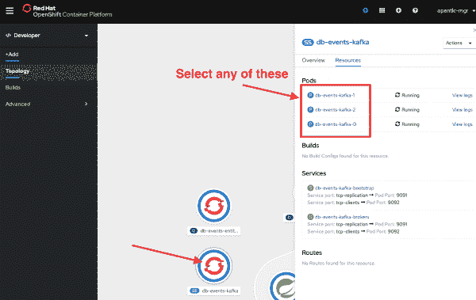](/sites/default/files/blog/2020/04/select-kafka-broker-pod.png)

图 20:选择 Kafka broker pod " >

从那里，点击**终端**选项卡，将您带到终端。到达终端后，运行:

```
$ bin/kafka-console-consumer.sh --bootstrap-server db-events-kafka-bootstrap:9092 --topic outbox.Album.events --from-beginning

```

它将输出一堆 JSON，如图 21 所示。

[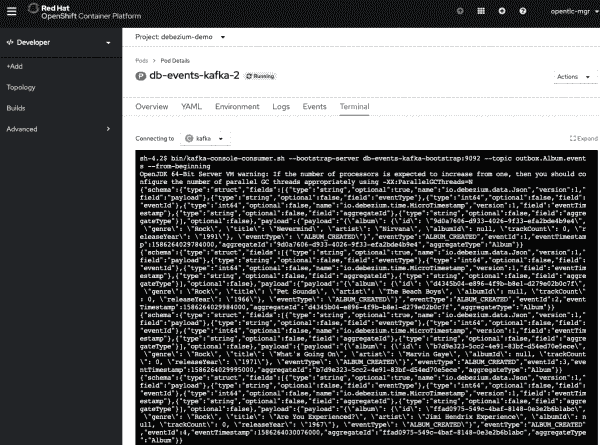](/sites/default/files/blog/2020/04/kafka-console-consumer.png)

图 21:运行 kafka-console-consumer.sh " >

现在您可以检查原始输出。它应该是这样的:

```
{"schema":{"type":"struct","fields":[{"type":"string","optional":true,"name":"io.debezium.data.Json","version":1,"field":"payload"},{"type":"string","optional":false,"field":"eventType"},{"type":"int64","optional":false,"field":"eventId"},{"type":"int64","optional":false,"name":"io.debezium.time.MicroTimestamp","version":1,"field":"eventTimestamp"},{"type":"string","optional":false,"field":"aggregateId"},{"type":"string","optional":false,"field":"aggregateType"}],"optional":false},"payload":{"payload":"{\"album\": {\"id\": \"9d0a7606-d933-4026-9f33-efa2bde4b9e4\", \"genre\": \"Rock\", \"title\": \"Nevermind\", \"artist\": \"Nirvana\", \"albumId\": null, \"trackCount\": 0, \"releaseYear\": \"1991\"}, \"eventType\": \"ALBUM_CREATED\"}","eventType":"ALBUM_CREATED","eventId":1,"eventTimestamp":1586264029784000,"aggregateId":"9d0a7606-d933-4026-9f33-efa2bde4b9e4","aggregateType":"Album"}}
```

输出可能看起来不太清楚，但是如果你把它打印出来(在你的浏览器中使用 Google `json pretty print`并找到一个免费的工具),你会看到有效载荷的格式如下:

```
{
  "schema": {
    "type": "struct",
    "fields": [
      {
        "type": "string",
        "optional": true,
        "name": "io.debezium.data.Json",
        "version": 1,
        "field": "payload"
      },
      {
        "type": "string",
        "optional": false,
        "field": "eventType"
      },
      {
        "type": "int64",
        "optional": false,
        "field": "eventId"
      },
      {
        "type": "int64",
        "optional": false,
        "name": "io.debezium.time.MicroTimestamp",
        "version": 1,
        "field": "eventTimestamp"
      },
      {
        "type": "string",
        "optional": false,
        "field": "aggregateId"
      },
      {
        "type": "string",
        "optional": false,
        "field": "aggregateType"
      }
    ],
    "optional": false
  },
  "payload": {
    "payload": "{\"album\": {\"id\": \"9d0a7606-d933-4026-9f33-efa2bde4b9e4\", \"genre\": \"Rock\", \"title\": \"Nevermind\", \"artist\": \"Nirvana\", \"albumId\": null, \"trackCount\": 0, \"releaseYear\": \"1991\"}, \"eventType\": \"ALBUM_CREATED\"}",
    "eventType": "ALBUM_CREATED",
    "eventId": 1,
    "eventTimestamp": 1586264029784000,
    "aggregateId": "9d0a7606-d933-4026-9f33-efa2bde4b9e4",
    "aggregateType": "Album"
  }
}

```

这个有效负载在第 2-41 行的`schema`元素中定义了自己的结构:

```
"schema": { 
  "type": "struct", 
  "fields": [ 
    { 
      "type": "string", 
      "optional": true, 
      "name": "io.debezium.data.Json", 
      "version": 1, 
      "field": "payload" 
    },
    { 
      "type": "string", 
      "optional": false, 
      "field": "eventType"
    },
    {
      "type": "int64",
      "optional": false,
      "field": "eventId"
    }, { "type": "int64", "optional": false, "name": "io.debezium.time.MicroTimestamp", "version": 1, "field": "eventTimestamp" }, { "type": "string", "optional": false, "field": "aggregateId" }, { "type": "string", "optional": false, "field": "aggregateType" } ], "optional": false }
```

我们可以通过建立我们自己的[模式注册中心](https://access.redhat.com/documentation/en-us/red_hat_integration/2020-04/html-single/getting_started_with_service_registry/index)和[配置我们的集群使用 Avro 序列化/反序列化](https://access.redhat.com/documentation/en-us/red_hat_amq/7.6/html-single/using_amq_streams_on_openshift/index#service-registry-str)来消除这一部分。第 42-49 行的`payload`元素包含关于事件的元数据，以及事件的实际负载:

```
"payload": { 
  "payload": "{\"album\": {\"id\": \"9d0a7606-d933-4026-9f33-efa2bde4b9e4\", \"genre\": \"Rock\", \"title\": \"Nevermind\", \"artist\": \"Nirvana\", \"albumId\": null, \"trackCount\": 0, \"releaseYear\": \"1991\"}, \"eventType\": \"ALBUM_CREATED\"}", 
  "eventType": "ALBUM_CREATED", 
  "eventId": 1, 
  "eventTimestamp": 1586264029784000, 
  "aggregateId": "9d0a7606-d933-4026-9f33-efa2bde4b9e4", 
  "aggregateType": "Album" 
}
```

主有效负载元素(第 43 行)中的`payload`子元素本身是一个 JSON 字符串，表示组成事件的域对象的内容:

```
"payload": "{\"album\": {\"id\": \"9d0a7606-d933-4026-9f33-efa2bde4b9e4\", \"genre\": \"Rock\", \"title\": \"Nevermind\", \"artist\": \"Nirvana\", \"albumId\": null, \"trackCount\": 0, \"releaseYear\": \"1991\"}, \"eventType\": \"ALBUM_CREATED\"}"
```

如果您保持此终端窗口打开，并打开一个新的浏览器窗口返回到应用程序本身，当您从应用程序的用户界面更新/删除专辑时，您应该会看到新的事件流。

## 后续步骤

希望这篇文章对你有所帮助！如果是这样的话，请关注本系列中的其他一些帖子:

*   添加 Prometheus metrics & Grafana 仪表板监控
*   使用 OAuth 身份验证保护 Kafka 和 KafkaConnect
*   通过 OAuth 授权向 Kafka 和 KafkaConnect 添加访问控制

此外，如果你像我一样，想要自动配置一切，请随意查看能够做到这一点的 [Ansible Playbook](https://github.com/edeandrea/debezium-demo-apb) 。

## 参考

*   [什么是变更数据捕获？](https://debezium.io/documentation/faq/#what_is_change_data_capture)
*   [Debezium](https://debezium.io)
*   [使用红帽 AMQ 流](https://access.redhat.com/documentation/en-us/red_hat_amq/7.6/html-single/using_amq_streams_on_openshift/index)

*Last updated: April 7, 2022*