# 使用 Red Hat Process Automation Manager、Elasticsearch 和 Kibana 监控业务指标

> 原文：<https://developers.redhat.com/blog/2020/05/04/monitor-business-metrics-with-red-hat-process-automation-manager-elasticsearch-and-kibana>

[Red Hat Process Automation Manager](https://developers.redhat.com/products/rhpam/overview)是一个开发容器化微服务和应用程序的平台，可实现业务决策和流程的自动化。将过程级和任务级的 SLA 指标与案例相关的分解结合起来，对于识别趋势和必要时重组劳动力是有益的。因此，业务流程系统的一个关键部分是实时了解正在发生的事情，监控 KPI 指标和响应问题趋势是运营不可或缺的一部分。

与 Elasticsearch 的集成提高了我们的搜索能力，并为企业提供了统一的报告环境。 [Maciej Swiderski 在博客中讲述了](http://mswiderski.blogspot.com/2017/08/elasticsearch-empowers-jbpm.html)我们如何利用 Elasticsearch 来获取 KPI 指标并提供全文搜索功能。本文扩展了这一想法，并介绍了如何在 [Red Hat OpenShift](https://developers.redhat.com/products/openshift/overview) 环境中实现与 Elasticsearch 的集成，以及如何使用 Kibana 在一个图形化的业务友好仪表板中表示 KPI。

## **准备演示环境**

让我们在 Red Hat OpenShift 上安装本演示所需的组件，它支持高效的容器编排，并允许快速的容器供应、部署、扩展和管理。

### 设置弹性和基巴纳

让我们利用 Elastic 集群操作符在 OpenShift 上设置 Elastic/Kibana:

```
$ oc apply -f https://download.elastic.co/downloads/eck/1.0.1/all-in-one.yaml 
$ oc new-project elastic
```

现在，我们可以部署一个弹性实例:

```
$ cat <<EOF | oc apply -n elastic -f -
# This sample sets up an Elasticsearch cluster with an OpenShift route
apiVersion: elasticsearch.k8s.elastic.co/v1
kind: Elasticsearch
metadata:
  name: elasticsearch-sample
spec:
  version: 7.6.2
  nodeSets:
  - name: default
    count: 1
    config:
      node.master: true
      node.data: true
      node.ingest: true
      node.store.allow_mmap: false
---

apiVersion: route.openshift.io/v1
kind: Route
metadata:
  name: elasticsearch-sample
spec:
  #host: elasticsearch.example.com # override if you don't want to use the host that is automatically generated by OpenShift (<route-name>[-<namespace>].<suffix>)
  tls:
    termination: passthrough # Elasticsearch is the TLS endpoint
    insecureEdgeTerminationPolicy: Redirect
  to:
    kind: Service
    name: elasticsearch-sample-es-http
EOF
```

接下来，让我们部署一个 Kibana 实例:

```
$ cat <<EOF | oc apply -n elastic -f -
apiVersion: kibana.k8s.elastic.co/v1
kind: Kibana
metadata:
  name: kibana-sample
spec:
  version: 7.6.2
  count: 1
  elasticsearchRef:
    name: "elasticsearch-sample"
  podTemplate:
    spec:
      containers:
      - name: kibana
        resources:
          limits:
            memory: 1Gi
            cpu: 1
---
apiVersion: v1
kind: Route
metadata:
  name: kibana-sample
spec:
  #host: kibana.example.com # override if you don't want to use the host that is automatically generated by OpenShift (<route-name>[-<namespace>].<suffix>)
  tls:
    termination: passthrough # Kibana is the TLS endpoint
    insecureEdgeTerminationPolicy: Redirect
  to:
    kind: Service
    name: kibana-sample-kb-http
EOF
```

我们现在可以从显示的路线访问 Kibana 仪表板:

```
$ oc get route -n elastic

```

登录到 Kibana 的凭证可以在弹性项目的 **Secrets** 下找到，如图 1 所示。

[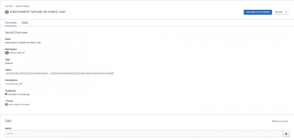](/sites/default/files/blog/2020/04/elastic_secret.png)

Figure 1: The login credentials for Kibana are available in Secrets.

**设置弹性搜索事件发射器**

事件发射器集成代码是一个单独的 Java 类，它实现了`EventEmitter`接口。发射器[的基本实现可以在这里](https://github.com/kiegroup/jbpm/tree/master/jbpm-event-emitters/jbpm-event-emitters-elasticsearch)找到。默认情况下，流程、任务和案例指标被推送到相应的弹性索引上:

```
if (view instanceof ProcessInstanceView) {
    index = "processes";
    type = "process";
    id = ((ProcessInstanceView) view).getCompositeId();
} else if (view instanceof TaskInstanceView) {
    index = "tasks";
    type = "task";
    id = ((TaskInstanceView) view).getCompositeId();
} else if (view instanceof CaseInstanceView) {
    index = "cases";
    type = "case";
    id = ((CaseInstanceView) view).getCompositeId();
}
content.append("{ \"index\" : { \"_index\" : \"" + index + "\", \"_type\" : \"" + type + "\", \"_id\" : \"" + id + "\" } }\n");
content.append(json);

```

我们现在可以扩展这个基本实现并允许 HTTPS 认证，因为 OpenShift 上的弹性实例是通过 HTTPS 公开的:

```
protected CloseableHttpClient buildClient() throws Exception{
   HttpClientBuilder builder = HttpClients.custom();
   if (elasticSearchUser != null && elasticSearchPassword != null) {
       SSLContextBuilder builder1 = new SSLContextBuilder();
       builder1.loadTrustMaterial(null, new TrustStrategy() {
           @Override
           public boolean isTrusted(X509Certificate[] chain, String authType) throws CertificateException {
               return true;
           }
       });
       CredentialsProvider provider = new BasicCredentialsProvider();
       UsernamePasswordCredentials credentials = new UsernamePasswordCredentials(elasticSearchUser, elasticSearchPassword);
       provider.setCredentials(AuthScope.ANY, credentials);
       SSLConnectionSocketFactory sslConnectionSocketFactory = new SSLConnectionSocketFactory(builder1.build(), new NoopHostnameVerifier());
       builder.setDefaultCredentialsProvider(provider);
       builder.setSSLSocketFactory(sslConnectionSocketFactory).build();
   }
   return builder.build();
}
```

请注意，出于本演示的目的，我们绕过了证书检查，使用了基本的身份验证机制。对于生产用例，有必要使用有效的证书进行身份验证。

我们现在可以在 KIE 服务器 war 的类路径中用事件发射器 JAR 构建一个定制的 Docker 映像:

```
FROM docker-registry.default.svc:5000/openshift/rhpam-kieserver-rhel8:7.5.0
COPY contrib/jbpm-event-emitters-elasticsearch-7.36.0-SNAPSHOT.jar /opt/eap/standalone/deployments/ROOT.war/WEB-INF/lib/jbpm-event-emitters-elasticsearch-7.36.0-SNAPSHOT.jar
USER root
RUN chownjboss:root /opt/eap/standalone/deployments/ROOT.war/WEB-INF/lib/jbpm-event-emitters-elasticsearch-7.36.0-SNAPSHOT.jar && \
chmod 664 /opt/eap/standalone/deployments/ROOT.war/WEB-INF/lib/jbpm-event-emitters-elasticsearch-7.36.0-SNAPSHOT.jar
USER jboss
```

我们还需要使用`JAVA_OPTS` Kie 服务器属性为弹性集群传递相应的元数据:

```
$ oc set env dc/{{ pam_app_name }}-kieserver JAVA_OPTS_APPEND=>\"-Dorg.jbpm.event.emitters.elasticsearch.url=https://{{routeelastic.stdout}} -Dorg.jbpm.event.emitters.elasticsearch.user=elastic -Dorg.jbpm.event.emitters.elasticsearch.password={{elasticpwd.stdout}}\" -n {{ OCP_PROJECT }}
```

## **业务活动监控**

现在我们已经完成了设置，让我们快速地看看如何使用 Kibana 可视化流程、任务和案例度量。让我们首先登录到 Business Central，从 **Try Samples** 部分中拉出一个项目，如图 2 和图 3 所示。

[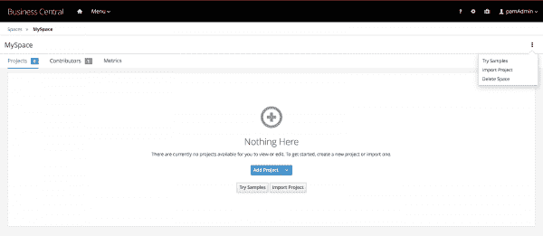](/sites/default/files/blog/2020/04/new_proj_samples.png)

Figure 2: Pulling up the Try Samples section.

[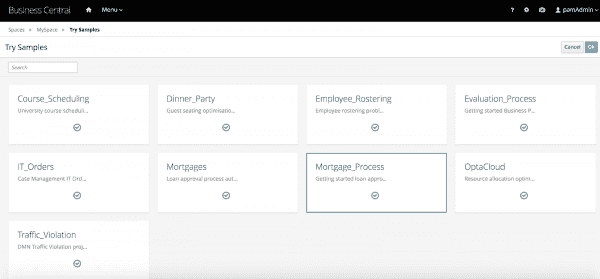](/sites/default/files/blog/2020/04/samples.png)

Figure 3: The Try Samples section contains a variety of options.

对于这个例子，我们将构建并部署 **Mortgage_Process** 项目。我们将使用这个项目的指标可视化。现在让我们使用流程启动表启动一个流程:

[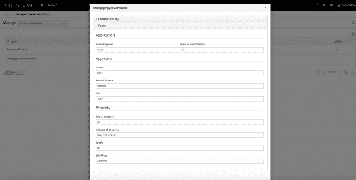](/sites/default/files/blog/2020/04/new_form.png)

Figure 4: Enter the details into the process start form.

创建流程，如图 5 所示。

[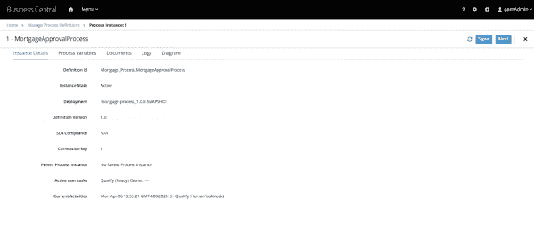](/sites/default/files/blog/2020/04/process_creation.png)

Figure 5: The MortgageApprovalProcess in the Process Instance perspective.

现在，登录到 Kibana 仪表板。我们将从流程和任务的基本可视化开始。Kibana 模板提供了一种可导出的 JSON 格式，用于在 Kibana 实例之间共享图形报告。样本模板[可以在这里](https://github.com/snandakumar87/ansible-rhpam-elastic/tree/master/kibana-resources)找到。在**管理**选项下，从 Kibana 仪表板的**保存的对象**部分导入模板。

我们现在有了一个可用于流程(图 6)和任务(图 7)的示例仪表板。

[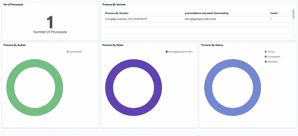](/sites/default/files/blog/2020/04/process_dashboard.png)

Figure 6: The new sample Processes dashboard.

[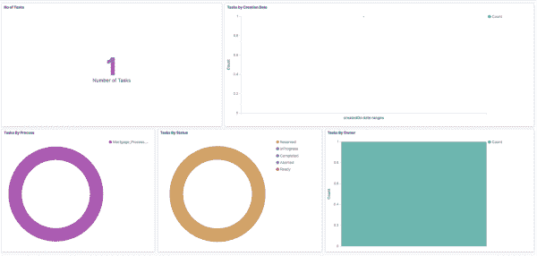](/sites/default/files/blog/2020/04/task_dashboard.png)

Figure 7: The new sample Tasks dashboard.

随着这些任务的进行和流程的完成，它们的状态和更新被推送到 Elastic，如图 8 所示。

[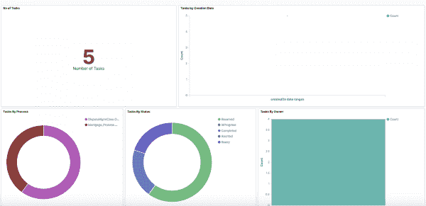](/sites/default/files/blog/2020/04/updates.png)

Figure 8: Track the progress of your tasks and processes through their dashboards.

现在，让我们从流程数据中创建自定义指标。我们可以假设需要过滤掉房产价格在 200 万以上，房龄在 25 年以下的情况。Kibana 提供了一种创建全文搜索的便捷方式，然后让我们将结果转换为可视化。

打开 Kibana 的原始数据部分，创建一个定制查询来过滤数据，如图 9 所示。

[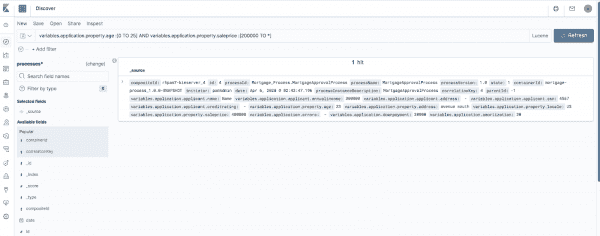](/sites/default/files/blog/2020/04/kibana_querhy.png)

Figure 9: Create your custom filter.

我们可以很容易地将这些数据转换成可视化，方法是保存这个搜索并创建一个条形图，如图 10 和 11 所示。

[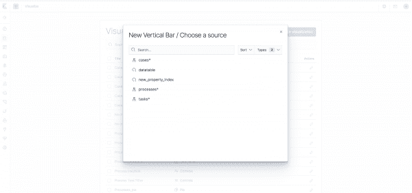](/sites/default/files/blog/2020/04/custom_viz.png)

Figure 10: Create a bar chart.

[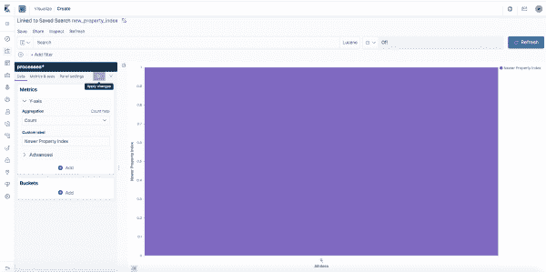](/sites/default/files/blog/2020/04/custom_viz_graph.png)

Figure 11: Your new bar chart.

也可以为案例创建类似的可视化。如图 12 所示，可以设置一个使用案例的 KPI 度量的示例案例可视化。

[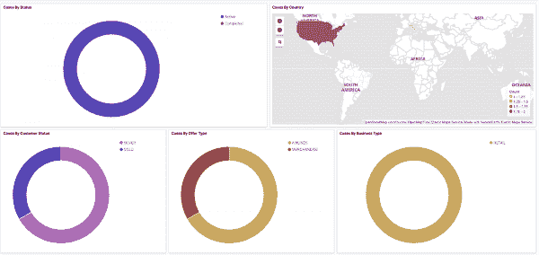](/sites/default/files/blog/2020/04/case_viz.png)

Figure 12: The sample case visualization.

在中可以找到设置[的完整示例。](https://github.com/snandakumar87/ansible-rhpam-elastic)

## **总结**

通过设置与 Elasticsearch 的集成，我们可以将来自业务自动化引擎的数据与来自其他不同系统的指标并排可视化。这样做还提供了更快、更可扩展、业务友好的可视化，适合运营管理。

## **参考文献**

[Elasticsearch 为 jBPM 助力](http://mswiderski.blogspot.com/2017/08/elasticsearch-empowers-jbpm.html)

[在 Openshift 上部署 Elastic 和 ki Bana](https://www.elastic.co/guide/en/cloud-on-k8s/current/k8s-openshift.html)

*Last updated: June 26, 2020*