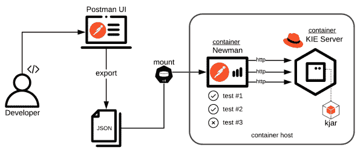

# KIE 服务器的自动化 API 测试

> 原文：<https://developers.redhat.com/blog/2020/05/01/automated-api-testing-for-the-kie-server>

在软件开发中，关于测试已经说了很多，也有很多方法可以考虑。在敏捷和 DevOps 的环境中，自动化测试被认为是流程和快速反馈原则的基础。考虑到软件交付项目中 [jBPM](https://www.jbpm.org/) 和 [Drools](https://www.drools.org/) 的实现，考虑如何为开发和持续集成的两个阶段支持可靠的自动化测试变得很自然。

KIE 服务器是一个独立的组件，可用于通过 REST API 接口执行业务流程和规则。本文探讨了 API 测试的概念，在这种测试中，消费者需要与 KIE 服务器提供的 API 进行交互。测试用例由针对活动服务器交换的 HTTP 请求和响应组成。因此，这些测试用例完全不知道 API 背后的技术，就像真正的消费者被期望的那样。

## 为什么要进行 API 测试？

API 测试方法以前被描述为不可知的，但是这意味着什么呢？或许值得通过列举好处来解释:

*   只要满足 API 契约，测试就与被测系统中的变化相分离。
*   更高的信心，因为测试断言准确的上游预期。
*   独立性，因为测试可以作为一个单独的工件来维护。
*   可伸缩性，因为测试也可以用来评估性能。

## 单元测试呢？

是的，单元测试很重要，不应该被忽视。jBPM 和 Drools 生态系统中有成熟的技术来对知识资产进行单元测试。这种技术通常由普通的 JUnit 或者由 [Business Central(又名工作台)](http://blog.athico.com/2018/11/workbench-is-now-business-central.html)提供的测试场景组成。

然而，有些挑战是单元测试无法解决的，尤其是当 JUnit 不是您的项目的选项时。在这种情况下，您只能使用 Business Central 提供的服务:

*   测试规则流，其中必须考虑触发的规则组合。
*   测试 REST API 的输入和输出发生的转换。
*   即使没有 Java 或 JUnit 技能，也能编写 API 测试。
*   测试 API 性能(我已经提到性能测试了吗？)

话虽如此，众所周知，单元测试在编写、维护和故障排除方面更快更简单。因此，一个人应该尽可能地偏爱它们。

## 邮递员和容器示例实现

如果你读到这里，你一定在寻找一些具体的东西。在我们开始之前，图 1 展示了后面的内容。

[](/sites/default/files/blog/2020/03/KIE-Server-Postman-Testing.png)Automated API Testing for the KIE ServerFigure 1: The example implementation.">

[Postman](https://www.postman.com/) 是一个创建和执行 HTTP 请求的流行工具。浏览图表，注意 Postman 是这个实现中的核心组件。有了它，开发人员可以编写测试用例，这些测试用例被分组到集合中，然后被导出为原生 JSON 格式。这个导出的 JSON 集合然后被用作 [Newman](https://github.com/postmanlabs/newman) 的输入，这是 Postman 的一个强大的命令行集合运行器。它允许您直接从命令行运行和测试 Postman 集合。

我们正在测试的系统是运行 KIE 服务器的[Red Hat JBoss Enterprise Application Platform](https://developers.redhat.com/products/eap/overview)，它部署了 [KJAR](https://developers.redhat.com/blog/2018/03/14/what-is-a-kjar/) 。

最后，纽曼和 JBoss / KIE 服务器都是在 Linux 容器中引导的。这种设置特别支持:

*   快速供应组件。
*   无需担心依赖性(NodeJS、Java 等)。
*   在本地执行或在 CI 代理中执行时没有区别(例如 Jenkins)。

### 实验

在本例中，`docker`和`docker-compose`用于简化用户体验。它们与 Git 一起，是运行这些步骤的唯一先决条件:

```
$ git clone https://github.com/juliaaano/rhdm-quickstart.git && cd rhdm-quickstart 
$ docker-compose up --detach --force-recreate rhdm-jboss
```

检查日志并等待 KIE 服务器启动:

```
$ docker-compose logs --follow rhdm-jboss
```

运行邮递员测试:

```
$ docker-compose run --rm postman
```

注意，可以使用其他工具直接启动和构建容器，例如 [Podman](https://podman.io/) 、 [Buildah](https://buildah.io/) 和 Docker 本身。

您还可以在本地构建容器映像，如果您对源代码进行了任何更改，这将非常有用。这个过程要花一点时间，特别是在第一次运行时，磁盘上没有 Docker 缓存。此外，需要使用 Red Hat 的容器注册表进行身份验证，才能访问[基础映像](https://access.redhat.com/containers/#/registry.access.redhat.com/rhdm-7/rhdm-kieserver-rhel8):

```
$ docker login registry.redhat.io
$ docker build --file d.jboss.Dockerfile --tag juliaaano/rhdm-jboss .
```

一旦构建了新的映像，请重复该步骤:

```
$ docker-compose up --detach --force-recreate rhdm-jboss
```

在你刚刚检查的的 [GitHub 项目中，有关于如何用](https://github.com/juliaaano/rhdm-quickstart) [Spring Boot](https://developers.redhat.com/blog/2018/11/01/spring-boot-enabled-business-process-automation-with-red-hat-process-automation-manager/) 而不是 JBoss EAP 运行同一个 app 的说明。查看该项目的自述文件以获取更多信息。

上面的例子以一个业务规则应用程序为特色，所以业务流程被放在一边。然而，这里演示的元素不应该改变，并且也适用于 jBPM。KIE 服务器和商业中心是红帽决策管理器和红帽过程自动化管理器平台的组成部分。

*Last updated: June 26, 2020*