# OpenShift 4.4 中的应用部署改进

> 原文：<https://developers.redhat.com/blog/2020/04/30/application-deployment-improvements-in-openshift-4-4>

最新发布的[Red Hat open shift Container Platform](https://developers.redhat.com/products/openshift/overview)提供了增强功能和特性，使得应用程序开发变得更加容易。这些增强功能包括:

*   增强的开发人员目录。
*   开发者目录中运营商支持的服务。
*   头盔 3 正式发布。
*   拓扑视图中的添加上下文选项。

请继续阅读，以更详细地了解这些增强功能。

[https://www.youtube.com/embed/elZ2Grd3sgs?autoplay=0&start=0&rel=0](https://www.youtube.com/embed/elZ2Grd3sgs?autoplay=0&start=0&rel=0)

## 开发者目录更新

对开发人员目录的增强包括允许开发人员更容易地过滤和分组项目的选项，以及帮助直观识别目录项目之间差异的标签。这些增强旨在使开发人员更容易、更快地找到他们正在寻找的项目，例如过滤开发人员目录、按操作员对开发人员目录进行分组以及类型徽章。

### 过滤开发人员目录

开发人员目录中的过滤选项已经更新，增加了按类型过滤的功能，例如操作员支持、掌舵图、构建器图像、模板和服务类别，如图 1 所示。

[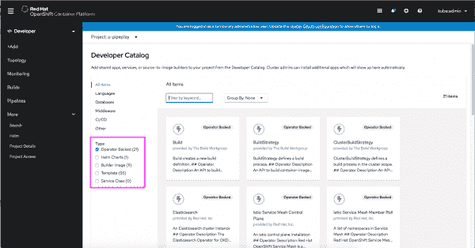](/sites/default/files/blog/2020/04/F1-FilterByType.png)Figure 1: Filtering the Developer Catalog by TypeFigure 1: Filtering the Developer Catalog by Type.">

默认情况下，操作员支持的项目是选中的，但是开发人员可以很容易地更改选择以查看他们需要的项目类型。

### 按操作员对开发人员目录进行分组

当在开发人员目录中查看操作人员支持的项目时，您可以使用 **Group By** 下拉菜单，按照与项目相关的操作人员对项目进行分组，如图 2 所示。

[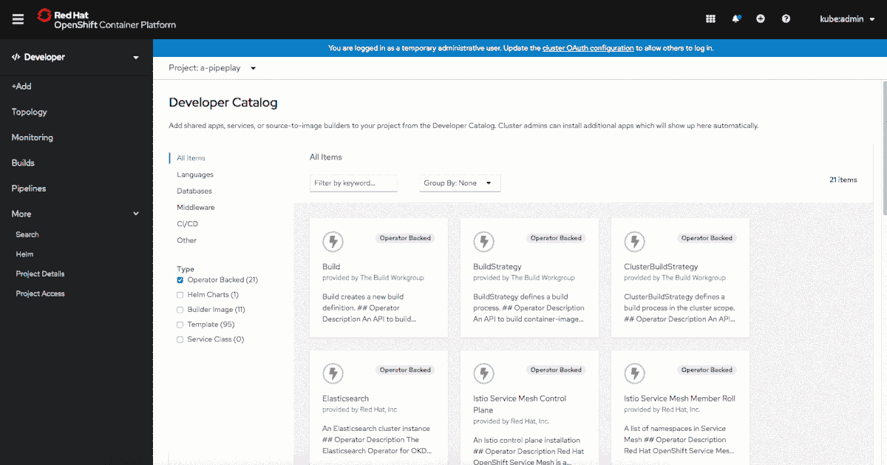](/sites/default/files/blog/2020/04/F2-CatalogGroupByOperator.gif)Figure 2: Grouping the Developer Catalog by OperatorFigure 2: Grouping the Developer Catalog by Operator.">

当一个运算符包含目录中的多个项目时，此分组功能会很有用。

### 类型徽章有助于在视觉上区分产品

为了使开发人员更容易扫描开发人员目录项目，每个项目的卡片现在在右上角包含一个标签，以指示项目的类型。例如，在图 3 中，如果用户搜索`Node`并希望找到 Node.js 构建器图像，标签使得快速识别正确的项目更加容易。

[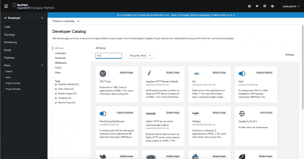](/sites/default/files/blog/2020/04/F3-DevCatalog-TypeBadges.png)Figure 3: Type badges help to visually differentiate offerings in the Developer Catalog Figure 3: Type badges help to visually differentiate offerings in the Developer Catalog.">

## 开发者目录中运营商支持的服务

开发人员目录中的运营商支持服务允许开发人员运行由 Kubernetes 运营商安装和管理的各种工作负载。在开发者目录中，很容易选择和部署各种运营商支持的服务。

### 创建运营商支持的服务

在**+添加**导航部分，然后从目录中选择**来创建一个运营商支持的服务。默认情况下，开发者目录被过滤以显示运营商支持的服务。选择您要安装的软件。您将被带到 YAML 编辑器，但是不要害怕，您可以点击**编辑表单**链接来跟随一个引导安装过程，如图 4 所示。**

[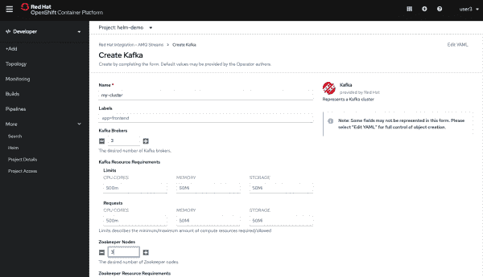](/sites/default/files/blog/2020/04/F04.png)Figure 4: Creating an operator backed serviceFigure 4: Creating an Operator-backed service.">

### 拓扑视图中运营商支持的服务

在拓扑视图中，运营商支持的服务在视觉上是不同的，并且相关联的资源被分组在一起，如图 5 所示。

[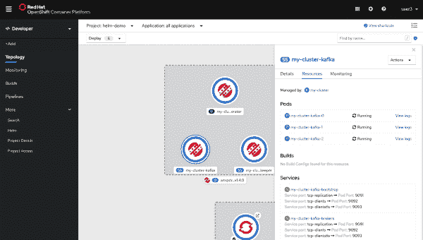](/sites/default/files/blog/2020/04/F05.png)Figure 5: Accessing the resource that manages the operator backed serviceFigure 5: Accessing the resource that manages the Operator-backed service.">

通过点击 **Managed by:** 链接，您可以访问管理资源的资源，这些资源是运营商支持的服务的一部分，如图 6 所示。

[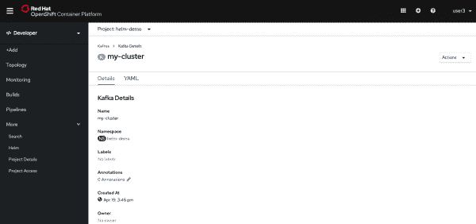](/sites/default/files/blog/2020/04/F06.png)Figure 6: Viewing the resource that manages the operator backed serviceFigure 6: Viewing the resource that manages the Operator-backed service.">

如果您喜欢拓扑视图中更精简的布局，您可以通过在 Display 下拉菜单中取消选择 **Operator Groupings** 旁边的复选框来折叠关于 Operator-backed services 的信息，如图 7 所示。

Figure 7: Collapsed operator groupingsFigure 7: Collapsed Operator groupings.">

## 舵 3

Helm 3 在 OpenShift 的这个版本中是 GA。开发人员现在可以通过 Helm CLI 和开发人员目录安装 Helm charts。关于头盔版本的信息显示在开发者视角中。

Helm 是 Kubernetes 应用程序的包管理器，它帮助定义、安装和更新应用程序。Helm 使用一种叫做图表的打包格式。Helm Chart 是一个应用程序包，其中包含运行应用程序所需的一组资源(如部署或服务)的模板。创建清单时，模板使用由值替换的变量。该图表包括描述如何配置资源的值文件。

随着 OpenShift 4.4 的发布，Helm 3.1 达到 GA。这意味着您可以在开发人员目录中找到舵轮图表，开发人员可以在图表安装期间指定自定义的`values.yaml`，以及在**舵轮**和**拓扑**导航部分中的舵轮版本。

### 安装 Helm 3 CLI

通过点击**帮助**菜单下的**命令行工具**，可以从 OpenShift web 控制台下载 Helm 3 CLI，如图 8 所示。

[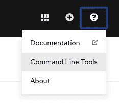](/sites/default/files/blog/2020/04/F08.png)Figure 8: Accessing command line toolsFigure 8: Accessing command-line tools">

使用 Helm 3 CLI，开发人员可以创建和安装图表，将存储库添加到他们自己的本地 Helm 客户端，等等。您可以在文档中[了解有关 Helm 3 CLI](https://docs.openshift.com/container-platform/latest/cli_reference/helm_cli/getting-started-with-helm-on-openshift-container-platform.html) 的安装和使用的更多信息。

### 在 OpenShift 中安装舵图

在 OpenShift 上安装 Helm charts 有两种方法:使用 Helm CLI 或从开发者目录中。

开发者目录现在包括了来自于[管理库](https://github.com/redhat-developer/redhat-helm-charts/)的导航图，如图 9 所示，允许开发者通过定制`values.yaml`来安装导航图。在 OpenShift 的未来版本中，开发人员目录中的存储库将是可配置的。

[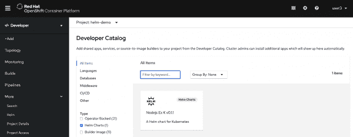](/sites/default/files/blog/2020/04/F09.png)Figure 9: Helm Charts in the Developer CatalogFigure 9: Helm Charts in the Developer Catalog">

要从开发者目录安装舵轮图，通过**类型**过滤目录项目，并选择**舵轮图**。当您单击一个图表进行安装时，您有机会定制`values.yaml`文件中的信息，如图 10 所示。

[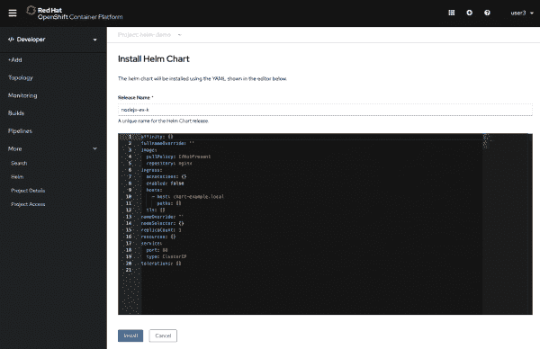](/sites/default/files/blog/2020/04/F10.png)Figure 10: Installing a Helm ChartFigure 10: Installing a Helm Chart">

### 从开发者的角度看 Helm 版本

关于 Helm 版本的信息可以在开发者视角的两个地方找到。在拓扑视图中，舵释放是可见的，并用舵图标表示，如图 11 所示。

[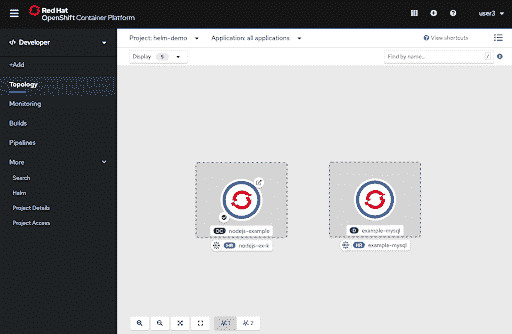](/sites/default/files/blog/2020/04/F11.png)Figure 11: Helm Releases in TopologyFigure 11: Helm Releases in Topology.">

头盔释放也可以从左侧导航的**更多- >头盔**下以列表形式访问，如图 12 所示。

[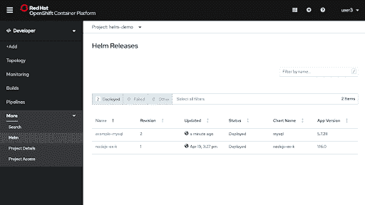](/sites/default/files/blog/2020/04/F12.png)Figure 12: Viewing Helm Releases in a projectFigure 12: Viewing Helm Releases in a project.">

# 从拓扑视图添加上下文

开发人员现在可以在拓扑视图中右键单击画布，向应用程序和项目添加新资源。在上下文中添加项目时，会动态创建适当的服务绑定，从而节省开发人员的时间。

可视化地布局应用程序结构可以让开发人员快速做出决策，并确定更好的方向。从目录中快速访问组件并以更少的步骤将它们链接到应用程序结构中的能力可以减少增强或扩展应用程序所需的时间和精力。为了支持这个特性，拓扑视图现在允许开发人员从画布中直接向应用程序或项目添加新的资源，或者无缝地创建与现有组件相关的上下文绑定。

## 访问“在上下文中添加”触发器

有两种方法可以访问外接程序上下文触发器:右键菜单选项和连接器句柄。

### 使用右键菜单选项

在画布上的任意位置执行右键单击会显示特定于被单击区域的上下文操作菜单，如图 13 所示。例如，应用程序的上下文菜单将提供向该应用程序添加资源的选项，而从画布上的 unassigned 区域调用的上下文菜单将显示向项目添加资源的选项。

[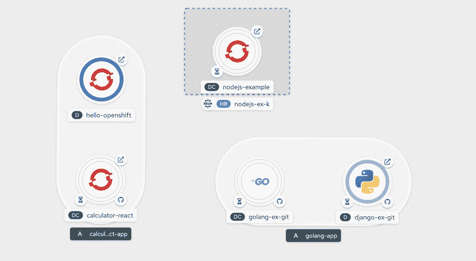](/sites/default/files/blog/2020/04/F13.gif)Figure 13: In context menus accessed by right clickFigure 13: In-context menus accessed by right-clicking.">

### 使用连接器手柄

在悬停时，连接器句柄从每个组件中伸出。将连接器手柄的箭头拖到拓扑图的任何部分，除了组件节点，将会使它变成一个“add”符号，如图 14 所示。

[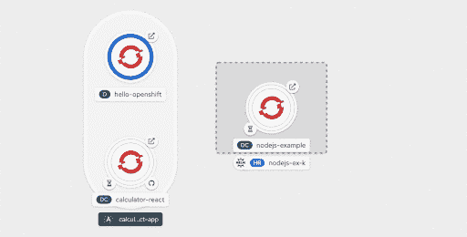](/sites/default/files/blog/2020/04/F14.gif)Figure 14: In context menus accessed by the connector handleFigure 14: In-context menus accessed by the connector handle.">

将光标放在图形上任何所需的区域上都会调用特定于上下文的选项菜单来添加资源。选择这些菜单选项中的任何一个，将用户引导到相应的添加表单，并预先分配上下文(应用程序和标签)。

一旦动作被确认，开发人员就被带回拓扑视图，在那里他们可以看到新创建的组件及其关联的绑定连接器，如图 15 所示。这种单一的交互通过替代三个操作提高了效率——创建资源、为其分配应用程序标签，以及创建相关资源的连接器。

[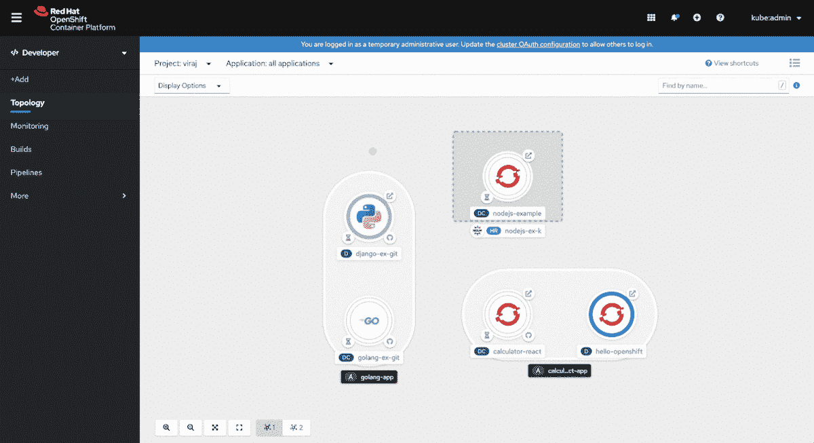](/sites/default/files/blog/2020/04/F15.gif)Figure 15: In context creation exampleFigure 15: In-context creation example.">

我们希望这些新特性和增强功能能够提高您在 OpenShift 上创建和部署应用程序的能力。在未来的版本中，我们计划默认提供引导流，并减少编辑 YAML 文件的需要。

## 准备好开始了吗？

[今天试试 OpenShift】。](http://www.openshift.com/try)

## 提供您的反馈！

在此分享[关于应用创建和部署的反馈或想法。此外，加入我们的](https://forms.gle/6HArjszuqyE1xr3f8) [OpenShift 开发者体验谷歌小组](https://groups.google.com/forum/#!forum/openshift-dev-users)，参与讨论并了解我们的办公时间会议，您可以与我们合作并提供反馈。

## 了解更多信息

如果您有兴趣了解更多关于 OpenShift 的应用程序开发，请从 OpenShift 上的[应用程序开发](https://developers.redhat.com/openshift)[了解更多](https://developers.redhat.com/blog/2020/04/30/whats-new-in-the-openshift-4-4-web-console-developer-experience/)。

*Last updated: June 29, 2020*