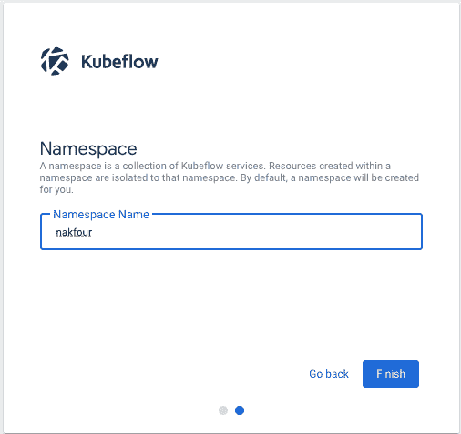
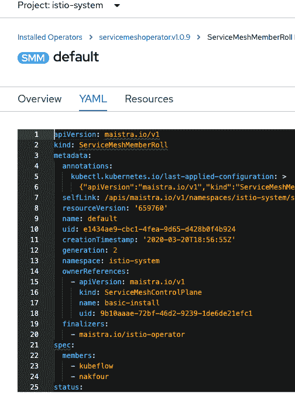
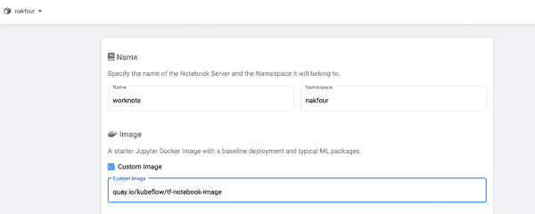

# 将 Kubeflow 与 Red Hat OpenShift 服务网格集成

> 原文：<https://developers.redhat.com/blog/2020/04/24/integrating-kubeflow-with-red-hat-openshift-service-mesh>

[开放数据中心](https://opendatahub.io/)是一个开源项目，提供端到端的人工智能和机器学习(AI/ML)平台，运行在[红帽 OpenShift](https://www.openshift.com/) 上。正如我们在[之前的文章](https://developers.redhat.com/blog/2020/02/10/installing-kubeflow-v0-7-on-openshift-4-2/)中所解释的，我们在 Kubeflow 项目中看到了真正的潜力和价值，并且我们已经在 RedHat OpenShift 4.2 上启用了 Kubeflow 0.7。Kubeflow 安装了多个 AI/ML 组件，并需要 [Istio](https://developers.redhat.com/topics/service-mesh/) 来控制和路由服务流量。

作为开放数据中心项目的一部分，我们还将 Kubeflow 与 [Red Hat OpenShift 服务网格](https://www.redhat.com/en/about/press-releases/red-hat-launches-openshift-service-mesh-accelerate-adoption-microservices-and-cloud-native-applications)进行了集成。在本文中，我们将 Red Hat OpenShift Service Mesh 作为本地 Kubeflow Istio 安装的替代方案，特别是对于已经在集群上安装了 OpenShift Service Mesh 的用户。

## Red Hat OpenShift 服务网格

为了可扩展性和容错性，大多数基于云的应用程序都是使用微服务和依赖关系来设计的。一个[服务网格](https://www.redhat.com/en/topics/microservices/what-is-a-service-mesh)是一个基础设施层，它连接在共享服务架构中一起工作的微服务。OpenShift 服务网格基于 Istio，并提供类似的机制来保护、控制和路由微服务。它还提供了额外的功能和易于安装。

作为一项关键功能，OpenShift 服务网格支持多租户控制平面，这使得在单个集群中管理多个服务网格生态系统变得非常容易。只需在 Istio 服务网格成员 Roll 的实例中声明一个名称空间，它就会包含在服务网格中。

OpenShift Service Mesh 还默认安装了 Kiali 和 Jaeger。 [Kiali](https://kiali.io) 提供了您的服务网格中微服务的交互式图表，您可以在其中看到服务是如何连接的，以及对每个服务施加了什么控制。 [Jaeger](https://www.jaegertracing.io) 是一个开源的分布式追踪平台，可以让你监控和排除微服务之间的交互。

在本文的后面，我们将指导您完成安装 OpenShift 服务网格及其所需组件的过程，您可以从 Red Hat OpenShift 容器平台的 OperatorHub 轻松完成。

**注**:详见[红帽 OpenShift 服务网格文档](https://access.redhat.com/documentation/en-us/openshift_container_platform/)。

## 将 Kubeflow 0.7 与 Red Hat OpenShift 服务网格集成

我们必须做一些改变来整合 Kubeflow 0.7 和 Red Hat OpenShift 服务网格。在本节中，我们将简要描述这些变化，您也可以在 Open Data Hub 的 [GitHub 库](https://github.com/opendatahub-io/manifests)中找到这些变化。

### 允许 Katib 控制器服务的流量

OpenShift 服务网格为被列为给定服务网格的成员的所有命名空间定义网络策略。网络策略中未定义的流量被阻止。我们向 Kubeflow Istio 组件添加了一个覆盖层，创建了一个允许流量流向 [Katib 控制器服务](https://github.com/kubeflow/katib)的网络策略:

```
kind: NetworkPolicy
apiVersion: networking.k8s.io/v1
metadata:
  name: allow-ingress-tokubelfow
  namespace: kubeflow
spec:
  podSelector:
    matchLabels:
     app: katib-controller
  ingress:
    - from:
        - namespaceSelector: {}
    - ports:
      - protocol: TCP
        port: 443
  policyTypes:
    - Ingress

```

### 支持多租户控制平面

在同一个覆盖图中，我们用`ServiceMeshRbacConfig`替换了 Istio 的`ClusterRbacConfig`，它支持多租户控制平面。我们还用项目范围的`RoleBinding`替换了`ClusterRoleBinding`。

### 新组件和 Kfctl 文件

我们在`istio-system`名称空间中添加了一个新组件，它创建了一个`ServiceMeshMemberRoll`资源，并将`kubeflow`名称空间添加为成员:

```
apiVersion: maistra.io/v1
kind: ServiceMeshMemberRoll
metadata:
  # the service must be named default
  name: default
  namespace: istio-system
spec:
  members:
    # a list of projects joined into the service mesh
    - kubeflow

```

我们还向服务网格添加了一个新的`kfctl`文件`kfdef/kfctl_openshift-servicemesh.yaml`。这样做可以更新用于在 OpenShift 服务网格中部署和管理 Kubeflow 的控制平面。

## 使用 Red Hat OpenShift 服务网格安装 Kubeflow 0.7

我们在之前的文章中描述了安装 Kubeflow 0.7 的先决条件。主要是，您需要一个 OpenShift 4.2 或更高版本的集群和`kfctl`命令行工具。本节将指导您完成安装。

### 步骤 1:安装 Red Hat OpenShift 服务网格

为您的 OpenShift 集群安装正确版本的 Red Hat OpenShift Service Mesh 至关重要。对于这个例子，我们将使用 [OpenShift 容器平台 4.2 安装](https://access.redhat.com/documentation/en-us/openshift_container_platform/4.2/html/service_mesh/service-mesh-installation#installing-ossm)。OpenShift 服务网格安装自动包括以下运算符:

*   弹性搜索算子
*   耶格算子
*   基亚里算子
*   红帽服务网状运营商

在继续之前，请确保等待每个成功安装的确认。

### 步骤 2:创建 ServiceMeshControlPlane 的实例

安装完所有需要的操作符后，创建一个`ServiceMeshControlPlane`的实例。示例中的缺省值将起作用。您不需要安装一个`ServiceMeshMemberRoll`实例；这将在您安装 Kubeflow 时自动创建。

### 步骤 3:克隆 opendatahub-manifest fork repo

从终端登录 OpenShift 容器平台集群，克隆`opendatahub-manifest` fork repo，默认为分支`v0.7.0-branch-openshift`，如图所示:

```
$ git clone https://github.com/opendatahub-io/manifests.git
$ cd manifests

```

### 步骤 4:安装 Kubeflow

接下来，使用 OpenShift 服务网格配置文件和本地下载的清单来安装 Kubeflow:

```
$ sed -i 's#uri: .*#uri: '$PWD'#' ./kfdef/kfctl_openshift_servicemesh.yaml (on mac try 
$ sed -i "" 's#uri: .*#uri: '$PWD'#' ./kfdef/kfctl_openshift_servicemesh.yaml) 
$ kfctl build --file=kfdef/kfctl_openshift_servicemesh.yaml -V 
$ kfctl apply --file=./kfdef/kfctl_openshift_servicemesh.yaml -V

```

请注意，在撰写本文时，我们正在解决一个 Kubeflow 安装错误,它不允许在构建过程中下载清单。

### 步骤 5:检查虚拟服务

检查由 Kubeflow 组件创建的虚拟服务:

```
$ oc get virtualservices -n kubeflow

NAME                         GATEWAYS             HOSTS                      AGE

argo-ui                      [kubeflow-gateway]   [*]                        4m20s

centraldashboard             [kubeflow-gateway]   [*]                        4m19s

google-api-vs                                     [www.googleapis.com]       4m23s

google-storage-api-vs                             [storage.googleapis.com]   4m23s

grafana-vs                   [kubeflow-gateway]   [*]                        4m22s

jupyter-web-app              [kubeflow-gateway]   [*]                        4m12s

katib-ui                     [kubeflow-gateway]   [*]                        4m1s

kfam                         [kubeflow-gateway]   [*]                        3m52s

metadata-grpc                [kubeflow-gateway]   [*]                        4m9s

metadata-ui                  [kubeflow-gateway]   [*]                        4m9s

ml-pipeline-tensorboard-ui   [kubeflow-gateway]   [*]                        3m56s

ml-pipeline-ui               [kubeflow-gateway]   [*]                        3m55s

tensorboard                  [kubeflow-gateway]   [*]                        4m6s

```

另外，检查 Kubeflow 网关:

```
$ oc get gateways -n kubeflow

NAME               AGE

kubeflow-gateway   5m35s

```

这就完成了安装。接下来，让我们从 OpenShift 服务网格上的 Kubeflow 开始。

## 访问 Kubeflow 门户网站

要访问 Kubeflow 门户，请转到`istio-system`名称空间，并从**网络**菜单项中单击`istio-ingressgateway`路线。Kubeflow 将要求您指定一个名称空间，您可以在其中运行管道和 Jupyter 笔记本服务器。输入一个名称空间，如图 1 所示。

[](/sites/default/files/blog/2020/03/Screen-Shot-2020-03-20-at-3.04.22-PM.png)

Figure 1\. Name your new namespace in Kubeflow.

Kubeflow 创建了这个名称空间，所以我们必须将它添加到`ServiceMeshMemberRoll`中。(`ServiceMeshMemberRoll`是在我们安装 Kubeflow 时创建的，但目前我们必须手动添加名称空间。我们正在努力使这一过程自动化。)

添加命名空间，进入**Istio-系统命名空间** **- >** **已安装操作符** **- >** **红帽 OpenShift 服务网格**->**Istio 服务网格成员滚动**-**->默认**->**YAML**。在`spec.members`下添加您的名称空间，如图 2 所示。注意，这是针对名称空间`nakfour`的。

[](/sites/default/files/blog/2020/03/Screen-Shot-2020-03-23-at-9.21.07-AM.png)

Figure 2\. Add a user namespace to the member roll.

## 创建 Jupyter 笔记本服务器

至此，您应该能够创建一个 Jupyter 笔记本服务器了。确保选择您添加到`ServiceMeshMemberRoll`的名称空间，并从我们的[上一篇文章](https://developers.redhat.com/blog/2020/02/10/installing-kubeflow-v0-7-on-openshift-4-2/)中选择[自定义笔记本图像](https://quay.io/repository/kubeflow/tf-notebook-image?tag=latest&tab=tags)。这些步骤如图 3 所示。

[](/sites/default/files/blog/2020/03/Screen-Shot-2020-03-20-at-3.33.59-PM.png)

图 3。创建一个 Jupyter 笔记本服务器。">

## 结论和下一步措施

[开放数据中心](https://opendatahub.io/)团队目前正在开发开放数据中心的增强功能和特性。这些包括能够使用`kfctl`操作符来共同安装集成开放数据中心和 Kubeflow 组件；自动化 Red Hat OpenShift 服务网格安装；以及自动化添加由 Kubeflow profile 控制器在`ServiceMeshMemberRoll`中创建的名称空间的过程。你可以在[开放数据中心 GitHub 库](https://github.com/opendatahub-io)和[开放数据中心 GitHub 库](https://gitlab.com/opendatahub)中找到我们所有的工作。我们还邀请您加入我们的[双周社区会议](https://gitlab.com/opendatahub/opendatahub-community)。

*Last updated: May 31, 2022*