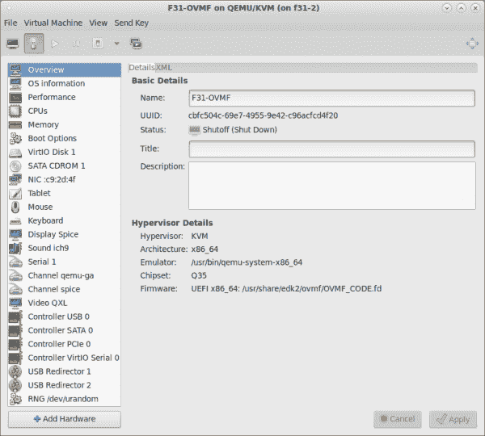
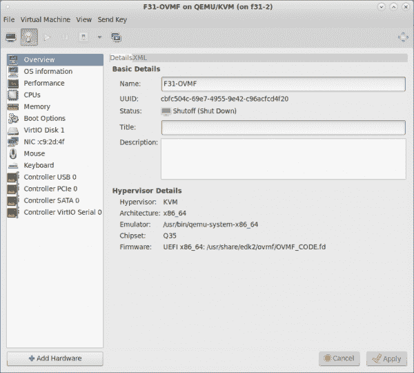
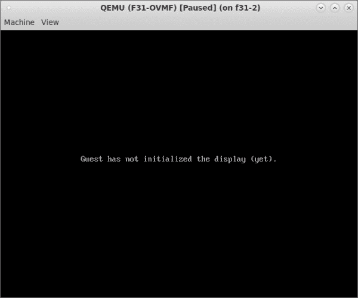
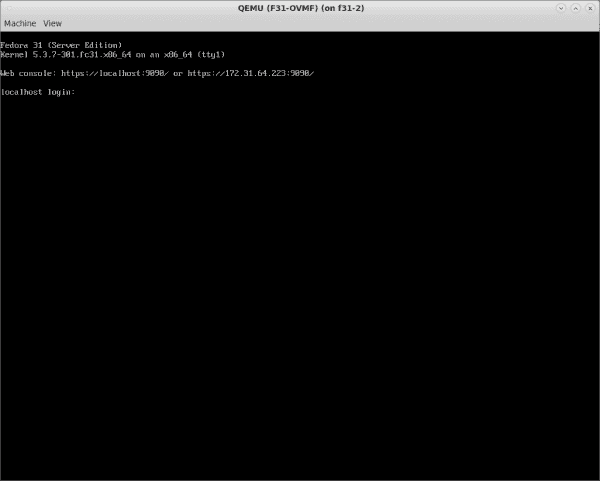

# 使用 virt-manager 在 libvirt 之外配置并运行一个基于 QEMU 的虚拟机

> 原文：<https://developers.redhat.com/blog/2020/03/06/configure-and-run-a-qemu-based-vm-outside-of-libvirt>

我最近需要在 [`libvirt`](https://libvirt.org/) 之外运行一个用 [`virt-manager`](https://virt-manager.org/) 创建的虚拟机(VM)。我正在调查一个需要用机器选项`dump-guest-core=on`运行 [QEMU](https://www.qemu.org) 的问题。默认情况下，`libvirt`在关闭该选项的情况下运行，所以我决定设置一个独立的 QEMU 环境。我发现配置测试虚拟机和编写引导脚本的过程比预期的要复杂，所以我决定记录我所采取的步骤。

我希望这篇文章能让您更容易地配置和运行自己的基于 QEMU 的 VM 来进行类似的研究。请注意，我不建议将这里描述的方法用于运行在生产环境中的虚拟机(至少在没有备份的情况下)。

## 创建测试虚拟机

本文假设您用`virt-manager`或`libvirt`框架中的另一个工具创建了一个 VM。我建议不要使用您关心的虚拟机，所以我们将从使用`virt-manager`从头创建一个测试虚拟机开始。另一种选择是使用现有虚拟机的克隆。

我在调查中使用的虚拟化主机也是一台虚拟机。如果你想做同样的事情，你需要[配置你的虚拟化环境以允许运行嵌套的虚拟机](https://docs.fedoraproject.org/en-US/quick-docs/using-nested-virtualization-in-kvm/)。(点击链接获取在 Fedora 上启用嵌套虚拟化的说明。)将虚拟化主机作为 VM 运行将使调试虚拟化主机内核变得更加容易，如果您需要这样做的话。

### 步骤 1:使用`virt-manager`的新虚拟机向导安装客户操作系统

新建虚拟机向导将安装分为五个步骤:

1.  命名来宾虚拟机并选择安装类型。
2.  找到并配置安装介质。
3.  选择内存和 CPU 设置。
4.  配置虚拟机的存储。
5.  配置网络、体系结构和其他硬件设置。

我不会详细描述所有的步骤，因为在其他地方已经完成了[。相反，我提供以下建议:](https://access.redhat.com/documentation/en-us/red_hat_enterprise_linux/6/html/virtualization_host_configuration_and_guest_installation_guide/chap-virtualization_host_configuration_and_guest_installation_guide-guest_installation_virt_manager-creating_guests_with_virt_manager)

*   在第 3 步(共 5 步)中，**选择内存和 CPU 设置**，我通常选择默认值。如果您打算进行最小化安装，或者如果您的虚拟化主机没有太多内存(RAM ),您可能会减少默认值的内存量。
*   在第 4 步(共 5 步)中，我选中了标记为**的框，为该虚拟机**启用存储，但是将存储空间减少到 10GB。如前所述，我的虚拟化主机也是一个虚拟机，我通常不会为该主机分配超过 60GB 的存储。如果我想安装几个虚拟机，我需要保持每个虚拟机相对较小。
*   在第 5 步(共 5 步)中，在**准备开始安装**屏幕上，勾选标记为**安装**前定制配置的复选框。此操作允许您根据自己的喜好配置芯片组和固件。例如，如果您希望您的新虚拟机使用 UEFI 引导，您可以将**固件**设置从`BIOS`更改为`UEFI x86_64: /usr/share/edk2/ovmf/OVMF_CODE.fd`。您可能还想将**芯片组**设置更改为`Q35`(来自`i440FX`)，假设该值还不是默认值。

**注意:**如果您想要更改虚拟机的芯片组或固件，请在安装操作系统之前进行更改。

我还发现记下网络接口的 MAC 地址很有用，这样我就可以在提供 DHCP 服务的系统上给它分配一个合适的名称。

### 步骤 2:安装操作系统

我在这里唯一的建议是确保你安装了测试所需的任何包。否则，我建议保持事情相当少。

### 步骤 3:在`virt-manager`下启动并测试操作系统

确保新安装的操作系统能够启动，并且您可以登录。如果您想使用一个独立的 QEMU 环境来测试一个特定的工具，那么要确保这个工具也在工作。

在我的例子中，我确保网络设备工作正常，并且我可以通过 SSH 登录。这样，我可以使虚拟机无头化，并且仍然登录，以查看设置是否仍然工作。回想起来，这一步可能是不必要的，因为打开了最终提供控制台的选项。

### 步骤 4:减小`virt-manager`配置的尺寸

接下来，是时候从典型的`virt-manager`配置中移除混乱了。这样做减少了我们稍后必须使用的 QEMU 命令的大小。

图 1 显示了我命名为`F31-OVMF`的虚拟机的硬件细节。

[](/sites/default/files/blog/2020/02/Screenshot-at-2020-02-05-13-56-28.png)Figure 1: Virt-manager's default VM contains more devices than you probably need.">

我移除了以下设备:

*   SATA CDROM 1
*   药片
*   展示香料
*   我听到 9 号声音了吗
*   系列 1
*   qemu-ga 频道
*   渠道香料
*   视频 QXL
*   USB 重定向器 1
*   USB 重定向器 2
*   RNG /dev/urandom

请注意，并非所有设备都可以删除。举个例子，我点击了`Controller VirtIO Serial 0`上的**移除**按钮，但是`virt-manager`又把它加了回去。

图 2 显示了当我删除完设备后得到的`F31-OVMF`的硬件细节。

[](/sites/default/files/blog/2020/02/Screenshot-at-2020-02-05-14-15-25.png)Figure 2: A much cleaner VM hardware setup.">

再次启动虚拟机，并确保它仍然工作。如果您进行了上述更改，VM 将无头启动，您需要通过 SSH 连接到它。*不要跳过这一步。*您仍然需要再次启动 VM，以便将`virt-manager`的(现在已经简化的)QEMU 命令写入日志文件。

## 从 QEMU 命令创建一个引导脚本

设置好测试虚拟机后，接下来要做的事情是创建脚本，您将使用该脚本在独立的 QEMU 环境中启动虚拟机。您可以使用 QEMU 命令作为脚本的基础，但是您必须首先进行一些编辑。最大的障碍是识别和删除任何引用在`libvirt`之外不可用的资源的文件描述符。我将再次指导您完成这些步骤。

### 步骤 1:在虚拟化主机上找到 QEMU 日志文件

在`libvirt`或`virt-manager`下运行的 QEMU 的日志文件可以在`/var/log/libvirt/qemu`中找到。对于我的虚拟机，这个文件被命名为`F31-OVMF.log`。找到这个文件，并准备使用您最喜欢的文本编辑器打开它。

### 步骤 2:将日志文件中的行复制到新脚本中

打开日志文件并滚动浏览，直到找到类似如下的行:

`/usr/bin/qemu-system-x86_64 \`

查看该行上方，确定为运行该命令而设置的所有环境变量。这些行都以反斜杠字符(`\`)结束。在我的日志文件中，第一个环境变量行以`LC_ALL=C \`开始。

复制从第一个环境变量开始到文件底部结束的行。将这些行粘贴到一个新文件中，跳过日志文件底部任何明显的错误。这将是您运行来启动作为独立 QEMU 环境的 VM 的脚本，所以我建议将其命名为类似于`start-<VM>`的名称。我把我的文件命名为`start-F31-OVMF`。

到目前为止，这是我即将完成的脚本的样子:

```
LC_ALL=C \
PATH=/usr/local/sbin:/usr/local/bin:/usr/sbin:/usr/bin \
HOME=/var/lib/libvirt/qemu/domain-3-F31-OVMF \
XDG_DATA_HOME=/var/lib/libvirt/qemu/domain-3-F31-OVMF/.local/share \
XDG_CACHE_HOME=/var/lib/libvirt/qemu/domain-3-F31-OVMF/.cache \
XDG_CONFIG_HOME=/var/lib/libvirt/qemu/domain-3-F31-OVMF/.config \
QEMU_AUDIO_DRV=none \
/usr/bin/qemu-system-x86_64 \
-name guest=F31-OVMF,debug-threads=on \
-S \
-object secret,id=masterKey0,format=raw,file=/var/lib/libvirt/qemu/domain-3-F31-OVMF/master-key.aes \
-machine pc-q35-4.1,accel=kvm,usb=off,vmport=off,dump-guest-core=off \
-cpu EPYC-IBPB,x2apic=on,tsc-deadline=on,hypervisor=on,tsc-adjust=on,arch-capabilities=on,cmp-legacy=on,perfctr-core=on,virt-ssbd=on,rdctl-no=on,skip-l1dfl-vmentry=on,mds-no=on,monitor=off \
-drive file=/usr/share/edk2/ovmf/OVMF_CODE.fd,if=pflash,format=raw,unit=0,readonly=on \
-drive file=/var/lib/libvirt/qemu/nvram/F31-OVMF_VARS.fd,if=pflash,format=raw,unit=1 \
-m 2048 \
-overcommit mem-lock=off \
-smp 2,sockets=2,cores=1,threads=1 \
-uuid cbfc504c-69e7-4955-9e42-c96acfcd4f20 \
-display none \
-no-user-config \
-nodefaults \
-chardev socket,id=charmonitor,fd=37,server,nowait \
-mon chardev=charmonitor,id=monitor,mode=control \
-rtc base=utc,driftfix=slew \
-global kvm-pit.lost_tick_policy=delay \
-no-hpet \
-no-shutdown \
-global ICH9-LPC.disable_s3=1 \
-global ICH9-LPC.disable_s4=1 \
-boot strict=on \
-device pcie-root-port,port=0x10,chassis=1,id=pci.1,bus=pcie.0,multifunction=on,addr=0x2 \
-device pcie-root-port,port=0x11,chassis=2,id=pci.2,bus=pcie.0,addr=0x2.0x1 \
-device pcie-root-port,port=0x12,chassis=3,id=pci.3,bus=pcie.0,addr=0x2.0x2 \
-device pcie-root-port,port=0x13,chassis=4,id=pci.4,bus=pcie.0,addr=0x2.0x3 \
-device pcie-root-port,port=0x14,chassis=5,id=pci.5,bus=pcie.0,addr=0x2.0x4 \
-device pcie-root-port,port=0x15,chassis=6,id=pci.6,bus=pcie.0,addr=0x2.0x5 \
-device pcie-root-port,port=0x16,chassis=7,id=pci.7,bus=pcie.0,addr=0x2.0x6 \
-device qemu-xhci,p2=15,p3=15,id=usb,bus=pci.2,addr=0x0 \
-device virtio-serial-pci,id=virtio-serial0,bus=pci.3,addr=0x0 \
-drive file=/var/lib/libvirt/images/F31-OVMF.qcow2,format=qcow2,if=none,id=drive-virtio-disk0 \
-device virtio-blk-pci,scsi=off,bus=pci.4,addr=0x0,drive=drive-virtio-disk0,id=virtio-disk0,bootindex=1 \
-netdev tap,fd=39,id=hostnet0,vhost=on,vhostfd=40 \
-device virtio-net-pci,netdev=hostnet0,id=net0,mac=52:54:00:c9:2d:4f,bus=pci.1,addr=0x0 \
-device virtio-balloon-pci,id=balloon0,bus=pci.5,addr=0x0 \
-sandbox on,obsolete=deny,elevateprivileges=deny,spawn=deny,resourcecontrol=deny \
-msg timestamp=on
```

### 步骤 3:创建 shell 脚本

接下来，通过执行以下操作，将该日志文件编辑成一个可用的 shell 脚本:

*   添加`#!/bin/sh`作为文件的第一行。我还会在这一行之后添加一个空行，但这并不是绝对必要的。
*   调整环境变量部分:
    *   从每个环境变量行的末尾删除反斜杠(`\`)字符。
    *   将单词`export`放在每行的开头，后跟一个空格。
    *   在本节末尾添加一个空行。
*   使用前导字符`#`注释掉`export PATH=`和`export HOME=`行。(也许可以禁用设置环境变量的其他行，但是我没有测试过这样做。)

我的脚本的开头看起来像这样:

```
#!/bin/sh

```

```
export LC_ALL=C
#export PATH=/usr/local/sbin:/usr/local/bin:/usr/sbin:/usr/bin
#export HOME=/var/lib/libvirt/qemu/domain-3-F31-OVMF
export XDG_DATA_HOME=/var/lib/libvirt/qemu/domain-3-F31-OVMF/.local/share
export XDG_CACHE_HOME=/var/lib/libvirt/qemu/domain-3-F31-OVMF/.cache
export XDG_CONFIG_HOME=/var/lib/libvirt/qemu/domain-3-F31-OVMF/.config
export QEMU_AUDIO_DRV=none

/usr/bin/qemu-system-x86_64 \
```

现在向下滚动文件，从`qemu-system-x86_64`命令编辑以下内容:

*   删除以`-object secret`开头的行。
*   删除以`-chardev socket`开头的行。(这一行引用了一个在`libvirt`环境之外不可访问的文件描述符。)
*   删除以`-sandbox`开头的行。
*   删除以`-mon`开头的行。
*   将线`-display none`改为`-display gtk`。确保在这一行的末尾留下反斜杠。
*   将`-netdev tap`线改为`netdev bridge,id=ID`，其中`ID`与原`-netdev tap`线中的`id`相同。在这种情况下，是`hostnet0`，所以有问题的行从:

```
-netdev tap,fd=39,id=hostnet0,vhost=on,vhostfd=40 \

```

收件人:

```
-netdev bridge,id=hostnet0 \
```

请注意，这一更改从整个命令中删除了另一个`fd= argument`。同样，这一行引用了一个文件描述符，该描述符在`libvirt`之外的独立环境中不可用。

还要注意的是，为了使这一改变生效，有必要在虚拟化主机上配置一个名为`br0`的桥。对于名为其他名称的桥，如`br1`，请使用以下内容:

```
-netdev bridge,id=hostnet0,bridge=br1
```

更多信息，请参考 [QEMU 网络选项文档](https://www.qemu.org/docs/master/qemu-doc.html#Network-options)。

您几乎完成了编辑，但是您还有几个简化脚本的选项。首先可以在文件中搜索`fd=`。希望不会出现这种情况，但是如果出现了，您需要找出如何安全地删除这些对文件描述符的引用。您可以尝试删除有问题的行。如果那不起作用，查阅 [QEMU 文档](https://www.qemu.org/docs/master/qemu-doc.html)。

其次，你可以删除`-nodefaults`行。(删除这一行后，您可能可以进一步简化脚本，但是我还没有探索这个选项。)

现在，让脚本可执行。对于我的示例脚本，我使用了:

```
# chmod a+x start-F31-OVMF
```

最后，完成所有的编辑后，我的脚本看起来是这样的:

```
#!/bin/sh

export LC_ALL=C
#export PATH=/usr/local/sbin:/usr/local/bin:/usr/sbin:/usr/bin
#export HOME=/var/lib/libvirt/qemu/domain-3-F31-OVMF
export XDG_DATA_HOME=/var/lib/libvirt/qemu/domain-3-F31-OVMF/.local/share
export XDG_CACHE_HOME=/var/lib/libvirt/qemu/domain-3-F31-OVMF/.cache
export XDG_CONFIG_HOME=/var/lib/libvirt/qemu/domain-3-F31-OVMF/.config
export QEMU_AUDIO_DRV=none

/usr/bin/qemu-system-x86_64 \
-name guest=F31-OVMF,debug-threads=on \
-S \
-machine pc-q35-4.1,accel=kvm,usb=off,vmport=off,dump-guest-core=off \
-cpu EPYC-IBPB,x2apic=on,tsc-deadline=on,hypervisor=on,tsc-adjust=on,arch-capabilities=on,cmp-legacy=on,perfctr-core=on,virt-ssbd=on,rdctl-no=on,skip-l1dfl-vmentry=on,mds-no=on,monitor=off \
-drive file=/usr/share/edk2/ovmf/OVMF_CODE.fd,if=pflash,format=raw,unit=0,readonly=on \
-drive file=/var/lib/libvirt/qemu/nvram/F31-OVMF_VARS.fd,if=pflash,format=raw,unit=1 \
-m 2048 \
-overcommit mem-lock=off \
-smp 2,sockets=2,cores=1,threads=1 \
-uuid cbfc504c-69e7-4955-9e42-c96acfcd4f20 \
-display gtk \
-no-user-config \
-rtc base=utc,driftfix=slew \
-global kvm-pit.lost_tick_policy=delay \
-no-hpet \
-no-shutdown \
-global ICH9-LPC.disable_s3=1 \
-global ICH9-LPC.disable_s4=1 \
-boot strict=on \
-device pcie-root-port,port=0x10,chassis=1,id=pci.1,bus=pcie.0,multifunction=on,addr=0x2 \
-device pcie-root-port,port=0x11,chassis=2,id=pci.2,bus=pcie.0,addr=0x2.0x1 \
-device pcie-root-port,port=0x12,chassis=3,id=pci.3,bus=pcie.0,addr=0x2.0x2 \
-device pcie-root-port,port=0x13,chassis=4,id=pci.4,bus=pcie.0,addr=0x2.0x3 \
-device pcie-root-port,port=0x14,chassis=5,id=pci.5,bus=pcie.0,addr=0x2.0x4 \
-device pcie-root-port,port=0x15,chassis=6,id=pci.6,bus=pcie.0,addr=0x2.0x5 \
-device pcie-root-port,port=0x16,chassis=7,id=pci.7,bus=pcie.0,addr=0x2.0x6 \
-device qemu-xhci,p2=15,p3=15,id=usb,bus=pci.2,addr=0x0 \
-device virtio-serial-pci,id=virtio-serial0,bus=pci.3,addr=0x0 \
-drive file=/var/lib/libvirt/images/F31-OVMF.qcow2,format=qcow2,if=none,id=drive-virtio-disk0 \
-device virtio-blk-pci,scsi=off,bus=pci.4,addr=0x0,drive=drive-virtio-disk0,id=virtio-disk0,bootindex=1 \
-netdev bridge,id=hostnet0 \
-device virtio-net-pci,netdev=hostnet0,id=net0,mac=52:54:00:c9:2d:4f,bus=pci.1,addr=0x0 \
-device virtio-balloon-pci,id=balloon0,bus=pci.5,addr=0x0 \
-msg timestamp=on
```

### 步骤 4:使用新创建的脚本运行虚拟机

作为 root 用户，运行您的新脚本。我的运行如下:

```
[root@f31-2 ~]# ./start-F31-OVMF
```

如果成功，将弹出一个类似图 3 的窗口。

[](/sites/default/files/blog/2020/02/Screenshot-at-2020-02-05-15-26-04.png)Figure 3: Virt-manager pauses the VM's launch for warnings.">

选择**机器**->-**暂停**取消暂停，继续开机过程。此时，机器应该启动，最终，您应该看到如图 4 所示的登录提示。

[](/sites/default/files/blog/2020/02/Screenshot-at-2020-02-05-15-32-15.png)Figure 4: Your new VM's login screen.">

登录并确保虚拟机按预期运行。

## 结论

现在，您应该有了一个在独立 QEMU 环境中引导 VM 的可行脚本。接下来的步骤取决于您的用例。在我的例子中，我修改了`dump-guest-core`选项，将值从`off`改为`on`，然后继续我的调查。

*Last updated: June 29, 2020*