# 大规模设计事件驱动的业务流程:健康管理示例，第 1 部分

> 原文：<https://developers.redhat.com/blog/2020/02/19/designing-an-event-driven-business-process-at-scale-a-health-management-example-part-1>

业务流程(BP)或工作流(WF)的概念，以及业务流程管理(BPM)的规则和实践在 90 年代早期就已经出现了。从那以后，WF/BPM 工具有了很大的发展。最近，不同工具的融合已经发生，将决策管理(DM)和案例管理(CM)添加到组合中。在过去几年中，数据科学、机器学习和人工智能的崛起让情况变得更加复杂。BPM 的成熟领域已经被归入数字业务自动化、数字再发明、数字万物等被大肆宣传的伪新事物中。，增加了“低代码”和机器人流程自动化(RPA)。

当今业务应用程序的一个常见要求是事件驱动的；也就是说，特定事件应该实时触发工作流或决策。这个要求导致了一个基本问题。在现实情况中，有许多不同类型的事件，每一种都需要特定的处理。事件驱动的业务应用程序可能有数百个性质不同的工作流或流程。随着新类型的事件在当今不断变化的业务环境中出现，必须尽快设计和部署新的流程。

这种情况不同于运行时可伸缩性的常见需求。这不仅仅是一个让架构扩展到每秒大量事件的问题。这个问题在许多方面都很容易解决。我在这里关心的是设计时的可伸缩性问题。

在本系列的第一篇文章中，我将为健康管理行业的一个具体例子定义业务用例及数据模型。然后，我将向您展示如何为这个场景创建触发流程，开始您的 [jBPM](https://www.jbpm.org/) (开源业务自动化套件)实现。在后续文章中，我将继续详细介绍这个示例实现。

具体来说，这个例子说明了在 jBPM 中实现的几个业务流程模型和符号(BPMN)结构:

*   业务流程抽象。
*   服务任务或工作项处理程序。
*   REST API 调用来自进程内部。
*   从流程内部发送电子邮件。
*   信号发送和捕捉。
*   基于计时器的提醒和升级。

## 业务用例

人口健康管理(PHM)是一种重要的医疗保健方法，它利用[最新的技术进步](https://www.ncbi.nlm.nih.gov/pubmed/19275994)来汇总各种来源的健康数据，将这些数据分析成统一的、可操作的患者视图，并触发可以改善临床和财务结果的具体行动。当然，这个话题意味着处理受保护的个人信息，这应该完全符合现有的法律(否则[的争议将随之而来](https://www.theverge.com/2019/11/11/20959771/google-health-records-project-nightingale-privacy-ascension))。

一家保险公司或健康管理组织跟踪每一个成员健康史的大量信息。例如，一个已知患有某种疾病的成员应该定期做一些事情，如看医生或接受测试。错过这样的动作应该触发 PHM 系统中的工作流，以确保成员回到正轨。

为了举例，我们假设一个成员患有风湿性关节炎。这个人应该服用一种药物。定期检查这种药物的处方是否已经开了一段时间，比如一年，是很容易的。如果在过去一年中没有为具有这种状况的成员开出这种处方，则特定行为者应该采取某些行动:

| 任务代码 | 活动 | 行动者 |
| --- | --- | --- |
| A490.0 | 应通知会员的医生。 | 专业人员 |
| B143 | 保险渠道工作人员应该执行相关的管理任务。 | 化学加工 |
| C178 | 这个成员应该接受教育。 | 工程管理硕士 |
| C201 | 该会员应咨询药剂师。 | RXS |

某些任务应该仅在另一个任务完成后发生:

| 任务代码 | 前置任务 |
| --- | --- |
| A490.0 |  |
| B143 |  |
| C178 | A490.0 |
| C201 | A490.0 |

任务生命周期应由任务状态的变化来决定，其中任务状态具有以下值和含义:

| 状态 | 描述 |
| --- | --- |
| 不活动的 | 现在不是完成这项任务的时候。 |
| 抑制 | 特定成员的情况决定了此任务应该被抑制。 |
| 关闭的 | 软结算:假设已完成，直到收到硬结算通知。 |
| 完成 | 硬关闭:收到完成确认。 |
| 期满 | 到期前未完成。 |

关闭(软关闭)和完成(硬关闭)之间的区别很重要。允许参与者软关闭任务，但只有在验证了任务的结果后，才应认为任务已完成。只有这样，任务才能有助于关键绩效指标(KPI)的度量。

参与者应通过点击**完成**按钮或指定任务不适用(并提供可上传的补充数据的解释)来完成软结束。硬关闭应要求来自外部系统的通知:

| 密码 | 软关闭 | 硬关闭 |
| --- | --- | --- |
| A490.0 | 已完成或不适用 | [HEDIS](https://www.ncqa.org/hedis/) 发动机符合性。 |
| B143 | 已完成或不适用 | 供应商和药房认证。 |
| C178 | 已完成或不适用 | 带软关闭。 |
| C201 | 点击召唤药剂师 | 带软关闭 |

如果某个任务执行者在完成分配的任务时出现延误，必须向相应的执行者发送提醒。然后，如果任务在一段时间后仍未关闭，则必须将该操作上报给经理:

| 任务代码 | 提醒频率 | 之后升级 | 升级因素 |
| --- | --- | --- | --- |
| A490.0 | 14 天 | 30 天 | 豌豆 |
| B143 | 30 天 | 90 天 | MCH |
| C178 | 7 天 | 60 天 | MRX |
| C201 | 7 天 | 30 天 | 化学加工 |

无论如何，每一项行动都应该在年底到期。

最后一个要求是，在规定的抑制期内，应该能够防止任务被执行。这种做法相当于打了一个闹钟。

下表简要描述了到目前为止提到的所有参与者:

| 行动者 | 描述 |
| --- | --- |
| 专业人员 | 供应者 |
| 工程管理硕士 | 成员 |
| 化学加工 | 社区卫生工作者 |
| RXS | 药剂师 |
| 豌豆 | 提供商参与倡导者 |
| MCH | 社区健康经理 |
| MRX | 药房经理 |

本质上，这些需求定义了一个必须为给定的 PHM 事件或触发器完成的工作流，例如成员缺少 DMARD 处方。

如果会员是糖尿病患者，且一年内没有接受他汀类药物治疗，而不是错过 DMARD 处方，您不希望必须重做所有实施工作。PHM 中可能有数百个不同的事件/触发器，必须分别为它们中的每一个建模是不可伸缩的。从业务角度来看，这是最重要的需求:实现的设计必须能够扩展到尽可能多的不同类型的触发器，并且必须能够以最少的工作量添加新的触发器。

## 作为业务流程的实施

在 [jBPM](https://www.jbpm.org/) 中实现这些需求的完整业务流程可以从 [GitHub](https://github.com/mauriziocarioli/PHM-Processes) 中导入。但是，我鼓励您按照下一节开始的详细步骤从头开始构建它。

jBPM 中的业务流程遵循最新的 [BPMN 2.0](https://www.omg.org/spec/BPMN/2.0/) 规范。您可以设计一个数据驱动和事件驱动的业务流程。然而，业务流程是过程命令式编程的一种实现。这意味着业务逻辑必须完整地被明确地表达出来。

实现应该完全由数据驱动，以尽可能满足业务可伸缩性需求。触发工作流应该用提供给流程引擎的数据进行参数化，以便一个业务流程定义能够处理任何触发事件。

### 数据模型

任务的大多数工作流相关属性都包含在自定义数据类型`Task`中:

| 属性 | 描述 |
| --- | --- |
| 身份证明（identification） | 任务的 id。 |
| 原始 id | 任务代码。 |
| 状态 | 跟踪任务生命周期的状态。 |
| 前任 | 任务工作流中当前任务之前的任务。 |
| 关闭 | 任务结束类型(软或硬)。 |
| 关闭信号 | 硬关闭任务的信号。 |
| 提醒启动 | 第一次提醒应该发生的时间。 |
| 提醒频率 | 提醒的频率。 |
| 升级 | 指示是否应该升级的标志。 |
| 升级计时器 | 何时应该进行升级。 |
| 抑制 | 指示任务是否被取消的标志。 |
| 抑制期 | 任务必须保持抑制状态的时间段。 |

自定义数据类型`TaskActorAssignment`包含将任务分配给参与者所需的信息:

| 属性 | 描述 |
| --- | --- |
| 行动者 | 任务的参与者。 |
| 频道 | 执行任务(即数据输入)的应用程序(用户界面)。 |
| 升级因素 | 负责升级的参与者。 |
| 升级渠道 | 升级中使用的应用程序(用户界面)。 |

自定义数据类型`Reminder`包含向任务参与者发送提醒所需的信息:

| 属性 | 描述 |
| --- | --- |
| 地址 | 任务执行者的(电子邮件)地址。 |
| 科目 | 提醒的主题。 |
| 身体 | 提醒的内容。 |
| 从 | 发送提醒的(电子邮件)地址。 |

所有这些数据都是从服务中检索的。您需要将服务的响应表示为自定义数据类型`Response`:

| 属性 | 描述 |
| --- | --- |
| 工作 | 任务数据。 |
| 作业 | 任务执行元分配数据。 |
| 催单 | 提醒数据。 |

不言而喻，对于任何给定的 PHM 事件或触发器，服务将生成一个响应对象列表，PHM 事件工作流中的每个任务都有一个响应对象。图 1 所示的 Java 类图总结了需要什么。

[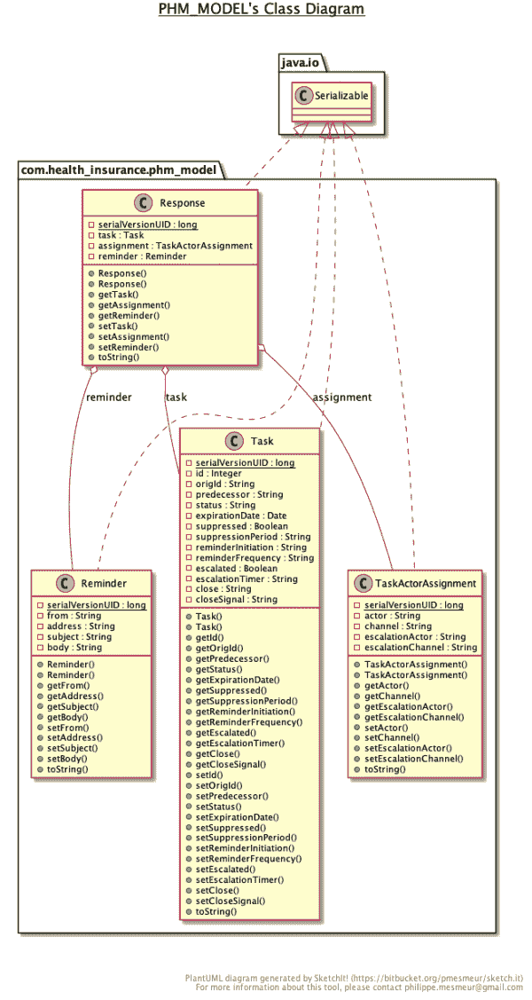](/sites/default/files/blog/2020/02/phm_model.png)Figure 1: Summary of the Java class requirements for the PHM workflow.">

你应该用 Java 实现这个模型。所有类都必须是可序列化的。覆盖`toString`方法是可选的，但是它有助于跟踪流程执行。

这个模型可以从 [GitHub](https://github.com/mauriziocarioli/PHM-Model) 导入 jBPM。

### 触发过程

在 jBPM 中为[业务流程](https://docs.jboss.org/jbpm/release/latest/jbpm-docs/html_single/#business_process)创建项目之后，实现触发工作流确保模型项目是项目设置中的一个依赖项:

1.  在[流程设计器](https://docs.jboss.org/jbpm/release/latest/jbpm-docs/html_single/#_process_designer)中创建流程，其属性如图 2 所示。

[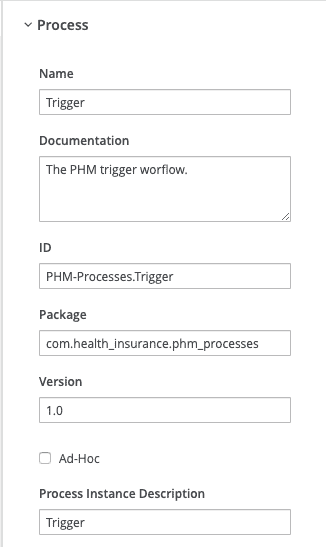](/sites/default/files/blog/2020/02/PHM-Processes-Fig-203.png)Figure 2: Add the example process into jBPM.">

2.  添加如图 3 所示的[过程变量](https://docs.jboss.org/jbpm/release/latest/jbpm-docs/html_single/#_variables)。

[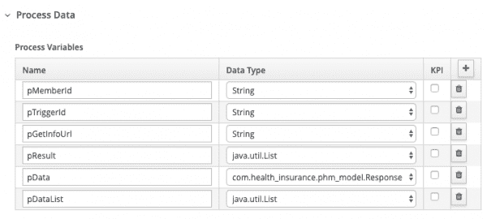](/sites/default/files/blog/2020/02/PHM-Processes-0002.png)Figure 3: Add the example process variables into jBPM.">

3.  添加如图 4 所示的导入。

[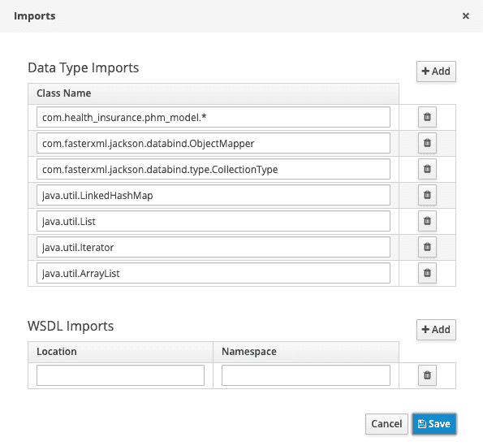](/sites/default/files/blog/2020/02/PHM-Processes-Fig-204.png)Figure 4: Add the example process data types to import into jBPM.">

4.  在流程设计器中绘制下图，如图 5 所示:

[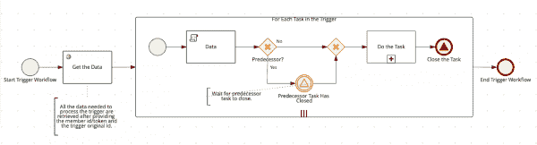](/sites/default/files/blog/2020/02/PHM-Processes-Fig-215-original-size.png)Figure 5: Use the process designer to define what happens with each task in the trigger.

Figure 5: Use the process designer to define what happens with each task in the trigger.

这种类型的业务应用程序通常订阅数据流解决方案的主题，如 [Apache Kafka](https://kafka.apache.org/) 。然而，我们现在并不关心精确的数据馈送机制，这个过程只是由 REST API 启动。

#### 获取数据

首先创建一个外部服务调用，根据成员令牌和触发器 id 获取执行子流程所需的所有数据。该调用将启动进程的流应用从编排数据服务的负担中解放出来。这个活动被实现为一个 [REST](https://github.com/kiegroup/jbpm/blob/master/jbpm-workitems/jbpm-workitems-rest/src/main/java/org/jbpm/process/workitem/rest/) [工作项处理程序](https://docs.jboss.org/jbpm/release/latest/jbpm-docs/html_single/#_work_item_handlers)，它被预先安装在 jBPM 中。

您需要为这个步骤创建两个动作:一个是进入动作的*，一个是退出动作*的*。(您还需要实现服务任务调用的服务，但我们将在后面讨论。)将[以下代码](https://gist.github.com/mauriziocarioli/34ddb1be9658d14fa81bddcf9b228a3a)添加到进入动作*的*中:*

```
final ObjectMapper om = new ObjectMapper();
ArrayList<Response> dd = new ArrayList<Response>();

List rr = (List)kcontext.getVariable("pResult");
Iterator<LinkedHashMap> i = rr.iterator();

while(i.hasNext()) {
    LinkedHashMap m = (LinkedHashMap)i.next();
    dd.add(om.convertValue(m,Response.class));
}

kcontext.setVariable("pDataList",dd);
```

然后，在退出动作的*中添加[以下代码](https://gist.github.com/mauriziocarioli/66f06d0a5a986e0aa930b230b85afdf5):*

```
final ObjectMapper om = new ObjectMapper();
ArrayList<Response> dd = new ArrayList<Response>();

List rr = (List)kcontext.getVariable("pResult");
Iterator<LinkedHashMap> i = rr.iterator();

while(i.hasNext()) {
LinkedHashMap m = (LinkedHashMap)i.next();
dd.add(om.convertValue(m,Response.class));
}

kcontext.setVariable("pDataList",dd);
```

退出操作的原因是 REST API 服务将数据作为一个映射列表交付。实际的响应对象必须通过转换列表中的每个映射来获得。这个要求无法回避，所以包含响应对象列表的集合是变量`pDataList`而不是`pReturn`。

需要配置的唯一参数是:

*   `Method`为`GET`
*   `Url`为`pGetInfoUrl`
*   `ContentType`为`application/json`
*   `ResultClass`为`java.util.List`
*   `Result`为`pResult`

在现实生活中，需要更多的参数。例如，BPM 必须进行身份验证才能检索数据。然而，为了这个练习，您将使这个服务尽可能简单。

#### 处理数据

接下来，您需要创建[多实例子流程](https://docs.jboss.org/jbpm/release/latest/jbpm-docs/html_single/#_multi_instance_sub_process)，一旦数据可用，它将遍历触发器工作流中的每个任务。您需要实现这样的要求，即某些任务必须在工作流中给定任务之后。在我们的例子中，任务 C178 和 C201 必须遵循 A490.0。

要配置并行执行的多实例子流程(您希望所有子流程实例同时启动)，使用`pDataList`作为集合，使用`pData`作为项目，如图 6 所示。

[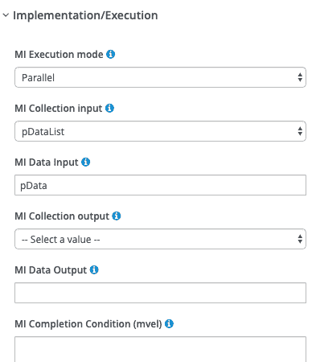](/sites/default/files/blog/2020/02/PHM-Process-Fig-216.png)Figure 6: Create a multiple instance subprocess with parallel execution.">

单个任务工作流被建模为一个带有属性的[可重用子流程](https://docs.jboss.org/jbpm/release/latest/jbpm-docs/html_single/#_reusable_sub_process)，如图 7 所示。

[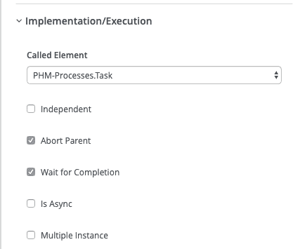](/sites/default/files/blog/2020/02/PHM-Processes-A490-call-properties-1.png)Figure 7: Create the individual task's workflow.">

还应该定义流程变量，如图 8 所示。

[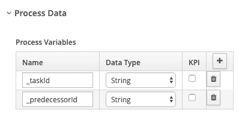](/sites/default/files/blog/2020/02/PHM-Processes-Fig-217.png)Figure 8: Define your process variables.">

子流程变量在脚本任务中初始化。在脚本任务的主体中编写[以下代码](https://gist.github.com/mauriziocarioli/f7e8c4a93f8096a1e757980374ed4f78):

```
Response d = (Response)kcontext.getVariable("pData");
kcontext.setVariable("_taskId",d.getTask().getOrigId());
kcontext.setVariable("_predecessorId",d.getTask().getPredecessor());
```

任务排序逻辑基于任务的 predecessor 属性，如图 9 所示。

[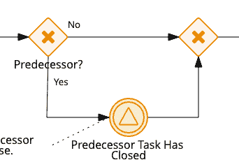](/sites/default/files/blog/2020/02/PHM-Processes-Fig-218.png)Figure 9: Implement the task sorting logic.">

如果该属性为空，第一个[分支独占网关](https://docs.jboss.org/jbpm/release/latest/jbpm-docs/html_single/#_diverging_gateway)让流程继续到任务子流程，如图 10 所示。

[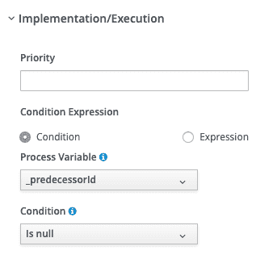](/sites/default/files/blog/2020/02/PHM-Processes-219.png)Figure 10: Create your null gateway.">

如果当前任务有一个前置任务，如图 11 所示，[捕捉中间信号](https://docs.jboss.org/jbpm/release/latest/jbpm-docs/html_single/#_catching_signal_event)将等待前置任务关闭的信号后再继续。

[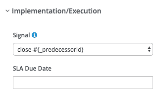](/sites/default/files/blog/2020/02/PHM-Processes-Fig-220.png)Figure 11: Set up the catching intermediate signal.">

**注意:**您还需要创建[任务子流程](https://developers.redhat.com/blog/?p=676127)。在完成之前，将“被调用元素”属性留空。

唯一需要传递给子流程的变量是类型为`com.health_insurance.phm_model.Response`的`pData`，如图 12 所示。

[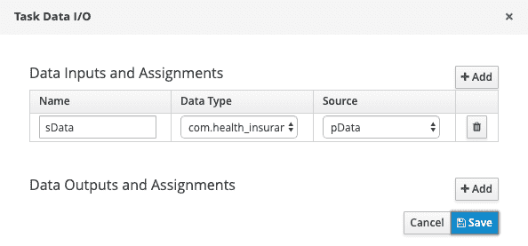](/sites/default/files/blog/2020/02/PHM-Processes-Fig-208.png)Figure 12: Pass the necessary data to the subprocess.">

最后，发送当前进程关闭的信号。注意，信号的名称是用当前任务 ID 参数化的，如图 13 所示。

[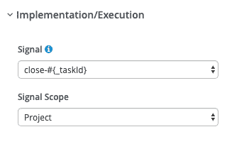](/sites/default/files/blog/2020/02/PHM-Processes-FIg-222.png)Figure 13: Close the current process.">

## 结论

现在您已经有了数据模型，并且已经在 jBPM 中创建了触发流程。在下一篇文章的[中，我们将逐步创建任务子流程的每个组件。](https://developers.redhat.com/blog/2020/02/20/designing-an-event-driven-process-at-scale-part-2/)

*Last updated: June 29, 2020*