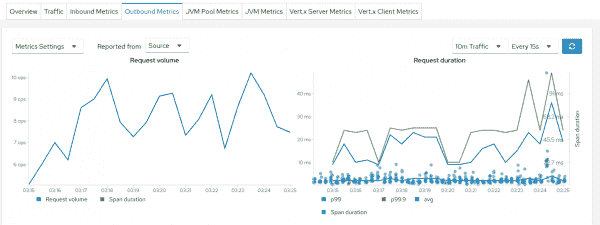
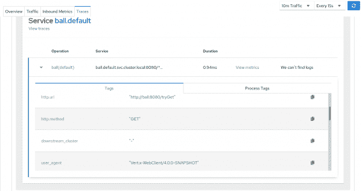
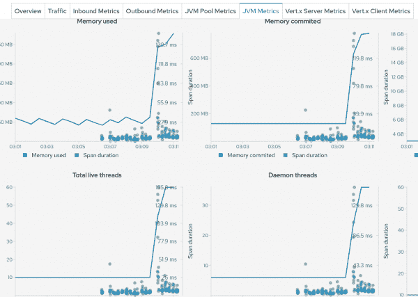
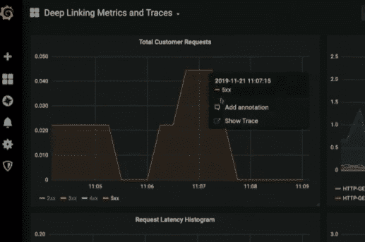

# Kiali 中的度量和轨迹相关性

> 原文：<https://developers.redhat.com/blog/2020/02/18/metrics-and-traces-correlation-in-kiali>

度量、跟踪和日志可能是可观察性的三大支柱，你肯定已经听说过了。这个咒语帮助我们将心态集中在可观察性上，但它不是一种宗教。“有如此多的数据可以帮助我们深入了解我们的运行系统，”[去年 KubeCon](https://www.youtube.com/watch?v=MkSdvPdS1oA) 的 Frederic Branczyk 说。

这三种信号确实有其特殊性，但它们也有我们可以归纳的共同点。它们都可以出现在一个虚拟时间线上，并且都源于一个工作负载，因此它们是有时间和来源的，这是实现关联的良好开端。如果说有什么事情与了解系统可能发出的信号一样重要，那就是了解这些信号之间的关系，并能够将它们相互关联起来，即使它们严格来说并不具有相同的性质。最终，我们可以假设，任何一种有时间和来源的信号都是很好的相关性候选者，即使我们在它们之间没有硬连接。

这个事实当然不是什么新鲜事。相关性总是可能的，但真正的利害关系是使它更容易，因此更便宜。如今是什么让关联变得更容易？我认为至少有一种模式是有帮助的，而且我们在监控系统中越来越多地看到这种模式:自动和一致地获取输入信号。

当您在 Kubernetes 中使用 Prometheus 时，可能会为[标签映射](https://github.com/prometheus/prometheus/blob/03a9e7f72e072c6d29f422425d8acd91a957836b/documentation/examples/prometheus-kubernetes.yml#L274-L275)启用和配置 Kubernetes 服务发现。顾名思义，这种机制将 pods 的现有标签映射到 Prometheus 标签，或者换句话说，它将源上下文转发到度量中(因此，允许基于该信息进行过滤和聚合)。该设置参与自动和一致的采购。例如，[洛基](https://grafana.com/oss/loki/)对原木也是如此。如果您可以为度量搜索定义一个上下文，并为日志搜索重用相同的上下文，那么猜猜您有什么？更容易关联。

但那只是一步，不是旅程的终点。

## Kiali 中的新关联特性

在 [Kiali](https://kiali.io/) 中，我们为 [Istio](https://istio.io/) 的观测控制台，我们最近开始了关于关联的工作。我们还有很长的路要走，但我们肯定参与了。[在之前的一篇文章](https://medium.com/kialiproject/beyond-the-mesh-troubleshooting-with-kiali-af0ef2a9c977)中，我描述了 Kiali 如何通过在屏幕(图表、日志、指标和跟踪)之间导航来帮助故障排除，同时始终保持活动的上下文。我们想做更多的事情，比如可视化地关联跟踪和指标，以便当我们看到行为异常的指标时，我们可以尝试将其与跟踪相关联，或者反过来，分析高延迟跟踪附近的指标行为。

为了做到这一点，Kiali 中的每个指标图表现在都有一个 **Span duration** legend 项，单击它会在图表上显示跨度，如图 1 所示。

Span duration plots displayed along with Istio request duration metricFigure 1: Span duration plots displayed along with Istio request duration metric.">

为什么是跨度而不是痕迹？此图表是以服务为中心的视图。我们只想显示与服务严格相关的内容，以便更好地与显示的指标相关联，而跟踪也将包含来自其他服务的调用。但是请放心，我们可以从一个跨度跳到它的轨迹，如图 2 所示。Kiali 现在集成了自己的痕迹视图以及 Jaeger UI 的外部链接。

Trace details and meta-dataFigure 2: Trace details and metadata.">

这个设置很好，因为我们现在可以将 Istio 响应时间度量与实际跟踪相关联，并查看与跟踪相关的所有元数据，我相信这将是解决 Kiali 中高延迟问题的典型场景。但这不仅仅是关于响应时间:Kiali 还可以监控非 Istio 指标，比如 JVM 内存。因此，我们也可以将内存增加与实际跟踪相关联，如图 3 所示(或任何其他度量)。

Spans spike clearly correlated with an increase of memory and threads usedFigure 3: Spans spike correlated with an increase of memory and threads used.">

### 潜在的陷阱

但是有一个陷阱:显示的跨度在数量上是有限的。当容量很大时，很快就会达到这个极限。[采样策略](https://www.jaegertracing.io/docs/1.16/sampling/)可以用 Jaeger 配置来限制摄入的痕迹量，但问题依然存在:我们可能会错过相关数据。排除高延迟故障通常意味着查看 p99 延迟，或 p99.9，甚至 max。我们越想有一个清晰的外观，我们就越需要在完整的数据集基础上工作。

今天，Kiali 试图首先显示最相关的跨度，例如有错误或高延迟的跨度。这种策略类似于我们可以用[基于尾部的采样](https://omnition.io/blog/intelligent-sampling-with-opencensus/)所做的，除了 Kiali 是在查询时做的。这种设置也是可完善的，因为它对相关的内容进行了假设，无论如何，它在某一点上仍然会达到一个极限。

有几个关于聚合的想法我们可以考虑解决。一些工具显然已经做到了这一点，比如 Pinterest 展示的[，还有几种可能的方法(记住，Kiali 是一个 API 消费工具，目前还没有持久存储)。处理痕迹在 Kiali 仍然是一个开放的领域，欢迎人们贡献自己的力量！](https://medium.com/pinterest-engineering/analyzing-distributed-trace-data-6aae58919949)

## 与样本的相关性

当谈到关联跟踪和度量时，可能会想到另一个选项:[通过样本深度链接度量和跟踪](https://www.youtube.com/watch?v=TzNZIEvhAdA)(参见图 4 中的屏幕截图)。

Screen capture of the video above, featuring Rob Skillington at KubeCon 2019, San Diego, using GrafanaFigure 4: Correlating with exemplars (Source: The video above, featuring Rob Skillington at KubeCon 2019).">

细节正在 OpenMetrics 规范中正式确定。想法是用与一个或多个指标相关联的跟踪 id 来丰富指标搜集端点。该跟踪是一个范例(只是其中的一个，可能还有很多其他的)。

为避免影响度量基数，此 ID 不会成为普罗米修斯标签。在《普罗米修斯》中的实现是[还没有](https://github.com/prometheus/prometheus/pull/6309) [完成](https://github.com/prometheus/prometheus/pull/6635) [还没有](https://github.com/prometheus/client_golang/issues/682)。在 Jaeger 案中，我们可以想象样本的存在会影响抽样决策，但这个问题在今天并不相关。这绝对是 Prometheus/Grafana/tracing 社区的热门话题。我们对基亚利很感兴趣。

然而，再次，问题可能会提出一个单一样本的代表性在许多痕迹。相关性不是仅仅为了相关性而做，而是因为它有助于解决一个真实的问题。样本链接将有助于发现*其中的一些*，或者在查看指标时找出*其中涉及的一些*业务/技术流程。但是，在跟踪/范围聚合领域，我们还可以做更多的工作，以便更好地了解系统的健康状况并进行故障排除。(不是与样本相对，而是作为调试器工具集的补充。)

## 那么，下一步是什么？

我们将继续致力于相关性和跟踪，例如考虑更多信号和简化故障排除路径。为什么不分析呢？如果您有任何建议或意见，请随时联系我们。请记住，Kiali 是一个开源项目，欢迎您贡献代码和/或想法。

*感谢 Simon Pasquier、Gary Brown、Alissa Bonas 和 Juca paix o krhling 回顾并分享观点。*

*Last updated: June 29, 2020*